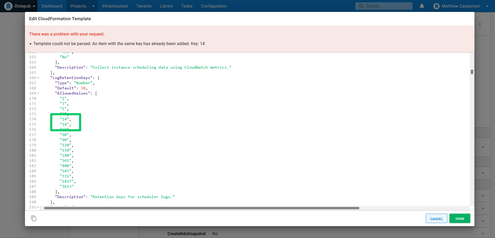
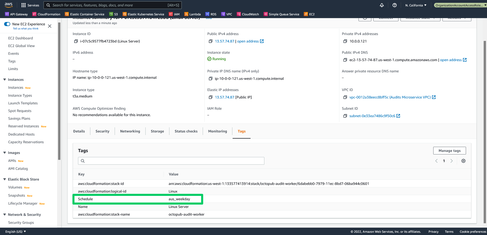

The promise of cloud computing has been to allow teams to efficiently scale up and down on demand. While on-premises infrastructure can save on electricity and cooling costs by shutting down, cloud based resources can avoid almost all charges (storage fees usually apply to stopped resources) by stopping any that are unused.

AWS provides the [Instance Scheduler](https://aws.amazon.com/solutions/implementations/instance-scheduler/) to shutdown and restart EC2 and RDS resources on demand. This is a great solution for teams that have Octopus resources like workers running in AWS, and where they are unused for most of the day.

In this post you'll learn how to install the Instance Scheduler, configure it with custom periods, and tag resources to be automatically shutdown and restarted.

## Prerequisites

This post assumes you will be running scripts on a Linux worker. You'll need Python 3, `jq`, `curl`, and `unzip` installed to complete the steps in this post. To install these tools in Ubuntu, run the command:

```bash
apt-get install jq curl unzip python3
```

To install the tools in Fedora, RHEL, Centos, and Amazon Linux, run the command:

```bash
yum install jq curl unzip python3
```

The Instance Scheduler is managed with a custom Python application called [Scheduler CLI](https://docs.aws.amazon.com/solutions/latest/instance-scheduler/scheduler-cli.html). 

The CLI requires Python 3. If you have Python 2 and Python 3 installed, you can force the use of Python 3 with the command:

```bash
alias python=python3
```

Run the following commands to install the CLI:

```bash
curl -O https://s3.amazonaws.com/solutions-reference/aws-instance-scheduler/latest/scheduler-cli.zip
unzip scheduler-cli.zip
python setup.py install
```

A public Octopus instance has been configured with a project that deploys the instance scheduler. You can access this Octopus instance [here](https://tenpillars.octopus.app/app#/Spaces-42/projects/aws-instance-scheduler/deployments).

## Deploying the Instance Scheduler template

Instance Scheduler is distributed as a CloudFormation template available from [here](https://s3.amazonaws.com/solutions-reference/aws-instance-scheduler/latest/aws-instance-scheduler.template). You'll deploy this with the **Deploy an AWS CloudFormation template** step in Octopus.

:::hint
If you see the error `Template could not be parsed: An item with the same key has already been added. Key: 14` when attempting to save the template, it is because one of the parameters has duplicated an option in the `AllowedValues` array. In the screenshot below you can see the `LogRetentionDays` parameter has duplicated value `14`. To resolve the error, remove the duplicated value:


:::

You can leave the parameters with their default values, although you will likely want to define the `DefaultTimezone` parameter to reflect your local timezone.

You can see a live example of this step [here](https://tenpillars.octopus.app/app#/Spaces-42/projects/aws-instance-scheduler/deployments/process/steps?actionId=4ba7211f-0531-48e6-8f88-de70b770595b).

## Adding new periods

The instance scheduler works by defining a number of periods in a DynamoDB database. The Scheduler CLI provides a convenient interface through which these periods can be viewed and manipulated.

The script below calls `scheduler-cli describe-periods` to list the currently defined periods, and then pipes the resulting JSON to `jq`, which checks to see if a period called `aus_weekday` exists. If it does not exist, the period is added by calling `scheduler-cli create-period`, and if it does exist the period is updated by calling `scheduler-cli update-period`.

This script is necessary to create an idempotent deployment, where a deployment can be redeployed at any point, regardless of the existing state of the database.

This script is run with the **Run an AWS CLI Script** step in Octopus. You can see a live example [here](https://tenpillars.octopus.app/app#/Spaces-42/projects/aws-instance-scheduler/deployments/process/steps?actionId=05a40c92-e81a-4882-a6eb-49415f5d23e5):

```bash
alias python=python3
scheduler-cli describe-periods --stack common-instance-scheduler | jq -e '.Periods|any(.Name == "aus_weekday")' > /dev/null
if [[ 0 -ne $? ]]; then
	scheduler-cli create-period --name "aus_weekday" --begintime 05:00 --endtime 17:00 --weekdays mon-fri --stack common-instance-scheduler
else
	scheduler-cli update-period --name "aus_weekday" --begintime 05:00 --endtime 17:00 --weekdays mon-fri --stack common-instance-scheduler
fi
```

## Tagging resources

The instance scheduler identifies resources to shutdown and restart based on tags. The default tag the instance scheduler looks for is called `Schedule` (although the tag name can be modified by changing the `TagName` parameter in the CloudFormation template). The value of the tag is set to the name of a period.

In the screenshot below you can see that a worker EC2 instance has a tag called `Schedule` set to `aus_weekday`. This means this EC2 instance will be shutdown at 17:00 and restarted at 05:00 every weekday. This more than halves the running costs of the EC2 instance as it is now shutdown overnight and over the weekend:



## Conclusion

The AWS Instance Scheduler is a convenient solution that allows you to automatically shutdown and restart EC2 and RDS instances, which can significantly reduce running costs for resources that are not required 24 hours a day.

In this post you saw how to deploy the instance scheduler with Octopus, add a new period with the scheduler CLI, and tag your resources to allow the scheduler to shut them down overnight and over the weekend.