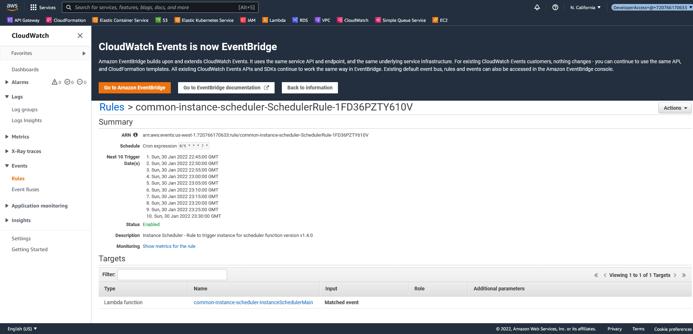
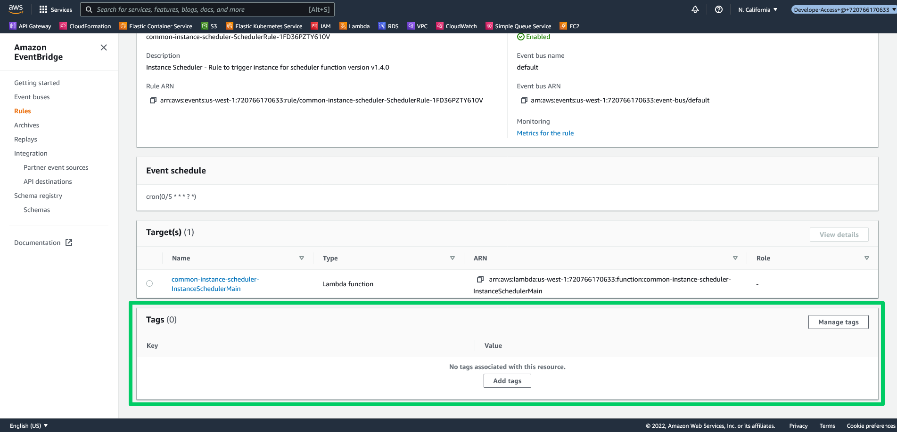

The term Shadow IT is often used to refer to adhoc IT resources deployed by members of a DevOps team to solve an immediate need, but which lack the kind of ongoing maintenance and management required to support long lived infrastructure.

In AWS, Shadow IT takes the form of virtual machines, S3 buckets, virtual private clouds, and any other kind of resource created on the fly, usually through the web console. In this post you learn some of the problems associated with Shadow IT and how to identify unmanaged resources in you AWS account.

## The issues with Shadow IT

Imagine you are a new member of a DevOps team tasked with resolving a failed AWS VM called simply "Web Server". Who created this VM? What applications does it host? Where are the backups located? How can the VM be recreated? 

None of this information is readily available from the VM resource itself, especially if it has failed to the point of no longer being able to log into it. Not having access to this information makes it almost impossible to provide support.

Any growing team that fails to implement some standard practices around the creation of new cloud resources will likely find themselves years later with no idea what any given resource does. This presents security challenges, because it is unclear who is responsible for tasks like OS patching, or what networking rules are appropriate when a general "allow all" rule set was originally applied. It also makes it difficult to know if the current state of the resource is correct, or if someone accidentally made undesirable changes.

In AWS, the first step towards describing resources attributes like who owns it and its purpose are to apply a set of standardized tags. The next step is to ensure all resources are created with declarative templates like CloudFormation, which allows resources to be recreated if needed, and also to detect unwanted manual changes, also known as drift.

To identify noncompliant resources, you'll create two simple runbooks to scan your AWS account for resources without the expected tags.

## Identifying untagged resources

The following Bash script scans the entire AWS account for any resources that lack any of the required tags. In this example, the tags **Team**, **Deployment Project**, and **Environment** refer to the team that owns the resource, the CI or Octopus project that deployed it, and the environment (like development or production) that the resources belongs to:

```bash
REQUIREDTAGS=("Team"  "Deployment Project"  "Environment")

for tag in ${REQUIREDTAGS[*]}; do
  echo "==========================================================="
  echo "The following resources lack the ${tag} tag."
  echo "==========================================================="
  aws resourcegroupstaggingapi get-resources --tags-per-page 100 \
    | jq -r ".ResourceTagMappingList[] | select(contains({Tags: [{Key: \"${tag}\"} ]}) | not) | .ResourceARN"
done
```

## Identifying unmanaged resources

Finding resources that were not created by a CloudFormation template (i.e. unmanaged resources) is very similar to the script above.

All (or almost all) AWS resources support tags, and when those resources are created by a CloudFormation template, the `aws:cloudformation:stack-id` tag is automatically applied. This means that identifying unmanaged resources is as simple as finding any resources that lack the `aws:cloudformation:stack-id` tag.

The Bash script below scans all resources that lack the `aws:cloudformation:stack-id` tag:

```bash
echo "==========================================================="
echo "The following resources were not created by CloudFormation"
echo "==========================================================="
aws resourcegroupstaggingapi get-resources --tags-per-page 100 \
  | jq -r '.ResourceTagMappingList[] | select(contains({Tags: [{Key: "aws:cloudformation:stack-id"} ]}) | not) | .ResourceARN'
```

Note that there are some exceptions to this rule. For example, CloudWatch event rules lack tags. In the screenshot below you can see a rule created by a CloudFormation template that would be flagged by the script above:



However, CloudWatch Events are being replaced by EventBridge, which does support tags for events:



## Resolving noncompliant resources

Defining tags on resources that lack them is usually a case of manually adding them through the web console or CLI. The script below shows an example of adding common tags to resources in bulk:

```bash
aws resourcegroupstaggingapi tag-resources --resource-arn-list \
    arn:aws:lambda:us-west-1:133577413914:function:Production-audits-0-SQS \
    arn:aws:lambda:us-west-1:133577413914:function:Production-product-0-InitDB \
    arn:aws:lambda:us-west-1:133577413914:function:Production-GithubActionWorkflowBuilderGithubOAuthCodeProxy \
    arn:aws:lambda:us-west-1:133577413914:function:Production-audits-0-Web \
    arn:aws:lambda:us-west-1:133577413914:function:Production-audits-0-InitDB \
    --tags Environment=Development \
    --region us-west-1
```

The process of importing unmanmaged resources into an CloudFormation stack is documented in the [AWS documentation](https://docs.aws.amazon.com/AWSCloudFormation/latest/UserGuide/resource-import-existing-stack.html).

## Conclusion

Identifying Shadow IT resources in your AWS account is the first step to establishing infrastructure that can be effectively managed by your DevOps teams. Then by establishing a consistent tagging scheme you are able to document who is responsible for what, the purpose of resources, and which external processes created them.

In this post you saw a number of scripts for finding noncompliant resources, as well as tips on how to add missing tags or import resources into CloudFormation stacks. These simple steps can make a huge difference as your infrastrucutre grows in size and complexity.