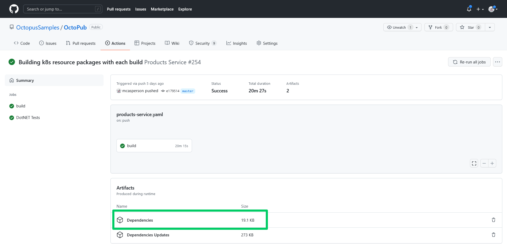
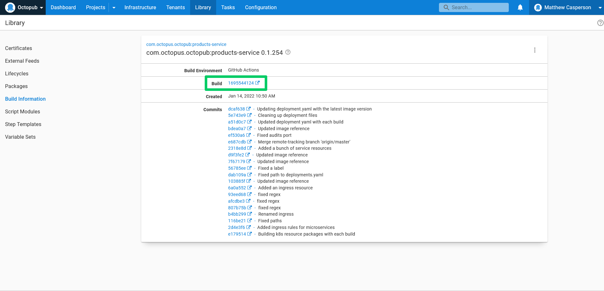

The Log4j project found itself the centre of attention in late 2021 for a [critical vulnerability](https://cve.mitre.org/cgi-bin/cvename.cgi?name=CVE-2021-45046), spawning a flood of "Our response to Log4j" announcements from companies and framework developers around the globe, and even more requests to support desks and forums from customers looking to gauge their exposure.

Needless to say, many engineering teams found themselves under pressure to identify any code bases that may have been affected, provide accurate reports describing any exposure, update any required dependencies, and deploy the new code to production as quickly as possible.

Anyone facing that challenge knows all too well that such a response is not as easy as it sounds. Like any code dependency, knowing whether your code uses Log4j requires a deep understanding of your application's structure and currently deployed version. Typically this requires checking your code base at the specific git commit representing the deployed version of your application and digging into your direct dependencies, along with their child dependencies, to find exactly what libraries your code uses.

Runbooks, combined with [build information](https://octopus.com/docs/packaging-applications/build-servers/build-information) and some simple changes to your CI/CD pipeline, provide a convenient method for querying the dependencies included in your deployed application. In this post you'll learn how to modify a GitHub Actions Workflow to expose the required information and see an example runbook that can query the information on demand.

## Prerequisites

This post uses GitHub Actions as a CI server. GitHub Actions are free for public git repositories, so you only need a GitHub account to get started.

The sample runbook script is written against Python 3, which can be downloaded from the [Python website](https://www.python.org/downloads/). The example runbook source code can be found on [GitHub](https://github.com/OctopusSamples/DependencyQuery).

The example application and associated GitHub workflows can be found on [GitHub](https://github.com/OctopusSamples/OctoPub).

## Capturing dependencies during the build process

We start by capturing the dependencies consumed by the build process as part of our GitHub Actions workflow. Every major language today provides the ability to list dependencies, and the list below shows examples of these commands, capturing the output in a file called `dependencies.txt`:

* Maven - `mvn --batch-mode dependency:tree --no-transfer-progress > dependencies.txt`
* Gradle - `gradle dependencies --console=plain > dependencies.txt`
* Npm - `npm list --all > dependencies.txt`
* PHP - `composer show --all > dependencies.txt`
* Python - `pip install pipdeptree; pipdeptree > dependencies.txt`
* Go - `go list > dependencies.txt`
* Ruby - `gem dep > dependencies.txt`
* DotNET Core - `dotnet list package > dependencies.txt`

Two steps must be added to a GitHub Actions workflow to capture the dependencies as a artifact. The example below demonstrates how to capture Maven dependencies, but the `run` property of the `List Dependencies` step can be replaced with any of the commands above for your specific use case:

```yaml
    - name: List Dependencies
      run: mvn --batch-mode dependency:tree --no-transfer-progress > dependencies.txt
      shell: bash
    - name: Collect Dependencies
      uses: actions/upload-artifact@v2
      with:
        name: Dependencies
        path: dependencies.txt
```

The screenshot below shows the artifact associated with the build:



## Producing build information

[Build information](https://octopus.com/docs/packaging-applications/build-servers/build-information) provides additional metadata for packages referenced in an Octopus deployment or runbook. Build information packages are separate artifacts stored on the Octopus server with the same package ID and version as the package they represent. This allows Octopus to track metadata for all kinds of packages, whether stored in the built-in feed or hosted on external repositories.

One attribute captured by build information packages is a link back to the specific CI build that produced the package. The screenshot below shows the link back to the GitHub Actions run:



The [xo-energy/action-octopus-build-information](https://github.com/xo-energy/action-octopus-build-information) action provides the ability to create and upload a build information package. The step below shows an example of the action:

```yaml
    - name: Generate Octopus Deploy build information
      uses: xo-energy/action-octopus-build-information@v1.1.2
      with:
        octopus_api_key: ${{ inputs.octopus_api_token }}
        octopus_project: Products Service
        octopus_server: ${{ inputs.octopus_server_url }}
        push_version: 0.1.${{ inputs.run_number }}${{ env.BRANCH_NAME != 'master' && format('-{0}', env.BRANCH_NAME) || ''  }}
        push_package_ids: com.octopus.octopub:products-service
        push_overwrite_mode: OverwriteExisting
        output_path: octopus
        octopus_space: "Octopub"
        octopus_environment: "Development"
```

Pushing the build information package is all that is needed for Octopus to link the metadata to a release. The build information is linked to the release as long as the build information package ID and version matches a package used in an Octopus step. The next step is to write a custom script to query the Octopus API to extract the link back to the CI server for the latest release in a given environment.

## Querying the build information to download CI artifacts

We now have all the information in place to track the dependencies for any packages used in an Octopus release. It is possible to manually traverse the links exposed in the Octopus UI back to the GitHub Actions run, download the dependencies artifact, and scan the text file inside, but this manual workflow will not scale as the number of application increases. What we want instead is to automate the process through a runbook executing a custom Python script.

The first step is to define the dependencies for the script in the file `requirements.txt`. The script will make use of the [requests](https://pypi.org/project/requests/) package to streamline HTTP requests:L

```txt
requests==2.27.1
```

You then create a file called `main.py` to hold the script. The complete code is shown below:

```python
import os
import sys
from datetime import datetime
from functools import cmp_to_key
from requests.auth import HTTPBasicAuth
import tempfile
from requests import get
import zipfile
import argparse

parser = argparse.ArgumentParser(description='Scan a deployment for a dependency.')
parser.add_argument('--octopusUrl', dest='octopus_url', action='store', help='The Octopus server URL',
                    required=True)
parser.add_argument('--octopusApiKey', dest='octopus_api_key', action='store', help='The Octopus API key',
                    required=True)
parser.add_argument('--githubUser', dest='github_user', action='store', help='The GitHub username',
                    required=True)
parser.add_argument('--githubToken', dest='github_token', action='store', help='The GitHub token/password',
                    required=True)
parser.add_argument('--octopusSpace', dest='octopus_space', action='store', help='The Octopus space',
                    required=True)
parser.add_argument('--octopusProject', dest='octopus_project', action='store',
                    help='A comma separated list of Octopus projects', required=True)
parser.add_argument('--octopusEnvironment', dest='octopus_environment', action='store', help='The Octopus environment',
                    required=True)
parser.add_argument('--searchText', dest='search_text', action='store',
                    help='The text to search for in the list of dependencies',
                    required=True)
parser.add_argument('--githubDependencyArtifactName', default="Dependencies", dest='github_dependency_artifact',
                    action='store',
                    help='The name of the GitHub Action run artifact that contains the dependencies')

args = parser.parse_args()

headers = {"X-Octopus-ApiKey": args.octopus_api_key}
github_auth = HTTPBasicAuth(args.github_user, args.github_token)


def compare_dates(date1, date2):
    # Python 3.6 doesn't handle the colon in the timezone of a string like "2022-01-04T04:23:02.941+00:00".
    # So we need to manually strip it out.
    date1_parsed = datetime.strptime(date1["Created"][:-3] + date1["Created"][-2:], '%Y-%m-%dT%H:%M:%S.%f%z')
    date2_parsed = datetime.strptime(date2["Created"][:-3] + date2["Created"][-2:], '%Y-%m-%dT%H:%M:%S.%f%z')
    if date1_parsed < date2_parsed:
        return -1
    if date1_parsed == date2_parsed:
        return 0
    return 1


def get_space_id(space_name):
    url = args.octopus_url + "/api/spaces?partialName=" + space_name.strip() + "&take=1000"
    response = get(url, headers=headers)
    spaces_json = response.json()

    filtered_items = [a for a in spaces_json["Items"] if a["Name"] == space_name.strip()]

    if len(filtered_items) == 0:
        sys.stderr.write("The space called " + space_name + " could not be found.\n")
        return None

    first_id = filtered_items[0]["Id"]
    return first_id


def get_resource_id(space_id, resource_type, resource_name):
    if space_id is None:
        return None

    url = args.octopus_url + "/api/" + space_id + "/" + resource_type + "?partialName=" \
        + resource_name.strip() + "&take=1000"
    response = get(url, headers=headers)
    json = response.json()

    filtered_items = [a for a in json["Items"] if a["Name"] == resource_name.strip()]
    if len(filtered_items) == 0:
        sys.stderr.write("The resource called " + resource_name + " could not be found in space " + space_id + ".\n")
        return None

    first_id = filtered_items[0]["Id"]
    return first_id


def get_release_id(space_id, environment_id, project_id):
    if space_id is None or environment_id is None or project_id is None:
        return None

    url = args.octopus_url + "/api/" + space_id + "/deployments?environments=" + environment_id + "&take=1000"
    response = get(url, headers=headers)
    json = response.json()

    filtered_items = [a for a in json["Items"] if a["ProjectId"] == project_id]
    if len(filtered_items) == 0:
        sys.stderr.write("The project id " + project_id + " did not have a deployment in " + space_id + ".\n")
        return None

    sorted_list = sorted(filtered_items, key=cmp_to_key(compare_dates), reverse=True)
    release_id = sorted_list[0]["ReleaseId"]

    return release_id


def get_build_urls(space_id, release_id, project):
    if space_id is None or release_id is None:
        return None

    url = args.octopus_url + "/api/" + space_id + "/releases/" + release_id
    response = get(url, headers=headers)
    json = response.json()

    build_information_with_urls = [a for a in json["BuildInformation"] if "github.com" in a["BuildUrl"]]
    build_urls = list(map(lambda b: b["BuildUrl"], build_information_with_urls))

    if len(build_urls) == 0:
        sys.stderr.write("No build information results contained build URLs to GitHub for project "
                         + project.strip() + ".\n")
        sys.stderr.write("This script assumes GitHub Actions were used to build the packages deployed by Octopus.\n")

    return build_urls


def download_file(url):
    with tempfile.NamedTemporaryFile(delete=False, suffix=".zip") as tmp_file:
        # get request
        response = get(url, auth=github_auth)
        # write to file
        tmp_file.write(response.content)
        return tmp_file.name


def get_artifacts(build_urls, dependency_artifact_name):
    if build_urls is None:
        return None

    files = []

    for url in build_urls:
        # turn https://github.com/OctopusSamples/OctoPub/actions/runs/1660462851 into
        # https://api.github.com/repos/OctopusSamples/OctoPub/actions/runs/1660462851/artifacts
        artifacts_api_url = url.replace("github.com", "api.github.com/repos") + "/artifacts"
        response = get(artifacts_api_url, auth=github_auth)
        artifact_json = response.json()

        filtered_items = [a for a in artifact_json["artifacts"] if a["name"] == dependency_artifact_name]

        if len(filtered_items) == 0:
            print("No artifacts were found in the GitHub Action run called " + dependency_artifact_name)

        for artifact in filtered_items:
            artifact_url = artifact["archive_download_url"]
            files.append(download_file(artifact_url))

    return files


def unzip_files(zip_files):
    if zip_files is None:
        return None

    text_files = []
    for file in zip_files:
        with zipfile.ZipFile(file, 'r') as zip_ref:
            with tempfile.TemporaryDirectory() as tmp_dir:
                zip_ref.extractall(tmp_dir)
                for extracted_file in os.listdir(tmp_dir):
                    filename = os.fsdecode(extracted_file)
                    if filename.endswith(".txt"):
                        with open(os.path.join(tmp_dir, extracted_file)) as f:
                            content = f.read()
                            text_files.append(content)
    return text_files


def search_files(text_files, text, project):
    found = False
    for file in text_files:
        if text in file:
            found = True
            print(text + " found in the following list of dependencies for project " + project.strip())
            print(file)

    return found


def scan_dependencies():
    space_id = get_space_id(args.octopus_space)
    environment_id = get_resource_id(space_id, "environments", args.octopus_environment)
    found = False
    for project in args.octopus_project.split(","):
        project_id = get_resource_id(space_id, "projects", project)
        release_id = get_release_id(space_id, environment_id, project_id)
        urls = get_build_urls(space_id, release_id, project)
        files = get_artifacts(urls, args.github_dependency_artifact)
        text_files = unzip_files(files)
        if search_files(text_files, args.search_text, project):
            found = True

    print("Searching project(s) " + args.octopus_project + " for dependency " + args.search_text)
    if found:
        print("\n\nSearch text " + args.search_text + " was found in the list of dependencies.")
        print("See the logs above for the complete text file listing the application dependencies.")
    else:
        print("\n\nSearch text " + args.search_text + " was not found in any dependencies.")


scan_dependencies()
```

Let's break this code down to understand what it is doing.

