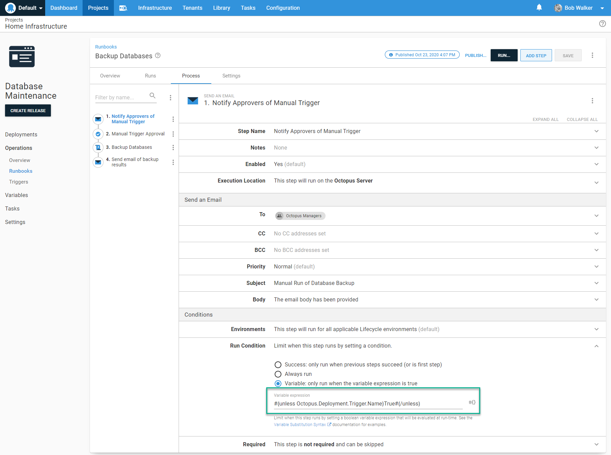

When we first released Runbooks, I had the chance to create a number of them and I learned some lessons I wanted to share.  

This post walks through creating a runbook from scratch and includes some recommendations.

## Defining the problem to solve

At Octopus, we use AWS and Azure for our infrastructure.  In fact, at the time of writing (this post was originally published in November 2020), the only infrastructure in Brisbane’s home office is a WiFi router and a network switch.  Despite being such heavy cloud users, many of us run a hypervisor of some kind in our home offices.  It gives us the opportunity to configure and run permanent VMs such as domain controllers and SQL Servers to use with Octopus Deploy.  It’s one thing to have someone set it up for you, but it’s an entirely different thing to set it up from scratch. 

The problem to solve: I have a couple of SQL Servers running, and I want to back up several databases on each server to my NAS. 

## Designing the runbook process

Defining the problem is the first step.  After I define the problem, my default next step is to add script steps to Octopus Deploy.  That's backfired on me many times, so first, I like to take a moment to answer these questions:

- What are the use cases and requirements? Any gotchas?
- Has this been tried before? If so, what worked and what didn’t work?
- Where should the runbook run?
- Who will invoke, and how will this runbook be invoked?
- Should running the runbook require approval?
- Should there be a notification? If so, when should they go out, and what information should be included? How can I maintain a high signal to noise ratio?
- Is the runbook project-specific? Or is it generic?  
- Is there any information that needs to be captured and retained? What should the retention policy be? Should I push anything to another service?

:::highlight
**Recommendation:** Take the time to go through similar questions.  A little prep work goes a long way.
:::

## Use cases, gotchas, and requirements

I’ve used Octopus Deploy to backup databases to my NAS before with the library step template, [SQL - Backup Database](https://library.octopus.com/step-templates/34b4fa10-329f-4c50-ab7c-d6b047264b83/actiontemplate-sql-backup-database).  It worked okay; the main problem was the library step only supports one database.  Backing up multiple databases required multiple steps, and the process required constant tweaking.  It also uses SQL Management Objects [SMO](https://docs.microsoft.com/en-us/sql/relational-databases/server-management-objects-smo/sql-server-management-objects-smo-programming-guide?view=sql-server-ver15), which meant I had to install additional software.

Based on that experience, my requirements are:

- Adding a database to an existing server shouldn’t require an update in Octopus Deploy
- It should be easy to exclude databases from the process
- Backing up system databases should be optional
- Outside of the Tentacle, the VM running this process shouldn’t require any additional software
- It should be trivial to add a new server to the process
- The SQL Server user performing the backup should only have permission to do backups.  No schema changes or writes allowed
- The process will back up to a NAS, not a local hard drive
- The process should clean any backups over a week old

Before moving on, let’s quickly examine the script this runbook will run.  To solve a number of requirements, I need to store some configuration options.  A little known feature of Octopus Deploy is the ability to store multiple line variable values, such as JSON.  Storing data like JSON lets me define an object for my script to use.  You can do something similar in your instance by clicking the **Open Editor** link.


The editor modal window lets you select the type of text in the top right corner. Choosing the type of text adds syntax highlighting to the value window, making it easier to see if the JSON is syntactically correct.


The script itself isn’t complex.  For each object in the array, it will:

- Connect to the server
- Pull back a list of databases
- Check each database name against the list of databases to exclude and if they are a system database
- If the database isn’t excluded, it will run a simple backup command
- Finally, it will clean up old database backups

```
$backupFolderLocation = $OctopusParameters["Project.Backup.FilePath"]
$backupFileDate = $(Get-Date).ToString("yyyy_MM_dd_HH_mm")
$backupItemList = $($OctopusParameters["Project.Backup.Information"]) | ConvertFrom-Json
$notificationContent = [System.Text.StringBuilder]::new()

foreach ($backupitem in $backupItemList)
{   
    $notificationContent.AppendLine("Server: $($backupItem.Server)")
    $connectionString = "Server=$($backupItem.Server);Database=master;integrated security=true;"    

    try
    {
      $sqlConnection = New-Object System.Data.SqlClient.SqlConnection
      $sqlConnection.ConnectionString = $connectionString

      $command = $sqlConnection.CreateCommand()
      $command.CommandType = [System.Data.CommandType]'Text'
      $command.CommandTimeout = 60000

      $command.CommandText = "select Name from sys.databases"
      $tablesToBackupDataAdapter = New-Object System.Data.SqlClient.SqlDataAdapter $command
      $tablesToBackupDataSet = New-Object System.Data.DataSet

      Write-Host "Opening the connection to $($backupItem.Server)"
      $sqlConnection.Open()

      Write-Highlight "Getting list of databases to backup from $($backupItem.Server)"
      $tablesToBackupDataAdapter.Fill($tablesToBackupDataSet)
      $databaseToBackupList = @()
      foreach ($row in $tablesToBackupDataSet.Tables[0])
      {
          $databaseNameToCheck = $row["Name"]        

          if ($backupitem.DatabasesToExclude -contains $databaseNameToCheck)
          {
              Write-Host "The database $databaseNameToCheck was found in the exclusion list, excluding this database."
              continue
          }

          if ($backupitem.ExcludeSystemDatabases -eq $true -and ($databaseNameToCheck -eq "master" -or $databaseNameToCheck -eq "model" -or $databaseNameToCheck -eq "tempdb" -or $databaseNameToCheck -eq "msdb"))
          {
              Write-Host "The database $databaseNameToCheck is a system database and exclude system databases is set to true, excluding this database."
              continue
          }

          $databaseToBackupList += $databaseNameToCheck
      }    

      Write-Host "The list of databases that will be backed up on $($backupItem.Server) is $databaseToBackupList"
      foreach ($databaseToBackup in $databaseToBackupList)    
      {
          $backupFileName = "$($backupFolderLocation)\$($backupItem.Server.Replace("\", "_"))_$($databaseToBackup)_$($backupFileDate).bak"

          $message = "Backing up $databaseToBackup to $backupFileName"
          Write-Highlight $message
          $notificationContent.AppendLine("    $message")
          $command.CommandText = "BACKUP DATABASE [$($databaseToBackup)]
          TO DISK = '$backupFileName'
             WITH FORMAT;"
          $command.ExecuteNonQuery()

          Write-Host "Backup complete, removing any backups a week old"
          $fileToRemoveList = Get-ChildItem -Path "$($backupFolderLocation)" -Filter "$($backupItem.Server.Replace("\", "_"))_$($databaseToBackup)_*"
          foreach ($fileToRemove in $fileToRemoveList)
          {
              $dateDiff = $(Get-Date) - $fileToRemove.CreationTime
              if ($dateDiff.TotalDays -gt 7)
              {
                  $message = "Removing $($FileToRemove.FullName) because it is $($dateDiff.TotalDays) days old"
                  Write-Host $message
                  $notificationContent.AppendLine("    $message")

                  Remove-Item $fileToRemove.FullName
              }
          }
      }

      $sqlConnection.Close()
    }
    catch
    {
        $notificationContent.AppendLine($_.Exception.Message)
    }
    
    $notificationContent.AppendLine("")
    $notificationContent.AppendLine("")
}

Set-OctopusVariable -name "NotificationContent" -value $($notificationContent.ToString())
```

## Where should the runbook run?

The runbook will invoke `t-sql` commands over port `1433` to back up the database.  The good news is Tentacles don’t have to be installed directly on the SQL Server (in fact, our [docs](https://octopus.com/docs/deployment-examples/database-deployments/configuration/tentacle-and-worker-installation) recommend NOT installing a Tentacle on the same server as SQL Server).  

One requirement is the user performing the backup should only have permission to do the backup.  Also, several requirements indicate this process should be easy to use and trivial to maintain.  Those requirements are solved by running the Tentacle as a [domain account](https://octopus.com/docs/infrastructure/deployment-targets/windows-targets/running-tentacle-under-a-specific-user-account).  That domain account will be assigned `db_backupoperator` and `db_datareader` [roles](https://docs.microsoft.com/en-us/sql/relational-databases/security/authentication-access/database-level-roles?view=sql-server-ver15#fixed-database-roles).  

And just like the [docs](https://octopus.com/docs/deployment-examples/database-deployments/configuration/tentacle-and-worker-installation) recommend, the Tentacle is registered as a [Worker](https://octopus.com/docs/infrastructure/workers) in Octopus Deploy.  I create a new worker pool `Database Backup Worker Pool` to isolate these Workers from other database deployment Workers.  


:::highlight
**Recommendation:** Keep Workers as close to the destination as possible.  If you’re in Azure, run the Worker on an Azure VM.  If you’re in AWS, then have an EC2 instance hosting a Worker.  If you’re running on-premises, have a Worker running on-premises.  Runbooks can be used to perform very low-level tasks.  Not having to jump through firewalls or configure additional permissions adds additional layers of security.  Plus, it keeps latency low.
:::

## Invoking the runbook

I don’t want to think about backups; they should happen automatically via a trigger.  What does require thinking is what environment the runbook should run in.  I want this runbook to run across all environments at the same time.  For simplicity, I create a new environment `Maintenance` for this runbook.  I could use `Production,` but that would be confusing as it connects to a SQL Server in the `Test` environment.  


:::highlight
**Recommendation:**  A maintenance environment can be handy for other cross-cutting runbooks.  However, this means there's a process to touch both `Test` and `Production` environments.  Do a security review of the process to make sure you're not accidentally exposing yourself to additional risk.
:::

## Approvals and notifications

Although a hands-off process, I want to know when an error occurs.  The process always sends out an email when it's finished, even if it fails.  Setting the run condition to be `Always Run` achieves this requirement.


Although it's hands-off, it makes sense to require approval if a person triggers the runbook in a real-world use case.  Thankfully, approvals can be conditional in Octopus using variable run conditions.  The syntax to trigger a manual intervention when a person invokes the runbook is `#{unless Octopus.Deployment.Trigger.Name}True#{/unless}`.  The variable says that unless a trigger triggers this, then run this step.



:::highlight
**Recommendation:** Leverage variable run conditions and [output variables](https://octopus.com/docs/projects/variables/output-variables) to help enforce business rules.  When business rules haven’t been met, an approval is required; otherwise, auto-approve the run.  Conditional auto-approval helps keep the signal-to-noise ratio high for the approvers.  See my post on [running ad hoc SQL Scripts](https://octopus.com/blog/database-deployment-automation-adhoc-scripts-with-runbooks) for a real-world example.
:::

## A generic runbook

This is a generic runbook, not a project-specific runbook.  A project-specific runbook is designed to work with only one project.  It runs on targets with specific roles.  An example of a project-specific runbook is one to refresh the cache of a web application.  Some applications expose endpoints to refresh the cache; others require an application pool or web server reset.  Or the application could use Redis as a cache-store.  

:::highlight
**Recommendation:** Group similar generic runbooks into runbook only projects.  Place those runbooks-only projects into a unique project group.  In the screenshot below, each project has 1 to N runbooks.  The hypervisor project has runbooks for managing the hypervisor; the NAS project has runbooks for backing up files onto the NAS and from the NAS to Azure file storage.
:::


## Logs and retention policy

You might notice the script is capturing logs and setting an output variable.  The contents of that output variable are sent in the results email.  It also uses [write-highlight](https://octopus.com/docs/deployment-examples/custom-scripts/logging-messages-in-scripts) to add text to the task summary.  


For my use case, this is all the logging and retention policy I need.  As this backup is happening each day, I don’t need to keep these logs around for long.  I reduced the retention policy from the default of 100 to 10.


Retention policies delete the run but not the task in the audit log.  To look at the run history, I go to the audit log and find it using advanced filters and date filters.


:::highlight
**Recommendation:** Retention policies are configured per runbook.  Double-check your company’s audit policy to ensure Octopus Deploy doesn’t clean up a run before it's supposed to.
:::

## Conclusion

Runbooks are a great tool to enable self-service DevOps.  Like any tool, though, it's possible to misuse it.  I hope these recommendations help you design runbooks you can use in your Octopus Deploy instance.  

A final recommendation: don’t design runbooks in a silo.  If you're a developer, collaborate with the appropriate operations person (or vice versa).  Start collaborating during the design phase.  Collaboration helps flesh out requirements, and you end up with a process everyone is comfortable supporting.  

!include <q2-2022-newsletter-cta>

Happy deployments!