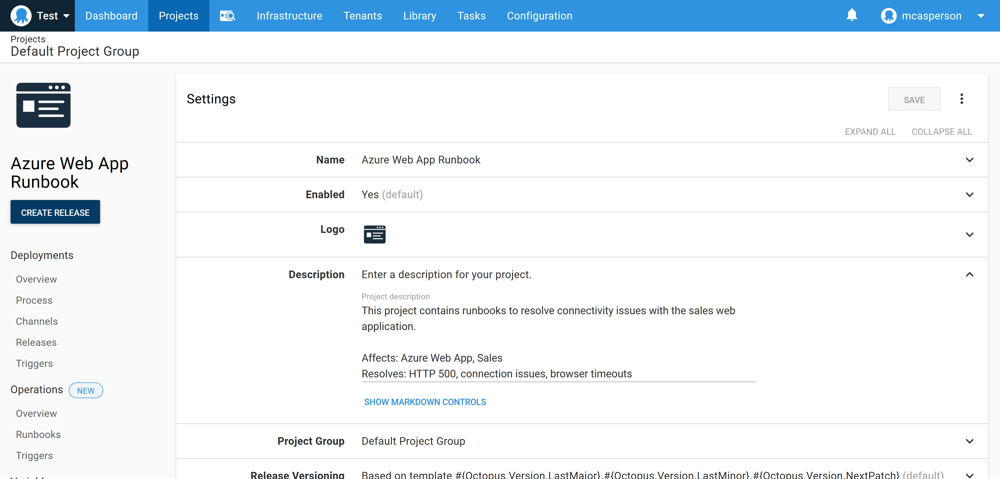
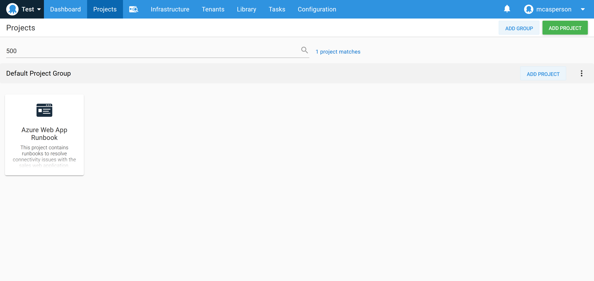
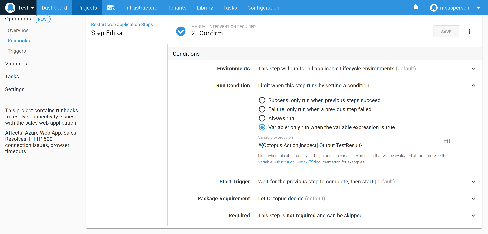
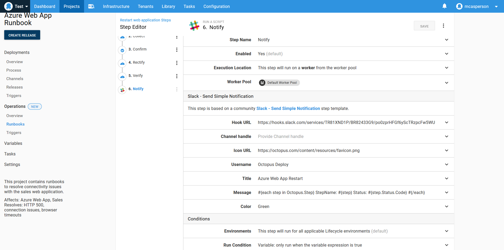
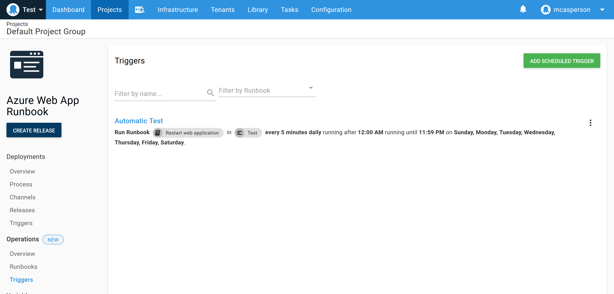

Waterfall, Agile, or Extreme Programming. Whether you implement them or even agree with them, there's no denying developers are always looking to optimize their workflows. And while the specific methodologies differ, they all boil down to maintaining a high velocity and high quality. To achieve that, you need automation.

The operations space hasn’t had the same love that developers have enjoyed, though, leaving the operations team to hack CI servers to automate their tasks. CI servers were built to automate software development, and the ops team will always be a secondary consideration.

With runbooks, Octopus elevates operations tasks to a first-class concept, giving ops teams a workflow designed for their needs.

In this post, we look at the best practices for designing runbooks, providing a template for ops teams to move from manual to automated workflows. As an example, we create a runbook for restarting an Azure web application.

## Describe

It’s 1am and your pager goes off to let you know your website is down. The last thing you want to do is wade through pages of projects and scripts to find the one that will resolve the issue. This makes discoverability critical to runbooks.

Each Octopus project has a description field. Runbooks should take advantage of this field to document what services the runbook targets and which problems the runbook solves. The description field is searchable from the main Octopus dashboard allowing operations and support staff to find suitable projects based on keyword searches, rather than a rote knowledge of all available scripts.

In the screenshot below, you can see the sample project includes several keywords like “500” and “Azure Web App” that match the expected scenarios the runbook would be used in:



Searching for these keywords in the Octopus dashboard returns the runbook project:



## Inspect

The first step in the runbook inspects the current state of the system to determine if it's degraded.

For our example runbook, we’ll use the **Run an Azure PowerShell script** step to make an HTTP request to the website and inspect the response code. The result of the HTTP call is saved in the Octopus variable `TestResult`.

The script below tests the HTTP response code:

```
[System.Net.ServicePointManager]::SecurityProtocol = [System.Net.SecurityProtocolType]::Tls12;

$status = [int]([System.Net.WebRequest]::Create("https://$Hostname").GetResponse().StatusCode)
Set-OctopusVariable `
  -name "TestResult" `
  -value ($status -eq 200)

Write-Host "Web application returned HTTP status code $status"
```

## Collect

To supplement the previous step, we need to collect diagnostic information to determine the root cause of the issue at a later date.

The information gathered here may also be used in the next step to allow support staff to determine if the system is degraded regardless of the HTTP response code that was returned in the previous step.

The script below captures the Azure Web App log file and saves it as an Octopus artifact:

```
[System.Net.ServicePointManager]::SecurityProtocol = [System.Net.SecurityProtocolType]::Tls12;

az webapp log download `
    --name MySalesWebApp `
    --resource-group SalesResourceGroup `
    --log-file logs.zip

New-OctopusArtifact "logs.zip"
```

## Confirm

There are many reasons why a web application could be down. For example, memory leaks and resource spikes can render a site unusable while still occasionally returning a valid HTTP response code.

If the inspect step failed to identify an issue, we display a prompt asking whether the runbook should continue regardless, giving support staff the opportunity to run manual tests or review the diagnostic information retrieved in the collect step and make their decision to proceed.

In practical terms, this step is implemented as a manual intervention step that runs on the condition that the `TestResult` variable created in the last step is true (in other words, if the inspect step successfully contacted the web application, thus not finding a problem).



It's worth paying attention to how often the confirmation step is presented. If it's the norm to proceed manually, it means the inspect step doesn’t accurately identify the error state of the system. Accurately determining that the system is degraded is an important requirement for automating the process.

## Rectify

The rectify step is the meat of the runbook, and in our example is where the Azure web app is restarted. This is implemented with a **Run an Azure PowerShell script** step calling the following script to restart the web app:

```
az webapp restart
```

Turning it off and on again is a running joke in our industry, but only because it's so effective.

## Verify

The verify step is similar to the inspect step, with the exception that the checks implemented here are expected to pass thanks to the rectify step.

In our example, the verify step enters a loop to check the HTTP status code over the course of five minutes. Once a 200 response code is returned, we consider the app to be running. The code for this step is shown below:

```
[System.Net.ServicePointManager]::SecurityProtocol = [System.Net.SecurityProtocolType]::Tls12;

for ($x = 0; $x -lt 30; ++$x)
{
  $status = [int]([System.Net.WebRequest]::Create("https://$Hostname").GetResponse().StatusCode)
  if ($status -eq 200) {
    exit 0
  }
  Start-Sleep 10
}

# We didn't get a good response in 5 mins, so we failed
exit 1
```

## Notify

It's useful to notify other members of the team that a restart was performed. Octopus has steps for sending messages through several communications platforms, and here we've used the **Slack - Send Simple Notification** community step to report the status of each proceeding step.

The text below loops over the runbook steps and prints their status:

```
#{each step in Octopus.Step}
StepName: #{step}
Status: #{step.Status.Code}
#{/each}
```



## Test

If you have a broken system and an untested runbook designed to fix it, you have two problems.

The idea of environment progression for deployments has been a central tenant of Octopus from the beginning, and runbooks have access to all the same environments. Just as you deploy to a test environment before going to production, executing a runbook in a test environment allows the process to be validated before it's used in anger with a production outage.

## Automate

Implementing the previous steps means your runbook accurately identifies when a system is not working as expected, rectifies the problem, and verifies that the system is back in the desired state. You'll also have tested this runbook outside of the production environment. This methodology is specifically designed to instil a high degree of confidence in the runbook process.

At this point, you have the ability to trigger the runbook automatically on a regular schedule. To do this, the confirm step is disabled or removed, use the run condition `#{unless Octopus.Action[Inspect].Output.TestResult}true#{/unless}` for the remaining steps, and a scheduled trigger is created to execute the runbook as needed:



## Conclusion

Whatever methodology you ascribe to, achieving high velocity and high quality demands automation. The steps outlined in this post are designed to produce a runbook that can be confidently run automatically.

Reliably identifying when a system is not in a desired state, rectifying the problem, verifying the fix, and validating the entire process in a test environment ensures your runbooks have the same quality as your software deployments.

!include <q2-2022-newsletter-cta>

Happy deployments!