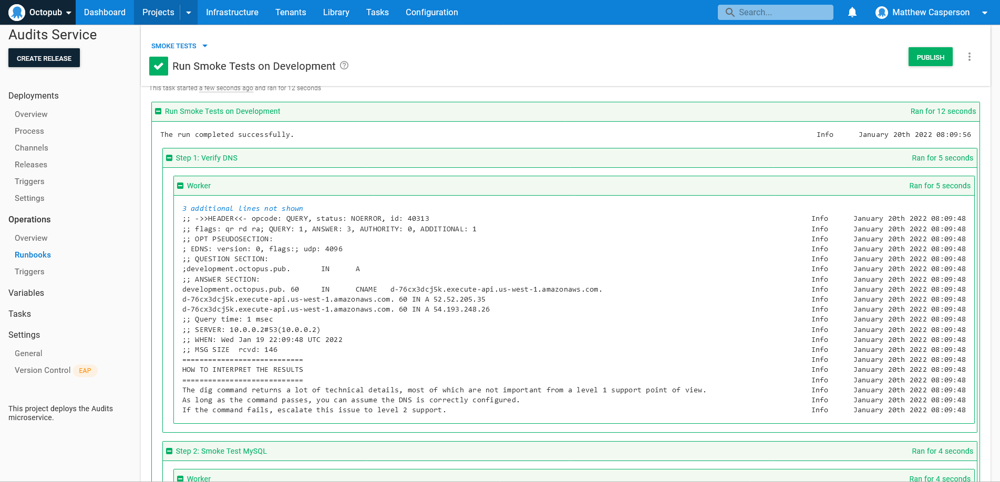
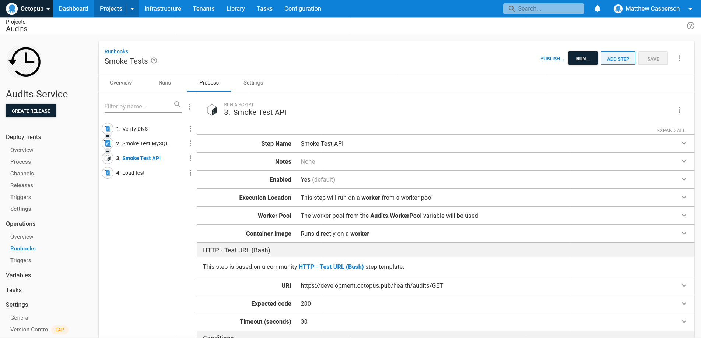
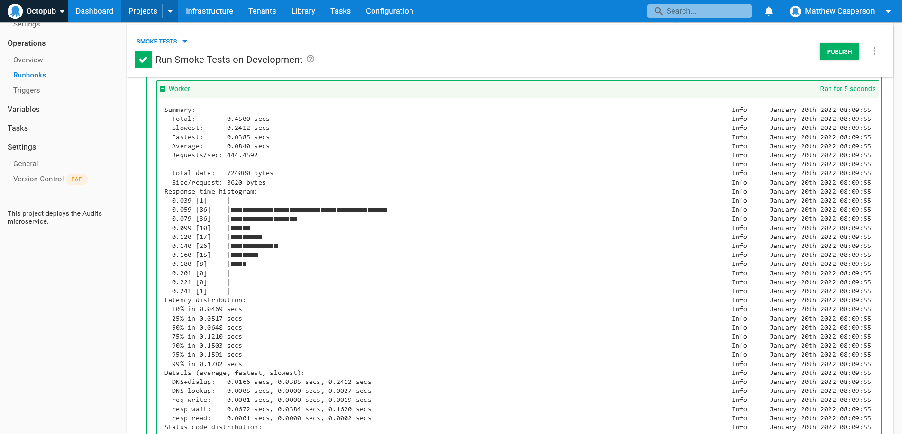

*The internet is broken!*

Anyone who has spent some time on a help desk has heard this, and other equally vague, descriptions of issues customers have run into. Getting actionable information is half the battle when diagnosing an issue.

When supporting complex infrastructure though, it can be hard to know how the system was designed, which in turn makes it hard to know what questions to ask and where to find information to help resolve the issue. It's the nature of custom applications typically found in enterprise environments that each is an evolution of the last, or written by an entirely different team using a unique approach each time. This means business knowledge around how an application should be supported is often only found in the heads of a few employees.

Runbooks provide a way to capture this business knowledge in an automated and testable way, ensuring the support team can quickly diagnose high level issues and efficiently respond to customer requests. 

In this post, I provide an example runbook aimed at the level 1 support team designed to smoke test a typical microservice application in AWS.

## Prerequisites

This post assumes that the runbook steps are run on a Linux Worker. They use [dig](https://linux.die.net/man/1/dig) for DNS lookups, [hey](https://github.com/rakyll/hey) for load testing, [curl](https://curl.se/docs/projdocs.html) for interacting with HTTP endpoints, and the [mysql client](https://dev.mysql.com/doc/refman/8.0/en/mysql.html).

To install the tools in Ubuntu, run the following command:

```bash
apt-get install curl dnsutils mysql
```

To install the tools in Fedora, RHEL, Centos, or Amazon Linux, run:

```bash
yum install curl mysql bind-utils
```

Then manually download `hey` with the command:

```bash
curl -o /usr/local/bin/hey https://hey-release.s3.us-east-2.amazonaws.com/hey_linux_amd64
chmod +x /usr/local/bin/hey
```

We created a [public Octopus instance with this runbook defined against a live microservice](https://tenpillars.octopus.app/app#/Spaces-42/projects/audits-service/operations/runbooks/Runbooks-102/overview). Log in with the guest account to view the runbook steps and list the results of previous executions.

## Smoke testing DNS

DNS lets you map friendly names, like `development.octopus.pub`, to IP addresses, like `52.52.151.20`.

DNS is usually a stable service, but when it fails it's likely no other networked service will function correctly. For this reason, the first smoke test you want to perform on services exposed to the internet is to verify that the DNS name can be resolved.

The script below executes `dig` to inspect the DNS records associated with a domain name:

```bash
dig "#{Octopus.Environment.Name | ToLower}.octopus.pub"
# Capture the return code of the previous command. This will be used as the exit code of the entire script once we print out
# any further instructions.
RETURN_CODE=$?
echo "============================"
echo "HOW TO INTERPRET THE RESULTS"
echo "============================"
echo "The dig command returns a lot of technical details, most of which are not important from a level 1 support point of view."
echo "As long as the command passes, you can assume the DNS is correctly configured."
echo "If the command fails, escalate this issue to level 2 support."
# Exit the script with the return code from the smoke test
exit $RETURN_CODE
```

The output of this script looks like this:



Tools like `dig` tend to be quite technical, and the output requires some experience to interpret. However, your level 1 support team usually doesn't need to deeply understand networking issues like DNS, so it's important that the results and any further actions are explained as part of the script. This is an example of capturing business knowledge in a runbook, and it means even new starters can run these runbooks and be confident responding to the results.

## Smoke testing MySQL

In this example our application uses a MySQL database for persistence. If the database isn't accessible, the service will fail, so the next step is to write a script to smoke test the database.

The script below uses the `mysql` command line tool to attempt to query a known database table. Note the results are redirected to `/dev/null`, as we don't want to populate the logs with actual database records:

```bash
DATABASE_HOST=$(get_octopusvariable "Database.Host")
USERNAME=$(get_octopusvariable "Database.AuditsUsername")
PASSWORD=$(get_octopusvariable "Database.AuditsPassword")

echo "Database Host: $DATABASE_HOST"
echo "Database Username: $USERNAME"

mysql --host=$DATABASE_HOST --user=$USERNAME --password=$PASSWORD audits -e "SELECT * FROM audits" > /dev/null
# Capture the return code of the previous command. This will be used as the exit code of the entire script once we print out
# any further instructions.
RETURN_CODE=$?

echo "============================"
echo "HOW TO INTERPRET THE RESULTS"
echo "============================"
echo "This test attempts to query the audits database."
echo "If this step fails, escalate the issue to level 2 support."

# Exit the script with the return code from the smoke test
exit $RETURN_CODE
```

## Smoke testing HTTP services

The next test verifies that public HTTP endpoints respond with the expected status code. Web services always return a status code with any response, and typically you can assume that a public URL will return a code of 200, which indicates a successful response.

For a complete list of HTTP response codes, refer to the [MDN documentation](https://developer.mozilla.org/en-US/docs/Web/HTTP/Status).

For this test, we make use of a step in the [community step template library](https://octopus.com/docs/projects/community-step-templates) called **HTTP - Test URL (Bash)**. This step defines a bash script that calls `curl` against the supplied URL and verifies the HTTP status code:



## Load testing

The previous three smoke tests verify the fundamental layers of our application's infrastructure. You can expect that if any of them fail there's a serious issue.

However, it is still possible the application is working, but is unusable because it's slow or randomly fails to requests. Your final smoke test performs a quick load test using `hey` to verify that the application responds consistently to multiple requests. The script below calls `hey` against the microservice API:

```bash
# Warm up
hey https://#{Octopus.Environment.Name | ToLower}.octopus.pub/api/audits > /dev/null

# Real test
hey https://#{Octopus.Environment.Name | ToLower}.octopus.pub/api/audits
# Capture the return code of the previous command. This will be used as the exit code of the entire script once we print out
# any further instructions.
RETURN_CODE=$?

echo "============================"
echo "HOW TO INTERPRET THE RESULTS"
echo "============================"
echo "It is expected that the majority of requests complete in under a second."
echo "If the chart above shows the majority of requests taking longer than a second, please escalate this issue to level 2 support."
# Exit the script with the return code from the smoke test
exit $RETURN_CODE
```

The output from this script is shown in the screenshot below:



This output requires some interpretation to decide what further action to take. The histogram shows the response time for each of the requests, and in this example you would expect the vast majority of requests to be completed in less than a second. The instructions guide support team members running this script to make the appropriate decision based on the output.

## Conclusion

Every application you encounter in an enterprise environment requires a multitude of underlying services and infrastructure to be operating correctly. By writing smoke tests that probe and verify those layers, support teams can quickly confirm issues and respond to support requests efficiently and confidently.

In this post, you saw examples of smoke tests that verified DNS services, HTTP endpoints, and MySQL databases. You also saw a simple load test that provided insight into the performance of a service when responding to multiple requests.

!include <q2-2022-newsletter-cta>

Happy deployments! 