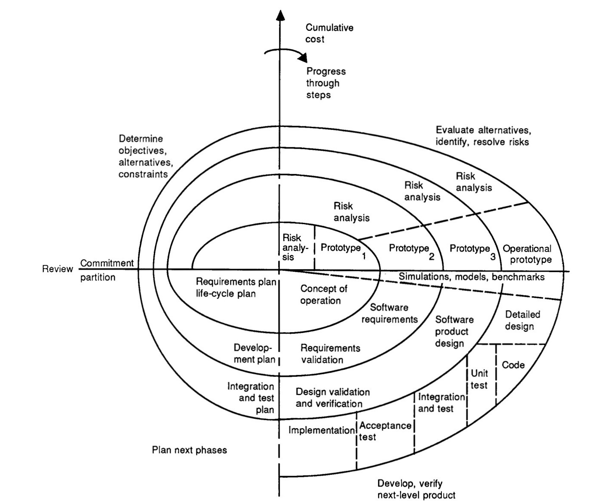

## Introduction

How did we get to where we are today with software delivery? Each time an organization publishes a new software delivery model, they tend to attack previous attempts to solve this complex problem; but there is evidence that they are more influenced by previous ways of working than they might appear. This three-part series will look at how the process of writing software has changed, and why.

This part looks at the first three decades of modern computer programming, starting in the 1950s. There are three specific examples to illustrate the trend:

- The Lincoln Laboratories model.
- The waterfall model.
- The spiral model

There is also context to explain some of the reasons these models emerged as organizations attempted to create large software products.

Software delivery throughout these thirty years was dominated by phased software delivery methods. These methods were partly inspired by manufacturing and construction, where each stage was performed once and where the completed project was difficult to change. Each stage in the model would be done by a different specialist role and work would be validated against the previous phase.

### Historical factors

In the early years of programming, there were many factors that should allow us some empathy with the creators of these heavyweight software delivery models.

In the 1950s, high-level compiled languages were a new invention. Self-taught programmers were having success writing small programs on their own, but now they were tackling far bigger problems. The software delivery world was now faced with the challenge of writing a program that was too large for a single individual to understand. This meant if was necessary for multiple people to contribute to the same code base, which required a method for a programmer to share what he knew about the program with others.

Additionally, it wasn't easy to create a team to produce software in mid to late 20th century because there weren't many programmers in the world. Accurate statistics are hard to obtain, but the US Census Bureau tracks detailed occupations by role. In 1970 there were fewer than two-hundred thousand programmers in the US, rising to 1.6 million by 2015. If you think it's hard to find programmers now, imagine what it was like in the fifties and sixties!

Modern programming languages are usually highly readable. Code is stored in version control, with many versions available almost instantly, and it is easily searchable. We have integrated development environments and advanced text editors that allow us to navigate the code and that makes suggestions as we type. We can get the machine to perform accurate refactorings using keyboard shortcuts. When two people edit the same file, the tools help us merge our changes and integrate them into a single canonical version that will be packaged and deployed.

In contrast, early programmers used hand-written code listing, or punch cards, or had to time-share an expensive machine and it's console. It was difficult to find code and update it. There was no immediate feedback from compilers running in the background to check the code. There were no build or deployment tools and many organizations had to write compilers and tools to support their own development efforts. The languages and tools available at the time will have had a big influence on the software delivery models that were created to tackle large complex programs.

There was also a big difference in software economics. Programmers were expected to cost around fifteen-thousand dollars a year, but computers cost five-hundred dollars an hour. This made computers more than fifty times more expensive than programmers, a completely inverse economic scenario to today, as programmers are now more than seventy times more expensive than the individually allocated machines they each use.

Lean manufacturing, though it existed, had not made it into the north-western hemisphere's mindset at this stage. That would happen in the 1990s when the *The Machine That Changed the World* was published. Manufacturing and construction in the west would have had no references to the Toyota Production System when the newly formed programming industry searched for metaphors to guide them.

When it comes to sharing ideas and guiding external organizations in the use of methods, one of the biggest revolutions is The Web. We can now read thousands of articles and case studies, watch videos, attend conferences, and participate in discussions through The Web. Many of the early models were published in trade journals, or transcribed from a presentation.

With these incredible differences in mind, we can view some examples with some understanding and empathy for the reasons they emerged. The examples have been selected because of their prevalence, and because their influence on each other, and on future models, is clear.

## The Lincoln Labs phased model

MIT's Lincoln Laboratory had been working on a secret project, later revealed to be the US SAGE (Semi-Automatic Ground Environment) air-defense system. This was a challenging project intended to connect dozens of radars to a machine for analysis and relay. The project included both software and hardware, with magnetic core memory being created to solve speed and reliability issues with the computer designed to handle the work.

The phased model used to develop the system was described by Herbert D. Benington in a presentation in 1956 titled *Production of Large Computer Programs*. The model had nine phases, many of which required specification documents to be prepared to enable the component to be tested in a later phase against the requirements. The documentation was also used to share knowledge between different people working on the system.

The solid lines describe the design of the system, with the dotted-lines showing the relationship between the documentation and testing phases.

The phase named "parameter testing" is a form of isolated component testing where other components were simulated. All components were assembled into a complete system and were tested together in the "assembly testing" phase. These two phases were performed on the machine where the code was being integrated. The final testing phase, called a *shakedown* tested the system on the production machine.

The purpose of Benington's paper is largely a call to action. He saw a great opportunity for the industry to use the computers to help reduce the cost of programming, documentation, and testing. "How can we reduce this cost?" he asked, referring to the huge expense of changing the documentation, tests, and code once it was in use. "Obviously, as we have done already, by more extensive use of the computer."

About half of the code written as part of the project was supporting code, such as utilities, compilers, and instrumentation.

Though this approach became the de-facto model for software delivery, Benington didn't recognize the Lincoln Labs approach in how the industry was applying the idea. He didn't like the interpretation of the phased approach as *top-down programming* where the initial specification was fully completed before the code was written. He said this was "misleading and dangerous" in 1983, yet many organizations would continue run large fully-specified projects. Instead, he told the industry to create a working prototype and use it to evolve a system.

This criticism was a possible influence on the spiral model, which is one of the featured models. First, though, we need to tackle *the big one*: Waterfall.

## Waterfall

When Winston Royce wrote about phased software development in his 1970 paper *Managing the Development of Large Software Systems*, his diagram looked a lot like a staircase waterfall. The "waterfall" name was first applied to Royce's approach in 1976 by T. E. Bell and T. A. Thayer in their paper *Software Requirements: Are They Really a Problem?*.

In his paper, Royce says there are two essential steps for software development: analysis and coding. He said that this was "... all that is required if the effort is sufficiently small and if the final product is to be operated by those who build it." He also warned that attempting to create a larger system using this two-step model was "doomed to failure."

Royce's full waterfall model is shown below. This isn't the version that is usually shared as the majority of people preferred the simpler diagram, where each stage only feeds back to its predecessor. Royce warned that this purely sequential approach would be "risky and invited failure." Despite this warning, the allure of the sequential approach made it the basis for most software delivery approaches for the following two decades.

One of Royce's gifts to the future is his suggestion that the key to working with a more complex multi-stage phased delivery model was to work in small incremental changes. He thought this would reduce the complexity and allow an organization to return to an earlier baseline if there was an unforeseen difficulty creating the new version.

Most suggestions in the paper involve introducing more documents and adding review stages. While there was a call to *involve the customer*, this was described in terms of a formal commitment, rather than a collaborative working partnership. The formal customer relationship was symptomatic of a contract-driven approach used by government departments and businesses for software acquisition.

The waterfall model recognized many of the problems with phased software delivery, but with most organizations choosing to ignore Royce's warnings, it was primarily the documentation and control aspects of his proposal that were added to existing phased approaches. This made things slower and more expensive, without realizing the benefits that might have been obtained from Royce's recommendations on using prototypes and working in small increments.

The problems with phased delivery continued for a further decade, prompting Benington to claim that the problems were caused by organizations failing to follow the Lincoln Labs model correctly. Royce could have made a similar claim about waterfall being used in the wrong way.

The legacy of waterfall, though not the intention, was to solidify the phased model and to increase the reliance on formal documents.

## The Spiral Model

By 1988, when Barry Boehm wrote *A Spiral Model of Software Development and Enhancement*, the waterfall Model was the prevalent software delivery model. Boehm noted that waterfall had helped to solve some problems, but he challenged the order of phases and the emphasis on fully elaborated documents as the basis for moving between stages. This echoed some of Benington's challenges to top-down document-driven approaches.

The spiral model arranged the phases of software delivery in an infinitely expanding spiral. The diagram itself contains several elements that are often missed.

There are *x* and *y* axes dividing the chart into four quadrants that represent specific categories of activity:

1. Determine objectives, alternatives, and constraints
2. Evaluate the alternatives, identify and resolve risks
3. Develop and verify the next-level product
4. Plan next phase

The exact phases that would form the development and testing quarter were to be determined in the risk analysis stage. This meant the approach could be tailored, based on the risks that had been identified.

The *x* axis indicated the cumulative cost of the initial development and the subsequent enhancements. The model included a pre-flight *round 0* to set up the project and assess feasibility,  followed by a number of rounds to produce incremental working prototypes. The initial software delivery cycles delivered an operational product and then further cycles would be used for enhancements and maintenance. The spiral could continue indefinitely and was only terminated when the product was retired.

The spiral model encouraged incremental delivery against a set of options. Each cycle would be small enough to deliver an agreed outcome against a selected option, using a process that was appropriate to the risks. It was possible to stop funding a project after reviewing a prototype, or to change the direction based on the alternate options and feedback from each prototype.

Some of the goals of the spiral model included finding and fixing errors earlier, generating and eliminating different options, and performing maintenance and enhancements the same way as the initial development. In the original paper, Boehm identified that one of the challenges to this approach was the nature of contracts used in software acquisitions. To use incremental and adaptable approaches to software delivery, contracts would also need to become more flexible.

## Summary

Before the introduction of models, software delivery was a code and fix process. The phased model was a response to the problems found in this approach. Each time a weakness was identified, a phase was added in an attempt to mitigate it. Systems written using code and fix became hard to change, so a design phase was added to try and reduce the cost of change. If the system didn't meet the users needs an analysis phase would be added to better understand the needs.

When there were still problems after phases were added, it was seen as being a control issue. Control issues were solved with documents and reviews. The amount of time to take a requirement through the phased approach began to grow, which meant it took more time to discover problems. The cost of handovers encouraged organizations to do them less often, which meant the size of a batch of work increased.

It turned out that all of the phases and controls introduced by heavyweight processes failed to reduce the failures in software delivery. Many of the reported failures were undoubtedly caused by naive adoptions of phased delivery, something the authors were keen to assert in the 1980s. 

Some organizations spotted the danger of ever-increasing project size and started to experiment with *evolutionary approaches*, but in many cases this appeared to be a return to code and fix delivery with all the associated issues.

The spiral model was the first sign that these phased software problems had been recognized and that the solution wasn't to increase batch sizes and add more control steps, or to have no process at all. Instead, the spiral model introduced the idea of working in smaller batches and tailoring the process for each increment according to the risks.

There were also plenty of revolutionary ideas to emerge from the heavyweight model era. Royce warned of the dangers of feedback being delayed. He also noted that risk increases in line with project size and that controls steps would add to the cost of the project. The concept of prototypes features in all of the models, with the spiral model assimilating Benington's suggestion about incrementally evolving the prototype towards the operational product, rather than trying to build a large system in one big bite.

In the second part of this history, the rise of lightweight and agile methods are explored.