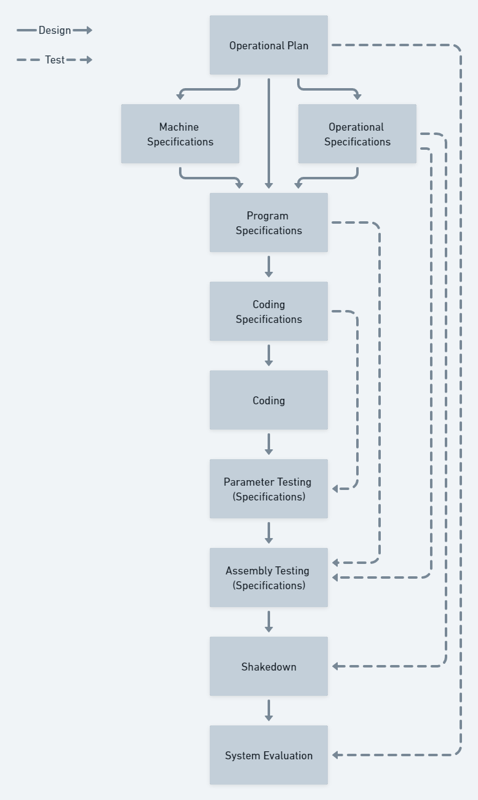

## Introduction

Over the years there have been many software delivery methods that have gained traction with teams and organizations. In this post, we'll look at a number of them and see what they got right and wrong. We'll then take a look at the future of software delivery as we move into a new mode of discovery backed by research and analysis of approaches.

## The heavyweight methods

Between 1950 and 1990, software delivery was dominated by phased software delivery methods. These methods were partly inspired by manufacturing and construction, where phases were performed once and couldn't cheaply or easily be changed once completed. Each phase represented a specific skill or discipline, such as analysis, design, coding, and testing. For the project to progress, it would need to be handed off from one phase to the next.

### Historical factors

In the first few decades of programming, there were a number of factors that should allow us some empathy with the creators of these heavyweight software delivery models.

In the 1950s, high-level compiled languages were a new invention. Self-taught programmers were having success writing small programs on their own, but now they were tackling far bigger problems. The software delivery world was faced for the first time with the challenge of writing a program that was too large for a single individual to grasp and this meant multiple people contributing to the same program, which required a method for a programmer to share what he knew about the program with others.

Additionally, it wasn't easy to create a team to produce software in mid to late 20th century because there simply weren't many programmers in the world. Accurate statistics are hard to obtain, but the US Census Bureau tracks detailed occupations by role. In 1970 there were fewer than 200,000 programmers in the US, rising to 1.6 million by 2015. If you think it's hard to find programmers now, imagine what it was like in the fifties and sixties!

We are all used to programming languages that are highly readable, stored in version control with many versions available almost instantly, and machine searchable. The modern tool set was not available when these first large programs were being written. Whether it was hand-written listings, the physical punching of cards, or having to time-share a machine and it's console; it was difficult to obtain and update code listings. The process of reviewing the listings and finding a routine can hardly be imagined by a programmer today. There was no auto-completion or immediate feedback from a code editor that compiled the code quietly in the background while the programmer typed. This will certainly have influenced the models being designed to tackle complex programs at the time.

In terms of costs, a programmer was expected to cost $15,000 a year. This was inexpensive compared to the $500 per hour cost of computer time. This made computers more than fifty times more expensive than programmers, a completely inverse economic scenario to today as the programmers are now more than seventy times more expensive than the individually allocated machines they each use.

Lean manufacturing, though it existed, had not made it into the northern hemisphere's western mindset at this stage. That would happen with the publication of *The Machine That Changed the World* in 1990. So, local manufacturing and construction would have had no references to the Toyota Production System when the newly formed programming industry searched for metaphors to guide them.

## The Lincoln Laboratory model

Herbert D. Benington described the phased model used at MIT's Lincoln Laboratory. The model described nine phases, many of which required specification documents to be prepared to enable the component to be tested in a later phase against the requirements. The documentation was also the mechanism for creating a shared understanding of the system, due to the historical factors mentioned earlier.

The solid lines describe the design of the system, with the dotted-lines showing the relationship between the documentation and testing phases.

The parameter testing is a form of component testing where other components are simulated. The components are tested together in the next phase when they are assembled into a complete system. These two phases are performed on the machine where the code is being integrated. The final testing phase, called a *shakedown* in this model tests the system in it's operational environment.

To make the model more streamlined, fully half of the instructions written for the system were for utilities, test instrumentation, and operational instrumentation.

The purpose of Benignton's paper is largely a call to action. He saw a great opportunity for the industry to use the computers to help reduce the cost of programming, documentation, and testing. "How can we reduce this cost?" he asked, referring to the huge expense of changing the documentation, tests, and code once it was in use. "Obviously, as we have done already, by more extensive use of the computer."

The most influential heavyweight methods include Waterfall, Spiral Model, and V-Model.

Herbert D. Benington

- In the 50s and 60s programmers designed, tested, installed, and maintained their program!
- "documentation of the system is an immense, expensive job" but it was necessary as the documentation was how the knowledge was shared 
- He didn't like the movement towards what he called *top-down programming*. In 1983 he said: "The great majority espouse the following approach: we must write the initial top-down specification [...] so we will know precisely what our objectives are before we produce one line of code. This attitude can be terribly misleading and dangerous."
- He said "the biggest mistake we made [...] was that we attempted to make too large a jump..." he said that if he could do that project again, he would have taken the 35,000 instruction prototype and "worked to test and evolve a system" from it instead of jumping from the prototype to the big real thing.
- As if he were looking at the current state of software development, Benington said; "there remains a tremendous range and ability among computer programmers to do different jobs. Some are good gem-cutters for any kind of stone. Some can play very special roles - for example, where fastidious approaches are needed. Some are brilliant and articulate conceptualizers and leaders. Some should not be allowed near a computer. We must learn to recognize these types, to use them in their right place, and to set higher standards for not using people even though the market seems insatiable."
- In what is a fantastically prescient statement, Benington discussed decentralized programs, which divided into "a dozen or so parts" with communication between each part using blocks of data on magnetic tape or punch cards. He said that these blocks could be defined with relative ease to considerably simplify the design problem. "After the blocks have been documented, groups of programmers can be assigned to each part with the assurance that little communication between these programmers will be necessary..." which is the fifties version of microservices solving Conway's law.
- "It is debatable whether a program of 100,000 instructions can ever be thoroughly tested - that is, whether the program can be shown to satisfy its specifications under all operating conditions." He suggested that we "must accept the fact that testing will be sampling only." He also added that "program testing effort is seldom adequate". He also said that the component tests should be performed using simulated inputs and recorded outputs as this would make the tests reproducible and remove the question of whether an error discovered during the tests could have been introduced by a human entering the wrong inputs.

## What changed?

- Higher-order programming languages
- Being able to program using interactive consoles
- 

## Waterfall

For the purposes of the Waterfall method, we'll use the definition from Winston Royce's "Managing the Development of Large Software Systems", which was written in 1970.

**Describe Waterfall**

### What it got right

Winston Royce started by describing a two-stage software delivery method that he deemed sufficient for most small software development projects. It involved analysis and coding.

He went on to describe a common seven-phase process of software delivery and explained that the process was prone to failure due to a lack of feedback cycles and the delay between the formation of the original requirement and the testing meant that it was highly likely a large amount of rework would be needed.

"I believe in this concept," he said. "But the implementation described above is risky and invited failure."

He then suggested an iterative interaction between various phases but also acknowledged that the feedback is not constrained to successive steps.

In fact, many of the observations in "managing the development of large software systems" represent a foreshadowing of the lightweight methods movement in the 1990s. So, what did Royce get wrong?

### What it got wrong

There are really two key failures in Waterfall, the first is that Royce correctly predicted many of the critical failures in the traditional phased approach and explains them in the paper. Despite having worked out all of the issues, Royce doesn't quite put his finger on the ultimate solution to all the drawbacks he perceived: Work in smaller batches.

All evidence suggests that the bigger you make a project, the more likely it is to fail. You can multiply the budget by the planned duration and get a reasonable failure indicator from the resulting number.

The attempts in Waterfall to avert disaster add overheads without meaningfully reducing the risk at all. In fact, practitioners often found themselves in the vicious circle of slowing down delivery to try and improve quality, which is proven to have the opposite effect.

The second key failure was that Waterfall had a skewed rationality to success ratio. It *sounded* very plausible and gained wide adoption without meaningfully solving the problems that Royce so intuitively predicted.

Waterfall found its way into many traditional methods and maturity models with organizations adopting damaging practices to get certified against required delivery standards.

### Interesting ideas

Most of the key ideas in waterfall are found in Royce's own findings. The delay in getting feedback, the increase of risk in line with project size, and the added overheads of attempting to add process to control risk were all astute observations. He didn't quite get to findings such as targeting fast feedback loops or working in small batches, but he came close.

There was a principle in Waterfall called "do it twice" that suggested that a completely novel idea should be implemented once *in miniature* as a practice run and then again as a proper product. Royce suggested a one-third split for practice with two-thirds remaining for the real thing. This idea has resurfaced in other methods as a prototype, MVP, or spike that is intended to remove some uncertainties and surface any unforeseen problems before you get too heavily invested in a particular pathway.

There was also a very clear call in Waterfall to involve the customer. While there was a more contractual and commitment-based intent to this statement, customer involvement remains a key aspect of many modern software methods - just with a more collaborative nature of engagement.

## Spiral Model

In 1988, Barry Boehm described "A Spiral Model of Software Development and Enhancement" that arranged the phases of software delivery into a repeating spiral, where each journey incrementally build on the previous one.

### What it got right

### What it got wrong

### Interesting ideas

## V-Model

The V-Model is attributed to Keven Forsberg and Harold Mooz from their 1991 paper "The Relationship of System Engineering to the Project Cycle". They originally referred to it as the "Vee" Model. Interestingly, they include a version of the Watefall process that Winston Royce used to critise the view that feedback was a concern of successive steps, which perhaps contributes to the misunderstanding of Waterfall but certainly supports their alternative, which arranges the steps into a V-shape and has more verbose sounding steps.

**Describe V-Model**

### What it got right

The V-Model extended Waterfall by acknowledging Royce's own observation that feedback doesn't occur between successive steps. The shape of the V-Model reflects the more concentric-circle nature of feedback, which means the feedback on earlier steps typically arrives later in the process.

### What it got wrong

Although arranged into a v-shape, the process is really linear, rather iterative. As with Waterfall, the test phase would often be compressed due to previous stages taking longer than expected. The V-Model was highly document-driven, with formal user requirement documents, software specifications, architecture descriptions, module designs, unit test plans, integration test plans, system test plans, and user acceptance test plans all listed amongst the required documentation.

### Interesting ideas

## References

Production of Large Computer Programs. Herbert D. Benington (1956) re-published in 1983 with an additional foreword from Benington.