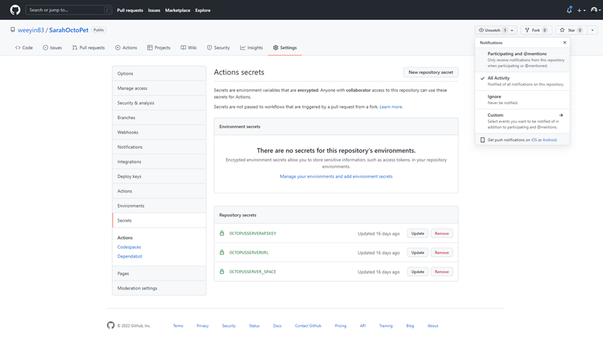

Recently, I wrote about [using Azure Bicep files to deploy your Azure infrastructure using Octopus Runbooks](https://www.octopus.com/blog/azure-bicep-octopus-deploy).  

In this post, I explain how you can use GitHub to source control your Azure Bicep files and then deploy them using Octopus. 

## Why source control?

Source control provides a single source of truth, whether that's for your application code or your Infrastructure as Code (IaC).  

Source control also allows you to collaborate with others working on the same code base and merge their changes. It can also help keep track of every change, so if someone makes a mistake, you can turn back the clock to a working version. 

## Get your Bicep files from GitHub to Octopus

With your Bicep files stored in GitHub, you can use GitHub Actions to move them to your Octopus Deploy instance, to automate the deployment of the Azure resources.

GitHub Actions launched in 2019 and has become a popular tool for DevOps professionals and open source contributors. 

In this post, you create a GitHub Actions workflow to pack your Bicep files into a ZIP file. You then push your Bicep files to your Octopus instance ready for deployment. 

### Octopus connection

First, you need to set up GitHub Actions secrets that will hold the connection information to your Octopus instance. 

You need: 

- The URL for your Octopus Deploy instance
- An API key
- The name of the space you want to push your files to 

Create 3 secrets under **Settings**, **Secrets**: 

- `OCTOPUSSERVERAPIKEY`
- `OCTOPUSSERVERURL`
- `OCTOPUSSERVER_SPACE`



### Creating a GitHub Actions workflow

Now you need to create the GitHub Actions workflow.  

Your GitHub Actions workflow needs to reside under a folder called **.github** in your repository and it must use YAML. 

Start your workflow files with a description of what they do for easy reference and others to understand. Then, define a name for the workflow and when you want it to run:

```yml

# This workflow takes the Bicep files within the Bicep folder and zips them together.  Then pushes/uploads them to the Octopus Instance specified. 
# In the repo's secrets are the information relating to the Octopus Instance URL, API key and Space. 
name: OctoPetShopBicepBuild
on:
  push:
    branches:
    - main
```
Your workflow runs every time there's a push on the main branch. 

Next, you need to define the steps for the workflow: 

```yml
# A workflow run is made up of one or more jobs that can run sequentially or in parallel
jobs:
  # This workflow contains a single job called "Bicep Build"
  BicepBuild:
    # The type of runner that the job will run on
    runs-on: windows-latest
    steps:
    # This first step takes the code within the Repo and pulls it into the workspace
    - uses: actions/checkout@v2
```

Define the kind of Worker or runner the job should run on. In this example, I defined the latest Windows runner. 

The first step for your workflow is taking the files in your repository and bringing them into the working area.  I did this using a Marketplace action called checkout. 

```yml
 # We install the latest version of Octopus CLI
    - uses: OctopusDeploy/install-octopus-cli-action@v1.1.8
```

Next, install the Octopus CLI onto your runner so you can use the commands from that CLI. The runner doesn’t have the commands installed by default. 

```yml
 # We take the files inside the Bicep folder and zip them together
    - name: Zip Bicep files
      run: octo pack --id="OctoBicepFiles" --format="zip" --version=${{ github.run_number }} --basePath=${{ github.workspace }}\Bicep\ --outFolder=${{ github.workspace }}\output
```

The next step takes the files into the Bicep folder in your repository and puts them in a ZIP file. 

```yml
# We take the zip file we created and push them to the Octopus Deploy server instance
    - name: Push Bicep files
      run: octo push --package="${{ github.workspace }}\output\OctoBicepFiles.${{ github.run_number }}.zip" --server="${{ secrets.OCTOPUSSERVERURL }}" --apiKey="${{ secrets.OCTOPUSSERVERAPIKEY }}" --space="${{ secrets.OCTOPUSSERVER_SPACE }}"
```

The final step in this workflow is a push step.  This step takes the ZIP file you created and pushes it to your Octopus instance.  You use the secrets you created earlier to make the connection to your Octopus instance. 

You can get a copy of the [complete workflow on GitHub](https://gist.github.com/weeyin83/fa134eec3cb7bd8c52fa25f2f323189c). 

## Conclusion

You now have a place to store your Bicep modules and infrastructure deployment code, and an automated process that pushes those files to your Octopus instance ready for deployment. 

Leave a comment below if you have any questions or feedback on this process, we'd love to hear from you.

!include <q2-2022-newsletter-cta>

Happy deployments!