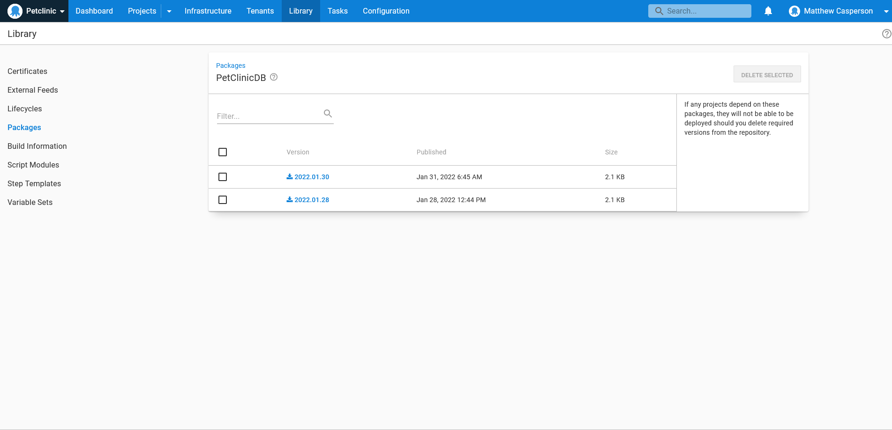
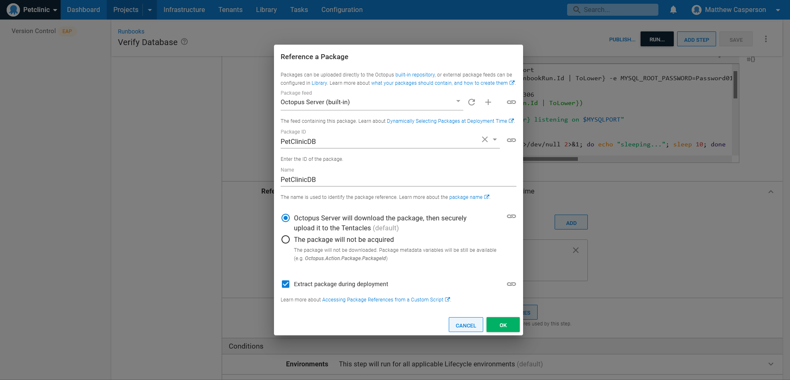
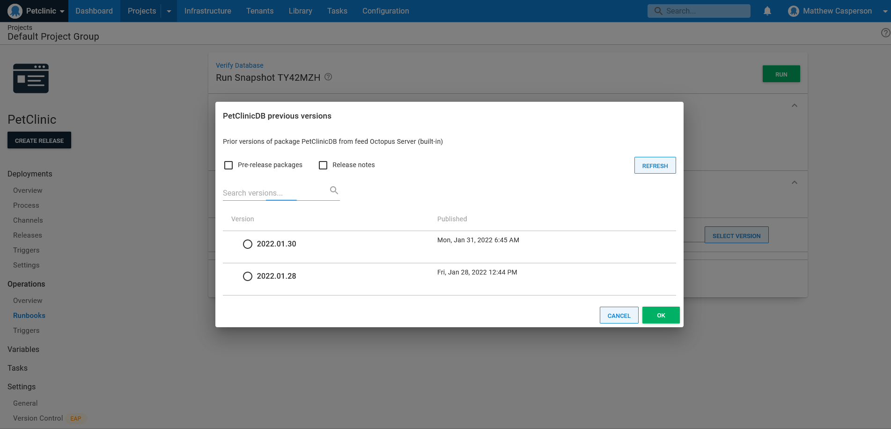

It's no longer a question these days of whether or not you should have backups. Regular backup procedures are a fact of life for any modern organization that recognizes the value of their data. Many organizations go as far as transferring their backup media to another site to ensure a physical disaster in one location doesn't destroy their data.

Less common though is a robust backup verification process. The finer points of the backup restoration process are often only worked out when disaster strikes. It's also during a disaster that organizations find themselves wondering if they've backed up the right data in the right format. Needless to say, these are not the questions DevOps personnel want to be faced with when trying to restore operations during a crisis.

Runbooks provide a convenient solution to these questions. By automating and regularly executing the process of restoring backups in a disposable environment, DevOps teams can gain confidence their backups are valid, and the process of restoring a system is well rehearsed.

Some years ago we released a [blog series documenting the process of building a CI/CD and operations pipeline for a Java application](https://octopus.com/blog/java-ci-cd-co/from-jar-to-docker). This series wrapped up with a runbook designed to backup a MySQL database. While valuable advice, this post series made the same mistake of assuming creating a backup and saving it offsite was the end of the story.

In this post, you learn how to complete the backup cycle by verifying the backup against a real, if disposable, MySQL database in a custom runbook.

## See the runbook in action

The runbook described in this post has been deployed to [this public Octopus instance](https://tenpillars.octopus.app/app#/Spaces-62/projects/petclinic/operations/runbooks/Runbooks-126/overview). Click **I am a guest** to view the runbook and the output generated from previous executions.

## Treating backups as deployable artifacts

The database described in the [previous post](https://octopus.com/blog/java-ci-cd-co/from-cd-to-co) was deployed to a Kubernetes cluster. As noted in the previous post, the process of performing the backup involves running the `mysqldump` client in the MySQL container, dumping the database tables, and uploading the resulting file to a more permanent location. That location was an S3 bucket.

However, verifying a backup file means treating it much like any other deployable artifact. The artifacts used to deploy your applications are versioned and saved in repositories that allow versions to be queried and compared. Conceptually, your database backup should be just another deployable and versioned artifact, ready to be queried and consumed by a runbook.

In practice, the backup artifact needs to be uploaded to a repository rather than a simple file store. This doesn't mean no longer using a service like S3, as you can quite easily [format S3 to function as a Maven repository](https://octopus.com/blog/hosting-maven-in-s3). However, for the purposes of this post, you upload the backup file directly to the Octopus built-in feed.

You can upload files to Octopus most easily with the Octopus CLI. The `Dockerfile` below installs the Octopus and AWS CLIs alongside the MySQL server:

```Dockerfile
FROM mysql
RUN apt-get update; apt-get install python python-pip -y
RUN pip install awscli
RUN apt update && apt install --no-install-recommends gnupg curl ca-certificates apt-transport-https -y && \
curl -sSfL https://apt.octopus.com/public.key | apt-key add - && \
sh -c "echo deb https://apt.octopus.com/ stable main > /etc/apt/sources.list.d/octopus.com.list" && \
apt update && apt install octopuscli -y
```

## Backing up the database

The following Bash script locates the first pod whose name starts with "mysql", executes `mysqldump` to perform a backup, packages the SQL file as a artifact with the Octopus CLI, and pushes the artifact to the Octopus server:

```bash
POD=$(kubectl get pods -o json | jq -r '[.items[]|select(.metadata.name | startswith("mysql"))][0].metadata.name')
VERSION=$(date +"%Y.%m.%d")
kubectl exec $POD -- /bin/sh -c 'cd /tmp; mysqldump -u root -p#{MySQL Password} petclinic > dump.sql 2> /dev/null'
kubectl exec $POD -- /bin/sh -c "cd /tmp; octo pack --overwrite --include dump.sql --id PetClinicDB --version ${VERSION} --format zip"
kubectl exec $POD -- /bin/sh -c "cd /tmp; octo push --package PetClinicDB.${VERSION}.zip --overwrite-mode OverwriteExisting --server https://tenpillars.octopus.app --apiKey #{Octopus API Key} --space #{Octopus.Space.Name}"
```

The end result of this script are versioned backup artifacts in the Octopus built-in feed:



## Verifying the backups

Now that your database backups are versioned and uploaded to a repository, like any other deployable artifact, consuming them in runbooks becomes much easier. The next step is automating the process of verifying the backup in an ephemeral (disposable) environment.

Docker provides the perfect platform to spin up and tear down a test database. This is because Docker containers are, by design, isolated and self contained, allowing you to orchestrate the backup restoration and clean everything up afterwards.

The Bash script below performs the following:

- Creates a MySQL Docker container
- Exposes the internal port 3306 on a random port on the host
- Extracts the random port number
- Waits for the MySQL server to start
- Restores the backup
- Queries the database for records known to be included in the backup
- Removes the Docker container
- Verifies the result of the previous SQL query

```bash
# Run docker mapping port 3306 to a random port
docker run -p 3306 --name mysql-#{Octopus.RunbookRun.Id | ToLower} -e MYSQL_ROOT_PASSWORD=Password01! -d mysql

# Extract the random port Docker mapped to 3306
PORT=$(docker port mysql-#{Octopus.RunbookRun.Id | ToLower})
IFS=: read -r BINDING MYSQLPORT <<< "$PORT"
echo "mysql-#{Octopus.RunbookRun.Id | ToLower} listening on $MYSQLPORT"

echo "Waiting for MySQL to start"
while ! echo exit | nc localhost $MYSQLPORT >/dev/null 2>&1; do echo "sleeping..."; sleep 10; done
echo "Sleep a little longer to allow MySQL to finish booting"
sleep 20

echo "Restoring the database"
docker exec mysql-#{Octopus.RunbookRun.Id | ToLower} mysql -u root -p#{MySQL Password} -e "CREATE DATABASE petclinic;" 2>/dev/null
cat PetClinicDB/dump.sql | docker exec -i mysql-#{Octopus.RunbookRun.Id | ToLower} /usr/bin/mysql -u root -p#{MySQL Password} petclinic 2>/dev/null

echo "Query the database"
COUNT=$(docker exec mysql-#{Octopus.RunbookRun.Id | ToLower} mysql -u root -p#{MySQL Password} petclinic -s -e "select count(*) from owners;" 2>/dev/null)
echo "Table owners has $COUNT rows"

echo "Shutting the container down"
docker stop mysql-#{Octopus.RunbookRun.Id | ToLower}
docker rm mysql-#{Octopus.RunbookRun.Id | ToLower}

if [[ "$COUNT" -eq 0 ]]; then
    # If there were no rows returned, something went wrong and the backup is not valid
    exit 1
fi
```

This script is run in a runbook as a regular **Run a script** step, with an additional package reference downloading the SQL backup artifact:



Referencing a backup like any other deployable artifact lets you select the backup to verify when creating the runbook run, or accepting the latest version by default:



## Conclusion

Backups are only as good as their ability to be restored, but too often the finer points of restoring a backup are discovered during a crisis, leaving DevOps teams to wonder if the backups include the correct data in the correct format.

By treating backup artifacts like any other deployable artifact and automating the process of restoring and verifying backup data, DevOps teams can refine their recovery process as part of a regular backup lifecycle, and gain confidence that they can quickly recover from any scenarios involving the loss of data.

In this post, you saw example runbooks that generate database backups, upload them to an artifact repository, consume the backup as a deployable artifact, and verify the process of restoring the data to an ephemeral environment. The end result is a backup workflow treating the restoration of data as just another routine, automated task.

!include <q2-2022-newsletter-cta>

Happy deployments!