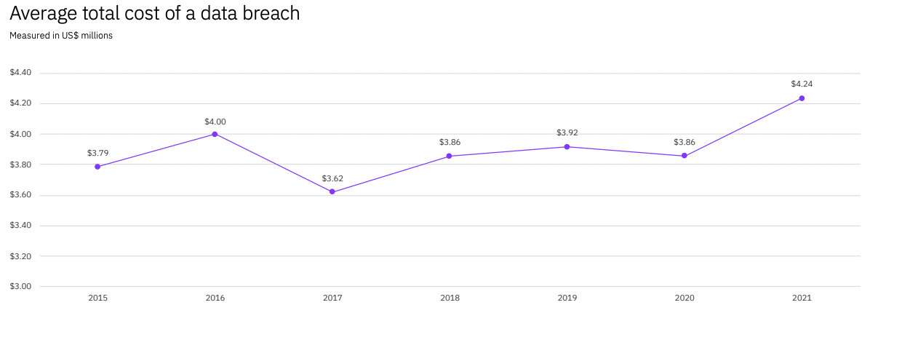

<!-- see https://github.com/OctopusDeploy/blog/blob/master/tags.txt for a comprehensive list of tags -->

## What is Shadow IT?

The IT department was once tasked with the oversight and management of all IT resources in an organization. While a worthy goal, this is no longer the case. Partly due to cloud technologies, and partly due to the abundance of choice for end users, not every IT resource is known and visible. End users may provision IT resources outside the control of the IT department. This concept is shadow IT. Shadow IT is the use and management of IT technologies that are outside the control of an organization. In 2017, Gartner predicted that the IT department would make fewer technology decisions, and individual business units would begin to select technology for their teams, amounting to 38% of technology purchases[1]. In  2019, Everest Group predicted that upwards of 50% of technology spend in organizations is in the shadows[2]. With the rise of cloud solutions, this number is set to rise. How should IT departments respond to this? Is it realistic to track 100% of all IT purchases? Or should there be a more managed approach with accepted risk? This blog aims to explore these questions.

## Costs to the business

As more and more IT resources and infrastructure migrate to shadow IT, the risks of security breaches increase as they lie outside the control of IT departments. A study by EMC estimates that data loss and downtime contribute to $1.7 trillion each year due to shadow IT security breaches[3]. In IBM's 2021 Cost of Data Breach report, a data breach rose from US$3.86 million to US$4.24million on average from 2020 to 2021[4].

There are also compliance concerns for businesses in highly regulated industries. For example the U.S army banned US soldiers from using TikTok over GDPR concerns with how the app shares data[5]. For industries like defence or cybersecurity, compliance poses a management risk.

Shadow IT affects operational costs. When shadow IT is left unmanaged, services become decentralized as each business unit is procuring IT for their own needs. This leads to underutilization of a prescribed centralized service. It can also lead to unpredictible operation costs of cloud infrastructure that is provisioned and running without the IT department's knowledge. 

## Why do employees use Shadow IT?

End users are any employees of an organization that require an IT resource to do their job. The main motivation of end users to employ shadow IT is convenience. IT policies can sometimes be rigorous. Often it is easier and faster to procure an IT solution themselves than go through the process with IT. End users could also prefer certain solutions over a prescribed solution which leads to more shadow IT. Rather than dealing with support tickets an end user may choose to find an alternate path. End users deviating from the prescribed IT solutions demonstrate the risks of shadow IT, however the end user is not often concerned with those risks. They want to get their job done in a way that is streamlined and efficient. At Octopus Deploy, we believe runbooks addresses the need for a streamlined experience, while maintaining the governance required to manage the IT resources.

[Image about the need for governance vs need to ease-of use and runbooks]

## Risk mitigation

The unknown nature of shadow IT increases the risk profile of an organization. Most likely, shadow IT has already invaded the majority of businesses, making the elimination of shadow IT entirely not possible. Gartner suggest three risk mitigation strategies to address this.

- Use Data Security Governance to Balance Local business unit IT (BUIT) Growth Objectives Against the Risk of Data Breaches and Financial Liabilities
- Deploy Shadow IT Discovery and Data Protection Tools to Enable the Safe Selection, Deployment and Notification of Unauthorized Cloud Services
- Use Data Security Governance to Develop and Orchestrate Consistent Security Policies Across All BUIT for Each Prioritized Dataset

From a business perspective, governance, discovery and protection are important to managing shadow IT. From an end user perspective, the IT solutions that are prescribed should be streamlined and free from blockers. 

## What do we mean by self-service runbooks?

With a runbook, you are typically executing a task in response to a request from a user. For example, a user may raise a help ticket, asking you to refresh the data in their testing database. You have to spend the time reading the ticket, making sure you understand exactly what the user wants, and then execute the task. 

By making the runbook self-service, you are taking that same runbook you would use to refresh the test database and making it possible for the user who needs the refreshed test database to execute the task themselves. That user can now run that runbook whenever they need, without having to raise a ticket, and without taking up your valuable time.

## Why do self-service runbooks benefit operations teams?

By making runbooks available to your users, you save the time you would have spent performing the task. This frees you up for more important and interesting work. Additionally, because the user inputs all the required information directly into the runbook, you save time going back-and-forth on a ticket trying to gather all the correct information (and reducing the chance of mistakes in the process). 

You can also bake “guard-rails” into your self-service runbooks, ensuring that users can only go down the "safe path" when executing a runbook. For example, if you had a runbook that returned log files from production, you could hard-code which files are returned, ensuring the runbook cannot be abused to gain unauthorized access (and you don’t have to give out access to production). This can make life much easier when it comes to audit time, as you know the production system has only been accessed in a safe and compliant manner.

You can also create self-service runbooks that allow users to do very complex and time consuming tasks, such as creating a new AWS account. By doing this, your users have their needs met very quickly, and you can ensure every AWS account is created with all the correct VPC settings, password policy, and IAM roles for your users. 

## Self-service runbooks can help to reduce shadow IT

**Shadow IT** is the unapproved use of IT systems and applications within an organizations, and it is a big issue for many companies. Self-service runbooks can help to reduce shadow IT, as users are more likely to follow the right path when they can do so quickly and easily. 

> The goal of this step is controlled, self-service solutions. Any software you provide must meet two important criteria:
> - Self-service: Users must use the solution without bothering IT.
> - Control: IT must still be able to control data and user access.
> When you deliver controlled, self-service options, your business gets the best of both worlds. Users get the solutions they need quickly, and IT can still secure the data and applications."

[From MRC](https://www.mrc-productivity.com/blog/2016/07/6-ways-to-reduce-shadow-it-security-risks/)

By using self-service runbooks, users can solve their own problem without bothering IT, while operations teams can maintain control over the data and user access. Self-service runbooks allows operations teams to ensure standardization into the processes that end users are running. Streamlining a process from multiple different ways into one standardized way that works repeatedly can provide a big benefit to a business.

## Conclusion

Shadow IT is any IT resource that lies outside the control of the organization. It is a problem with several risks and high costs to businesses. To manage shadow IT, busineses need more governance, discovery and protection of IT assets. End users want more streamlined processes and the ability to solve problems without too many support tickets. Runbooks are a way to solve this issue by providing a self-serviced way to run commonly used tasks. Applying this concept to a problem like setting up cloud accounts provides standardization for IT assets

## Learn more

- [Gartner 38%](https://www.gartner.com/smarterwithgartner/make-the-best-of-shadow-it)
- [Everest Group 50%](https://www.everestgrp.com/2019-04-why-shadow-it-is-the-next-looming-cybersecurity-threat-in-the-news-49881.html/)
- [EMC](https://corporate.delltechnologies.com/en-us/newsroom/announcements/2014/12/20141202-01.htm)
- [IBM](https://www.ibm.com/au-en/security/data-breach)
- [TikTok](https://www.forbes.com/sites/carlieporterfield/2020/01/02/us-army-bans-soldiers-from-using-tiktok/?sh=5bb4b66deb9b)
- 

!include <q2-2022-newsletter-cta>

Happy deployments! 