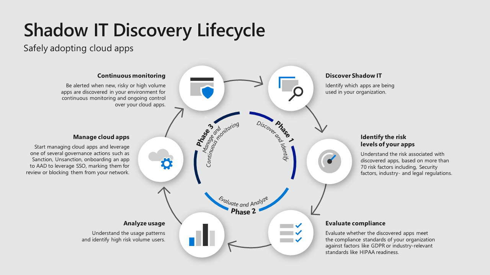

In a traditional organization, the IT department oversees and manages all IT resources. However, with such easy access to cloud-based IT resources, many employees (who are impatient and have pressing deadlines) find it simpler and quicker to spin up IT infrastructure themselves, rather than filling out requests and waiting for the IT department. When employees create and use their own IT resources that are invisible to the IT department, this is known as shadow IT.

In 2017, Gartner predicted that the IT department would make fewer technology decisions, and individual business units would begin to select technology for their teams, amounting to [38% of technology purchases](https://www.gartner.com/smarterwithgartner/make-the-best-of-shadow-it). In 2019, Everest Group predicted that [more than 50% of technology spending in organizations was due to shadow IT](https://www.everestgrp.com/2019-04-why-shadow-it-is-the-next-looming-cybersecurity-threat-in-the-news-49881.html/). The rise of cloud technology compounds this problem, making it easier than ever for employees to use unapproved IT resources.

Shadow IT poses new questions for organizations. These include:

- How should IT departments respond to shadow IT?
- Is it realistic, or even practical, to track 100% of all IT resources?
- Should there be a more managed approach with accepted risk?
- What tools can help manage shadow IT?

This post aims to explore these questions.

## Costs to the business

More and more teams are taking advantage of shadow IT. This increases the risks of security breaches as the resources are outside the control of IT department. 

A study by EMC estimates that data loss and downtime contribute to [$1.7 trillion in losses each year due to shadow IT security breaches](https://corporate.delltechnologies.com/en-us/newsroom/announcements/2014/12/20141202-01.htm). 

In IBM's 2021 [Cost of Data Breach Report](https://www.ibm.com/au-en/security/data-breach), the average cost of a data breach rose from US$3.86 million to US$4.24million from 2020 to 2021.

There are also compliance concerns for businesses in highly regulated industries. The [General Data Protection Regulation (GDPR)](https://gdpr.eu/tag/gdpr/) imposes strict regulations on organizations anywhere they collect data related to people in the European Union (EU). There are harsh fines for offenders reaching into the tens of millions of euros. As shadow IT increases, it becomes harder to ensure that only authorized employees are accessing sensitive data.

Shadow IT affects operational costs, too. When shadow IT is left unmanaged, services become decentralized as each business unit procures IT for its own needs. One business unit may prefer one product while another prefers its competitor. This can also lead to unpredictable operation costs of cloud infrastructure. Think of all the unmonitored VMs created for a single purpose, always running but never torn down. By allowing business units to procure their own IT infrastructure, businesses lose then benefits of their buying power and ability to reduce the cost of IT infrastructure.

The true costs of shadow IT come down to a growing unknown resource that has operational and security risks.

## Why do employees use shadow IT?

End users are any employees of an organization that require an IT resource to do their job. The primary motivation to employ shadow IT is convenience. 

IT policies can sometimes be rigorous. Often, it's easier and faster for the end user to procure an IT solution themselves than go through the process with IT. End users often also prefer specific solutions over a prescribed solution, leading to more shadow IT. Rather than dealing with support tickets, an end-user may find an alternate solution to the problem that introduces shadow IT.

End users are the cause of shadow IT, but they are generally not concerned with the consequences. They want to get their job done in a streamlined and efficient way. Self-service runbooks can address this by ensuring a streamlined experience with governance that gives end users the ability to spin up the infrastructure they need without avoiding the IT department.

## Risk mitigation

The unknown nature of shadow IT increases the risk profile of an organization. Shadow IT has already infected businesses and will only grow, so it's a matter of managing the risk. Gartner suggests three [risk mitigation strategies](https://www.gartner.com/smarterwithgartner/make-the-best-of-shadow-it) to address this.

> - Use data security governance to balance local business unit IT (BUIT) growth objectives against the risk of data breaches and financial liabilities
> - Deploy shadow IT discovery and data protection tools to enable the safe selection, deployment, and notification of unauthorized cloud services
> - Use data security governance to develop and orchestrate consistent security policies across all BUIT for each prioritized dataset

Shadow IT requires governance, discovery, and protection. The solution must be streamlined and minimize time spent in support. Self-service runbooks can address this.

## The Shadow IT discovery lifecycle

A [post by Microsoft](https://www.microsoft.com/security/blog/2019/03/26/step-7-discover-shadow-it-and-take-control-of-your-cloud-apps-top-10-actions-to-secure-your-environment/) outlines the stages of the shadow IT discovery lifecycle. This supports that any solution to shadow IT should have governance but also compliance. 

Reducing the barriers to compliance while maintaining governance is an important step towards managing shadow IT. Octopus Deploy provides runbooks as a way to achieve compliance and governance across an organization.

## What is a runbook?

A runbook is a reusable way to execute a commonly repeated task, for example, refreshing the data in a test database.

Typically when a developer needs the data in a test database to be refreshed, the following actions need to be performed:

1. The developer creates a request to the support team to refresh the data in their database.
1. The support team reviews the request to understand the requirements.
1. If the support team needs additional information, they request it from the developer.
1. When the support team has everything they need to action the request, they run through the process of refreshing the data in the database.

Depending on the support team's workload and turnaround, this request could take anywhere between minutes to days, and often the developer has no visibility into the timeline.

The steps to refresh the data in the database can be captured and executed by a runbook. Runbooks also include all the permissions to execute the task, meaning the runbook can be self-service. This allows the user to execute the task without requesting and waiting for a support team member.

Any task that can be automated can be captured in a runbook, allowing team members to execute tasks that previously needed a dedicated team.

Runbooks also introduce consistency. Imagine a self-service runbook for creating a new AWS account. Users need to set access levels, VPC settings, and other IAM considerations. If 50 different users try to set up an account, this could result in 50 different types of users, which is another challenge that's introduced with shadow IT. If you apply this to creating VMs, container registries or other PaaS infrastructure, it is easy to see the issues with shadow IT.

Using runbooks can restrict this process and standardize IT resources. Operations can use runbooks to enable monitoring and security on IT resources.

Though runbooks don't solve every aspect of shadow IT, runbooks can improve IT resource governance and ease of use for end users. [According to MRC on managing shadow IT risk](https://www.mrc-productivity.com/blog/2016/07/6-ways-to-reduce-shadow-it-security-risks/):

> The goal of this step is controlled, self-service solutions. Any software you provide must meet two important criteria:
> 
>    - Self-service: Users must use the solution without bothering IT.
>    - Control: IT must still be able to control data and user access.
> 
> When you deliver controlled, self-service options, your business gets the best of both worlds. Users get the solutions they need quickly, and IT can still secure the data and applications."

Runbooks allow operations teams to monitor resources and provide security. They also allow the user to self-serve problems without support.

## Conclusion

Shadow IT is any IT resource that lies outside the organization's control. It's a problem with several risks and high costs to businesses. 

Businesses need more governance, discovery, and protection of IT assets. End users want more streamlined processes and solve problems without too many support tickets. 

Runbooks can solve this issue by providing a self-service way to run commonly used tasks. Applying this concept to a problem like setting up cloud accounts provides standardization for IT assets.

!include <q2-2022-newsletter-cta>

Happy deployments!