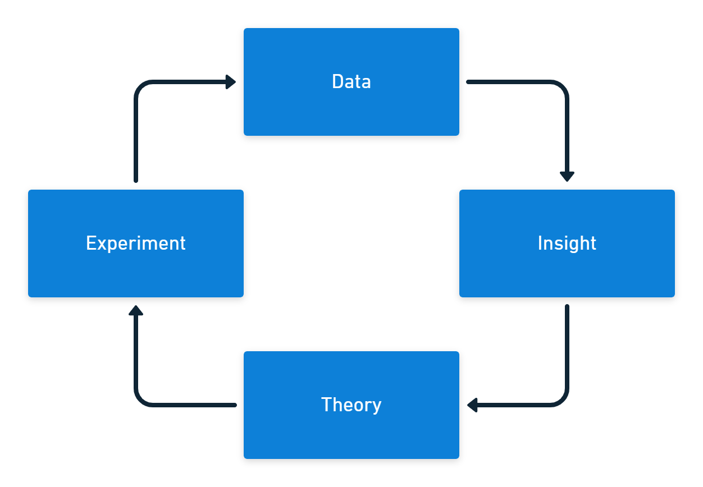

Metrics are crucial to the process of continuous improvement. However, a balance must be struck between collecting data and making it visible and being flooded with information. You'll need to decide what data to collect as well as what smaller set of data you pay attention to at any time.

If your car had a dashboard that displayed every metric it collects through the engine management system, there would be no window left to see the road.

Early cars featured an *ammeter*, which measured the electric current between the battery and voltage regulator. This was important as it told you the charging system was working. There was no speedometer. As cars could only achieve a top speed of 35 miles per hour and the suspension discouraged traveling at this speed, it wasn't necessary to measure velocity.

In a modern car, no dashboard space is given to an ammeter (though a battery light will illuminate if there is a problem). But, you will find a speedometer in almost every car. The current dashboard design reflects the changes that have been developed in cars and also in the broader system they operate within. Engines are more powerful, suspension systems are better, roads are generally smoother, and there are more cars on the road. Attitudes towards safety have also changed.

Similarly, the metrics you collect and display will change over time as you respond to differences in the team and organization.

As you create and evolve your system of measurement, there are some common mistakes you should avoid.

## Ignoring the data

The first problem with metrics is where great effort is expended to collect them, but they aren't used. This can happen even in organizations that regularly review the numbers.

The data needs some process that generates insights, which in turn can be used to create theories that you use for experiments. The experiments should then provide new data to start the cycle again.

The only good reason to collect that data is to learn more about the work you are doing and find ways to improve it. If you collect data 'just in case', the chances are it won't be used, or it will be used without a strong purpose.

If you have a dashboard already, open it up and ask for each chart, 'what would do differently if this number went up, or down?' You can ask this question frequently, deleting any chart where you don't have an answer.

## Activity bias

There are four levels of measurement, with activity often being the earliest and easiest to collect. You can usually track activity in near real time, and the activity won't result in a change to outputs or outcomes until some later time.

| Measurement level    | Software example  | Heating example             |
|----------------------|-------------------|-----------------------------|
| Activity             | Lines of code     | Power consumption           |
| Outputs              | Features per week | Heating element temperature |
| System output        | Lead time         | Room temperature            |
| Outcomes             | User value        | People are comfortable      |

Activity metrics are usually built-in to the tools you use, so they are already available. The problem is, not all activity represents progress. Some activity might even reduce output and outcomes.

You can use activity metrics to predict future changes to outputs and outcomes. To do this, you need to continually test that the relationship exists between your activity metric and your lagging output or outcome metrics.

If you only measure activity, you will get a lot of motion but no progress.

## Tracking too much at once

The number of metrics you collect and display can increase, often rapidly. Before long, your dashboard is filled with charts and you don't know what is important, and what isn't.

You need to keep your set of metrics lean, current, and relevant. When a chart is no longer useful, you should remove it from your dashboard. You should also consider whether the metric still needs to be collected and retire it if you don't have a good reason to track it.

Your dashboard should focus on key long-term output and outcome metrics, with only short-term activity metrics that are being used as part of your current improvement efforts.

## Jumping into tools

Data visualization tools like Microsoft Power BI, Tableau, or Google Data Studio are among the coolest software products you'll ever have in your organization. Many business tools have either table-based or text-based interfaces, but data tools have colorful animated charts.

It is easy to be distracted by the task of creating a really engaging dashboard. If you don't begin with metric design, you end up with lots of pleasing dashboards that have no impact your daily work. You'll definitely need these tools as they will help you explain reality with a compelling story, but design the metrics first.

It is better to start in low-fidelity to collect meaningful metrics. It's fine to start with a simple spreadsheet or even a whiteboard. Once you work out which measurements are currently useful to your team and organization, you can approach the task of automating the collection and creating slick displays.

If you spend a great deal of time creating a stunning dashboard, you might be inadvertently making your metrics more permanent. If you fall in love with your dashboard, you won't want to change it when you need to remove a metric or measure something else.

## Standardization

You might have a development team in your organization who are an example of high-performance in software delivery. They are likely to be tracking a set of metrics that they use as part of their continuous improvement efforts.

It is tempting to take their metrics as a template, standardize it, and roll it out to all teams. The problem with this is that metrics useful in high-performing teams are often different to metrics useful to teams earlier in their improvement efforts.

The skill of metrics is working out what behaviors need to change, and designing a way of measuring the change.

Imagine you were helping a team who had longer cycle times. You've done some research by following some work items to completion and found that the primary cause of delay is in the review stage. Having completed the change, a developer waits 8 hours before someone approves their pull requests.

In theory, if pull requests were completed in minutes, rather than hours, work would flow faster through the value stream. Developers would also be able to complete the work they started, rather than starting new work while they wait for the approval. This requires less switching between different work, which avoids repeating the ramp-up time needed for knowledge work.

To test this theory, you need to collect the cycle time for pull requests from the time they are opened to the time the code is merged into the main branch. You also need to collect the total lead time for the change. You can now test your theory to see if faster pull request approvals reduce the overall lead time.

The metrics also signal to the team what is important *at the current time*.

## Relying on eyeballs

When a dashboard is super-busy, it's often because there is no other mechanism for responding to data.

For well-established data, it can be better to set up threshold-based or anomaly-based alerts. With alerts in place, you can remove the charts from your dashboard. You only need to review that data if you get an alert.

## Rewarding performance

If a team is working to increase their deployment rate, it can be tempting to incentivize them by telling them they will get a reward if they attain daily deployments. This approach to rewards leads to poor outcomes. A team might let other important work slip to achieve the goal, not to cheat the system but because you've set up a system where you've accidentally made daily deployments more important than anything else.

In the landmark book *Punished By Rewards*, Alfie Kohn explains that attempting to manage using incentives leads to long term harm for your organization. It was found across hundreds of studies that people do worse work when they are offered rewards. Outside of education and work, this practice would be called a *bribe*.

Using metrics to create a competitive atmosphere, either for individual performance, comparison of different teams, or to gamify the workplace (where you introduce game elements as a form of "fun" competition) all lead to trouble. Competition conflicts with what you really need - collaboration.

## Summary

The 5 DORA metrics (there used to be 4, but there's a new one) and the SPACE framework provide pre-built balanced ways to measure software delivery performance. The best set of measurements mixes leading measures of activity and output with lagging measures that indicate whether the organization is achieving it's goals. We cover this in detail in our white paper on [measuring Continuous Delivery](https://octopus.com/resource-center).

Whatever you measure, you need to constantly refine the metrics to ensure they are useful to your team and organization. Ideally, the metrics you collect are relevant to a specific theory you have, like the example of pull request delays causing long lead times.

If you use metrics well, you'll certainly amplify performance and learning as you seek to become one of the elite performers in software delivery.

Happy deployments!

## Further reading

- Punished by Rewards - Alfie Kohn. 1993.
- We have a white paper on [Measuring Continuous Delivery](https://octopus.com/resource-center), which describes different types of metrics and frameworks for measuring DevOps and Continuous Delivery
- You can [find out more on DevOps and Continuous Delivery in our DevOps Engineer's Handbook](https://preprod.octopus.com/devops/)