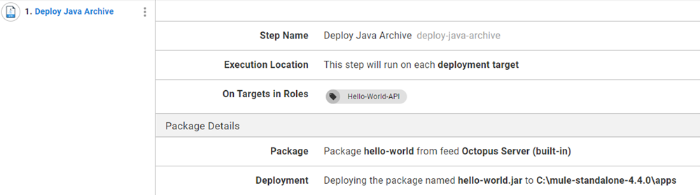

Mulesoft created a unique software that allows you to create custom API's that connect with both on-premises and cloud-based systems to retrieve or manipulate information.  In this post, I demonstrate how to deploy a Mulesoft API to a server running the [Mule Runtime](https://docs.mulesoft.com/mule-runtime/4.4/) using Octopus Deploy.

## What you'll need

For this walk-through, you will need to download the following software:
- [Mulesoft Anypoint Studio](https://www.mulesoft.com/platform/studio)
- [Mule Community Edition Runtime](https://developer.mulesoft.com/download-mule-esb-runtime)
- [Maven](https://maven.apache.org/download.cgi) (optional)
- [Postman](https://www.postman.com/downloads/) (optional)

### Installing Anypoint Studio
The Anypoint Studio is available from Mulesoft as a 30-day trial.  After filling in the form, download the .zip file and extract it to your disk.  AnyPoint studio isn't "installed" on to your machine and can just be executed once it has been extracted.

### Configure Mulesoft Runtime
In order to configure the Mule Community Edition Runtime, you'll first need to install and configure Java.  The Mulesoft documentation recommends [Java 8](http://www.oracle.com/technetwork/java/javase/downloads/jdk8-downloads-2133151.html), however, I used [Microsoft OpenJDK 11](https://docs.microsoft.com/en-us/java/openjdk/download#openjdk-11) and it worked just fine.  Once you have both Java and the Mule Runtime installed, create the following system Environment Variables:
- JAVA_HOME: Set this to the location of your Java folder
- MULE_HOME: Set this to the location of your Mule Runtime folder


By default, the Mule Community Edition Runtime runs in the forground.  If you want to configure it to run as a service, follow the Mulesoft documentation:
- [Linux](https://docs.mulesoft.com/mule-runtime/3.9/configuring-mule-as-a-linux-or-unix-daemon)
- [Windows](https://docs.mulesoft.com/mule-runtime/3.9/configuring-mule-as-a-windows-service) 

### Maven
The installation of Maven is optional in that the Anypoint Studio software comes with Maven built into the product.  If your intention is to have a build server perform the build of the Anypoint Studio project, your build server would then need to have the Maven capability.  Most, if not all, of the modern build servers contain steps or tasks that do this as long as Maven is installed on the build agent.  Installing Maven is as simple as extracting the .zip file, then adding the folder to the `PATH` system environment variable.

### Postman
Postman is a piece of software designed to make API calls and is commonly used for testing APIs.  Anything that has the ability to call an API would work, however, Postman makes this testing easier.

## Creating the API
In this post, I'm going to create a simple Hello World API.  As the name implies, the response from calling this API will simply be `Hello world`.  Real-world APIs would be far more complex than this, but this post is to demonstrate how to deploy the API.

### Create the project
1.  From within Anypoint Studio, click `File`->`New`-> `Mule Project`


2.  Give the project a name and click `Finish`


3.  From the `Mule Pallete`, choose the `HTTP` category and drag a `Listener` to the canvas


4.  Configure the listener `Connector configuration` by clicking on the green plus button


5.  Configure the settings for the Connector configuration, for this post, I kept the defaults.


Click on the `Test Connection ...` button to ensure that this will work.

6.  Define a path for the API, for this post, I chose `/hello-world`


7.  Add a `Set Payload` object from the `Core` category of the `Mule Pallete` and drag it to the `Process` section of the message flow


8.  Disable the `fx` button by clicking on it and set a static message for the `Value`


9.  Test your API by clicking in the green play button.  When the `Console` window shows a status of **DEPLOYED**, your API is ready.  Switch over to Postman (or a similar tool) to test your API.  Send a POST request to `http://localhost:8081/hello-world`


## Creating a deployable file
The Anypoint Studio software contains a version of Maven built into the product.  This means you can create a deployable artifact from within Anypoint Studio itself.  Alternatively, you could use Maven from a build server (or the command line) to produce the deployable file.

### Anypoint Studio
You are able to `Export` your project from Anypoint Studio by doing the following:

1.  Click on `File` -> `Export`


2.  Select an export wizard, for this post, I chose `Anypoint Studio Project to Mule Deployable Archive (includes Studio metadata)`.  Click Next


3.  Select the proejct to export.  The `hello-world` project is the only one I've created.  Click Next.

4.  Select a location to save the file to and click Finish


Once the save operation has completed, it will display where the file was saved and what the name is.  In my case, it was saved to `C:\Users\Shawn.Sesna\hello-world.jar`


### Maven
You can also build the project by using Maven from either a build server or the command line.  In this post, I'm going to demonstrate the command line method, the build server method would be almost identacle.

1.  Navigate to the project folder.  This folder should already contain a `pom.xml` file that we'll use with Maven.

2.  Run Maven with following command/goals

```
mvn clean package
```

3.  Once the build has completed, navigate to the `target` sub-folder.  The build will have produced a file called `hello-world-1.0.0-SNAPSHOT-mule-application.jar`


## Deploying the API

As you've seen so far, the Anypoint Studio projects are compiled into .jar files.  Octopus Deploy doesn't have a specific step to deploy to the Mule Community Edition Runtime, however, it does contain a `Deploy Java Archive` step.  Once you have placed the .jar file in either the built-in repository, or an external one, you are ready to proceed with configuring the deployment.

### Configure Deploy Java Archive step
This post assumes you are familiar with Octopus Deploy and will not cover Octopus Project creation.  To configure your Octopus Deploy project, use the following steps:

1.  Add a `Deploy Java Archive` step to your process.

2.  Select the role to deploy to, this post uses the role `Hello-World-API`

3.  Select the package to deploy, this post uses the package created by the export method, `hello-world-1.0.0-SNAPSHOT-mule-application.jar`.  This file was renamed to `hello-world.1.0.0.jar` so that Octopus could determine the semver version of the package.

4.  The Mule Community Edition Runtime expects APIs to be deployed to a specific folder.  Within the `Deployment` section of the `Deploy Java Archive` step, ensure the `Use custom deployment directory` is ticked.  Enter the location for the Mule Community Edition Runtime `apps` folder.

:::warning
Do NOT tick the `Purge` option.  If there were other APIs deployed, this would delete them all.
:::

When done, it should look something like this



5.  Create a release and deploy


6.  Flip over to Postman and test out the API


## Manipulating the API with Structured Configuration Variables
So far, we've successfully deployed a simple API, however, this isn't terribly realistic.  It is more than likely that items within the API would need to be updated as it progresses through our environments.  Using the [Structured Configuration Variables](https://octopus.com/docs/projects/steps/configuration-features/structured-configuration-variables-feature) I can change the message that was displayed from `Hello World!` to something else.

### Updating the API message
The API message is stored within an XML file in the .jar package.  By determining the XPath of the message, we can update the message to something else for our deployed API.

1.  Edit the `Deploy Java Archive` step

2.  Click on the **CONFIGURE FEATURES** button


3.  Enable the **Structured Configuration Variables** feature


4.  The message is located in the hello-world.xml file, specify this file to perform replacement on


5.  Create an XPath Project variable and give it a value.  In this case, the XPath is `/*[local-name()='mule']/*[local-name()='flow']/*[local-name()='set-payload']/@value`

6.  Create a release and deploy.  Once the deployment is complete, test your API to see the replaced message


## Conclusion

In this post, I demonstrated how to create an API using the Mulesoft Anytime Studio and deploy it to a server running Mule Community Edition Runtime using Octopus Deploy.  

Close off the post by restating what was achieved in the how-to, share any closing thoughts, and invite feedback.

## Learn more

- [link](https://www.example.com/resource)
- [repo with examples if used](https://www.github.com/repo)

## Register for the webinar: {webinar title here}

Short webinar description here, for example: A robust rollback strategy is key to any deployment strategy. In this webinar, we’ll cover best practices for IIS deployments, Tomcat, and full stack applications with a database. We’ll also discuss how to get the rollback strategy right for your situation. 

We're running 3 sessions of the webinar, from {webinar dates here, for example: 4 November to 5 November, 2021.}

<span><a class="btn btn-success" href="/events/rollback-strategies-with-octopus-deploy">Register now</a></span>

## Watch the webinar: {webinar title here}

<iframe width="560" height="315" src="https://www.youtube.com/embed/F_V7r80aDbo" title="YouTube video player" frameborder="0" allow="accelerometer; autoplay; clipboard-write; encrypted-media; gyroscope; picture-in-picture" allowfullscreen></iframe>

We host webinars regularly. See the [webinars page](https://octopus.com/events) for details about upcoming events, and live stream recordings.

Happy deployments!
