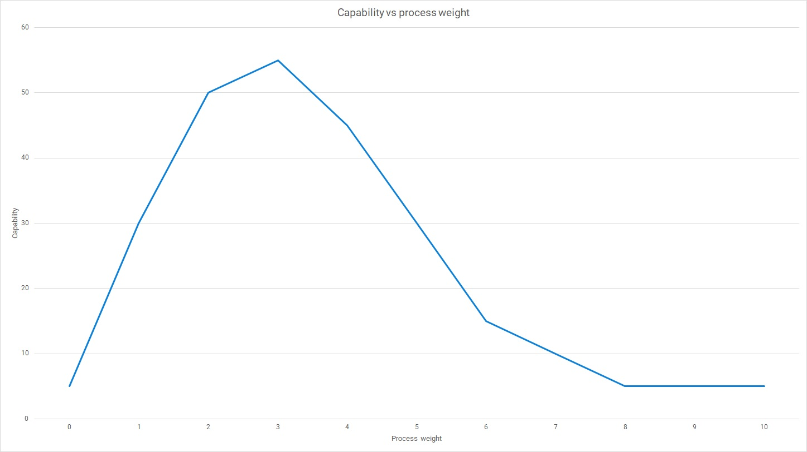

## Outline

- What is a SDLC
  - Just a set of phases and quality gates you use to deliver software
  - Created to solve problems with early code and fix approaches
- Why did SDLC become a problem
  - When your primary tool is a set of phases, every problem is solved by adding a new phase, or a new quality gate
  - Adding phases made the transaction cost of delivering software higher and encouraged larger batches
  - We discovered, perhaps a little late, that there is such a thing as too much process
- Does an SDLC still exist in DevOps?
  - There is still a set of steps you need to complete to create a software version
  - Batch size keeps things small, so the SDLC is less important
  - You mostly need a mechanism to discover what to build, and a deployment pipeline to take what you build through to your users
  - A sample DevOps SDLC - Lean startup, impact mapping, specification by example, Continuous Delivery
- The future of SDLC
  - With small batches, you should be able to use a lightweight SDLC - in some cases, just Continuous Delivery applied within the correct culture... or, as we call it now, DevOps.

## IDEAS... some of these will push into other posts I think!

## What is the SDLC

The software development life cycle (SDLC) has been around in various forms since the dawn of software engineering. It was introduced to resolve issues with the previous way of writing software

The software development life cycle is a specific version of the systems development life cycle (which has the same acronym).

## The purpose of the SDLC

Delivery all the software, at high quality, and the lowest cost

In fast-forward, SDLC starts from code and fix, then steps get added to try and fix problems.

- Too many bugs... add more testing
- Unclear requirements... more detailed business analysis and requirement documents
- The software design makes changes hard... add a systems analysis stage to convert requirements into a high-quality design
- We lost all the code when the network drive failed... add version control tools
- The software sometimes doesn't work on the test environment, depending on whose machine it was build... have a dedicated build machine and a process to build and package the software from that machine
- Conflicting changes happen in version control... split into feature branches so no changes occur while a feature is build built
- A problem is found just after go-live and we can't deploy because we added new changes since then... code freezes around go-live dates, and sign-offs from various managers before software can go live
- We deployed just before our peak season and had a bug that cost us revenue... code freezes during the three peak months
- We delivered a feature but users don't like it and it doesn't solve their problem... get users to sign off the business requirements

It's not that the changes to the process are introduced in bad faith, it's just they don't meaningfully solve the problem. In many cases they introduce new, worse problems - like feature branching, which makes the integration stage vastly more complex and time consuming.

The reality of passing a detailed to design to programmers to "simply implement" is that they actually need to repeat all the work of the design phase to implement the feature in real life. Theoretical designs are not reality-tested, so the programmer introducing the change needs to create a completely new design that will work in real life.

## What has changed

"Code and Fix". When you develop software with no process, you realize at some point that some level of process helps. When adding some process helps, it can be tempting to introduce more process, in the hope of getting more benefit. Code and fix still exists in some organizations where the software remains small enough to be managed with no formal process. Code and fix stops being viable once a software system grows beyond a trivial size. You can normally tell when this happens as the test cycle (the time between features being completed, and features being released) will grow faster than the software.

"Heavyweight". The introduction of process improves performance compared to code and fix style development. A one sentence goal is a better plan than no plan, and a sketched out design is better than no design. Over time, the plan and the design become more detailed and early experiments find that a little more detail does in fact improve software delivery performance.

"Agile". When you first learn to cook, you discover that adding seasoning makes food taste better, until you add too much and the dish becomes irretrievably inedible. It is not until someone uses *too much process* that the limit of process can be discovered. This is the tipping point where process stops brining benefits. If you continue past this point, you start to negatively impact software delivery performance. This discovery was made in the 1980s, but it took a long time for the discovery to reach the mainstream. Some organizations resist the discovery even now.

The tipping point for too-much process is further left than you think... as will all curves of this type, you want to remain just below the tipping point, so you have a little room to add more process should you need it. If you operate at or above the tipping point and need to add more process, you immediately hit drops in quality or productivity. People tend to overshoot the curve, often never experiencing the peak performance, so they don't notice that the additional process is limiting their software delivery.

Other differences in how we apply process...

Traditionally we try to predict, but modern software delivery is adaptive. In practice, this means adjusting the plan continuously instead of trying to work it out up front. You can still control risks and budgets, but the software delivered so far is a better indication of progress than a partially filled task on a plan. Small batches are either done or not, large batches need some prediction of how complete they are and this is often monumentally wrong (especially when people defer complex stuff to stay on track).

Being adaptive doesn't benefit the development team. It doesn't mean they deliver "whenever they want" - it means you can test the partially completed software, get feedback, and change direction as a business, instead of committing your whole budget to your most naive plan. Each software version increases your knowledge and enables better decision making than was possible when you had no live software.

This chart will differ based on your team and culture. It is hard to measure process weight as organizations with too much process often can't tell whether people are working on real work activities or artificial work activities that result from the process. Often, they designate process-related activities as *real work* and fail to spot when individuals become fully dedicated to process and delivery no value-adding work.

Process and culture... a bureaucratic culture loves a prescriptive process. By standardizing exactly how work is done, they believe it will be easier to train new people and pass important industry audits. The problem is that heavyweight process makes many activities outside of software delivery simpler, while increasing the difficulty of software delivery itself.

One of the strange themes of resistance to the discovery that there is such a thing as "too much process" is that as heavyweight methods fall out of use, they are re-invented with new names. Too much process is too much, even if you use agile-sounding words.

Technically, quite a lot hasn't changed. All of the authors of papers on SDLC over the years have agreed that you should work in small batches.

Herbert D. Benington (Lincoln Labs phased model, 1956) said that a small prototype should be created, and then evolved towards an operational product. Winston Royce (phased software development, 1970) said that risk increases in line project size and control steps add to the cost of the project. Barry Boehm (spiral model, 1988) encouraged people to work in small batches and tailor the process for each increment according to the risks.

Despite their advice, people seemed to fixate on the process-element - perhaps driven by maturity models that required organizations to demonstrate that they produced a list of specific documents throughout their projects.

Lightweight methods emerged during the 1990s that tried to reduce the fixed overheads of the software delivery life cycle. More people were realizing that communication structures were more important than process and working software had a higher value that the required documentation list. While some process and documentation was needed, it was nowhere near the amount in use at the time.

Investment in planning and design was an intuitive way to control projects, but we learned that reality runs counter to this assumption. The business risk of a change increases hourly until you release it and discover whether the software does what the users need. Anything that delays a release increases risk.

We've gained decades of experience that shows us increasing investment in activities on the left (planning and design) doesn't increase the outcomes on the right (high-quality software that users love).

Another recent shift in thinking is where to place the programming activity. Traditionally, writing code has been part of a *production* phase that occurs *after* the design phase. Increasingly, we recognize that writing code is part of the *design* phase. The *production* phase of software delivery starts when the code change is committed to version control. The production phase should be managed as a [deployment pipeline](https://octopus.com/devops/continuous-delivery/what-is-a-deployment-pipeline/) and [deployment pipelines should be automated as much as possible](https://octopus.com/devops/continuous-delivery/automate-everything/).

When building a bridge, 10% of the job is design and the rest is construction. In software development, the design accounts for nearly the entire job as the source code is part of the design phase. The construction phase is entirely automated. Completely different ratios and costs, a different process is needed.

"the requirements are always changing" - instead of trying to lock down the requirements, create a process where it is an accepted reality. A product manager could tell you precisely what they want to build, but when users handle it for the first time many assumptions could be invalidated. Even a feature that launches successfully today might be invalidated by competition in a week.

Only requirements tied to fundamental laws of physics will be stable. For example, software that deals in weight, distance, velocity, planets, and other domains that obey natural laws. Landing a person on the moon is a very stable requirement, even though it's complex and costly. Creating a landing page that successfully converts visitors in paying subscribers is a constantly moving target. Trying to write line-of-business applications is a constantly moving target.

If you took a process from a high-performing team, it would be too specific to use in another team. The process is built on specific skills the team has and is appropriate the problem they are solving within the industry they work. It is hard to generalize a process enough to re-use broadly, you might end up removing too much or leaving too much in. This is why as software industry we are converging on [DevOps](https://octopus.com/devops/) and [Continuous Delivery](https://octopus.com/devops/continuous-delivery/), because research is helping us to identify the parts that are important to be in our general method, and the parts that don't seem to move the needle on performance.

Although process has a tipping point that means doing it more results in worse performance, no minimum batch size has yet been found. Some teams are making the most trivial changes and putting them live, ten minutes work or even less. As your batch size reduces, you must find ways to reduce the transaction cost of delivering a software version, which is why your deployment pipeline has to be automated.

A plan-driven predictive project is assessed on whether the work matched the original plan. An adaptive project is assessed on whether more value is obtained than is put into creating the software. Adaptive methods should allow you to get a greater return on investment as you can adjust your direction often.

In scientific management, some smart people were tasked with working out the most efficient process for a large number of workers to follow. The idea was that the workers could be quickly swapped out, effectively classifying them like other resources such as machines or sheet metal. In applying this to software development, a mistake was made thinking programmers were these workers, when in fact they are the computers. The programmers are the smart people telling the replaceable worker resources (computer) what to do, using specific language sets.

It also turns out that the original scientific management was wrong in applying it to the workers, too - as they were closest to the work and sometimes understood the problem better than the smart people telling them to work in a way the workers knew was inefficient.

Measurement-based management works for simple repetitive work, but that's exactly the kind of thing we should be automating in DevOps. For everything else, a delagatory style of management is better. Ref: Austin

Broad vs Concrete... lightweight methods started concrete, with Extreme Programming. Over the course of a decade, broad methods gained popularity, because they appealed to people even outside of development. The problem with broad methods is in fact this appeal. It tempts people to believe once again that they can control how developers work as they understand  the elements of the broad method. Extreme Programming fell out of favor not because Scrum was better, but because there are elements in Extreme Programming that people outside of development simply don't get. Continuous Delivery returns us to a concrete method, inspired in part by Extreme Programming, which doesn't tell you how to pass work items around, but focuses on the technical practices that make a meaningful impact on your software delivery performance. There are still principles and values to explain why the practices matter, because both values and technical practices are needed.

The software delivery method should be independent of your method for generating ideas and communicating them to developers. Continuous Delivery is generally applicable to all software delivery, but context dictates how you come up with ideas and share them. Organizations of different sizes, at different stages, and in different competitive environments need to respond to their specific context. A startup with a few hundred small company customers will need to respond in a different way to an SME with 10 blue chip customers. The environment might be one of product leadership where the organization has a clear vision for how to solve the problem, or it might be more customer-driven in generating requirements.

The good parts...

Scrum, mostly a management framework for software development -> continuous communication across business and technical team members, small batches, and frequent retrospectives to specifically improve the process

XP, a mix of management and technical framework -> a strong set of inter-related technical practices backed up with principles that explain why the exist, the management part of XP is similar enough to Scrum that Scrum is often substituted

Crystal, prioritizes habitability (i.e. the people doing the process are happy to use it) and encourages frequent delivery, reflective improvement, and close communication

code and fix -> CD you'll be increasing discipline and lowering the levels of chaos

heavyweight -> CD you'll be lowering the transaction cost of each deployment, and will replace a lot of unneccessary work with automation, freeing up people to make more valuable contributions

agile -> CD depending on your agile flavour, you might already be very close to CD. You may have to organize your deployment pipeline and add some extra automation, and you may need to add further technical practices if you were following something more like Scrum and less like XP.

> imposing agile methods on reluctant people is fundamentally at odds with the whole notion of agile development - Martin Fowler

## Why plan-driven methods fail

- The plan as truth - important people basically expect the plan to be delivered and nobody has the courage to say that it isn't likely to happen. Some organizations think that optimism is an important aspect of hitting dates, which could be a  misapplication of sports psychology.
- When you are hit by unexpected events early on, you say "these events were unexpected, but with a clear run from now we'll make up the time and be back on track"... it looks like everything is fine. However, you should be saying "we had four unexpected events in the first month that put us a week behind, we should expect similar things to happen each month making us even further behind"... but the culture may prevent attitudes other than optimism.
- It's hard to measure long tasks. A task in progress can be reported as 80% complete after week 1, and 80% complete after week 2, and so on. It's just hard to know how much longer it will take to resolve some tricky problem.
- If you track progress by completed tasks, it is possible to see faster progress earlier in the plan when simpler tasks are being done. Although many teams know they should tackle the harder tasks first to reduce risk, their good judgment will be tempered to how they think the organization will respond to a slow-start profile. Often badly. It's easier to look on-track from day one, deferring risky items until later than it is to explain why things will start slow and gain momentum.

Predictive approaches increase the risk and lower quality compared to working in small batches, so they make the problems they attempt to solve worse. It is also harder to add time-relative value if the up-front work means you don't start working on the idea for months.

Even if you kept the phases of your traditional SDLC, but limited the batch size, you'd improve results. You'd also find that many of the activities no longer make sense, because there is so much less you need to control. Many control steps become immediately redundant and can be removed... others could be removed with appropriate automation in the deployment pipeline. Some you might keep, but adjust so they are appropriate to the batch size.

The only way to deliver software with appropriate controls is to deliver something small quickly, and then deliver many more versions in quick succession to evolve the early version into a workable software product. The delivered software version is the reality check. Features can be seen, or they can't. There is no such thing as an 80% complete task, only 0% or 100%.

## Wordle

Wordle was a game where you had to guess a word in six attempts. You entered a word and would be told whether a letter featured in the word and whether a correct letter was in the correct position. Using this information, you would make a second guess that you hoped would be closer to the correct word.

The game was sold to the New York Times for a sum in the "low seven-figures" in 2022.

There are many clones of the game available, but nobody is queuing up to buy them. Being early is highly valuable in software delivery. Even with fewer features than the copycats, Wordle was worth more money because it was first.

You can win over the longer term, none of us is using the Mosaic browser, or Netscape, or Internet Explorer. Re-solving a problem in a different way can bring new value that increases the competitiveness of a software product. However, an adaptive process will help find where this value is to be found.

## The SDLC still exists

It still exits, but we've made it so small it now hardly matters... 

At it's most general, the SDLC will always exist. You have a series of steps that have to be done in a specific order. Unlike early SDLCs, you can have fewer steps and you can make each step really small. For example, your product manager could spot an opportunity to add amazing value to the product on Monday morning. They could share this idea with the development team, and have the first code change available within 3 hours. The prototype could be tried out and the idea released, refined, or dropped. All within a day.

There were still stages

1. An idea was generated
2. The team worked out how they might make it happen
3. A change was made to the software
4. Feedback was obtained about the change

While this is less formal and has fewer explicit controls than a traditional SDLC, it results in higher-quality software and faster feedback loops.

## NOTES

But the way we manage quality and cost has changed dramatically over the past decade as traditional project controls have been discredited.

Traditional SDLC
- Requirements
- Design
- Development
- Testing
- Integration
- Deployment
- Operation
- Maintenance

KEY CHANGES
- Design and development were traditionally seen as separate phases, but it is better to consider the coding to be part of the design. This allows you to embrace iterative and incremental progress towards solving a requirement
- Build quality in, means integration and testing are both continuous. They shouldn't be stand-alone stages, but be part of the daily work
- Deployment pipelines are now automated, with each change built, tested, and available to deploy to production, which has many benefits
- Traditional models assumed each stage would validate the previous stage, for example the design stage would highlight errors in the requirements stage. This turned out to be misleading as the requirements stage is only really validated after the software is deployed and users attempt to use it.

Traditional SDLC vs DevOps cost control

The traditional SDLC hoped to spend money up-front to reduce errors and ensure the correct software was built. Investing in detailed requirements and designs was intended to ensure money spend developing the software was all "good spending".

Traditional SDLC increased the effort on requirements to ensure they were detailed and correct. This didn't substantially alter the outcome as people only really know if software solves their problem once they get it.

DevOps controls cost by working in small batches and releasing software versions frequently. Teams are allowed to make decisions as they can respond faster than if they have to await external decisions. The deployment pipeline is automated to decrease errors, increase quality, and reduce the transaction cost of deployments

Traditional SDLC vs DevOps quality control

In the traditional SDLC, testing is a phase or a number of phases that happen once a set of changes is available. When issues were discovered, the batch would be on hold until fixes were delivered and re-tested. This cycle increased the size of the batch and required re-testing of the updated software. If testing revealed a critical misunderstanding in how the software had been designed, or highlighted conflicting requirements, there could be expensive rework required.

In DevOps, quality is a daily part of the process. Instead of waiting for a number of changes to take place, each change is tested. This is assisted with test automation, but leaves space for human ingenuity where necessary - for example UX testing. If a developer commits a change that fails an automated test, no human need spend time manually testing the version. The developer can respond almost immediately to the error and fix the software straight away.

Research confirmed that small batches and frequent deployments results in higher quality software, which means the traditional SDLC has lower quality than DevOps.

Happy deployments! 
