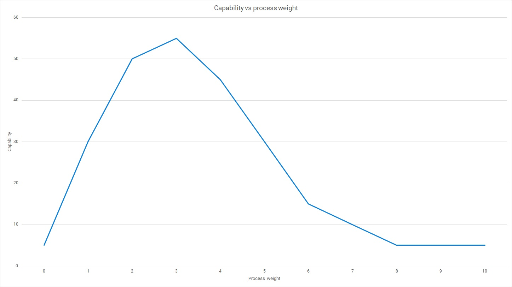

If you're using a traditional software development life cycle (SDLC) you may have questions about where DevOps fits in. Can the 2 exist together, or are there too many conflicts? This post addresses the differences between the 2 approaches.

## What is the SDLC?

The concept of a life cycle emerged in the 1960s, offering a structured and methodical way to build and operate an information system. Early systems development projects involved both software and hardware, such as [Project LINCOLN and the SAGE program](https://www.ll.mit.edu/about/history/sage-semi-automatic-ground-environment-air-defense-system), which involved the introduction of new computer memory technology and the development of software.

The [systems development life cycle](https://en.wikipedia.org/wiki/Systems_development_life_cycle) expressed stages and control steps as a series of phases, such as analysis, design, and development. The full life cycle covered everything from initial conception right through to retiring the system.

The *software development life cycle* originally applied the systems development life cycle to software projects. The specific sequence of phases was different, but the overall concept was the same for many [early software delivery models](https://octopus.com/devops/history/early-software-delivery-models/).

More recently, SDLC is being used informally to refer to *any* [software development process](https://en.wikipedia.org/wiki/Software_development_life_cycle). As we can't compare DevOps to every possible process (of which it's one), we'll stick to the formal definition of the SDLC as a traditional phased approach to software delivery.

## Why was the SDLC created?

You need to travel back in time to understand the motivation for the SDLC. Our [history of software delivery](https://www.octopus.com/devops/history/) follows the evolution of development processes since 1950. We found that technology has played a major role in changing what is needed. Just as scientists are limited by the equipment available for their experiments, early developers were limited by scarce machines that were expensive to run, had long compile times, and limited tools for code editing.

:::hint
As an early programmer, you didn't have an integrated development environment with syntax highlighting, code navigation, or compiler warnings. People in non-programming roles also lacked software tools to assist their work or to improve communication between roles.

Crucially, you couldn't search for answers on the web. You had to work it out for yourself with the help of the manual.

- 1989 - Tim Berners-Lee invented the World Wide Web
- 1997 - Google launched
- 2008 - Stack Overflow arrived
:::

Before the SDLC was introduced, systems were created using an ad-hoc *code and fix* approach. With no defined process or controls, and with many technological limitations, the phased model solved many problems organizations had *at the time* when creating large applications.

The SDLC solved 2 types of problem:

1. Issues scaling the code and fix approach to large-scale systems
1. Specific technical limitations of the time

The original phased model was created at MIT's Lincoln Laboratories. Their model had 9 phases that were intended to directly solve the problems faced by software teams in the 1950s. This let them scale their development efforts, share information about the system, and document what went wrong so the knowledge could be shared with existing and future contributors.

The phases used at Lincoln Labs were:

1. Operational plan
1. Machine and operational specifications
1. Program specifications
1. Coding specifications
1. Coding
1. Parameter testing
1. Assembly testing
1. Shakedown
1. System evaluation

Many variations of the SDLC were created with different phases, which changed as both business and technology developed.

## Why the SDLC became a problem

Problems emerged from the SDLC due to 2 factors:

1. Organizations had increased the number and complexity of phases in their SDLC
1. The SDLC hadn't kept pace with improved tools

When your primary tool for solving software delivery problems is a set of phases and control steps, you tend to solve most problems by adding more of them. As your process grows in size, it increases the transaction cost of each software version. Heavyweight processes were increasing in cost while machines were getting cheaper and compilation faster.

The SDLC was originally introduced to solve 2 problems:

1. Scaling software development to handle large-scale systems
1. Specific technical limitations of the time

While the first problem remained, the technical limitations in 1990 were nothing like those in 1960. With technical constraints fading, the SDLC itself became a limiting factor in software delivery. The SDLC was an even greater problem in organizations that treated the process as the goal, rather than a way to achieve organizational outcomes.

The SDLC taught us that there *was* such as thing as *too much process*.

*Capability versus process weight: Compared to code and fix, adding process improves software delivery until the process itself becomes the constraining factor*

There are complex relationships between batch size, deployment frequency, and risk. No matter how rigorously you test the functional and quality attributes of the system, the market risks remain until you release the software version to users. You only know that a feature is useful once people are using it.

Large batches also cause a common error in automation economics. Common wisdom says you either automate the tasks you do most often; or that you calculate the manual effort of the task multiplied by its frequency. 

This creates a paradox, as the reason you don't perform a task frequently is that it's manual and expensive. Automation does reduce manual work, but it also lets you perform tasks more frequently. Any economic model for automation should account for:

- Increased frequency
- Higher quality
- Fewer manual errors
- Reductions in cost of delay

In addition to the shift in technological constraints, a new competitive landscape emerged where organizations that were slow to market lost business to smaller and faster companies.

The SDLC was the correct solution at the time. Things have changed so much it's no longer a valid approach to software delivery.

## Does DevOps have an SDLC?

The traditional SDLC is no longer seen as good practice. Though it's possible to avoid it with appropriate care, it's more common for traditional phased approaches to result in large batches that are passed between specialized teams. This is incompatible with a DevOps approach, which seeks to reduce the size of batches and increase collaboration between different disciplines.

Using an SDLC, you'd arrange 20 people into 5 specialist teams to work on phases such as analysis, design, development, testing, and operations. These *horizontal teams* would perform their specialist task with work passed from team to team, like the baton in a relay race.

In DevOps, you'd arrange people into 4 cross-functional teams who could deliver software without hand-offs. Your *vertical teams* could each deliver and run an isolated component, like the line of players moving the ball towards the scoring line in a game of rugby.

:::hint
If you want to find out more about team design, Matthew Skelton and Manuel Pais created [*Team Topologies*](https://teamtopologies.com/) to describe different interaction modes. You can use these to design healthy communication structures in your organization.
:::

In DevOps and Continuous Delivery, there are still a series of tasks that need to be completed to deliver software. Instead of a structured SDLC, you focus on reducing batch size, creating autonomous vertical teams, and automating your deployment pipeline. You can design a process that complements the DevOps culture and capabilities.

## A DevOps process

Continuous Delivery is central to a DevOps process, but you still need a way to discover and share what to build. Your context will guide your selections, but an example process is shown below:

1. [Impact Mapping](https://www.impactmapping.org/): A collaborative technique for generating ideas connected to goals.
1. [Specification by Example](https://en.wikipedia.org/wiki/Specification_by_example): A way to communicate requirements using examples, which can be turned into automated acceptance tests.
1. [Continuous Delivery](https://octopus.com/devops/continuous-delivery/): A software delivery process built around an automated deployment pipeline.

Continuous Delivery doesn't depend on any specific technique for generating ideas. For example, you could switch from Impact Mapping to Lean Startup or any other technique from your product management toolkit. DevOps recognizes that you use appropriate Lean and Agile techniques alongside Continuous Delivery.

## The legacy of the SDLC

For some organizations, the lasting part of the SDLC is a heavyweight set of phases and controls that limit software delivery and create high levels of market risk. This is an unfortunate negative result from many years of discovery.

The real legacy of the SDLC should be what we learned from the first 4 decades of software delivery:

- You should work in small batches
- You should deploy frequently
- Start with a small working prototype, then evolve it
- It's possible to have too much process

With the right culture and capabilities, and a deployment pipeline that is as automated as possible, you should be able to deliver frequent high-quality software versions.

## Summary

When you think of the software development life cycle now, just take your modern DevOps process and extend it to encompass the creation of the original idea, and consider how software could be retired when it's no longer valuable enough to maintain. The most important part (the bit in the middle where you continually increase the value of the software and improve its operation) is where most of your time and money will be spent.

The traditional formal method based on the systems development life cycle is no longer appropriate to software delivery, given the changes to the underlying constraints and competition.

If you want to learn more about DevOps and Continuous Delivery, you may find the following useful:

- [The Octopus DevOps Engineer's Handbook](https://octopus.com/devops/)
- [Our white papers on Continuous Delivery](https://octopus.com/resource-center)

Happy deployments! 