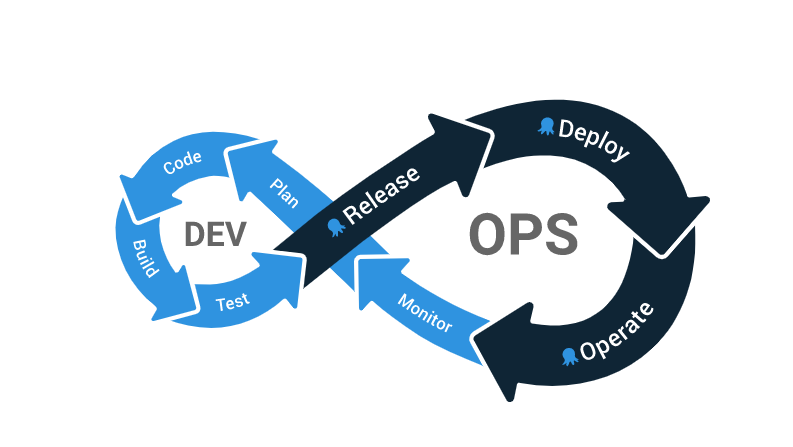

<!-- see https://github.com/OctopusDeploy/blog/blob/master/tags.txt for a comprehensive list of tags -->

## Why is testing important?

At Octopus Deploy, we help make complex deployments easier by providing a best-in-class deployment management tool. This tool works with your DevOps process to create the deployment loop shown below:



Testing is part of continuous delivery. Testing assures each stage of the delivery pipeline for quality before moving on to the next stage. DevOps is an iterative cycle of building, testing, and releasing. A robust testing environment will ensure that each iteration of the DevOps loop strengthens the quality of the product. A weak testing phase will mean defects progress to release, and developers must fix bugs while the product is live. This blog discusses automated and manual tests and common types of tests: functional, non-functional, and maintenance.

## Manual vs. automated tests

A person carries out a manual test. A person will click through an application and use it to find any bugs. Automated tests are scripted in advance and executed by a machine. Automated tests compare an expected result with the actual result.

Both methods of testing have their place in a software application. A manual test is much slower and requires an environment for the tester. As developers must write automated tests in advance, the errors found in manual testing can inform and turn into automated tests to strengthen the test harness. Manual tests are suitable for cases where opinion and nuance play a role, such as UX or user experience. There is no deterministic result for an automated test to check in these cases.

Automated tests are near-instant and execute in the hundreds or thousands at runtime. Automated tests check for functionality and ensure that every line of code and feature works as intended. In a DevOps process, automated tests enable continuous delivery. Automated tests will have a rating of test coverage. When developers add new features to a release, developers can run the test harness to identify whether test coverage has decreased. Developers can pinpoint where tests fail to fix bugs for the new release.

Manual and automated tests are two methods of testing. Manual testing can be helpful in cases where opinion may be necessary. Manual testing may also inform developers which tests to automate. Automated tests work well in a DevOps strategy as automated tests are quicker than manual testing. Automated tests help give test coverage over the whole application and help identify bugs quickly when tests fail.

## Functional and non-functional tests

The list of possible types of tests is large and growing. There are hundreds of different kinds of tests you could perform on your application. One way to categorize types of tests is functional and non-functional testing.

Functional tests ask questions like, does this button work? Does one module work with another module? Does the user journey work from the start of the experience to the end? Functional tests test for functionality.

Maintenance testing tests if the application has retained all functionality from version to version. It asks whether any functionality in the application has regressed between versions. I have included maintenance testing under functional tests as it has to do with functionality. Some sources list it as a third type.

Non-functional tests test the overall performance of the application. How secure is the application? How much load can it handle? Can the application scale if needed? Non-functional tests are more concerned with the application rather than individual components.

## Test types

The following are some types of functional and performance tests. I have provided some general points of the kind of test and a real-life example. These are simple and digestible to get the main point across.

### Functional

#### Unit

```

Testing an individual unit of code for functionality

1. We want to test if a class works
2. We test the class by giving it inputs
3. We check whether the expected output matches the actual output

```

#### Integration

```

Testing the functionality between two or more modules

1. Test adding an item to the cart from the e-commerce shop front
2. Load the e-commerce store and add an item to the cart, and go to checkout
3. Check that the correct number of items are in the cart and the user is now at the checkout page.

```

#### Smoke

```

Smoke testing ensures that the most critical paths of an application work before passing the tests on to more rigorous testing.

1. We want to make sure that all critical login functions are available to a user before moving forward with testing.
2. User is on the home screen
3. User enters credentials
4. Click login
5. User is on the dashboard page

```

#### Acceptance

```

Confirm that the application is working according to a requirements specification

1. It is a requirement for the user rewards system to works
2. If a user tries to purchase a product with rewards points and they have enough points, the purchase price should be $0
3. If a user tries to purchase a product with rewards points and they do not have enough points, the purchase price should be $20

```

### Non-Functional

#### Performance

```

Tests performance metrics like speed, response time, and resource usage of the application

1. Verify that loading the home page takes <4ms
2. Check CPU and memory load during peak conditions
3. Check database response time when handling 100 or more concurrent requests

```

#### Load

```

Tests related to the load on an application

1. Increase the number of concurrent requests on the application until failure. Record the result.

```

#### Security

```


1. Check if stored passwords are encrypted
2. Check cookies and traffic location to scan for malicious actors

```

#### Scalability

```

1. Under increasing load, test how many nodes an application needs to recover
2. Monitor load to identify peak time. Assign more nodes during this time

```

## Conclusion

Testing is an essential factor in DevOps processes. Testing assures each stage in a DevOps process for quality before moving to the next stage. Tests can be run manually or automated. This blog has given examples of the two main types of tests: functional and non-functional. A robust testing environment fits well with Octopus Deploy. Octopus Deploy takes care of the release, deploy and automate sections of the DevOps lifecycle, and makes complex deployments easier.

Happy Deployments!
