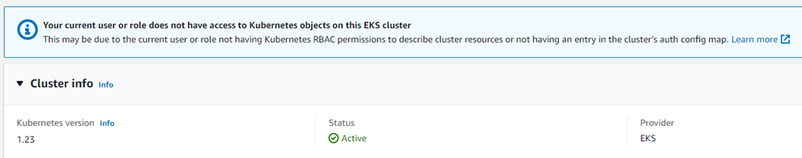
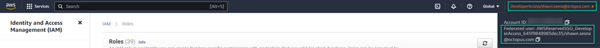
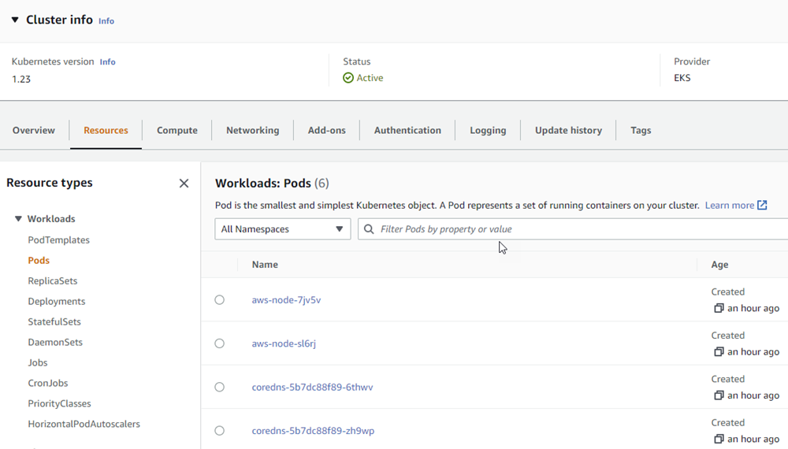
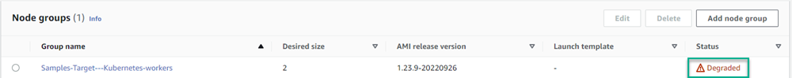
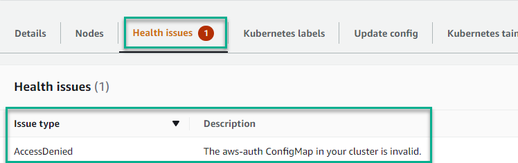

<!-- see https://github.com/OctopusDeploy/blog/blob/master/tags.txt for a comprehensive list of tags -->

If you've ever worked with the Elastic Kubernetes Service (EKS) on Amazon, chances are you've experienced the pain and frustration of permissions.  If you're not the creator of the EKS cluster, you won't be able to see any information about it in the AWS Console other than it's overall status.  There are plenty of tutorials out there that demonstrate how to add additional user accounts, however, there isn't a concrete walkthrough of adding a Federated User account.  In this post, I'll walk you through granting a federated user account to an EKS cluster.

## Walkthrough

The impetus for this came from working with EKS on our [Samples](https://samples.octopus.app) instance.  One of the projects was creates an EKS cluster which I needed to see the details of a deployment resource on the cluster.  The project used a [Runbook](https://octopus.com/docs/runbooks) to create the EKS cluster using an AWS account.  Despite having full access to our AWS account, I found I was unable to see the details of the cluster.  To further complicate things, I log into the AWS console using a Federated user account.  While researching this topic, I found that there were some tutorials out there, but there wasn't quite anything that lead you through the entire process.  In this walkthrough, I'll perform the following:
- Create EKS cluster using a different account
- Find the information for the federated account(s)
- Add the federated account to cluster

### Create EKS cluster
The crux of the problem is not being the creator of the EKS cluster.  To that end, the cluster must first be created by a user other than yourself.  In my case, I created a user account with sufficient permissions to create EKS clusters.  I added the [AWS Account](https://octopus.com/docs/infrastructure/accounts/aws) into Octopus and used the following steps in a runbook to create a cluster:
- Create EKS Cluster
- Add cluster as deployment target

Though I'm using an Octopus Deploy runbook, the **Create EKS Cluster** section isn't Octopus specific as it uses the AWS CLI to create the cluster.

#### Create EKS Cluster
This step uses the **Run an AWS CLI Script** step within Octopus Deploy to create the EKS cluster.  The following variables are required by the CLI to create the cluster:
- ClusterName
- Region
- EKS Role arn
- EKS Node Role arn
- Subnet IDs (I use two)
- Security Group ID

This post assumes you are framiliar enough with AWS to know what those values need to be.  The following script uses the CLI to first create the EKS cluster then the nodegroup. Once those activities are complete, it will store the URL endpoint for the cluster in an [Output Variable](https://octopus.com/docs/projects/variables/output-variables) for use in subsequent steps.  

```powershell
# Get variables
$clusterName = $OctopusParameters['AWS.Kubernetes.Cluster.Name']
$region = $OctopusParameters['AWS.Region.Name']
$eksRoleArn = $OctopusParameters['AWS.EKS.Role.Arn']
$nodeRoleArn = $OctopusParameters['AWS.Node.Role.Arn']
$subnet1Id = $OctopusParameters['AWS.Network.Subnet1.Id']
$subnet2Id = $OctopusParameters['AWS.Network.Subnet2.Id']
$securityGroupId = $OctopusParameters['AWS.Network.SecurityGroup.Id']


# Create EKS cluster
$eksCluster = aws eks create-cluster --name $clusterName --role-arn $eksRoleArn --resources-vpc-config subnetIds=$subnet1Id,$subnet2Id,securityGroupIds=$securityGroupId
$eksCluster = $eksCluster | ConvertFrom-JSON

Write-Host "Waiting for cluster to be done creating..."
while ($eksCluster.Cluster.Status -eq "CREATING")
{
	# Wait for cluster to be done creating
	$eksCluster = aws eks describe-cluster --name $clusterName
	$eksCluster = $eksCluster | ConvertFrom-JSON
}


Write-Host "Status of cluster: $($eksCluster.Cluster.Status)" 

Write-Host "Creating node group..."
aws eks create-nodegroup --cluster-name $clusterName --nodegroup-name "$clusterName-workers" --subnets $subnet1Id $subnet2Id --instance-types "t3.medium" --node-role $nodeRoleArn --remote-access ec2SshKey="<Your EC2 keypair>"

Set-OctopusVariable -name "EKSURL" -value $eksCluster.Cluster.Endpoint
```

#### Add cluster as deployment target
This steps adds the newly created cluster as a target in Octopus Deploy.  If you don't use Octopus, you can go to the next section **Find the information for the federated account(s)**.  This step uses the [New-OctopusKubernetesTarget](https://octopus.com/docs/infrastructure/deployment-targets/dynamic-infrastructure/kubernetes-target) cmdlet in a Run a Script step to add the newly created EKS cluster to Octopus Deploy.  The `$eksUrl` variable retrieves its value from the output variable of the previous step.

```powershell
# Get the variables
$clusterName = $OctopusParameters['AWS.Kubernetes.Cluster.Name']
$region = $OctopusParameters['AWS.Region.Name']
$eksUrl = $OctopusParameters['Octopus.Action[Create EKS Cluster].Output.EKSURL']

# Add new Kubernetes cluster target
New-OctopusKubernetesTarget -Name "Samples-#{Octopus.Space.Name | Replace " "}-EKS" -clusterName $clusterName -octopusRoles "PetClinic,EKS" -octopusAccountIdOrName "#{AWS.Account.Name}" -namespace "default" -skipTlsVerification $true -clusterUrl $eksUrl
```

### Find the information for the federated account(s)
Navigating to the cluster in the AWS console, you'll be presented with the following message, `Your current user or role does not have access to Kubernetes objects on this EKS cluster.  This may be due to the current user or role not having Kubernetes RBAC permissions to describe cluster resources or not having an entry in the cluster’s auth config map.`



You can see that the cluster is active and healthy, but that's all.

The solution to this problem is to add your user account to the `aws-auth` configmap.  However, the process of doing so is different with a Federated account as they don't show up in the IAM `Users` section of the AWS console.  Federated users are mapped to an AWS `Role`, so you'll need to identify which role your account is mapped to.  Thankfully, this is something that is easily done by clicking on your account in the upper right hand side of the AWS console.  This will display the role your Federated account is mapped to.  In this case, you can see my account is mapped to the `AWSReservedSSO_DeveloperAccess_645f9848983dec35` role.



### Add the Federated account to cluster
Before adding the Federated user(s), we must first get the current value of the `aws-auth` config map.  This can be done utilizing a `kubectl` command, `kubectl get configmap/aws-auth -n kube-system`.  To make working with his file easier, I output the command to JSON and write it to a file.  This allows me to deserialize the JSON into a PowerShell object.

```powershell
# Get current aws-auth configmap
kubectl get configmap/aws-auth -n kube-system -o json | Set-Content aws-auth.json

# Load the JSON as an object
$jsonPayload = (Get-Content aws-auth.json | Out-String | ConvertFrom-Json)
```

Once loaded into the `$jsonPayload` variable, we're able to access to relevant data by navigating to the `.data.mapRoles` property of the variable.  By default, the value of `mapRoles` should look something like this

:::info
Despite the object being deserialized from JSON into an PowerShell object, the `mapRoles` section is still YAML.
:::

```yaml
- groups: 
  - system:bootstrappers 
  - system:nodes 
  rolearn: arn:aws:iam::<AWS account ID>:role/<Role used to create cluster>
  username: system:node:{{EC2PrivateDNSName}}
```

To add your Federated user(s), append the following

```yaml
- rolearn: arn:aws:iam:<AWS account ID>:role/<role name>
  username: "{{SessionName}}"
  groups:
    - system:masters
```

The whole section should look similar to this

```yaml
- rolearn: arn:aws:iam:<AWS account ID>:role/AWSReservedSSO_DeveloperAccess_645f9848983dec35
  username: "{{SessionName}}"
  groups:
    - system:masters
- groups: 
  - system:bootstrappers 
  - system:nodes 
  rolearn: arn:aws:iam::<AWS account ID>:role/<Role used to create cluster>
  username: system:node:{{EC2PrivateDNSName}}
```

The last step will be to replace the existing `aws-auth` configmap with our altered version.  This can be accomplished using the `replace` command for the `kubectl` CLI.  Since I did this in an Octopus Deploy runbook, I used the following PowerShell to perform this alteration:

```powershell
# Get current aws-auth configmap
kubectl get configmap/aws-auth -n kube-system -o json | Set-Content aws-auth.json

# Load the JSON as an object
$jsonPayload = (Get-Content aws-auth.json | Out-String | ConvertFrom-Json)

# Create federated users rolearn piece
$federatedUsers = 
@"
`n
- rolearn: arn:aws:iam::<AWS Account ID>:role/AWSReservedSSO_DeveloperAccess_645f9848983dec35
  username: "{{SessionName}}"
  groups:
    - system:masters
- groups:
    - system:bootstrappers 
    - system:nodes
  username: system:node:{{EC2PrivateDNSName}} 
  rolearn: arn:aws:iam::<Your AWS Account ID>:role/<Role used to create cluster>
"@

# Add federated users to maproles
$jsonPayload.data.mapRoles = $federatedUsers

# Write the new information to file
Set-Content aws-auth.json -Value ($jsonPayload | ConvertTo-Json -depth 10)

# Replace the config map
kubectl replace -n kube-system -f aws-auth.json
```

With the Federated user accounts added, I can now see the details of the cluster



## Troubleshooting
If, after applying the update, you notice the `Node group` in a degraded state



Check the `Health issues` of the node group.  If the `Issue type` is `AccessDenied` with a description of `The aws-auth ConfigMap in your cluster is invalid.`, ensure that you encased the `{{SessionName}}` part of the Federated account YAML within double quotes

```yaml
- rolearn: arn:aws:iam::<Your AWS Account ID>:role/AWSReservedSSO_DeveloperAccess_645f9848983dec35
  username: "{{SessionName}}"
  groups:
    - system:masters
```



The update won't take immediate effect and may take about ten minutes or so, but the health issue should go away.

## Conclusion

It took quite a bit of searching to gather what was necessary to add a Federated user account to an EKS cluster, especially that hint about `{{SessionName}}` needing to be encased within quotes.  I am hoping this post saves you time by walking you through the process.

## Learn more

- [link](https://www.example.com/resource)

Happy deployments! 
