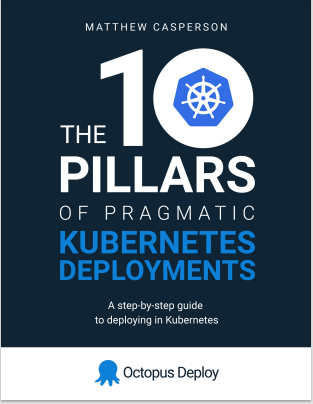

Cloud-native technologies have emerged as a way to gain a competitive advantage through benefits like scalability, economies of scale, and global reach. Migrating to the cloud and modernizing systems are an important issues for most IT professionals. Despite the clear need, there can be some challenges to knowing where to start.

At Octopus, we meet this challenge by providing some resources for getting started with cloud migration. These resources are a mix of Octopus developed tools, whitepapers and guides as well as external reports. This list of resources exposes to you a wide variety of sources so you can have an informed opinion about the benefits of cloud but also get practical tools to get started.

## Whitepapers

We want to provide you with in-depth research about issues that are important to us and our customers. As a cloud-native dedicated continuous delievery tool, we are invested in continuous delivery and cloud-native technologies. We have developed two whitepapers to address these issues to help inform our readers and give them actionable steps to move forward.

### Migrating to the cloud whitepaper

The migrating to the cloud whitepaper provides an argument for migrating to the cloud as well as first steps to take when migrating. It contains researched backed reports and distills cloud migration into a series of phases: strategy, implementation and operation. The whitepaper provides clear, actionable steps that your company can take when getting started with migrating to the cloud.

### Importance of continuous delivery whitepaper

The importance of continuous delivery whitepaper provides a deep dive into continuous delivery, the best practice principles, the benefits and why continuous delivery’s technical capabilities are fundamental to a successful DevOps adoption. The white paper includes case studies and  discussions on specific challenges your company may face when implementing continuous delivery.

## Octopus free tools

We have developed some free tools to address common customer problems. These tools help remove some of the barriers to getting started with modern CI/CD pipelines.

### Workflow Builder

The Octopus workflow builder was born out of a need to get users started quickly in a cloud CI/CD workflow. Users provide a GitHub repository and credentials and the workflow builder will automatically set up a deployment pipeline, managed by Octopus and deployed to a cloud platform.

### Kubernetes YAML generator

When you are working with Kubernetes, you will need to supply a YAML configuration file for your deployments. The Kubernetes YAML generator is a UI-based tool that lets you easily generate Kubernetes compliant YAML code. This code can be pasted directly into the Octopus UI to help you get started quickly with Kubernetes deployments.

## External reports

When you are validating your cloud-native approach, it is useful to be aligned with the broader cloud community. External reports provide surveys of cloud usage, best practices and use cases that you can use to back up your strategies.

## State of the cloud reports

State of the cloud reports give a snapshot in time of the major trends towards cloud-native. The main trends in these reports are that cloud usage has increased and the trend is increasing towards the future. Companies are having to modernize their systems and workforce to maintain a competitive advantage.

- [Hashicorp](https://www.hashicorp.com/state-of-the-cloud)
- [Flexera](https://resources.flexera.com/web/pdf/Flexera-State-of-the-Cloud-Report-2022.pdf)
- [Konveyor](https://www.konveyor.io/modernization-report/?utm_source=thenewstack&utm_medium=website&utm_campaign=platform)
- [Foundary](https://resources.foundryco.com/download/cloud-computing-executive-summary)

## Best-practice reports

If you want to migrate to the cloud, you need to understand the best practices that major cloud providers have used to become cloud native. These reports all suggest that planning is important and that there are implementation and operational concerns that companies will face. When moving towards cloud-native, hybrid approaches are recommended to bridge the gap between traditional systems and full cloud-native solutions.

- [Amazon](https://pages.awscloud.com/rs/112-TZM-766/images/AWS_Migration_8_Best_Practices_ebook_final.pdf)
- [Microsoft](https://azure.microsoft.com/en-au/migration/migration-journey/#how-to-migrate)
- [Google](https://cloud.google.com/architecture/migration-to-gcp-getting-started)

## Octopus supporting resources

At Octopus, we have authored several blogs and guides that can help you with cloud-migration. 

### The ten pillars of pragmatic kubernetes deployments

We wrote an [eBook on getting started with Kubernetes](https://github.com/OctopusDeploy/TenPillarsK8s/releases/tag/0.1.269-main) 

### Relevant blog posts

We have created several blogs that are relevant to cloud-native technologies. Here are a few:

1. [What is cloud orchestration?](https://octopus.com/blog/what-is-cloud-orchestration)
1. [Microservices and frameworks](https://octopus.com/blog/microservices-and-frameworks)
1. [Containerization - what you need to get started](https://octopus.com/blog/get-started-containers)
1. [Monolith versus microservices](https://octopus.com/blog/monoliths-vs-microservices)
1. [The benefits of containerization](https://octopus.com/blog/benefits-of-containerization)
1. [The ultimate guide to Kubernetes microservice deployments](https://octopus.com/blog/ultimate-guide-to-k8s-microservice-deployments)

## Conclusion

This post has given you some resorces for getting started with cloud migration. We have provided some whitepapers, free tools, external reports, and Octopus published blogs and guides. These resources can provide you with a base understanding of cloud technologies and some practical tools and steps to get started with your migration efforts. 