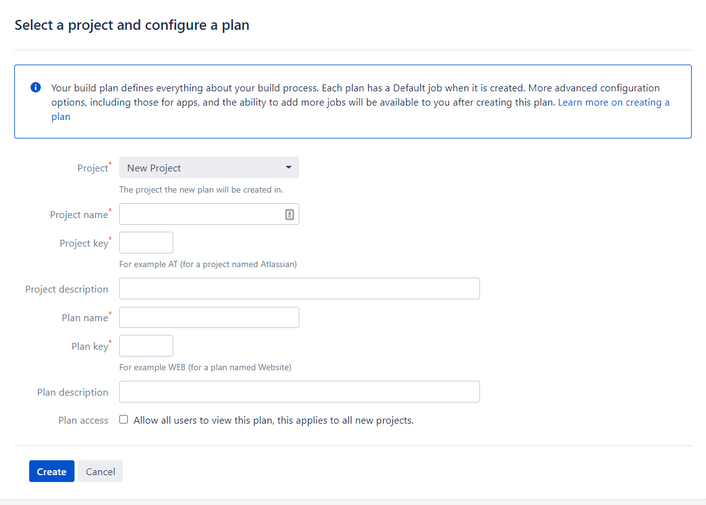

Continuous Integration (CI) servers are an important step in the CI/CD process. CI servers take a code repository, build it and push it to a central location where a continuous delivery (CD) tool like Octopus can take over and manage deployments. Bamboo is a CI server developed by Atlassian that can automate the building and testing of software applications. If you are beginning your CI/CD journey, it is hard to know where to start. Often it is useful to start with a simple use case, with a visible result. In this blog, you will build and push a software artifact where Octopus can take over and deploy it to a target environment.

This blog will take you through:

- Installing Bamboo on a Windows Server
- Configuring a Bamboo project
- Configuring a Bamboo plan to build and push a docker container to a container registry
- Running and viewing the container image

## Pre-requisites

To follow along with the guide, you will need the following software and accounts:

- [Java 8 or 11](https://confluence.atlassian.com/bamboo/supported-platforms-289276764.html)
- [Docker](https://docs.docker.com/desktop/install/windows-install/)
- [Git](https://git-scm.com/book/en/v2/Getting-Started-Installing-Git) 
- A Github Account
- DockerHub account

## Installing Bamboo on a Windows Server

To install Bamboo:

- [Download the latest release](https://www.atlassian.com/software/bamboo/download)
- Run the install executable
- Set the install location to a directory you can access, such as C:\Users\Username\Documents. Setting it to the Default location of C:\Program Files may result in permission errors.
- Set the Bamboo home directory, make sure this is a seperate directory from the install location with a folder name Bamboo-home.

Once the install has finished, run the bamboo server:

- Open terminal and navigate to the Bamboo installation directory
- Run bin\start-bamboo.bat
- The server should be started at http://localhost:8085/

## Setting up users

In the start up screen, you will be asked to set up an admin account. Fill out the details and store the details in a password manager. If you misplace your password, you will need to run through a recovery process.

## Agents

Agents are the workers that execute workloads in Bamboo. Since you have installed the pre-requisite technology, you can use the local machine as an agent for testing purposes. To set up a local agent:

- In the Bamboo dashboard, go to the settings icon and agents
- Go to add local agent and give it a name
- Click **Save**

## Setup project and plan

Bamboo organises your workflow into projects and plans. A project can contain multiple plans and each plan is a process that executes a series of tasks. To get started, set up your first project and plan:

- In the home menu, click **Create** and **Create Plan**. 
- Fill out the names of your project and plan

In the next screen check the box that says 'link new repository'

### Connect to the octopus underwater app reposotiry

We will be using the [Octopus Underwater App](https://github.com/OctopusSamples/octopus-underwater-app). 

To use this repository:

- Fork it into you own GitHub account. 
- In the password settings, use a [personal access token](https://docs.github.com/en/authentication/keeping-your-account-and-data-secure/creating-a-personal-access-token) to grant Bamboo access to repositories under your GitHub account.
- Select the main branch
- Test the connection to make sure that Bamboo can connect to this repository
- Click **Save and continue**

### Configure plan

You wil now be on the configure job screen. Here you can configure the tasks that the plan will run to execute your job. Bamboo provides a suite of task steps that you can select from. These tasks execute a certain step in the CI pathway, such as checkout, build, pull, push etc. You will see that there is a source code checkout task pre-filled for you. This checks out the linked Github repository into Bamboo

- Leave the isolate build as 'Agent environment'. This will use the local agent you set up earlier.

First, add the build docker task:

- Click on **add Task** and search for 'Docker'
- Set the command to Build a Docker Image
- Set the repository to be [Your DockerHub Username]/[The tag of your image]
- Check **Use an existing Dockerfile located in context path**
- Click **Save**

Now, add the push docker task:

- Click on **add Task** and search for 'Docker'
- Set the command to Build a Docker Image
- Set the repository to be [Your DockerHub Username]/[The tag of your image]
- Check **Use the agent's native credentials**
- Click **Save**

Click **Create**

The plan will start to execute by checking out the code, building the docker image, and pushing the built image to DockerHub

Once done you will see a success green tick box to indicate that the plan has completed successfully.

Navigate to your DockerHub account to confirm that the image has been pushed to the repository.

## Deploy step

Now that the image is on DockerHub, any CD tool can use that to deploy it to locally or to a cloud platform. We have written a guide on how to do this for [Azure](https://octopus.com/blog/deploying-java-app-docker-google-azure), [AWS through GithubActions](https://octopus.com/blog/multi-environment-deployments-github-actions), and [AWS through Jenkins](https://octopus.com/blog/multi-environment-deployments-jenkins).

To view the application locally:

- docker pull [Your DockerHub Username]/[The tag of your image]
- docker run -p 8080:8080 [Your DockerHub Username]/[The tag of your image]
- Go to http://localhost:8080/

You will see the Octopus Underwater app where you can learn more about CI/CD and Octopus

## Conclusion

CI servers are an important part of the CI/CD process and you can use many different CI servers with Octopus Deploy to complete your deployments. Bamboo is a CI server by Atlassian that allows you to build and push Docker images to Docker repositories. This blog guided you in how to install Bamboo and set up a project and plan to build and push the Octopus Underwater App. This is a simple getting started case, and there are many more use cases that Bamboo can do. If you are interested in more CI server resources, we did a [series on CI servers](https://octopus.com/blog/tag/CI%20Series) where we focussed on Jenkins, GitHub actions and fundamental CI concepts.
