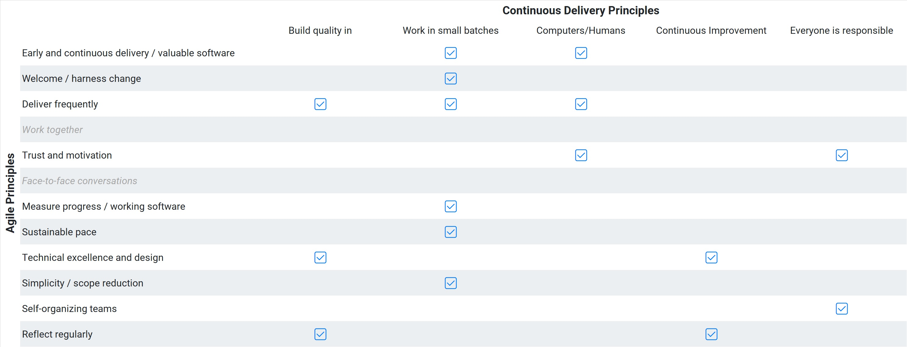

With DevOps and continuous delivery gaining traction, are Lean and Agile principles still relevant? How do they compare to the 5 principles of continuous delivery and what do any differences mean for software development teams?

## Introduction

Throughout the 1990s, a revolution was brewing within the software development industry. The early phased models had divided the delivery process into skill-based steps, with designs and documents being used to run approval processes to control the project.

The process for delivering software was heavyweight and slow, with little indication that the overheads reduced the risks they were intended to mitigate.

A collection of lightweight methods were emerging that were designed to generate feedback and adapt the plan iteratively. Small batches were used to control the risk and to provide frequent opportunities to review and change the plan.

The Agile Manifesto emerged From this adaptive and lightweight methods community in 2001, with Lean Software Development arriving a couple of years later.

Both Agile and Lean provided a *values and principles* based approach to software development. You could test whether an approach was Agile or Lean by testing it against a set of core statements that defined the philosophy behind the approach.

Continuous delivery and DevOps arrived a decade later. Instead of a they represented an evolution of Agile and Lean ideas, based on the experiences shared within the community.

InfoQ publishes an annual report on software development culture and methods, which is inspired by Geoffrey Moore's book *Crossing the Chasm*. Moore famously visualizes a technology adoption lifecycle as a bell curve charting 3 standard deviations. The chart is divided into five groups with different attitudes to new technology:

- Innovators (-3)
- Early adopters (-2)
- Early majority (-1)
- Late majority (+1)
- Laggards (+3)

The early majority and late majority represent two-thirds of the adoption lifecycle, but for a technology (on in the case of InfoQ an idea) to move into the majority, it must cross the chasm from the early adopters to the mainstream.

*Source: [InfoQ Software Development Culture and Methods 2022](https://www.infoq.com/articles/culture-trends-2022/)*

While adaptive modes of software delivery are now embedded in the late majority, the capabilities needed for continuous modes are still making their way across the chasm. Some practices (such as DevSecOps) have made the leap, while other key elements (like team topologies and empowered teams) remain at the early adopter stage.

So, with DevOps and continuous delivery gaining traction, it's a great time to compare the 5 principles of continuous delivery with the 12 Agile principles and the 7 Lean principles.

## Comparing principles

Agile, lean, and continuous delivery each provides a set of principles. This provides a basis for a comparison of their fundamental structures.

There are other techniques and capabilities in Lean and continuous delivery that don't have comparable elements in Agile, as The Agile Manifesto was designed as a broad litmus test of the agility of other specific methods, such as Extreme Programming, Scrum, and Disciplined Agile.

Lean describes techniques that cover the whole software development process with advice on planning, design, testing, and maintenance.

Continuous delivery uses the deployment pipeline (from the code commit to the software running in production) to focus efforts to improve the flow of change. Specific technical capabilities are described in detail to enable the *early and continuous delivery of valuable software*.

This means the principles are the only directly comparable elements of these three approaches.

### CD principles

https://continuousdelivery.com/principles/

1. Build quality in
1. Work in small batches
1. Computers perform repetitive tasks, people solve problems
1. Relentlessly pursue continuous improvement
1. Everyone is responsible

### Agile principles comparison

The continous delivery principles are well-aligned to Agile principles in most cases. Often, a single continuous delivery principle covers several Agile ones. Working in small batches is a great way to achieve several of the Agile principles:

- Our highest priority is to satisfy the customer through early and continuous delivery of valuable software.
- Welcome changing requirements, even late in development. Agile processes harness change for the customer's competitive advantage.
- Deliver working software frequently, from a couple of weeks to a couple of months, with a preference to the shorter timescale
- Working software is the primary measure of progress.
- Agile processes promote sustainable development. The sponsors, developers, and users should be able to maintain a constant pace indefinitely.
- Simplicity--the art of maximizing the amount of work not done--is essential.

The principle "work in small batches" is concise, easy to follow, and contributes to achieving half of the Agile principles. It doesn't do this on its own, to "deliver working software frequently" we also need to "build quality in" and let "computers perform repetitive tasks".

Across the 5 continuous delivery principles, all of the key ideas are represented in snappy and actionable statements, with just two exceptions.

 - Business people and developers must work together daily throughout the project, and
 - The most efficient and effective method of conveying information to and within a development team is face-to-face conversation

Continuous delivery is centered on the delivery pipeline, which means the process of identification, inception, and initiation aren't the concern of continuous delivery. However, the subject of the broader development lifecycle is still discussed in Jez Humble and Dave Farley's *Continuous Delivery* book. It may even be the case that continuous delivery challenges these views. The authors and editors worked with different tools in different countries and used version control and automated builds to update drafts of the book. Remote and asynchronous work is becoming more common, so perhaps face-to-face communication isn't fundamental to successful software development either.

The principles of continuous delivery are 10% of the size of the Agile principles; just 21 words rather than 180. Blaise Pascal is credited with an apology for the length of a letter, excusing himself by saying he had no time to make it shorter. In our case, hindsight and the more detailed practices around the deployment pipeline have provided the opportunity for concision.

> It’s easy to get bogged down in the details of implementing continuous delivery — tools, architecture, practices, politics — if you find yourself lost, try revisiting these principles and you may find it helps you refocus on what’s important. - [Jez Humble](https://continuousdelivery.com/principles/)

You don't have to throw out The Agile Manifesto to move forwards, it's part of the geography that continuous delivery and DevOps are building on. The industry will continue to discover new and better ways of developing software. It is increasingly certain that technical practices and cultural capabilities are a key part of this emerging knowledge.

### Lean principles comparison

The Lean principles are already brief and actionable, and they are covered particularly well by continuous delivery.

Where the agile principles find reasonable alternatives in continuous delivery, the Lean principles are a different angle altogether. Rather than being largely equivalent, the two sets provide alternative approaches to common goals. Automation is an attack vector for eliminating waste, delivering quickly, and building integrity into the system.

You could view the Lean principles as applicable broadly to your organization, with the continuous delivery principles directing practical software development efforts. A leadership perspective and an individual contributor viewpoint.

## Conclusion

Continuous delivery provides a concise set of principles that align to 10 of the 12 Agile principles. Continuous delivery also complements Lean, providing a different perspective on achieving similar goals. All three are consistent with modern management philosophy and provide different way to review and re-focus your software delivery efforts.

## Learn more

- [The importance of continuous delivery (blue paper)](https://www.example.com/resource)

Happy deployments! 
