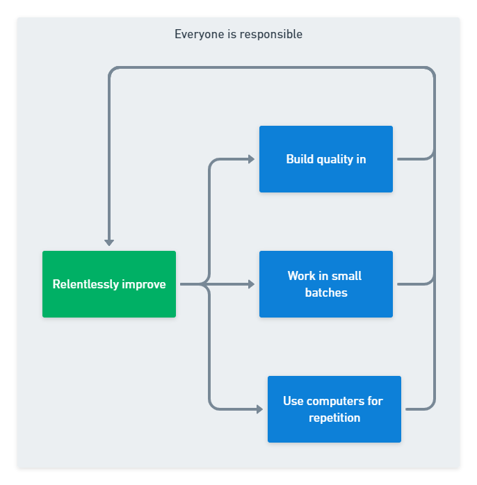

With DevOps and Continuous Delivery gaining traction, are the principles behind Lean and Agile still relevant? How do they compare to the 5 Continuous Delivery principles, and what do any differences mean for software development teams?

## The beginnings of lightweight software delivery

Throughout the 1990s, a revolution was brewing in the software development industry. The early phased models divided the delivery process into skill-based steps, with designs and documents used to run approval processes to control a project.

The process for delivering software was heavyweight and slow, with little indication that the overheads reduced the risks they tried to mitigate.

A collection of lightweight methods emerged, designed to generate fast feedback and iteratively adapt the plan based on new information. Rather than controls and approvals, developers used small batches to manage the risk and provide frequent opportunities to change direction.

The Agile Manifesto emerged from this adaptive and lightweight methods community in 2001, with Lean Software Development arriving a couple of years later.

Agile and Lean provided a *values and principles* based approach to software development. You could test whether an approach was Agile or Lean by testing it against a set of core statements defining each method's philosophy.

Continuous Delivery emerged from the Lean and Agile communities, providing the most concrete practices and capabilities to achieve frequent and safe software delivery. Apart from Extreme Programming, most software development methods deal with requirements management and communication structures. Continuous Delivery takes on the rest of the value stream and provides a pathway to an efficient and reliable delivery pipeline.

InfoQ publishes an annual report on software development culture and methods. They style the report after Geoffrey Moore's *Crossing the Chasm* concept. Moore famously visualizes a technology adoption lifecycle as a bell curve spread across 3 standard deviations.

The chart is divided into 5 groups with different attitudes to new technology:

- Innovators (-3)
- Early adopters (-2)
- Early majority (-1)
- Late majority (+1)
- Laggards (+3)

The early majority and late majority represent two-thirds of the adoption lifecycle. Still, for new technology (or, in the case of InfoQ, a new idea) to move into the majority, it must cross the chasm from the early adopters to the mainstream majorities.

*Source: [InfoQ Software Development Culture and Methods 2022](https://www.infoq.com/articles/culture-trends-2022/)*

While adaptive modes of software delivery are embedded in the late majority, the capabilities needed for continuous modes of delivery are still making their way across the chasm. Some practices (such as DevSecOps) have made the leap, while other key elements, like team topologies and empowered teams, remain at the early adopter stage.

So, with DevOps and Continuous Delivery gaining traction, it's a great time to compare the 5 principles of Continuous Delivery with the 12 Agile principles and the 7 Lean principles.

## Comparing Agile, Lean, and Continuous Delivery principles

Agile, Lean, and Continuous Delivery each provide a set of principles. This helps us compare their fundamental structures.

There are other techniques and capabilities in Lean and Continuous Delivery that don't have comparable elements in Agile. The Agile Manifesto was intended to be a broad litmus test of the agility of other specific methods, such as Extreme Programming, Scrum, and Disciplined Agile, so it didn't define further details.

Lean expands on its principles by describing techniques covering the whole software development process with advice on planning, design, testing, and maintenance.

Continuous Delivery uses the deployment pipeline (from the code commit to the software running in production) to focus efforts on improving the flow of change. Specific technical capabilities are described in detail to enable the *early and continuous delivery of valuable software*.

The principles are the only directly comparable elements of these 3 approaches.

### Continuous Delivery principles

There are [5 principles](https://continuousdelivery.com/principles/) of Continuous Delivery:

1. Build quality in
2. Work in small batches
3. Computers perform repetitive tasks, and people solve problems
4. Relentlessly pursue continuous improvement
5. Everyone is responsible

The principles can be arranged into a reinforcing relationship, where the first 3 principles act as drivers of continuous improvement, for which everyone involved is responsible.

### Agile principles comparison

In general, Continuous Delivery principles are consistent with [The Agile Manifesto](https://agilemanifesto.org/principles.html).

For example, working in small batches is widely understood to help achieve several of the Agile principles:

- Our highest priority is to satisfy the customer through early and continuous delivery of valuable software.
- Welcome changing requirements, even late in development. Agile processes harness change for the customer's competitive advantage.
- Deliver working software frequently, from a couple of weeks to a couple of months, with a preference to the shorter timescale
- Working software is the primary measure of progress.
- Agile processes promote sustainable development. The sponsors, developers, and users should be able to maintain a constant pace indefinitely.
- Simplicity - the art of maximizing the amount of work not done - is essential.

The phrasing of the principle "work in small batches" is concise and easy to follow in practice. This Continuous Delivery principle contributes to the attainment of half of the Agile principles.

There is also an amplification effect when you combine the 5 principles. To "deliver working software frequently", you need to work in small batches, increase automation, and build quality in.

Two Agile principles are not covered by Continuous Delivery:

 - Business people and developers must work together daily throughout the project.
 - The most efficient and effective method of conveying information to and within a development team is face-to-face conversation.

Continuous Delivery is centered on the delivery pipeline, which means the process of identification, inception, and initiation aren't a direct concern of Continuous Delivery. Additionally, in the front matter of the *Continuous Delivery* book, the authors highlight that the book was created according to the ideas it contained. The contributors and editors worked using different tools and from separate locations. They used version control and automated builds to form a delivery pipeline for the book. They didn't work together daily or convey information face-to-face.

As an industry, many organizations who hadn't attempted to work remotely are now ready to experiment with distributed working. This will further challenge the need for real-time face-to-face coordination as asynchronous communication becomes more common and familiar.

Regarding word counts, Continuous Delivery principles are conveyed in 21 words, rather than 180 words for Agile principles. A combination of hindsight and incisive editing has given us a compass to check our direction, with the detail provided in the specific practices of Continuous Delivery.

> It's easy to get bogged down in the details of implementing Continuous Delivery — tools, architecture, practices, politics — if you find yourself lost, try revisiting these principles and you may find it helps you re-focus on what's important. - [Jez Humble](https://continuousdelivery.com/principles/)

You don't have to throw out The Agile Manifesto to move forwards; it's part of the geography that Continuous Delivery and DevOps are building on. The industry will continue to discover new and better ways of developing software. It's increasingly evident that technical practices and cultural capabilities are vital.

### Lean principles comparison

The Lean principles are already brief and actionable. There's complete alignment between Lean and Continuous Delivery, with no un-mapped areas.

With Agile, Continuous Delivery offered a concise alternative to 10 Agile principles. In the case of Lean, Continuous Delivery aligns entirely with the principles. Each approach provides a different perspective that applies to various organization segments.

In an organization that has fully adopted both Lean and Continuous Delivery, the respective principles are helpful to different groups. Lean principles and techniques are leadership tools, while Continuous Delivery provides an approach specific to the individual contributors' delivery efforts.

For example, automation is a practical attack vector for eliminating waste, delivering quickly, and building integrity into the system with Continuous Delivery.

## Conclusion

Continuous Delivery provides a concise set of principles that align with 10 of the 12 Agile principles and complement Lean, providing a different perspective on achieving similar goals.

All 3 sets of principles are consistent with modern management philosophy and provide different ways to review and re-focus your software delivery efforts.

You can use the Continuous Delivery principles to guide your software delivery efforts and refer back to Agile and Lean principles to find further inspiration for your improvement efforts.

## Learn more

- [The importance of Continuous Delivery (white paper)](https://www.example.com/resource)
- CD series links
- [Free tools](https://octopus.com/freetools)

Happy deployments! 