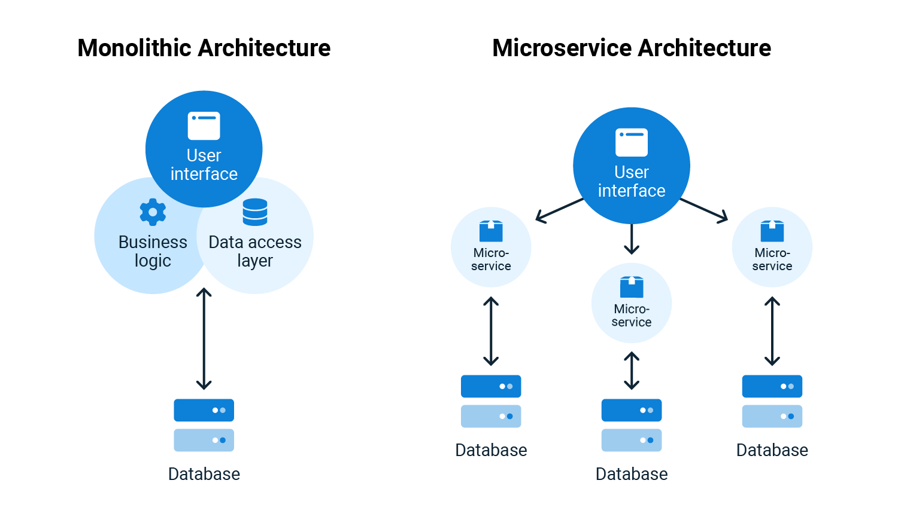

Monoliths and microservices are 2 approaches to building software. Which one you choose can significantly impact development and performance. 

In this post, I discuss:

 - The difference between monoliths and microservices
-  Which is better for enterprise software applications
-  Challenges of both approaches

## What are monoliths and microservices?

A monolith is a singular executable software application. It contains one codebase that defines the user interface, application logic, and database required to run an application. A monolithic application is built and maintained as a single, indivisible unit and is served from a central location. For example, in-house accounting software that uses a database to store customer records, a web server for record keeping, and other components, all served from an on-premises server.

By contrast, a microservice architecture breaks down an application into smaller independent units. Microservices are connected to make the whole application through Application Programming Interfaces (APIs). 

APIs let microservices communicate with one another to execute a task. For example, a microservice sends input data to a second microservice. The second microservice sends input data to several other microservices, and so on. The same accounting software can run on the cloud, with the database, web server, and other components distributed across multiple geographical regions.

Microservices are modularized. Their components are built independently and only become associated when they need to create an application. A database component built for a microservice can be part of 2 different software applications through software reuse.

The diagram below visualizes the differences between monoliths and microservices. They key dinstinction is that monoliths are large units with several services whereas an application using microservices is made up of several independent microservices.

## Which one is better for enterprise software applications?

Traditionally, software applications were built as monoliths. With the advancement of cloud technologies, though, particularly containerization, microservices have become popular in delivering software. Google Trends shows that microservices gained popularity after 2013. It was also 2013 when Docker, the leading containerization technology, was released.

Microservices are more agile than monoliths because there's more isolation between microservices. Building, testing, and deploying a monolithic application involves the entire codebase. You can build each microservice and test it independently, without building a larger application. The agility of microservices also means they're more reusable than monoliths. To reuse code from a monolith, you need to create interfaces for the new application. Through APIs, microservices have immediate interfaces with other applications, making them easier to reuse.

A container is a lightweight, portable computing environment with all the necessary files to run independently. Containerization is the process of making an application runnable as a container. Containerization helped microservices gain popularity and widespread adoption through scaling. Microservice applications leverage cloud orchestration tools like Kubernetes to schedule and scale workloads. 

Imagine an application contains a database and a web front-end, but the database is also serving a second application. A Kubernetes node dynamically manages load for the front-end and database by increasing or decreasing load on each service. The Kubernetes node services 2 applications, and only uses the resources required for the task. A monolith can only scale by adding more nodes that scale the entire application, creating unnecessary costs.

Enterprise software applications operate at scale and compete with other products for market share. Our [post on DORA metrics](https://octopus.com/blog/dora-metrics-devops-business-outcomes) discusses how agility-based metrics like deployment frequency, lead time, mean time to recovery (MTTR) and change failure percentage are important to improving profitability, market share, and productivity. Microservices are more agile and flexible than monoliths, allowing microservice applications to be delivered faster to market and achieving cost savings at scale. Microservices can be delivered iteratively with feedback instead of delivering a monolith as a single executable. The benefits of microservices make them well-suited for enterprise software applications.

## The challenges when using microservices

Despite many benefits, there are challenges when using microservices over monoliths. An application using microservices can make hundreds of API calls for one function, where a monolith application only needs one. Monoliths can have higher performance at scale for applications that require several functions, as there's no need for multiple API calls per function.

Both the monolithic and microservice architecture can be complicated. When developing a monolith, you end up with a large application code base. It's unlikely that a single developer or team understands the application in its entirety. 

Microservices contain multiple interacting services that can each use a different framework, making it more complex. The number of services in microservices also increases the demand for documentation as the number of services grows.

Downtime in a microservice can have cascading effects in the application. Even though microservices are independent, they're connected. If one microservice sends incorrect outputs, this can cause other microservices to behave unpredictably. Microservices are decentralized, which introduces networking problems. Firewalls, latency, and security are more significant problems in microservices than in monoliths, where an application is self-contained and runs in a central location.

## Conclusion

Monoliths and microservices are 2 approaches to software development. Around 2013, microservices became popular with improved cloud and container technologies. Monoliths are a singular executable providing high performance but low agility. Microservices are independent services that make up a larger application providing high agility, flexibility, and scale. These benefits make microservices better suited for enterprise software applications, as long as you're aware of the challenges.

Happy deployments!
