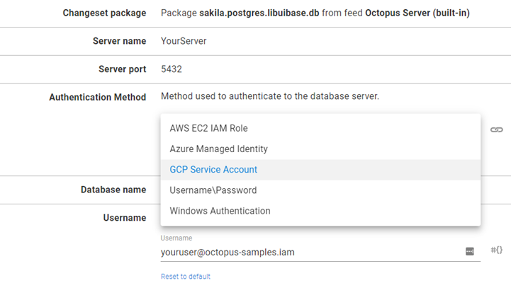
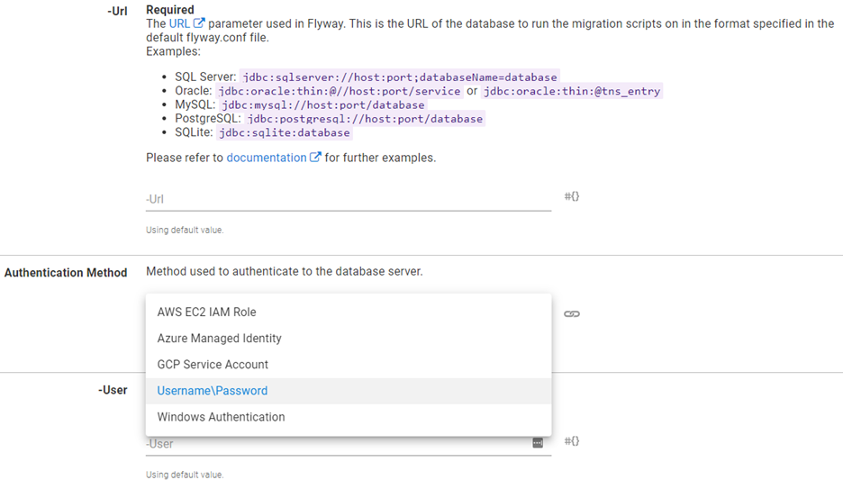

Amazon Web Services (AWS), Azure, and Google Cloud Platform (GCP) have introduced passwordless authentication mechanisms where resources such as Virtual Machines (VMs) can be assigned an identity (Azure), a service account (GCP), or a role (AWS) that can be used to authenticate to other resources such as database server instances.  The Solutions team has updated several database deployment Community Step Templates to include these passwordless authentication mechanisms.  This post will cover which templates have been updated and which mechanisms they support.

## Database technologies that support cloud-native authentication methods
The database technologies that support the cloud-native authentication differs by cloud provider:

AWS
- Amazon Aurora
- MariaDB
- MySQL
- PostgreSQL

:::warning
Amazon Aurora has not been tested with the templates listed in this post.  
::::

Azure
- Azure Cosmos DB
- MySQL
- PostgreSQL
- Microsoft SQL Server

:::warning
Azure Cosmos DB has not been sted with the templates listed in this post.
:::

GCP
- MySQL
- PostgreSQL

Both GCP and AWS support Windows Authentication for Microsoft SQL Server, however, the server must connected to an Active Directory on the cloud provider.

## Step templates with cloud authentication support
The following Community Step Templates support use of cloud-native database authentication:
- [Liquibase Run Command](https://library.octopus.com/step-templates/36df3e84-8501-4f2a-85cc-bd9eb22030d1/actiontemplate-liquibase-run-command)
- [Flyway Database Migrations](https://library.octopus.com/step-templates/ccebac39-79a8-4ab4-b55f-19ea570d9ebc/actiontemplate-flyway-database-migrations) 
- [RoundhousE Database Migrations](https://library.octopus.com/step-templates/6da0afee-ed55-4c75-a13b-5e8ce42ef027/actiontemplate-roundhouse-database-migrations)
- [SQL - Deploy DACPAC with AAD Auth support](https://library.octopus.com/step-templates/ae9d0024-a5aa-4aa8-95a9-cba53c291054/actiontemplate-sql-deploy-dacpac-with-aad-auth-support)

### Liquibase Run Command
The `Liquibase Run Command` has been updated with an **Authentication Method** selector which allows you to select the appropriate method for the cloud provider.  This template supports the following:
- AWS EC2 IAM Role
- Azure Managed Identity
- GCP Service Account
- Username/Password
- Windows Authentication

Liquibase Run Command requires the use of PowerShell, however, is coded to work on both Windows and Linux operating systems.

### Flyway Database Migrations
`Flyway Database Migrations` has also been updated with an **Authentication Method** selector.   This template supports the following authentication methods:
- AWS EC2 IAM Role
- Azure Managed Identity
- GCP Service Account
- Username/Password
- Windows Authentication

Flyway Database Migrations requires the use of PowerShell Core, however, is coded to work with PowerShell Core on both Windows and Linux operating systems.

### RoundhousE Database Migrations
Simlar to the previous two, `RoundhousE Database Migrations` has been updated with an **Authentication Method** selector.  This template supports the following authentication methods:
- AWS EC2 IAM Role
- Azure Managed Identity
- GCP Service Account
- Username/Password
- Windows Authentication

### SQL - Deploy DACPAC with AAD Auth support
Though limited to Azure, SQL - Deploy DACPAC with AAD Auth support can use several the following authentication methods:
- Azure Active Directory Integrated
- Azure Active Directory Managed Identity
- Azure Active Directory Username/Password
- SQL Authentication
- Windows Integrated

SQL - Deploy DACPAC with AAD Auth support is written in PowerShell and makes use of DLL files that are part of the SQL Server installation.  Because of this, it may not work on the Linux operating system.

## Conclusion
Use of cloud-native authentication within Octopus Deploy is a topic that comes up quite a bit.  To continue to support our customers with the best experience possible, the Solutions team took it upon themselves to augment popular database deployment templates to use modern, cloud authentication for databases.  Happy Deployments!

## Learn more

- [link](https://www.example.com/resource)

Happy deployments! 
