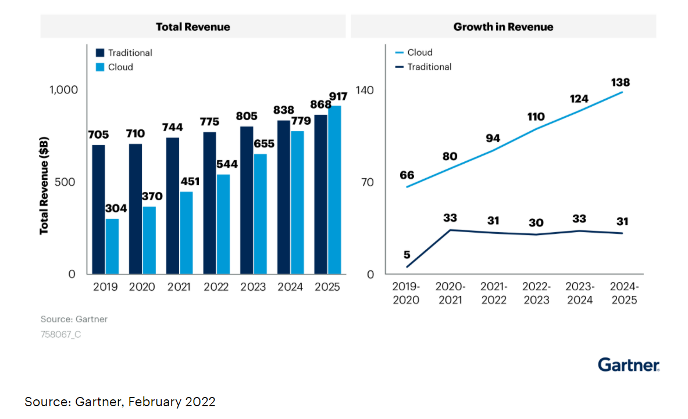
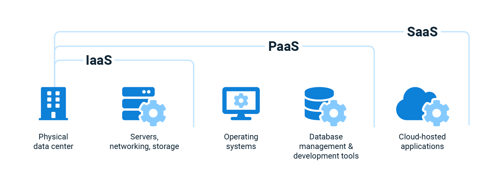

Wherever you work, you may have noticed a big shift to the cloud in the applications you use, from storing data like emails or photos, to developing software in a cloud repository like Git. Cloud solutions are dominating the market. A [study by Gartner](https://www.gartner.com/en/newsroom/press-releases/2022-02-09-gartner-says-more-than-half-of-enterprise-it-spending) indicates that revenue for cloud products will overtake traditional IT solutions in 2025. 

If you work with cloud products, you'll want make them more efficient and cost-effective. Two terms that can help you with that are cloud orchestration and cloud automation. These terms are often used interchangeably, but there are some key differences. 

Cloud orchestration is the coordination and automation of workloads, resources, and infrastructure in public and private cloud environments. Cloud orchestration is the automation of the whole cloud system. Each part of the system should work together to produce an efficient system. Cloud automation is a subset of cloud orchestration focused on automating the individual components of a cloud system. Cloud orchestration and automation complement each other to produce an automated cloud system.

In this blog, I will write about the different as a service models, the benefits of cloud orchestration, some cloud orchestration tooling, and how Octopus Deploy helps enable cloud orchestration.

## As a Service Models

Developers access cloud services in three main models:

- Software as a Service (SaaS)
- Platform as a Service (PaaS)
- Infrastructure as a Service (IaaS)

SaaS is a software licensing and delivery model where a software solution is provided on-demand and hosted by the provider. SaaS solutions often have a subscription fee or freemium pricing model to access the service. The benefit of this approach is that users do not have to install and host the application and can access what they need. You may have used some SaaS solutions like Dropbox, Gmail or Netflix. 

PaaS platforms give developers a complete cloud development and deployment environment. Developers can load operating systems and development tools on VMs. PaaS provides a contained environment to build cloud applications without needing to manage licensing or underlying application infrastructure. Think the platform used to build SaaS applications. Platforms like Microsoft Azure, Google Cloud Platform, or Amazon Web Services are examples of PaaS. 

IaaS provides on-demand services to deploy IT infrastructures such as virtual machines, servers, networks, and storage. IaaS is a pay-as-you-go where users pay for the infrastructure they need when they need it. Think of IaaS as the infrastructure behind PaaS and SaaS systems. Examples of IaaS platforms include Digital Ocean or AWS EC2. 

Developers build SaaS systems on IaaS and PaaS platforms, and developers build PaaS platforms on IaaS platforms. Together,  as-a-service systems allow developers to achieve cloud orchestration and automation. The diagram below shows how SaaS, IaaS, and PaaS work together to deliver cloud solutions:

## Benefits of Cloud Orchestration

Cloud orchestration allows developers to automate every part of their cloud solution. Cloud orchestration leads to:

- Increased efficiency
- Cost reductions
- Support for DevOps
- Increased security

When developers automate processes in a cloud solution, the cloud solution can detect when peak times occur and deploy extra services to prevent services from being overloaded. Cloud solutions can also shut down any idle processes that are not needed. The optimized allocation of resources leads to increased efficiency of the platform and reduced costs. 

Cloud orchestration supports the DevOps framework by allowing continuous integration, monitoring, and testing. Cloud orchestration solutions manage all services, which leads to frequent updates and faster troubleshooting. Your applications will be more secure as developers can patch vulnerabilities quickly.

Cloud orchestration is a hard project to complete. You will find benefits along the way to complete orchestration, maybe you automate the database component and that speeds up manual data handling, or you install a smart scheduler for your Kubernetes workloads. Even small improvements to cloud orchestration could save you time and money.

## Cloud Orchestration tools

Terraform is an open-source infrastructure as code tool. You can specify your infrastructure in configuration files to deploy infrastructure on the cloud. Infrastructure as code can be saved and restored between versions. Terraform is a common framework for deploying infrastructure solutions. 

Kubernetes is a container orchestration tool developed by Google. Containers are lightweight computing units that make up a larger application. Kubernetes works with cloud providers to manage and deploy containers on infrastructure. Resources can be scaled up or down depending on demand which saves costs and increases the reliability of the application.

Many PaaS cloud providers have tools that allow cloud orchestration, such as:

- AWS Cloud Formation
- Microsoft Azure Automation
- IBM Cloud Orchestrator
- Google Cloud Composer

These tools allow developers to automate their cloud environments through infrastructure as code, deployment management GUIs, and integrations to other cloud solutions within the PaaS system. There are dedicated cloud orchestration tools such as:

- RedHat Ansible
- Cloudify
- Morpheus

These dedicated tools provide cloud provisioning, configuration management, and automation. All cloud orchestration tools work with technologies such as Terraform and Kubernetes. Your choice of tool will depend on a number of things: IT budget, preferred languages, the location of preexisting deployments, or other application-specific requirements.

### Where does Octopus Deploy fit in?

Octopus Deploy is a cloud-agnostic deployment tool that makes complex deployments easier. The role of Octopus Deploy in cloud orchestration is to set up and manage the deployment of an application through an on-premise solution or a cloud provider. Octopus takes the application from code to build to deployment. Once the deployment is live, a tool like Kubernetes or AWS Cloud Formation can manage the state of the infrastructure and cloud resources of the application. If developers need to deploy the application with a new version, Octopus can manage the new release and deploy a new release version to the production environment.

## Conclusion

Cloud orchestration is the coordination and automation of workloads, resources, and infrastructure in public and private cloud environments. Cloud orchestration is the automation of the whole cloud system. The benefits of orchestration and automation are increased efficiency, reduced cost, support for DevOps, and increased security. 

Developers access cloud services in three main models: Software as a service, platform as a service, and infrastructure as a service. These services provide on-demand services for developers to access the resources they need without managing them. Developers can combine SaaS, PaaS, and IaaS to achieve cloud orchestration and automation. 

Popular frameworks and tools for cloud orchestration include Terraform, Kubernetes, PaaS orchestration tools, and dedicated orchestration tools. Octopus is a deployment tool that can work with your DevOps toolchain to achieve cloud orchestration and happier deployments.
