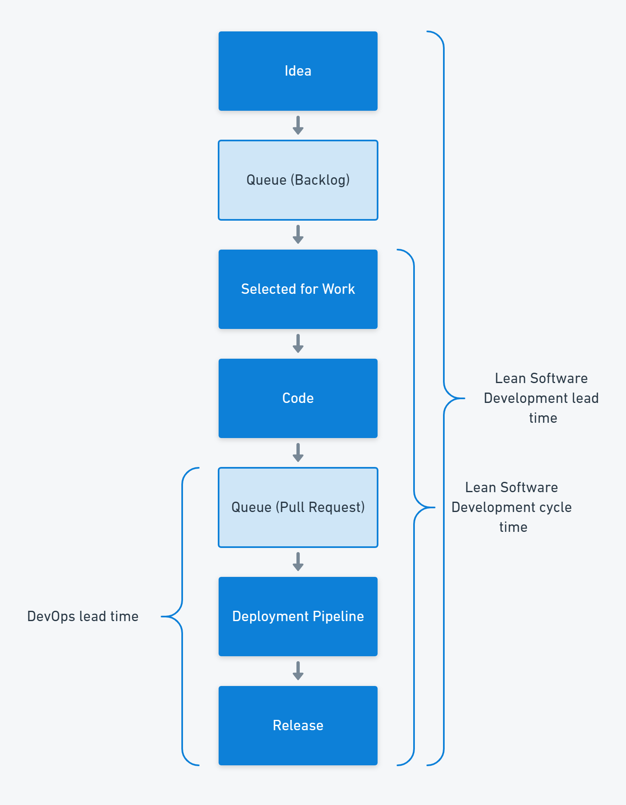
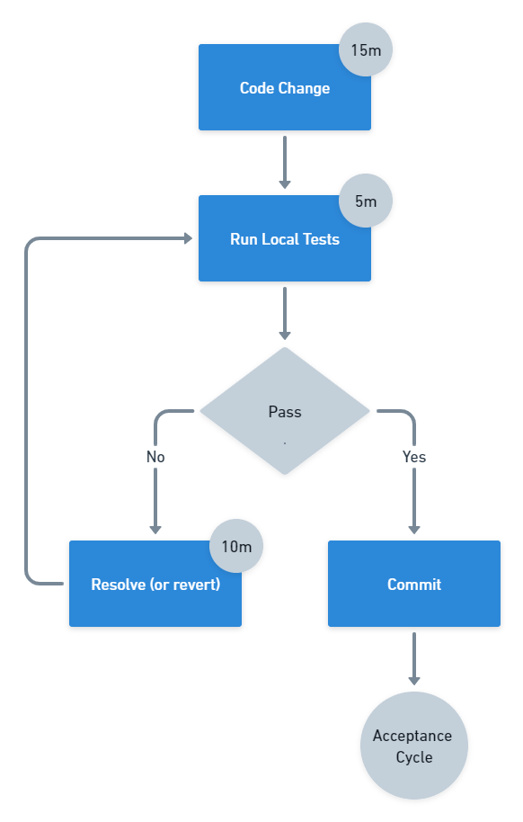

When someone mentions lead times in software delivery, it often isn't clear whether they mean the definition of lead times from Lean Software Development, the one from DevOps, or something else entirely. Why are there so many definitions of lead time and how do you put them to use?

## Lead time definitions

The [DevOps definition of lead time](https://octopus.com/devops/metrics/) is the time between a change being committed into version control, and the change being deployed to the production environment. This definition covers a smaller part of the software delivery process than the Lean definition of lead time.

In Lean Software Development, created by Mary and Tom Poppendieck based on the lean manufacturing movement, lead time is measured from when a requirement is discovered to the point when that requirement is fulfilled.

The Lean movement is based on the Toyota Production System, which defined lead time as the time between a customer placing an order and receiving their car.

## Lead time is a customer measurement

What all of these lead times have in common is that they represent a customer measurement. The reason they differ is the customer is different. Toyota was measuring the system from the perspective of a car buyer, the Poppendiecks were measuring the software development system as the users see it, and DevOps measures the deployment pipeline from the perspective of the developer as the customer.

| Lead time                 | Customer  | Start       | End                   |
|---------------------------|-----------|-------------|-----------------------|
| Toyota Production System  | Car Buyer | Order       | Delivery              |
| Lean Software Development | User      | Requirement | Working software      |
| DevOps                    | Developer | Code commit | Production deployment |

The key to successful lead time measurement is that it represents how the customer views the elapsed time.

:::hint
If you run a coffee shop, you might measure the time between a customer placing an order and being handed their coffee. You might consider a 2-minute lead time to be good as your competitors take 3 minutes to make a coffee.

However, your competitor is using a whole-system lead time, which starts when the customer joins the queue. They added another barista and reduced the queue from 15 minutes to just 7. Their customers get coffee in 10 minutes, but your customers have to wait 17 minutes.

Unless your lead time represents the customer's complete view of the system, you will optimize the wrong things.
:::

## Cycle times

When you measure a part of the system, you are collecting a *cycle time*. In the car industry, it is useful to track how long it takes for a car to move along the production line. In software delivery, it is common to collect the cycle time from when a work item is started, to when it is closed.

Your customer doesn't care about cycle times, as the coffee shop example shows. However, you can use cycle times to measure different parts of the whole system to identify bottlenecks that constrain the flow of work.

In software delivery, it is common to find that a large proportion of elapsed time is due to work waiting in a queue. For example, a requirement that would take a few days to deliver might sit in a backlog for months, or a pull request may wait for approval for hours or even days. You can identify these delays by subdividing your system and measuring each part.

## All measurements are useful

Lead time is valuable because it represents the customer's perception. Identifying your customer and tracking lead times as they see them will ensure any improvements you make impact their experience. If you make an improvement that doesn't reduce the lead time, you have optimized the wrong part of your system. In some cases, reducing the time for the wrong part of the system can even increase the overall lead time if it adds additional stress to the constraint.

:::hint
A _constraint_ is a bottleneck that limits the speed of flow for the whole system. Resolving a constraint causes the bottleneck to move, so the process of identifying and resolving constraints is continuous. Software delivery represents a constraint to most organizations as technology is such a key competitive advantage.
:::

The Theory of Constraints, created by Eli Goldratt, tells us that there is only one constraint in the system. Optimizing anywhere other than the constraint will fail to improve the performance of the whole system.

However, while lead time is vital to ensure your improvement efforts are worthwhile, you may need other measurements to help you find the constraint. Cycle times and other part-system timers will help you work out where optimization is likely to reduce the overall lead time.

## Common software delivery constraints

There are some common constraints in software delivery, which you should look at to assess whether they are increasing your lead time:

- Working in large batches
- Pull request approval queues
- Having too many branches, or branches that exist for too long
- Manual testing
- Policy constraints, such as unnecessary approvals

These constraints are reflected in the Continuous Delivery commit cycle, which has the following timings:

- Commits every 15 minutes
- Initial build feedback in 5 minutes
- Any failures fixed or the change reverted after 10 minutes

...

Happy deployments!