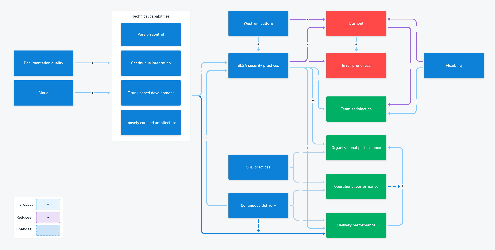

As DevOps adoption increases, it becomes more likely the certification industrial complex will attempt to apply a maturity model. This article explains why a maturity model is not appropriate and what you should use instead.

- Maturity models are popular in the IT industry

## What is a maturity model?

A maturity model represents groups of characteristics such as processes or activities into a sequence of maturity levels. By following the groups from the easiest to the most advanced, an organization can implement all the required elements of the model.

Maturity models:

- Provide a roadmap for adopting characteristics
- Make it easier to get started by suggesting a smaller initial set of characteristics
- Can be assessed to provide the organization with a maturity score

For example, a simple maturity model for riding a bike might have 5 levels of maturity:

1. Walk upright on two legs
2. Ride a balance bike
3. Ride a balance bike with both feet off the ground
4. Ride a pedal bike from a starting point facing downhill
5. Ride a pedal bike from a starting point facing uphill

The sequence of maturity levels provides you with a useful roadmap to follow if you want to learn to ride a bike. Each maturity level is easier to reach from the level below, as the earlier levels provide a basis for increasing your skills and progressing to the next stage. You can also assess someone by asking them to demonstrate each level.

You can create a maturity model by designing the levels first and expanding each one with characteristics, or you can collect the characteristics first before arranging them into a sequence of levels.

You'll find maturity models are commonly used as part of standards and their certification process. A typical process audit will use a model that requires you to prove:

1. That you document your process
2. That people follow the documented process
3. That you regularly review and improve the process

When you plan to achieve a certification, your roadmap is clear; you have to start by documenting the process before you can tell whether people follow it. In the same way, you can't improve a process until you know people are following it.

## Limitations of maturity models

You can use a maturity model to assess whether a set of activities is taking place, but not whether these activities impact your key outcomes. Maturity models are rigid and require you to adopt all characteristics to achieve maturity levels. You have to trust that following the model will bring you similar benefits to those found by its authors.

The sequence of maturity levels might not work for everyone. They could slow down your progress or even have counter-productive outcomes. A maturity model isn't connected to your starting point or the challenges facing your business - it may not even solve the kind of problems you are facing.

Maturity models are most commonly used within due-diligence frameworks to ensure suppliers meet a minimum standard for process or security. If you were cynical, you might argue that they are used to ensure an organization can't be blamed when one of its suppliers makes a mistake.

In DevOps, the context and challenges faced by organizations and teams are so important, a maturity model is not an appropriate tool. If you want to apply a maturity model to DevOps, you may need to adjust your mindset and approach as there is no fixed end state to DevOps. Neither should the capabilities be adopted in a specific order.

Maturity models are not appropriate to DevOps because:

- They assume there is a known answer to the current context
- They focus on arriving at a fixed end state
- They encourage standardization, not innovation and experimentation
- They have linear progression
- They are activity-based

For DevOps, a different kind of model is needed.

## Capability models

A capability model describes characteristics in terms of their relationship to an outcome. Rather than arrange sets of characteristics into levels, they connect a characteristic to the effect it has on a wider system.

Going back to riding a bike, a capability model would show that balance affects riding stability and steering, whereas walking has some bearing on the ability to pedal to power the bicycle. Instead of following the roadmap for learning to ride a bike, you would identify areas that could be improved based on your current attempts to ride.

If you were using a capability model, you wouldn't stop once you proved you could ride uphill. Capability models encourage you to continue your improvement efforts, just like *Ineos Grenadiers* (formerly Sky Professional Racing / Team Sky) who achieved 7 Tour de France wins in their first 10 years using their approach to continuous improvement, which they call *marginal gains*.

A capability model:

- Focuses on continuous improvement
- Is multi-dimensional, dynamic, and customizable
- Understands that the landscape is always changing
- Is outcome-based

When you use a capability model, you are accepting that what is high-performance today will not be sufficient in the future. Business, technology, and competition are always on the move.

## Maturity vs capability models

A maturity model tends to measure activities, such as whether a certain tool or process has been implemented. Capability models are outcome-based, which means you need to use measurements of key outcomes to confirm that changes result in improvements. For example, the DevOps capability model is aligned with the [DORA metrics](https://octopus.com/devops/metrics/). The throughput and stability metrics help you assess improvements.

While maturity models tend to focus on a fixed standardized list of activities, capability models are dynamic and contextual. A capability model expects you to select capabilities that you believe will improve your performance given your current goals, the organization, your team, and the scenario you face at the current point in time.

You level up within a maturity model based on proficiency against the activities. In a capability model, you constantly add gains as you continuously improve your skills and techniques.

These differences are summarized below:

|    Maturity    |  Capability   |
|:--------------:|:-------------:|
| Activity based | Outcome based |
|     Fixed      |    Dynamic    |
|  Standardized  |  Contextual   |
|  Proficiency   |    Impact     |

## The DevOps capability model

The DevOps capability model is called the *structural equation model* (SEM) and is sometimes referred to as the *big friendly diagram (BFD)*. It arranges the capabilities into groups and maps the relationships they have to outcomes.

Each of the arrows describes a predictive relationship. These show that adopting a capability and building the skills in using it are likely to positively improve the next capability.

For example, [Continuous Delivery](https://octopus.com/devops/continuous-delivery/) depends on several [technical capabilities](https://octopus.com/devops/continuous-delivery/continuous-delivery-capabilities/), like version control and trunk-based development but leads to increased software delivery performance and reduced burnout (among other benefits).

If you find this version of the model overwhelming, the 2022 version offers a simpler view, with many of the groups collapsed. Using simplified views of the model can help you navigate it before you drill into the more detailed lists of capabilities.

How to use capability models

Capability models are outcome-based, so you need a handle on outcomes. You can start with the DORA metrics, but if you *can* measure business outcomes, that would be a major step forward. The SPACE framework can help you design better sets of measurements (you shouldn't depend on any single number).

Select the capabilities that will bring the most benefit to your specific scenario, which differs by organization, team, goals, and point in time.

The highest performers are looking to make gains year-on-year - never satisfied, always improving.

## Conclusion

DevOps shouldn't be assessed against a maturity model and you should be wary of anyone who tries to introduce one. Instead, use the structural equation model from Accelerate and the State of DevOps reports as part of your continuous improvement efforts.

Further reading

- [DevOps engineer's handbook](https://octopus.com/devops/)
- [Accelerate: The Science of Lean Software and DevOps - Nicole Forsgren PhD, et al](https://itrevolution.com/product/accelerate/), part of our [DevOps reading list](https://octopus.com/devops/reading-list/)

The inflexibility of maturity models and the requirement to *do as you are told* 

You can assess your performance by demonstrating each maturity level to obtain your score and the sequence suppl

A maturity model arranges a set of characteristics along a scale of 

One of the key arguments against maturity models is that there is no relationship between maturity and outcomes. An organization rated "Level 1" may outperform an organization rated "Level 5".

Many organizations followed the Capability Maturity Model (CMM), which was later replaced by Capability Maturity Model Integration (CMMI). The model was created in response to software contractors failing to deliver Despite advancing their maturity against this model, the outcomes did not significantly change.

