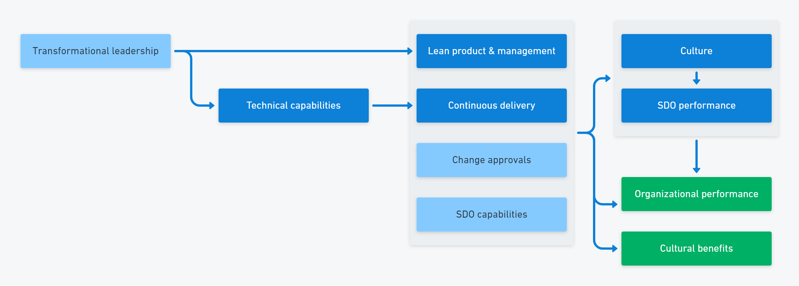

DevOps has brought the topic of organization culture firmly to the table. While culture was always an element of Agile and Lean, the research into DevOps has shown it's just as important as the more technical capabilities.

The DevOps structural equation model has several elements related to people and culture, so it's clear that human issues are an important part of the DevOps picture. The 5 cultural capabilities in the model are:

- Climate for learning
- Westrum organizational culture
- Psychological safety
- Job satisfaction
- Identity

The cultural capabilities drive software delivery and operations performance, which predict successful business outcomes.

At the same time, there have been several HR hot topics across all industries that have trended over the past few years:

- Work to rule (quiet quitting)
- The Great Resignation / Reshuffle
- The 4-day work week
- Hybrid working

As Emily Freeman (author of DevOps for Dummies) [said](https://emilyfreeman.io/#:~:text=I%20believe%20the%20biggest%20challenges%20facing%20tech%20aren%E2%80%99t%20technical%2C%20but%20human):

> The biggest challenges facing tech aren't technical, but human.

So, where should you start when it comes to understanding culture in the context of DevOps?

## The fundamental assumption

In 1960, Douglas McGregor published a book called *The Human Side of Enterprise*. In the book, he described how a fundamental assumption about human behavior results in different management styles.

You either believe that:

- Theory X: People don't want to work and need to be motivated by rewards and punishments
- Theory Y: People are intrinsically motivated to do good work

Many decisions in the workplace involve a trade-off, but these fundamental assumptions are mutually exclusive.

If you believe Theory X, you centralize decision-making, track individual performance, and use rewards and punishments to motivate workers. With Theory Y, you focus on setting clear goals and let people direct their own efforts. When you do this, employees become the organization's most valuable asset.

::hint
When you use external rewards, you often achieve short-term gains. This ultimately fails as a strategy as it reduces internal motivation. Alfie Kohn looked at hundreds of studies and concluded that incentives cause temporary obedience but result in lasting harm to motivation.

Dan Pink expanded on Douglas McGregor's and Alfie Kohn's work in his famous book on motivation, *Drive*, which describes how people need context, autonomy, and purpose to reach high performance levels.
:::

McGregor considered Theory X and Theory Y to be 2 options a manager would choose from after assessing a workplace. You would review the work and the people and decide whether you need an authoritarian style or a more hands-off approach. We've since learned through the study of system failures, that cultures with high trust and low blame are safer than bureaucratic or pathological cultures.

Theory Y is foundational to Lean, Agile, and DevOps and is the underlying assumption of a generative culture.

## Mission command

Although military organizations are traditionally seen as Theory X cultures, modern military units operate using *mission command*. The mission command pattern decentralizes decision-making by providing clear goals. The soldiers with boots on the ground can respond dynamically as events unfold rather than waiting for orders. This is the application of Theory Y culture.

The civilian version of this is called [workplace empowerment](https://en.wikipedia.org/wiki/Empowerment#In_workplace_management), which requires that:

- You share information with everyone
- You create autonomy through boundaries
- You replace hierarchy with self-directed teams

Workplace empowerment combines centralized intent with decentralized execution. In software delivery, this typically involves a shared vision implemented by a cross-functional, self-organizing team.

## Culture predicts safety

When you feel safe to speak up and nobody will be blamed, near-misses and minor faults fuel learning. Each incident results in positive action to make the workplace safer, whether the industry is manufacturing, nuclear power plant, aviation, or software delivery.

If you don't feel safe to report close calls, the unspoken risks accumulate until, very often, a disaster happens.

You don't have to be in a safety-critical industry to benefit from this relationship. The same cultural traits that predict safety are also related to communication, collaboration, innovation, and problem-solving. Culture affects the flow of information, which is critical to all these activities.

> In 2022, we found that the biggest predictor of an organization's application-development security practices was cultural, not technical: high-trust, low-blame cultures focused on performance were significantly more likely to adopt emerging security practices. 
> <cite>The Accelerate State of DevOps Report, 2022</cite>

Theory X management restricts the flow of information and limits who can take action. Managers draw information up and pass decisions back down.

Theory Y leadership leads to strong information flow and prompt action in response. Information flows freely, and decisions are made close to the work.

## Changing culture

Changing team and organization culture is one of the toughest challenges in software delivery. Not even the most complex automation task in your deployment pipeline comes close. You need a clear vision of your intended future state, which needs to be pushed rapidly, firmly, and regularly to ensure the goal remains clear.

You need leaders and managers to understand their role is to enable self-organizing teams that use each team member's talent. You need to move away from systems that centralize information and decision-making and transfer to systems aligned to distributed responsibility.

For example, suppose you use centralized tools to organize tasks and assign them to people. In that case, you need to move to a system that aligns with setting a clear mission without removing the ability of teams to self-organize and respond to dynamic situations. You may need to replace a tool entirely or use the tool in a new way. Your Gantt charts might have to go, but your task tracking app can remain if the team can re-purpose it.

The leadership role in a culture change is to:

- Relentlessly push the desired end state
- Reinforce the role of leaders and managers as enablers
- Ensure teams become self-organized

A healthy culture should also be clear about the importance of the flow of information and must set a standard for communication style.

At Octopus, we follow the Radical Candor approach. This allows us to be direct in our communications but in a framework where we all care about each other. Radical Candor enables individuals to show courage and challenge others when they might otherwise remain silent. This ultimately means we can all do better work without harmful or toxic behavior.

You won't make a dent in culture without a clear, robust, and sustained push. You have to overcome inertia and battle organizational immune responses. Despite the difficulty, the research is conclusive that culture is crucial to high performance.

## Conclusion

When people talk about culture in the context of DevOps, they're referring to Westrum's generative culture, which is based on McGregor's Theory Y assumption. Simply put, you should aim for a clear, shared mission combined with decentralized decision-making.

All modern software delivery methods refer to this concept of empowered teams in different ways.

We refer to this as *modern workplace culture*, yet the ideas are over a hundred years old. Mission command dates back to the 1800s, Theory X and Y are explained in a book from 1960, and Westrum's typology of organizational cultures was designed in the 1980s.

You'll find culture is the toughest nut to crack in DevOps. It's tempting to rely on research and statistics to prove the case for a generative culture. Still, the reality is that cultural change depends on compelling storytelling and creating a compelling vision of what the organization will look like after the transition.

You can read more about DevOps culture [in our DevOps engineer's handbook](https://octopus.com/devops/)

## Further reading

Related information:

- [The DevOps engineer's handbook](https://octopus.com/devops/)
- [A typology of organizational cultures](https://qualitysafety.bmj.com/content/13/suppl_2/ii22)

Culture in DevOps:

- DevOps for Dummies - Emily Freeman

Management and motivation:

- The Human Side of Enterprise - Douglas McGregor
- Punished by Rewards - Alfie Kohn
- Radical Candor - Kim Scott
- Drive - Dan Pink

Culture and failure:

- Understanding Systems Failures - Victor Bignell, Joyce Fortune
- Black Box Thinking - Matthew Syed

Happy deployments!