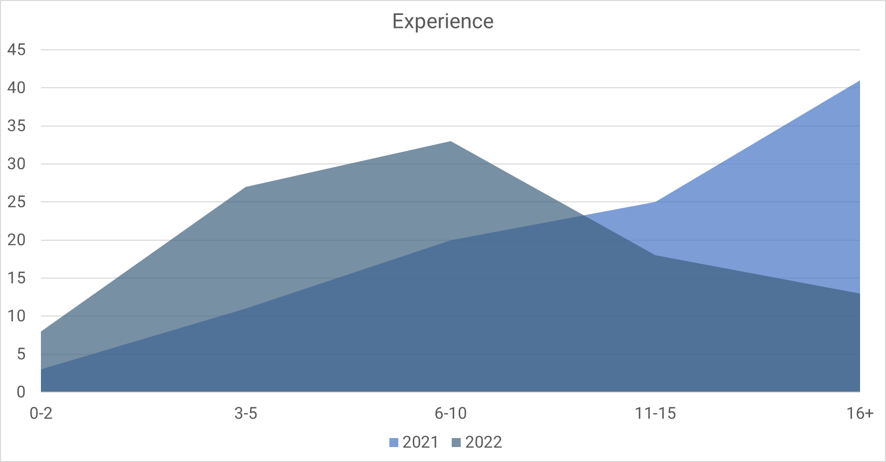
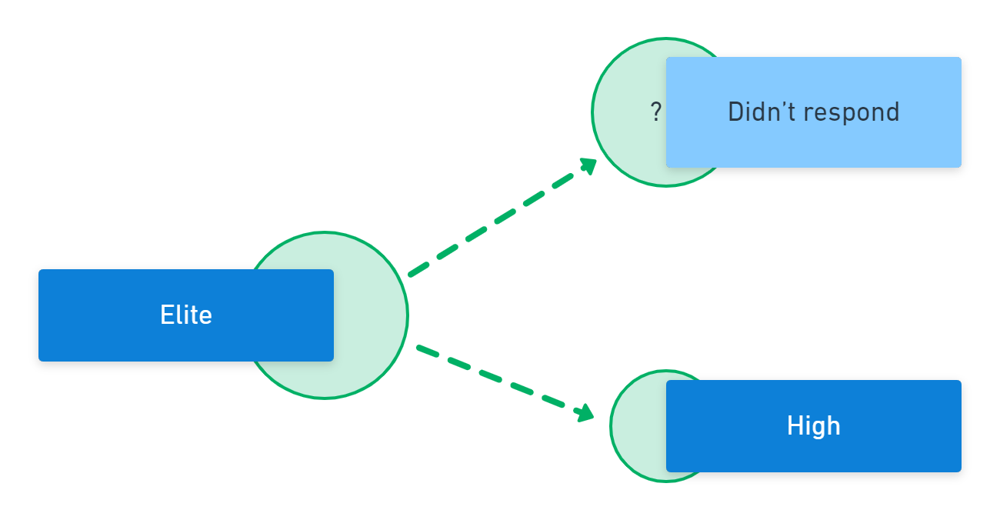
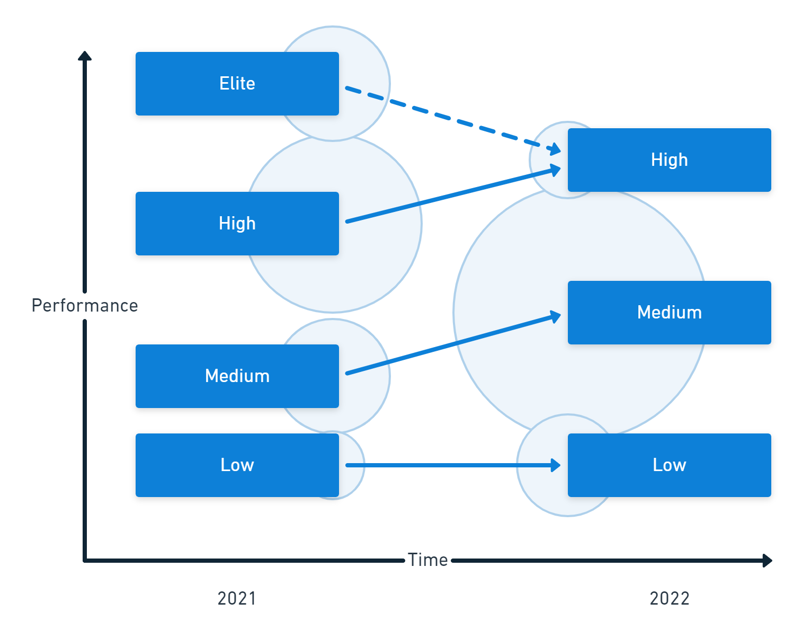

In 2022, the Accelerate State of DevOps Report contained a few surprises. One was a change to the traditional performance clusters. The report also introduced a new way to group organizations using an extra dimension.

This post introduces you to the original performance clusters, explains the changes, and describes how you can use the new groups.

## Previous changes

This isn't the first time something has changed. You'll have seen changes over the last 8 years as the researchers discover new connections or a new direction to explore. Some past changes have had a direct impact on the new clustering technique.

In past DevOps reports, DORA (DevOps Research and Assessment) researchers used 4 key metrics to divide organizations into sets based on performance:

 - Throughput

 1. Deployment frequency
 1. Lead time for changes

 - Stability

 3. Change failure rate
 3. Mean time to recovery

In 2018, DORA added a new metric for *availability* to measure the operational performance of an organization. They later changed this to *reliability*.

You could measure software delivery performance with the original 4 metrics (often called the 4 keys), but using all 5 lets you measure software delivery *and operational* performance, often shortened to *SDO performance*.

Performing well against all 5 measures drives organizational performance. Your organization is more likely to achieve its goals where teams excel in these metrics. Your operational performance enables the relationship between software delivery performance and organizational outcomes.

## Clusters

A cluster is a group of data whose members are more similar to each other than they are to items in another group. This is useful in the State of DevOps report as it allows many organizations to be arranged methodically for comparison.

The research team uses hierarchical clustering to discover the performance groups in the State of DevOps report. This technique doesn't define clusters in advance but lets them emerge from the data.

Researchers test hypotheses using clusters. For example, by grouping organizations based on their deployment frequency, they can see that organizations that deploy more often are more likely to achieve their goals. Each time the researchers repeat the analysis on a different sample, they can test the validity of the hypothesis. This scientific approach is how researchers increase their confidence in the practices that drive performance.

## Software delivery performance clusters

If you've followed the State of DevOps Report for a while, you'll be familiar with the software delivery performance clusters. Each group represents a different level of performance against throughput and stability metrics. This usually results in 4 clusters.

| Performance level | Lead time      | Deployment frequency           | Change failure rate | Mean time to resolve |
|-------------------|----------------|--------------------------------|---------------------|----------------------|
| Elite             | < 1 hour       | Multiple times per day         | 0-15%               | < 1 hour             |
| High              | 1 day - 1 week | Weekly to monthly              | 16-30%              | < 1 day              |
| Medium            | 1-6 months     | Monthly to biannually          | 16-30%              | 1 day - 1 week       |
| Low               | > 6 months     | Fewer than once every 6 months | 16-30%              | > 6 months           |

Organizations can compare their software delivery performance to the clusters based on throughput and stability metrics and identify potential improvement areas.

### How software delivery clusters changed in 2022

The most apparent change to the software delivery clusters in 2022 was that there are only 3 groups rather than 4. The removal of the elite performance group is described in more detail later, but let's first consider the changes to the other clusters, as they're just as surprising.

#### The low-performance group

You'll find the performance of the lowest cluster improved across 3 metrics, with lead time and deployment frequency matching the medium performance group in 2021. The mean time to resolve has also improved by more than 6x. However, the change failure rate has increased.

| Performance level | Lead time      | Deployment frequency           | Change failure rate | Mean time to resolve |
|-------------------|----------------|--------------------------------|---------------------|----------------------|
| 2021 Medium       | **1-6 months** | **Monthly to biannually**      | 16-30%              | 1 day - 1 week       |
| 2021 Low          | > 6 months     | Fewer than once every 6 months | 16-30%              | > 6 months           |
| Low (new)         | 1-6 months     | Monthly to biannually          | **46-60%**          | **1 week - 1 month** |

#### The medium-performance group

The medium-performance group improved against lead time and deployment frequency, matching 2021's high-performance group for these metrics. They also reduced their mean time to resolve and kept the same change failure rates.

| Performance level | Lead time             | Deployment frequency  | Change failure rate | Mean time to resolve |
|-------------------|-----------------------|-----------------------|---------------------|----------------------|
| 2021 High         | 1 day - 1 week        | **Weekly to monthly** | **16-30%**          | < 1 day              |
| 2021 Medium       | 1-6 months            | Monthly to biannually | **16-30%**          | **1 day - 1 week**   |
| Medium (new)      | **Weekly to monthly** | Weekly to monthly     | 16-30%              | 1 day - 1 week       |

#### The high-performance group

The high-performance group merges the performance of 2021's high and elite clusters.

| Performance level | Lead time          | Deployment frequency       | Change failure rate | Mean time to resolve |
|-------------------|--------------------|----------------------------|---------------------|----------------------|
| 2021 Elite        | < 1 hour           | **Multiple times per day** | **0-15%**           | < 1 hour             |
| 2021 High         | **1 day - 1 week** | Weekly to monthly          | 16-30%              | **< 1 day**          |
| High (new)        | 1 day - 1 week     | Multiple times per day     | 0-15%               | < 1 day              |

#### The elite performance group

Only 3 clusters emerged in 2022, so there's no elite-performance group in 2022. There are 2 explanations for this:

1. The elite respondents in 2022 were absorbed into the improved high-performance cluster.
2. The demographic profile is different in 2022 compared to previous years

In previous years, many respondents had been in software delivery for over 10 years. In 2022 the proportion of respondents with more than a decade of experience fell by half. The change seems less surprising as most respondents have less experience than those answering the surveys in prior years.

While you can see the clear change in demographics, it's not known whether this makes the sample more or less representative of the software development industry. When reviewing your team's performance level, you can compare your team's experience with survey respondents to see whether you have access to highly experienced developers who can make a big impact.

The demographic change and subsequent disappearance of the elite cluster suggest that experience drives performance. However, the link between specific capabilities and outcomes remains consistent each year.

Removing the elite performance category doesn't mean these organizations gave up software development. Different people respond to the survey each year, and there was an unusual shift in the type of respondents this time. This year's respondents had less experience overall, so it might not be surprising that they performed less well against the throughput and stability metrics.

Instead of disrupting the annual study of DevOps, the demographic change in respondents has provided a unique opportunity to discover new directions for exploration.

### Software delivery performance summary

In the chart below, you find a comparison of 2021 and 2022. The vertical position of each cluster indicates the level of performance, and the circles show the size of each group.

The changes in performance and distribution mean you could consider these as 3 new performance clusters rather than an evolution of previous ones. Further research is needed to understand these changes, but it's likely to relate to the demographic shift in respondents.

## The SDO performance clusters

As well as changes to the software delivery groups, DORA added a new breakdown that took operational performance into account. The new clusters for SDO performance use all 5 metrics for throughput, stability, and operational performance:

 - Throughput

  1. Deployment frequency
  1. Lead time for changes

 - Stability

  3. Change failure rate
  3. Mean time to recovery

- Operational performance

  5. Reliability

The reliability metric captures how often the team achieves its reliability targets.

The labels given to groups suggest a scenario where you might expect the associated performance against the metrics. For example, the "starting" cluster exhibits what you might expect from a team in the early stages of product or feature development. This group has modest performance against each dimension. In the early stages, the team may be focused more on innovation than reliability.

Here are the SDO performance clusters, with low performance highlighted:

| Cluster  | Lead time        | Deployment frequency       | Failure rate | MTTR           | Reliability   |
|----------|------------------|----------------------------|--------------|----------------|---------------|
| Starting | 1 week - 1 month | Weekly or monthly          | **31-45%**   | 1-7 days       | **Sometimes** |
| Flowing  | < 1 day          | On demand                  | 0-15%        | < 1 hour       | Usually       |
| Slowing  | 1 week - 1 month | Weekly or monthly          | 0-15%        | < 1 day        | Usually       |
| Retiring | **1-6 months**   | **Monthly or bi-annually** | **46-60%**   | **1-6 months** | Usually       |

These groups are more descriptive than the software delivery performance clusters. Rather than striving for high performance across all products and teams, an organization can take a more balanced approach. You can plan for different performance levels from a team working on your core product and one working on a new product.

This approach isn't without its hazards. Many teams remain in the starting group permanently, never resolving the reliability issues that would unlock the positive impact software delivery performance can have on organization-wide achievements. You may have worked on teams that resembled the retiring cluster despite actively developing a software product. The performance characteristics of the retiring cluster would be present in a bureaucratic organization where the operations team acts as gatekeepers, preventing changes from moving through the system to keep things stable.

You can view the cluster names as best-fit explanations for deliberate performance choices. For example, you might choose to give up some reliability to encourage risk-taking and innovation when developing a new idea. If you don't make intentional choices, you risk inventing a narrative to explain poor performance. Future research may test the accuracy of these cluster names.

The most practical application of the new clusters is to use them to focus your efforts on your core software systems. The systems you sell and the line-of-business applications that give you a competitive advantage are the ones to bring into a flowing state first. Never classify these systems as *slowing*, and only designate a system as *retiring* when you have an active plan for its withdrawal or replacement.

Teams in the flowing state more commonly use the capabilities of the DevOps structural equation model, such as:

- [Deployment automation](https://octopus.com/features)
- Loosely coupled architectures
- [Continuous Delivery](https://octopus.com/devops/continuous-delivery/)
- Version control
- Flexible work arrangements

You can read more about [Continuous Delivery capabilities](https://octopus.com/devops/continuous-delivery/#continuous-delivery-capabilities) in the [DevOps engineer's handbook](https://octopus.com/devops/).

While some organizations achieve adequate performance without achieving the flowing state of SDO performance, they do so at a higher cost with increased burnout, more unplanned work, and lower change rates.

## Conclusion

The original software delivery performance clusters remain critical in your assessment of performance in your organization. Operational performance unlocks the benefits of high performance, extending their impact to the organizational level. The new SDO performance clusters attempt to demonstrate the importance of reliability to software delivery but may be misleading due to the attempt to assign non-judgmental labels.

The disappearance of the elite performance cluster is likely related to demographic changes. Additionally, this may have led us to discover that a team needs experienced developers to achieve the highest performance levels.

You must consolidate these industry-wide insights with a local measurement strategy to ensure your continuous improvement efforts are led by their actual impact on your organization. The State of DevOps report is a source of inspiration for specific and measurable changes you make to your software delivery process.

## Further reading

- [The 2022 State of DevOps Report](https://cloud.google.com/devops/state-of-devops/)
- [The DevOps engineer's handbook](https://octopus.com/devops/)
- [White Paper: Measuring Continuous Delivery and DevOps](https://octopus.com/whitepapers/lv-measuring-continuous-delivery-and-devops)

Happy deployments!
