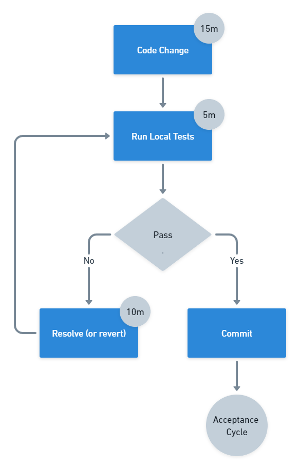

When someone mentions lead times in software delivery, it often isn't clear whether they mean the definition of lead times from Lean Software Development, the one from DevOps, or something else entirely. Why are there so many definitions of lead time and how do you put them to use?

## Lead time definitions

The [DevOps definition of lead time](https://octopus.com/devops/metrics/) is the time between a change being committed into version control, and the change being deployed to the production environment. This definition is more narrow than the Lean definition of lead time.

In Lean Software Development, created by Mary and Tom Poppendieck based on the Lean manufacturing movement, lead time is measured from when a requirement is discovered, and the fulfillment of that requirement. The Lean movement is based on the Toyota Production System, which defined lead time as the time between a customer placing an order and receiving their car.

## Lead time is a customer measurement

What all of these lead times have in common is that they represent a customer measurement. The reason they differ is the customer is different. Toyota was measuring the system from the perspective of a car buyer, the Poppendiecks were measuring the software development system as the business sees it, and DevOps measures the deployment pipeline from the perspective of the developer as the customer.

The key to successful lead time measurement is that it represents how a customer views the elapsed time. If you run a coffee shop, you might measure the time between a customer placing an order and being handed their coffee. However, this doesn't capture the lead time of the whole system, which should start from when the customer joins the queue. It is important to capture the customer's perception of time.

## Cycle times

When you measure the same system from a perspective other than the customer, you are collecting the cycle time. For example, the cycle time for software delivery starts when a work item is picked up and closes when the work is complete. In the car industry, it would time the car from the start to the end of the production line.

Customers don't care about cycle times. If you were waiting for months for your car to be delivered, you would not be consoled by how quickly the factory put it together. You might worry about where the finished car has been sitting for the past six months.

IMAGE TO SHOW THE DIFFERENT MEASUREMENTS OF TIME IN SOFTWARE DELIVERY

## All measurements are useful

Lead time is valuable because it represents the customer's perception. Identifying your customer and tracking lead times as they see them will ensure any improvements you make impact their experience. If you make an improvement that doesn't reduce the lead time, you have optimized the wrong part of your system. In some cases, reducing the time for the wrong part of the system can even increase the overall lead time if it adds additional stress to the constraint.

:::hint
A _constraint_ is a bottleneck that limits the speed of flow for the whole system. Resolving a constraint causes the bottleneck to move, so the process of identifying and resolving constraints is continuous. Software delivery represents a constraint to most organizations as technology is such a key competitive advantage.
:::

The Theory of Constraints, created by Eli Goldratt, tells us that there is only one constraint in the system. Optimizing anywhere other than the constraint will fail to improve the performance of the whole system.

However, while lead time is vital to ensure your improvement efforts are worthwhile, you may need other measurements to help you find the constraint. Cycle times and other part-system timers will help you work out where optimization is likely to reduce the overall lead time.

## Common software delivery constraints

There are some common constraints in software delivery, which you should look at to assess whether they are increasing your lead time:

- Working in large batches
- Pull request approval queues
- Having too many branches, or branches that exist for too long
- Manual testing
- Policy constraints, such as unnecessary approvals

These constraints are reflected in the Continuous Delivery commit cycle, which has the following timings:

- Commits every 15 minutes
- Initial build feedback in 5 minutes
- Any failures fixed or the change reverted after 10 minutes

...

Happy deployments!