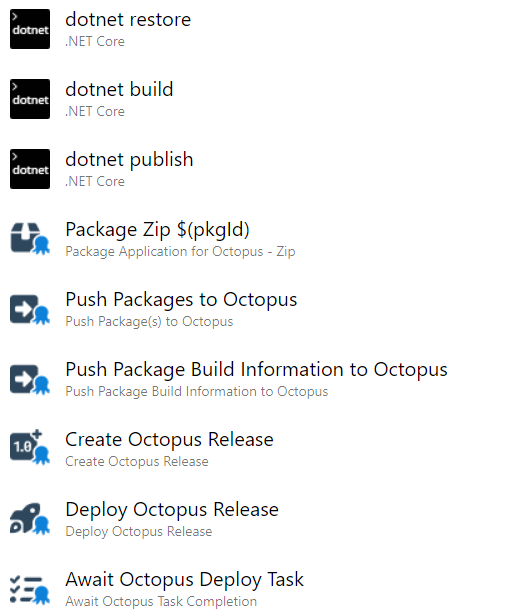
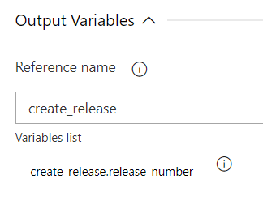
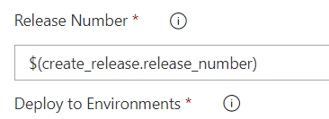
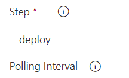

In this post, you learn what's new in v6 of the Octopus Azure DevOps plugin, understand some of the decisions that went in to the updates, and get a quick tour of the updated plugin.

The updates include:

- Octopus CLI is no longer *required*, and by extension, neither is the .NET Framework
- Octopus 2022.3+ is now a dependency (this is only for the v6 steps, not the earlier versions)
- There's a new step for running a Runbook

If you read about our [our third iteration of GitHub Actions for Octopus Deploy](https://octopus.com/blog/github-actions-for-octopus-deploy-v3), some of these updates will sound familiar.

## Octopus CLI is no longer required

Removing the dependency on the Octopus CLI is the biggest architectural change to v6 of the Octopus Azure DevOps plugin. 

Our steps no longer use the Octopus CLI to perform work. Instead, they interact with the Octopus API directly from TypeScript. This means your pipelines start and execute far quicker than before. 

It also means v6 of the steps has a dependency on Octopus Server 2022.3+, as it introduced the [Executions API](https://octopus.com/blog/faster-deployments-with-the-executions-api).

:::hint
You can still use the Octopus CLI, but you're no longer required to include the **Octopus CLI Installer** in your pipeline if you only need to use our other steps. 

The **Octopus CLI Installer** is still available for you to use if you have a script of your own that needs it. See more in the next section.
:::

We achieved a longstanding goal of full NodeJS support, eliminating the dependency on the .NET Framework. This removes compatibility issues caused by the deprecation of various .NET Framework versions, which have plagued customers in the past. The transition to NodeJS means smoother and more reliable software releases.


## Octopus CLI Installer now installs the Go-based CLI

We recently moved our CLI implementation from C# to Go (for more information on why, please see [Building Octopus CLI vNext](https://octopus.com/blog/building-octopus-cli-vnext)). The Octopus CLI (`octo`) will remain supported until mid-2023. 

The **Octopus CLI Installer** v5 will continue to install the Octopus CLI (`octo`). If you have existing pipelines using the C#-based CLI, you can continue to use v5.

**Octopus CLI Installer** v6 (or greater) will only install the new Go-based CLI (`octopus`). If you're writing new pipelines, we recommend using v6. The Go-based CLI (`octopus`) has new features and improvements missing from the C#-based CLI, however, there are some minor differences. If necessary, you can use these CLIs side-by-side. That is, you could include both v5 and v6 of the step in the same pipeline to get both CLIs.

We did not update **Invoke Octopus CLI command** step to v6. The design of the new Go CLI leans into scripting concepts, like chaining inputs/outputs, and you can use it directly in script steps, so we made the decision not to update the **Invoke Octopus CLI command** step. We recommend using a script step in your pipeline and call `octopus` directly.

## Deployments and runbook runs

In earlier versions of the plugin, the **Create Release** step supported the `deploy-to` parameter from the Octopus CLI (`octo`). Unfortunately, this brought with it all the other deployment-related concerns that the Octopus CLI (`octo`) supports. The switches for these additional concerns, though, aren't directly available. You had to know which switches you needed and enter them directly into an "Additional arguments", making the step complex and confusing.

A key design consideration for the [Executions API](https://www.octopus.com/blog/faster-deployments-with-the-executions-api) was to simplify things and formalize the requirements/inputs for specific actions. The v6 updates to the Azure DevOps steps reflect these changes directly and now have explicit fields for all supported settings.

Key things to note:

- **Create Octopus Release** just creates a release
- **Deploy Octopus Release** just queues a deployment (as does the new **Deploy Octopus Release to Tenants** step, which we'll talk about more momentarily)
- The new **Run Octopus Runbook** step queues a run
- You can use the new **Await Octopus Task Completion** if you want to wait for tasks that you queued for deployments or runbook runs

:::hint 
Tenanted deployments have different semantics to "standard" deployments. Primarily, they support a different multiplicity on the environments you can deploy to (standard can deploy to multiple environments, tenanted can only deploy to a single environment). To make this clear, we split them into separate steps, with clear names on the fields to make it clearer what each step supports. Again, this also directly reflects the way the Executions API functions.
:::

:::warning 
While this is the initial version of some of these steps, we decided to release them all as v6 to make it easier to reason about them as a matching set. The versions may diverge again over time as we move forward and make patches and updates to the steps individually.
:::

## Chaining is a built-in feature

A number of the steps now produce outputs, to enable chaining. The outputs are as follows:

| Step                                | Outputs                            | Description                                                                                                                                                                                                                                                                                                                                                                                                          |
| :---------------------------------- | :--------------------------------- | :------------------------------------------------------------------------------------------------------------------------------------------------------------------------------------------------------------------------------------------------------------------------------------------------------------------------------------------------------------------------------------------------------------------- |
| `Pack` (both Zip and NuGet)         | `package_file_path`                | The full path to the package that was created                                                                                                                                                                                                                                                                                                                                                                        |
|                                     | `package_filename`                 | Just the filename of the package that was created                                                                                                                                                                                                                                                                                                                                                                    |
| `Create Octopus Release`            | `release_number`                   | The release number (version) that was created                                                                                                                                                                                                                                                                                                                                                                        |
| `Deploy Octopus Release`            | `server_tasks`                     | JSON array of objects with `serverTaskId` and `environmentName`                                                                                                                                                                                                                                                                                                                                                      |
| `Deploy Octopus Release to Tenants` | `server_tasks`                     | JSON array of objects with `serverTaskId` and `tenantName`                                                                                                                                                                                                                                                                                                                                                           |
| `Run Octopus Runbook`               | `server_tasks`                     | JSON array of objects with `serverTaskId`, `environmentName`, and `tenantName`                                                                                                                                                                                                                                                                                                                                       |
| `Await Octopus Deploy Task`         | `completed_successfully`           | Whether the task(s) completed successfully or not                                                                                                                                                                                                                                                                                                                                                                    |
|                                     | `server_task_results`              | JSON representation of the tasks and their success. Schema: { "serverTaskId": <task id>, "tenantName": <tenant name>, "environmentName": <environment name>, "successful": <true/false> }.<br />This is provided for scenarios like error handling. E.g. if you have a subsequent step that conditionally ran on failure of this step, it could use the JSON for things like logging, sending messages to Slack, etc |
|                                     | `<context>.completed_successfully` | Contextual success flag for each task using the name of the environment or tenant, e.g `Production.completed_successfully` or `UAT_Tenant_A.completed_successfully`. Spaces in names are replaced with underscores                                                                                                                                                                                                   |

We show you in more detail how to use the outputs in the examples below.

## Other changes

### Pack has been split

We decided to separate the Zip and NuGet package creation steps, for similar reasons to those mentioned above. Having the 2 in a single step leads to a more complex and confusing list of configuration fields.

### No more selectors

Except for the Octopus service connection selector, we removed all selectors in the v6 versions of the steps. The selectors require Azure DevOps itself to connect to the Octopus instance. For customers with a self-hosted instance of Octopus behind a firewall, this is confusing and looks like things aren't going to work, but if they just type a name into the field it may work at runtime (that is, it may work when using a self-hosted build agent, if that agent is behind the firewall and can connect to Octopus).

This felt overly complex for the potential little gain for some customers, so we reverted all fields to strings.

### Create Release project name

We noticed an inconsistency in the naming of the **Create Release** field while working on these steps. You don't notice this in the classic view, but it becomes obvious when you're using YAML. The **Create Release** step used `ProjectName`, but all the other steps use `Project` as the name of this field. 

We decided that while it's a slight inconvenience for an upgrade, it makes life easier in the future to rename the field on the **Create Release** step.

## Migrating to v6

No existing step versions have changed. You shouldn't encounter any changed behavior on upgrade of the plugin. 

You will encounter some changes when migrating from older versions to v6,though. We tried to minimize this while balancing against consistency and ease of use going forward.

In the classic editor, if you haven't saved the pipeline, you haven't lost any data. So, if you switch to v6 and lose something or aren't happy with the new settings, you can refresh the page to reload the original version and data. In YAML, you just revert the text changes to go back.

### Fields use names not IDs

Anyone who used the classic view for earlier steps and then looked at their YAML representation might notice some fields contain names and some contain IDs. Some can even be either, which is a side-effect of the selectors. If you select a value from the list, it will contain an ID if you type directly into the same field, although you'll probably enter a name (as you would likely do in YAML).

The Executions API only supports names, not IDs, to remove the need for lots of lookups. As a result, the steps also only support names now.

If you're upgrading an earlier version of a step to v6 in a classic pipeline and used a selector in the past, you'll see an ID appear in the field, and you have to edit the value to be the name.

### Metadata vs Build Information

When the **Build Information** feature was first released, it was called **Package Metadata**. We kept some remnants of that for backward compatibility. This is visible today in the YAML steps, where you use `OctopusMetadata` as the step identifier. 

From v6 forward, the YAML ID for this step will be `OctopusBuildInformation`. (`OctopusMetadata` will continue to work for v4 and v5, so existing pipelines should not be impacted).

In the classic editor, you won't be able to select v6 from the dropdown on an existing v4/v5 step. The plugin now sees them as separate and you have to add a new **Build Information** step (the one that doesn't have `legacy` in the title/description) and copy the values across. 

We apologize for any inconvenience this causes as we balance it against ease of understanding moving forward, especially given the prevalence of YAML pipelines.

### Additional arguments

In prior versions of the steps, this field served as a fallback option for inputting arguments that weren't represented by specific fields. With the transition away from the CLI, this field is obsolete and has been deprecated. Despite its obsolescence, the decision was made to retain the field on steps where it was likely used to minimize disruption.

For key things, like packages during release creation and variables when deploying a release, we tried our best to parse the existing values and union the data into that provided by the new fields for these values. You'll see a warning in the logs to let you know this has happened and we recommend you move the values into the new fields at your earliest convenience.

## Sample pipeline walkthrough

In this walkthrough, we use a simple ASP.NET web application as an example. At a high level the pipelines is:

- "Packaging" using the .NET tooling
- Using an Octopus Pack step to get the output into a package file that Octopus can work with
- Pushing that package file to Octopus, along with some build information
- Creating a release using that package
- Queueing deployments for that release
- Waiting for those queued tasks to complete

For brevity, we include the .NET build/package steps in the YAML version of the pipeline, but skip screenshots for the same steps in classic mode. 

Let's start with the complete YAML and then we'll mention the parts of interest.

``` yaml
steps:
- task: DotNetCoreCLI@2
  displayName: 'dotnet restore'
  inputs:
    command: restore
    projects: 'source'

- task: DotNetCoreCLI@2
  displayName: 'dotnet build'
  inputs:
    command: build
    projects: 'source'
    arguments: '--configuration Release'

- task: DotNetCoreCLI@2
  displayName: 'dotnet publish'
  inputs:
    command: publish
    projects: 'source'
    arguments: '--configuration Release --output $(build.artifactstagingdirectory)'
    publishWebProjects: false
    zipAfterPublish: false
    modifyOutputPath: false

- task: OctopusPackZip@6
  name: pkg
  displayName: 'Package Zip'
  inputs:
    PackageId: $(pkgId)
    PackageVersion: '$(Build.BuildNumber)'
    SourcePath: '$(build.artifactstagingdirectory)'
    OutputPath: drop

- task: OctopusPush@6
  displayName: 'Push Packages to Octopus'
  inputs:
    OctoConnectedServiceName: $(connectionName)
    Space: $(spaceName)
    Packages: '$(pkg.package_file_path)'

- task: OctopusBuildInformation@6
  displayName: 'Push Package Build Information to Octopus'
  inputs:
    OctoConnectedServiceName: $(connectionName)
    Space: $(spaceName)
    PackageId: $(pkgId)
    PackageVersion: '$(Build.BuildNumber)'

- task: OctopusCreateRelease@6
  name: create_release
  displayName: 'Create Octopus Release'
  inputs:
    OctoConnectedServiceName: $(connectionName)
    Space: $(spaceName)
    Project: $(octoProject)
    Packages: '$(pkgId):$(Build.BuildNumber)'

- task: OctopusDeployRelease@6
  name: deploy
  displayName: 'Deploy Octopus Release'
  inputs:
    OctoConnectedServiceName: $(connectionName)
    Space: $(spaceName)
    Project: $(octoProject)
    ReleaseNumber: '$(create_release.release_number)'
    Environments: |
     Dev
     Staging

- task: OctopusAwaitTask@6
  displayName: 'Await Octopus Deploy Task'
  inputs:
    OctoConnectedServiceName: $(connectionName)
    Space: $(spaceName)
    Step: deploy
```

Key technical things to note are:

- Steps you want to reference output variables from must have a `name` defined, for example, `name: create_release`. You then use that name to reference the variable in later steps. For example, `ReleaseNumber: '$(create_release.release_number)'`
- The Await step understands the structure of the output variables emitted by our deploy/runbook run steps and handles the variable binding internally. Therefore, you only need to provide it with the name of the deploy/runbook run step, not a variable binding
- Inputs with pluralized names support multiple values, each entered as a separate line (see `Environments` in the example)

:::warning 
Use caution when naming your variables. We learned the hard way that having a variable named `packageId` declared has special meaning to `dotnet restore`.
:::

### Classic pipeline

Below is a view of the same process modeled in a classic pipeline.



For brevity, we'll only dig into vital details. They each contain fields that align with the inputs illustrated in the YAML pipeline. With the classic pipelines, it's important to understand how the output variable chaining works. On the steps that support output variables, you find the following panel at the bottom of the step.



This is Azure DevOps detecting that we declared the step supports output variables and providing a way to connect the steps together. It's asking for the equivalent to the `name` property in YAML, a unique name in the pipeline for this step. You then use that name in later steps in variables bindings, in the same way you reference them in YAML.



As noted in the YAML example, the Await step has internal knowledge of the output variables structure from the deploy/runbook run steps, so you use the step reference name.



## Conclusion

The new steps and updates to the Octopus Azure DevOps plugin improve the automation of deployment processes, task execution, and the creation of packages. This gives you more consistency and a more seamless user experience. 

To help if you use YAML pipelines, we also updated the marketplace listing with detailed information on all input and output variables.

Our goal with this release is to empower you with robust and user-friendly steps to manage your deployments, and we believe it will significantly enhance your experience.

Happy deployments!
