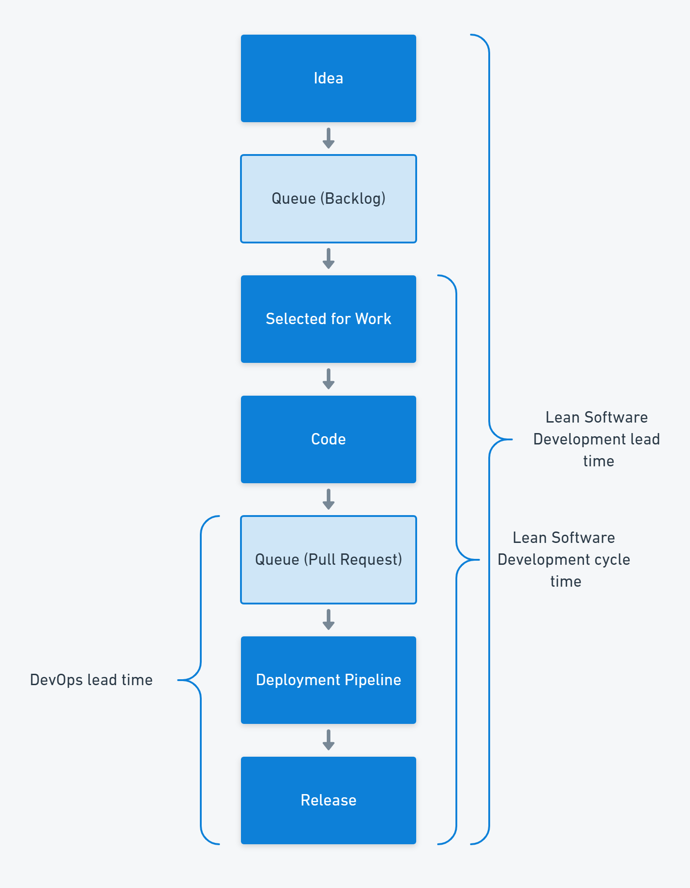
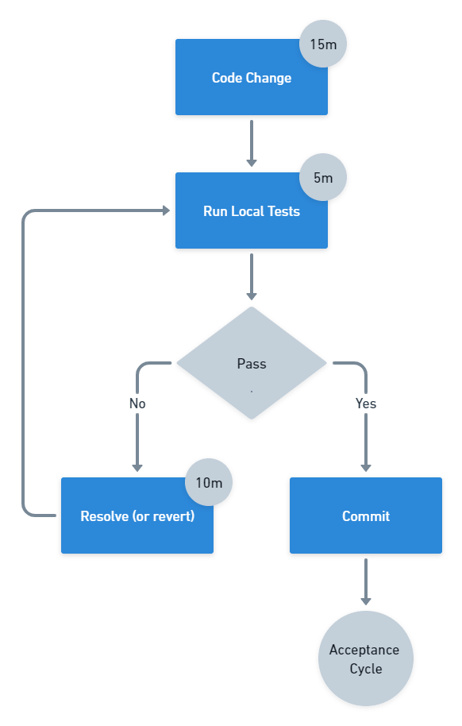

When someone mentions lead times in software delivery, it's often unclear whether they mean the definition of lead times from Lean Software Development, the one from DevOps, or something else entirely. 

In this post, I look at why there are so many definitions of lead time and how you can put them to use.

## Lead time definitions

The [DevOps definition of lead time for changes](https://octopus.com/devops/metrics/) is the time between a developer committing code into version control and someone deploying that change to the production environment. This definition covers a smaller part of the software delivery process than the Lean definition.

Mary and Tom Poppendieck created Lean Software Development based on the lean manufacturing movement, and they measured lead time from when you discover a requirement to when someone fulfills that requirement.

The Lean movement, based on the Toyota Production System, defines lead time as the time between a customer placing an order and receiving their car.

## Lead time is a customer measurement

All these lead times represent a customer measurement. But they differ because the customer is different. 

- Toyota measured the system from the perspective of a car buyer
- The Poppendiecks measured the software development system as the users see it
- DevOps measures the deployment pipeline from the perspective of the developer as the customer

| Lead time                 | Customer  | Start       | End                   |
|---------------------------|-----------|-------------|-----------------------|
| Toyota Production System  | Car Buyer | Order       | Delivery              |
| Lean Software Development | User      | Requirement | Working software      |
| DevOps                    | Developer | Code commit | Production deployment |

The key to successful lead time measurement is representing how the customer views the elapsed time.

:::hint 
If you run a coffee shop, you might measure the time between a customer placing an order and handing them their coffee. You might consider a 2-minute lead time to be good as your competitors take 3 minutes between the order and its fulfillment.

However, your competitor is using a whole-system lead time, which starts when the customer joins the queue. They added another barista and reduced the queue from 15 minutes to 7. Their customers get coffee in 10 minutes, but your customers have to wait 17 minutes (and you're losing customers who leave when they see the queue).

Unless your lead time represents the customer's complete view of the system, you're likely to optimize the wrong things. 
:::

## Cycle times

When you measure a part of the system, you're collecting a *cycle time*. In the car industry, it's useful to track how long it takes for a car to move along the production line. In software delivery, it's common to collect the cycle time from when a work item starts to when it's closed. This indicates the performance of software delivery without the varying wait times that can occur before work begins.

As the coffee shop example shows, your customer doesn't care about cycle times. While you can use cycle times to measure different parts of the system to identify bottlenecks constraining the flow of work, you should always keep the complete system in mind.

In software delivery, it's common to find a large proportion of elapsed time is due to work waiting in a queue. For example, a requirement that would take a few days to deliver might sit in a backlog for months, or a pull request may wait for approval for hours or even days. You can identify these delays by subdividing your system and measuring each part.

Lead times measure the real output of a system, but cycle times help you find the system's constraint.

## All measurements are useful

Lead time is valuable because it represents the customer's perception. Identifying your customer and tracking lead times as they see them ensures any improvements you make impact their experience. 

If you make an improvement that doesn't reduce the lead time, you've optimized the wrong part of your system. In some cases, reducing the time for the wrong part of the system can even increase the overall lead time if it adds additional stress at the constraint.

:::hint
A _constraint_ is a bottleneck that limits the speed of flow for the whole system. Resolving a constraint causes the bottleneck to move, so the process of identifying and resolving constraints is continuous.

Software delivery represents a constraint to most organizations as technology is such a key competitive advantage. However, this isn't a granular enough identification to make improvements. You need to look at your software delivery value stream and make improvements where they increase the flow of work in the system. 
:::

The Theory of Constraints, created by Eli Goldratt, tells us there's only one constraint in a system. Optimizing anywhere other than the constraint will fail to improve the performance of the whole system.

Cycle times and other part-system timers help you work out where optimization is likely to reduce the overall lead time, so you can use cycle times and lead times together to assess the improvement.

## Common software delivery constraints

There are some common constraints in software delivery:

- Working in large batches
- Pull request approval queues
- Having too many branches, or branches that exist for too long
- Manual testing
- Policy constraints, such as unnecessary approvals
- Hand-offs between functional silos (such as development, testing, and operations)

Some of these constraints are reflected in the [Continuous Delivery commit cycle](https://octopus.com/devops/continuous-delivery/how-to-start-using-continuous-delivery/#key-practice-continuous-integration), which has the following recommended timings:

- Commits every 15 minutes
- Initial build and test feedback in 5 minutes
- Any failures fixed or the change reverted after 10 minutes

## Conclusion

The different definitions of lead time reflect various customer perceptions of parts of the same process. You can use as many measurements of lead and cycle times as you need to find and resolve constraints in your system. You can track the lead times over the long term and use cycle times temporarily as part of a specific improvement exercise.

When you improve or optimize, lead time can help you understand if you're positively impacting the whole system.

Happy deployments!