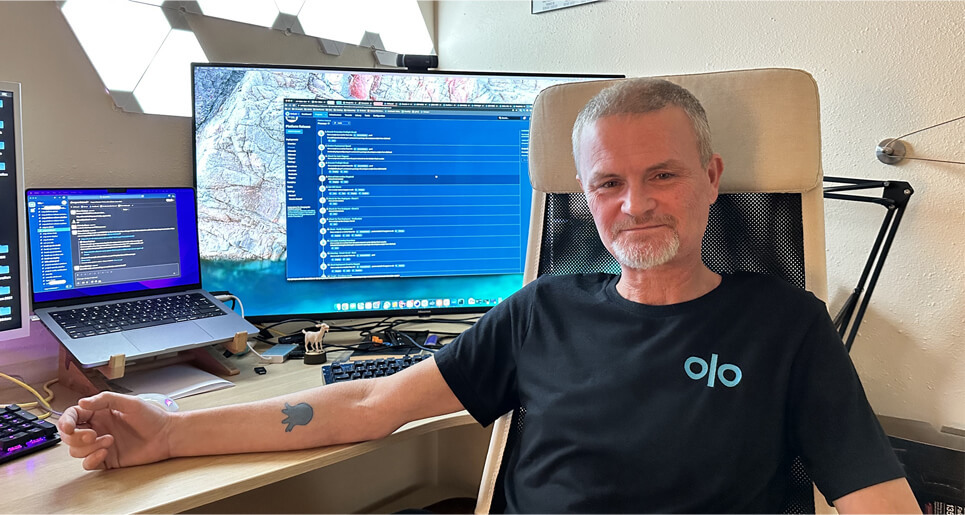

This post opens our Inside DevOps series, where we share lessons learned from those on the frontlines of DevOps. 

[Jason Dunnivant](https://www.linkedin.com/in/jasondunnivant/), Release Engineer at [Olo](https://www.olo.com/), features first. Olo is a leading open SaaS platform for restaurants that enables hospitality at every touchpoint.

## Jason, I reached out to you to start our blog series as I'm fascinated by your dedication to DevOps. You even have a tattoo of Octopus Deploy!

**Jason Dunnivant**: As you can see, I am a true fan of your product.

*Jason Dunnivant and his Octopus Deploy tattoo*

## What is DevOps to you? How do you define it?

**Jason Dunnivant**: To me, DevOps is an approach to automating as many things as possible, so people don’t need to do them manually. With a DevOps mindset, we can relieve our software engineers from mundane tasks, such as provisioning infrastructure, and let them focus on what they love to do – developing software.

## How did your DevOps journey start?

**Jason Dunnivant**: My career path is probably not typical for a software person. I was in the military and have a degree in psychology. I was working at a gas station, working on my degree, when I received an offer to work in tech support. I then moved to a network administration role. My manager told me I was a smart guy, so I started learning how to code and became a developer. For the last few years, I’ve been the release engineer for Olo.

## Was your degree in psychology helpful in any way?

**Jason Dunnivant**: It helped me be able to step into someone else’s shoes, which was very important during my tech support times. That skill remains relevant in my current job as well.

## What’s the most challenging part of DevOps?

**Jason Dunnivant**: I think the most challenging part of DevOps is that it covers so many aspects of software operations, and people come to you with so many different requests. I found, however, that the best approach is to stay open-minded and not be afraid to try things that haven’t been done before.

## And what’s the most rewarding part of your job?

**Jason Dunnivant**: Getting to help people. Developers just want to develop, and I can make their lives easier.

## What are some DevOps best practices you or your organization have implemented?

**Jason Dunnivant**: There are many best practices that our company has implemented. One is using microservices so that we can release faster and independently from other components of our software platform. We integrate our system with over 300 other software technologies, so this approach lets us get software into production faster. We release to production twice a day or even more often, and we strive to have ‘single Jira ticket deployments’, where we push fixes to production so quickly there’s only a single initial ticket to close. This is in big part possible because we use Octopus. Our deployment process has over 100 steps, yet we can deploy it in around 20 minutes, so it becomes pretty much a non-event for us – it’s such a well-orchestrated deployment process that no one is stressing about it. 

Another best practice is involving the development team in the deployment process. We accomplish this by using Configuration as Code (CAC) in Octopus. The dev team uses an environment they’re familiar with to add and modify deployment steps, which then go through the review and approval process with my team. This way, we can scale and deliver features to our clients faster while ensuring the separation of duties required by The Sarbanes-Oxley Act (SOX).

## What advice would you give folks starting their DevOps journey?

**Jason Dunnivant**: Get your hands dirty – just create your Azure environment, download Octopus, and start playing with it.

## What DevOps book do you recommend reading?

**Jason Dunnivant**: I actually haven't read that much recently, but I learn something new every day by working with my teammates, so I learn through osmosis. But one book, most helpful to me was [*Cloud Native DevOps with Kubernetes: Building, Deploying, and Scaling Modern Applications in the Cloud*](https://www.amazon.com/Cloud-Native-DevOps-Kubernetes-Applications/dp/1492040762), by Justin Domingus and John Arundel.

## Thank you for that recommendation; we’ll make sure to add it to our [DevOps reading list](https://octopus.com/devops/reading-list/). Last question: what’s one thing about you that might surprise us?

**Jason Dunnivant**: A fun fact about me is that I’m a nuisance alligator trapper with The Florida Fish and Wildlife Conservation Commission.

## Oh wow – it will be hard to beat that one! Jason, thank you again for spending time with me, and happy deployments!

**Jason Dunnivant**: Anytime!

:::hint
If you’d like to feature in our series, Inside DevOps, please reach out to [Joanna on LinkedIn](https://www.linkedin.com/in/joannawyganowska/) to set up time for a quick chat.
:::
