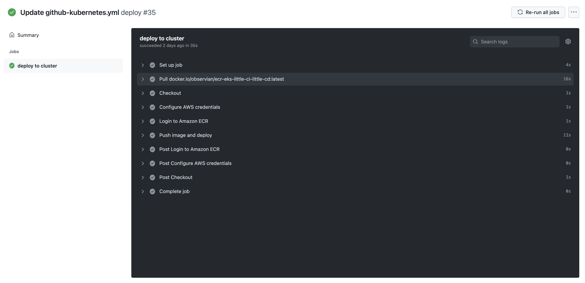

In a DevOps process, a CI server, like GitHub Actions, builds a code repository and pushes the software artifact to a container registry, ready for deployment. Before GitHub Actions was introduced, a third-party tool like Jenkins had to execute DevOps operations on the GitHub repository. 

GitHub Actions introduces DevOps operations inside your GitHub repository, making it easier for you to implement DevOps processes. 

In this post, you build a Docker image in a GitHub Actions workflow, publish the image to Amazon Elastic Container Registry (ECR), and deploy it to Amazon Elastic Kubernetes Service (EKS). 

## Getting started

To follow along with this post, you need:

- An Amazon Web Services (AWS) account 
- A GitHub account

This post uses the [Octopus underwater app repository](https://github.com/OctopusSamples/octopus-underwater-app). You can fork the repository and follow along. Alternatively, the github-deployment branch contains the template files you need to complete the steps in this post. You have to replace some values with your own, but I include my values as a reference.

## Amazon Web Services setup

To set up AWS for GitHub Actions, you need to create an access key and an ECR repository to store the image.

To create an access key, go to **Amazon Console**, then **IAM**, then **Users**, `[your user]`, then **Security credentials**, and then **Create Access Key**.

Your browser will download a file containing the Access Key ID and the Secret Access Key. These values will be used in Jenkins to authenticate to Amazon.

To create a repository, go to the **Amazon Console**, then **ECR**, and then **Create Repository**.

You need to set up an image repository for each image that you publish. Give the repository the same name you want the image to have.

You will see your repository under **Amazon ECR**, then **Repositories**. Make a note of the zone it's in, in the URI field.


### AWS cluster setup

Set up the cluster in AWS by following the steps in our post, [Creating an EKS cluster in AWS](https://octopus.com/blog/eks-cluster-aws).

## GitHub setup

For this example, you use a sample web application that displays an animated underwater scene with helpful links.

Fork the repository at `https://github.com/OctopusSamples/octopus-underwater-app`.

Go to **Settings**, then **Secrets**, and then **New repository secret**.

- **REPO_NAME** - the name of the AWS ECR repository you created
- **AWS_ACCESS_KEY_ID** - the Access Key ID from earlier
- **AWS_SECRET_ACCESS_KEY** - the Secret Access Key from earlier
- **AWS_ACCOUNT_ID** - your Amazon account ID

First, you need to create a deployment YAML file for GitHub actions to deploy to EKS. Create a file named `git-deployment.yml` in the root level of your repository with the following code:

```


apiVersion: apps/v1
kind: Deployment
metadata:
  name: underwater-app-github
  labels:
    app: octopus-underwater-app
spec:
  selector:
    matchLabels:
        app: octopus-underwater-app
  replicas: 3
  strategy:
    type: RollingUpdate
  template:
    metadata:
      labels:
        app: octopus-underwater-app
    spec:
      containers:
        - name: octopus-underwater-app
          image: 720766170633.dkr.ecr.us-east-2.amazonaws.com/octopus-underwater-app:latest
          ports:
            - containerPort: 80
              protocol: TCP
          imagePullPolicy: Always

```

You then need to create a workflow file in the repository. 

A GitHub Actions workflow contains instructions on performing operations on the code repository. Several pre-built step templates allow you to do many different tasks on a code repository. In this example, you use a step template to build and push the code to an AWS ECR repository and deploy it to EKS.

Create a file named `main.yml` in the .github/workflow directory of the root folder. Paste the following code in the main.yml file:

```

on:
  push:
    branches: [ main ]
  pull_request:
    branches: [ main ]

name: AWS ECR push

jobs:
  deploy:
    name: Deploy
    runs-on: ubuntu-latest

    steps:
    - name: Install Octopus CLI
      uses: OctopusDeploy/install-octopus-cli-action@v1.1.1
      with:
          version: latest
    - name: Checkout
      uses: actions/checkout@v2
      
    - name: Configure AWS credentials
      uses: aws-actions/configure-aws-credentials@v1
      with:
        aws-access-key-id: ${{ secrets.AWS_ACCESS_KEY_ID }}
        aws-secret-access-key: ${{ secrets.AWS_SECRET_ACCESS_KEY }}
        aws-region: us-east-2

    - name: Login to Amazon ECR
      id: login-ecr
      uses: aws-actions/amazon-ecr-login@v1

    - name: Build, tag, and push the image to Amazon ECR
      id: build-image
      env:
        ECR_REGISTRY: ${{ steps.login-ecr.outputs.registry }}
        ECR_REPOSITORY: ${{ secrets.REPO_NAME }}
        IMAGE_TAG: "latest"
        
      run: |
        # Build a docker container and push it to ECR 
        docker build -t $ECR_REGISTRY/$ECR_REPOSITORY:$IMAGE_TAG .
        echo "Pushing image to ECR..."
        docker push $ECR_REGISTRY/$ECR_REPOSITORY:$IMAGE_TAG
        echo "::set-output name=image::$ECR_REGISTRY/$ECR_REPOSITORY:$IMAGE_TAG"
```



You need to port forward locally to inspect the service. Use this command to inspect the web application. The port 28015 is chosen based on the example in the Kubernetes documentation:

    kubectl port-forward deployment/underwater-app-github  28015:80
    
Go to the IP address `http://127.0.0.1:28015/` in your browser to view your web application.


## GitHub Actions as a CD tool

GitHub Actions can build, push, and deploy a GitHub repository to a Kubernetes cloud platform like EKS. Integrating with cloud platforms and other tools relies on community-built step templates. In my experience, these step templates aren't standardized. I tried several different templates, and some worked differently from others, depending on the variables called.

I found that using a new step template in GitHub required some new learning each time. A tool like Octopus also uses step templates, but they share a standard design across the Octopus Deploy application. This means the Octopus Deploy step template experience is consistent. 

## Conclusion

GitHub Actions allows developers to perform DevOps operations in their GitHub repositories, simplifying the deployment process. 

In this post, you built and pushed a GitHub repository to Amazon ECR and deployed it to Amazon EKS. The next post will look at using Octopus Deploy to manage the deployment process.

Templates are available for different third-party integrations. However, the user experience may vary between templates because they're community-maintained. In a future post, we'll cover how Octopus Deploy integrates with GitHub Actions and provides standardized templates for continuous deployment, while offering a rich user experience. 

Check out our other posts about deploying with GitHub Actions, Kubernetes, and Octopus Deploy:

- [Building and publishing a Docker image to ECR using GitHub Actions](https://octopus.com/blog/githubactions-docker-ecr)
- [Multi-environment deployments with GitHub Actions and Octopus](https://octopus.com/blog/multi-environment-deployments-github-actions)

!include <github-actions-free-tool>

You can also learn more about [building with GitHub and deploying with Octopus](https://octopus.com/github), and use our [verified actions in the GitHub Marketplace](https://github.com/marketplace?query=octopus&type=actions&verification=verified_creator). 

Happy deployments!