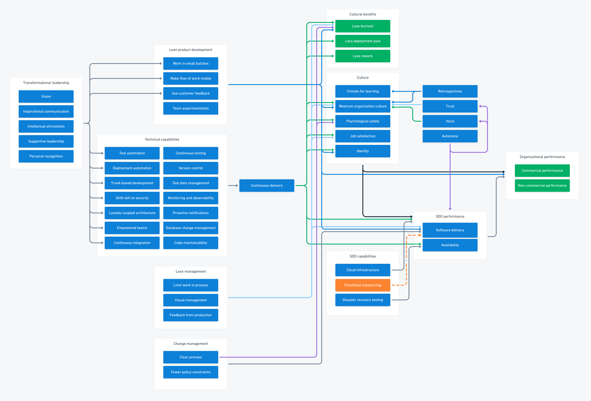
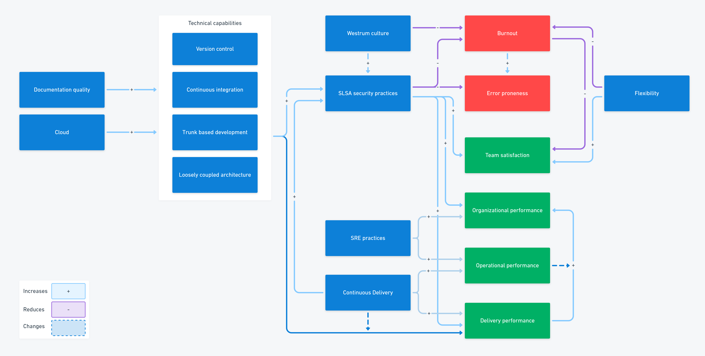

Your approach to DevOps is likely to be influenced by the methods and practices that came before. For organizations that gave teams autonomy to adapt their process, DevOps would have been a natural progression. Where an organization has been more prescriptive in the past, people will look for familiar tools to run a DevOps implementation, such as maturity models.

In this post, I explain why a maturity model isn't appropriate and what you should use instead.

## What is a maturity model?

A maturity model represents groups of *characteristics*, like processes or activities, into a sequence of maturity levels. By following the groups from the easiest to the most advanced, an organization can implement all the required elements of the model. The process is a journey from adoption through to maturity.

Maturity models:

- Provide a roadmap for adopting characteristics
- Make it easier to get started by suggesting a smaller initial set of characteristics
- Can be assessed to provide the organization with a maturity score

For example, a maturity model for riding a bike might have 5 levels of maturity:

1. Walk upright on two legs
2. Ride a balance bike with a walking motion
3. Ride a balance bike with both feet off the ground
4. Ride a pedal bike from a starting point facing downhill
5. Ride a pedal bike from a starting point facing uphill

The sequence of maturity levels is a useful roadmap to follow and you may already be able to achieve the lower levels. Each maturity level is easier to reach from the level below, as the earlier levels provide a basis for increasing your skills and progressing to the next stage. You can also assess someone by asking them to demonstrate their ability at each level.

You can create a maturity model by designing the levels first and expanding each with characteristics, or you can collect together all the characteristics before arranging them into levels.

You'll find maturity models are commonly used as part of standards and their certification process. Most process certifications require you to demonstrate that:

1. You have documented your process
2. People follow the documented process
3. You regularly review and improve the process

When you plan to achieve a certification, your roadmap is clear; until you document the process you can't tell if people are following it.

## Limitations of maturity models

You can use a maturity model to assess whether a set of activities is taking place, but not whether these activities impact your key outcomes. Maturity models are rigid and require you to adopt all characteristics to achieve maturity levels. You have to trust that following the model will bring you the same benefits experienced by the model's authors.

The sequence of maturity levels might not work for everyone. They could slow down your progress or even have counter-productive outcomes. A maturity model doesn't take into account the unique challenges facing your business - it may not even solve the kind of problems you're facing. It also defines an end point that may not be good enough.

Maturity models are most commonly used in due-diligence frameworks to ensure suppliers meet a minimum standard for process or security. If you were cynical, you might argue they're used to ensure an organization can't be blamed when one of its suppliers makes a mistake.

In DevOps, the context and challenges faced by organizations and teams are so important, a maturity model is not an appropriate tool. If you want to apply a maturity model to DevOps, you may need to adjust your mindset and approach as there's no fixed end state to DevOps. Neither should the capabilities be adopted in a pre-determined order.

Maturity models are not appropriate for DevOps because they:

- Assume there is a known answer to your current context
- Focus on arriving at a fixed end state
- Encourage standardization, not innovation and experimentation
- Have a linear progression
- Are activity-based

For DevOps, you need a different kind of model.

## Capability models

A capability model describes characteristics in terms of their relationship to an outcome. Rather than arrange sets of characteristics into levels, they connect them to the effect they have on a wider system outcome.

Going back to riding a bike, a capability model would show that balance affects riding stability and steering, whereas walking has some bearing on the ability to pedal to power the bicycle. Instead of following the roadmap for learning to ride a bike, you would identify areas that could be improved based on your current attempts to ride.

If you were using a capability model, you wouldn't stop once you proved you could ride uphill. Capability models encourage you to continue your improvement efforts, just like [Ineos Grenadiers](https://en.wikipedia.org/wiki/Ineos_Grenadiers) (formerly Sky Professional Racing / Team Sky) who achieved 7 Tour de France wins in their first 10 years using their approach to continuous improvement, which they called *marginal gains*.

A capability model:

- Focuses on continuous improvement
- Is multi-dimensional, dynamic, and customizable
- Understands that the landscape is always changing
- Is outcome-based

When you use a capability model, you accept that high-performance today won't be sufficient in the future. Business, technology, and competition are always on the move and you need a mindset that can keep pace.

## Maturity vs capability models

A maturity model tends to measure activities, such as whether a certain tool or process has been implemented. In contrast, capability models are outcome-based, which means you need to use measurements of key outcomes to confirm that changes result in improvements. 

For example, the DevOps capability model is aligned with the [DORA metrics](https://octopus.com/devops/metrics/). Using throughput and stability metrics helps you assess the effectiveness of improvements.

While maturity models tend to focus on a fixed standardized list of activities, capability models are dynamic and contextual. A capability model expects you to select capabilities that you believe will improve your performance given your current goals, industry, organization, team, and the scenario you face at this point in time.

You level up in a maturity model based on proficiency against the activities. In a capability model, you constantly add gains as you continuously improve your skills and techniques.

These differences are summarized below:

| Maturity model | Capability model |
|:--------------:|:----------------:|
| Activity based |  Outcome based   |
|     Fixed      |     Dynamic      |
|  Standardized  |    Contextual    |
|  Proficiency   |      Impact      |

## The DevOps capability model

The DevOps capability model is the *structural equation model* (SEM), sometimes referred to as the *big friendly diagram* (BFD). It arranges the capabilities into groups and maps the relationships they have to outcomes.

Each of the arrows describes a predictive relationship. You can use this map to work out what items will help you solve the problems you're facing. 

For example, [Continuous Delivery](https://octopus.com/devops/continuous-delivery/) depends on several [technical capabilities](https://octopus.com/devops/continuous-delivery/continuous-delivery-capabilities/), like version control and trunk-based development, and leads to increased software delivery performance and reduced burnout (among other benefits).

If you find this version of the model overwhelming, the 2022 version offers a simpler view, with many of the groups collapsed. Using simplified views of the model can help you navigate it before you drill into the more detailed lists of capabilities.

## How to use the DevOps model

Depending on which version you look at, the model can seem overwhelming. However, the purpose of the model isn't to provide a list of all the techniques and practices you must adopt. Instead, you can use the model as part of your continuous improvement process to identify which capabilities may help you make your next change.

As the capability model is outcome-based, your first task is finding a way to measure the outcomes for your team and organization. Any improvement you make should eventually move the needle on these outcomes, although a single capability on its own may not make a detectable difference.

The [DORA metrics](https://octopus.com/devops/metrics/) are a good place to start, as they use throughput and stability metrics to create a balanced picture of successful software delivery. In the longer term, it's best to connect your measurements to business outcomes. Whatever you measure, everyone involved in software delivery and operations needs to share the same goals.

After you can measure the impact of changes, you can review the capability model and select something you believe will bring the biggest benefit to your specific scenario.

The highest performers use this process of continuous improvement to make gains every year. The high performers are never *done* and persistently seek new opportunities to build performance. This is why the high performance of today won't be enough to remain competitive in the future.

## Conclusion

DevOps shouldn't be assessed against a maturity model. You should be wary of anyone who tries to introduce one. Instead, use the structural equation model from Accelerate and the [State of DevOps reports](https://cloud.google.com/devops/state-of-devops/) as part of your continuous improvement efforts.

The DevOps capability model supports the need for constant incremental gains and encourages teams to experiment with their tools and processes.

## Further reading

- [DevOps engineer's handbook](https://octopus.com/devops/)
- [Measuring Continuous Delivery and DevOps](https://octopus.com/whitepapers/lv-measuring-continuous-delivery-and-devops)
- [Accelerate: The Science of Lean Software and DevOps - Dr. Nicole Forsgren et al](https://itrevolution.com/product/accelerate/), part of our [DevOps reading list](https://octopus.com/devops/reading-list/)
- Use 8 Simple Steps to Get DevOps Right - Gartner (Daniel Betts, George Spafford)

Happy deployments!