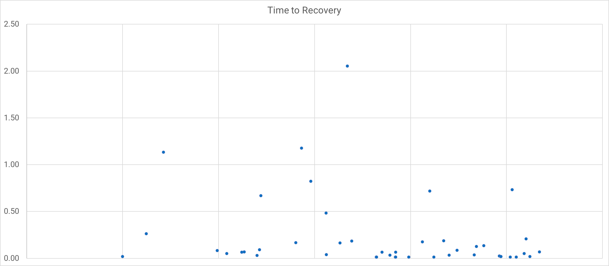

It's possible to overthink your DevOps metrics. If you've read the research undertaken by [DORA](https://www.devops-research.com/research.html), you might worry that you need science and statistics expertise to do the same for your team.

The good news is, you don't need advanced skills to use metrics in your team. You only need information that's good enough to guide your process of continuous improvement.

One metric that's currently the subject of broader discussion is mean time to recovery (MTTR). In this article, you'll see how MTTR is valid for research, the arguments against it, and whether you should use it to measure your software delivery performance.

## What is MTTR

MTTR is the mean time to recovery, sometimes referred to as mean time to restore. It's the time it takes to get a system operational after a fault. It has become a common measure of software delivery performance as part of the [DORA Metrics](https://octopus.com/devops/metrics/dora-metrics/).

If you perform well against all DORA metrics, you'll have working software sooner, happier employees, and a competitive advantage in your industry.

To collect *mean* time to recovery, you need to collect the duration of each incident from when it started to when it ended. You then sum the durations and divide the total by the number of incidents. Some teams calculate the *median* time to recovery by ordering all incidents and selecting the middle value.

Recovery times are impacted by many parts of your software delivery process, such as architecture, documentation, observability, and deployment pipeline performance. When you can recover quickly, incidents have less impact and customers are happier.

### Why MTTR is useful for industry research

When researching performance across many organizations and industries, you can't ask people to provide a list of all incidents for analysis. This would deter many people from responding to the research survey. That means you must ask them to summarize their experience by providing a comparable number.

The [DORA quick check](https://www.devops-research.com/quickcheck.html) phrases the MTTR question like this:

*For the primary application or service you work on, how long does it generally take to restore service when a service incident or a defect that impacts users occurs (for example, unplanned outage, service impairment)?*

- More than six months
- One to six months
- One week to one month
- One day to one week
- Less than one day
- Less than one hour

Most people working in software delivery have a feel for the typical duration of incidents, especially with the broad buckets used in the answer. You can probably answer this for your team from memory with reasonable accuracy.

The researchers can use this information to find [performance groups](https://octopus.com/blog/new-devops-performance-clusters) in the data. They can also look for relationships between various practices and their impact on business outcomes. The DevOps structural equation model is built using these findings.

### The reason MTTR isn't suitable for your team

While MTTR is helpful in research for comparisons and clustering, this differs from how you'll use incident information in your organization. Your primary use of incident duration is to learn from service outages and improve how you handle them in the future.

For continuous improvement purposes, using an average hides essential signals. You need more fine-grained information to understand how well you handle faults and to find their causes.

The Verica Open Incident Database (VOID) has over 10,000 incidents shared by almost 600 organizations. They analyze these incidents in [the VOID report](https://www.thevoid.community/report). The 2022 report made the following comment about MTTR:

> MTTR isn't a viable metric for the reliability of complex software systems for many reasons, notably due to its underlying variance.

MTTR will only be helpful if you have thousands of monthly incidents within your organization. Most teams will be hoping for a smaller number of incidents. With fewer incidents, averages result in a highly volatile metric, which can go up even when incident management improves.

Averages are most useful when you have a normal distribution. Incident durations skew heavily to the left of the chart, as most incidents can be solved quickly. The VOID database found most incidents are resolved in under 2 hours. There is then a long thin tail of values that can cause wild variation in mean and median averages.

You could eliminate this variation by excluding outliers, but then you'd hide valuable information. You need a better way to use this data to improve your process.

### Where restore times remain useful

Instead of zipping up your incidents into an average, plot each duration on a chart. Using a scatter plot or a box-and-whisker chart lets you visualize durations without losing fidelity. This will show you trends and outliers, which is more useful than an average.

You can now understand the trend in resolution times to see if you are improving over time. You can also identify outliers that took longer to solve and discuss how you could handle them better. Resolution times remain useful as part of your journey into exploring incidents and improving incident management and system stability.

If incidents require a code fix, the restore time will reflect the performance of your deployment pipeline. Being able to quickly and safely deploy new versions of your software has positive effects beyond incident management. The restore times also encourage the introduction of monitoring and alerting tools, significantly improving your ability to detect problems before a customer is impacted.

To get the most out of incident duration data, make sure you have consistent definitions for:

- What is an incident
- What is the start time
- What is the end time

Should you classify something as an incident if a system failed but didn't impact customers? For example, your instant-search feature may have stopped working, but the fallback of letting users round-trip the search form to get a response still worked - is this an incident? It's pretty subjective. What if your web server crashed, but your edge cache continued to serve requests?

You'll need to ask these questions to create a shared definition of an incident.

The exact start time and end time of an incident can be tricky to pin down. Do you start the clock when the CPUs get hot, when the response times slow, or when the first customer gets an error? The same goes for the end time. Is it when customers can use the system again or when you've mitigated the issue? It may be when you've finished fixing a bug or when you've put in a permanent fix to prevent a similar incident in the future.

You can make your data comparable by creating a solid definition for indicates and their measurement.

You will likely reach a point where time to restore no longer offers you the prompts needed to find the next level of improvements. You'll need some new measurement ideas once you can quickly deploy changes and receive early warnings of faults. This is where the SPACE framework can help you measure your incident response capability.

## Using the SPACE Framework to measure incident response

You can take a more holistic view of incident response and incident management using [the SPACE framework](https://octopus.com/devops/metrics/space-framework/). Here are several ideas that align with the 5 SPACE categories:

- Satisfaction and wellbeing
- Performance
- Activity
- Communication and collaboration
- Efficiency and flow

You don't have to use all these metrics at once. The SPACE framework recommends you use a mix of instrumented and perceptual measures across at least 3 dimensions and cover individual, team, and system levels. Your goal is to create a balanced set of measurements that helps you improve the process.

### Satisfaction and wellbeing

Perceptual measures work best here, so survey the people managing incidents to see how happy they are with:

- The incident management process
- The on-call schedule
- How easy it is to escalate or access specialists to help during an incident

You can also review instrumented data to determine how reasonable the on-call schedule is:

- What local times did pagers go off

### Performance

You can measure incident management performance using metrics such as:

- Whether systems perform against their reliability targets
- The time between incident conditions and awareness of the incident
- The time it takes to resolve an incident

### Activity

Your incident activity doesn't just have to be about the number of incidents. There are plenty of activity metrics you can use to understand incidents. You'll find most of these numbers in your existing systems:

- Number of alerts raised by monitoring tools
- Number of incidents raised
- Number of concurrent incidents

### Communication and collaboration

The flow of information is crucial to incident management. You should include this dimension in your measurement strategy for incidents. Having high-quality communication will reduce the time it takes to resolve faults. You can measure:

- The number of people involved in each incident
- How many different teams were involved in an incident
- The number of chat channels opened for an incident
- How many times the incident report was viewed (or given a positive rating, or referenced in other incidents)

### Efficiency and flow

You will often uncover waste in your system when you use efficiency and flow metrics. If an incident is passed around, progress stalls and resolution takes longer. These metrics can help you spot problems:

- How often an incident is reassigned
- The number of mitigation attempts per incident

### Incident management SPACE framework summary

You should be free to build and adjust your metrics as you gain insight and improve your system. You may find it useful to start with satisfaction, communication, and efficiency, as these will likely give you early wins.

If you already survey customers, ask them to rate your reliability.

The SPACE framework provides a way to build measurements that can directly influence your incident management more than recovery times alone.

## Transitioning from MTTR

If you have been reporting mean time to recovery, you'll confuse people if you just drop it. Instead, introduce new measurements alongside MTTR to familiarize people with the new concepts. You can demote the importance of MTTR in your dashboards by moving it further away from the "top left" of the dashboard. You can eventually remove it.

The same process can help you normalize the process of changing metrics over time. For example, if you expand from [DORA metrics](https://octopus.com/devops/metrics/dora-metrics/) to [the SPACE Framework](https://octopus.com/devops/metrics/space-framework/).

## Beyond the numbers

Metrics are useful because they stop you fooling yourself with convincing narratives. Without numbers, it's possible to dismiss an incident as a one-off, when it is more frequent than you thought. Phrases such as "one-off" and "exceptional/edge case" should warn you of narrative fallacy.

Despite the role numbers play, they can only tell you there is a problem, not how to solve it. You'll need to go beyond numbers and use incident retrospectives and reviews to work out how to improve incident management in your organization.

The numbers don't drive continuous improvement. They remind you of reality so you can apply some human ingenuity and improve things each week, forever. Use the numbers to identify and remove bias and logical fallacy from your discussions, so you can deal with the reality before you.

You should run incident retrospectives soon after each incident before vital context is lost and the assembled team returns to their day jobs.

Be cautious about root cause analysis, as software systems rarely have a single root cause. It's usually a combination of several contributing factors. Root cause analysis focuses on the people closest to the incident, not the broader systemic issues. Aim instead for a post-incident review that details everything that happened and what you did to mitigate and solve it.

Your incident reviews can contribute directly to reducing resolution times as they capture the learning and make it available to people handling future incidents.

> Safety is the capability to absorb an incident, not the absence of failure, and incident reviews are blameless learning opportunities. - Adrian Cockcroft

The cause of an incident is never a person. It's a whole system within which people work. If someone logged onto a server and accidentally selected "shut down" instead of "log out", that's a fault in the system. Why hasn't the "shut down" option been hidden? Why do they need to access servers directly? Couldn't this be done with a runbook?

Periodic reviews allow you to review all recent incidents to find patterns and think up improvements in the absence of *incident adrenaline*.

It is more important to learn from incidents than it is to achieve some arbitrary goals around time to recover.

## Conclusion

Do we want DORA to change how they measure software delivery - no. The survey collects how long it generally takes to restore service. You can answer more accurately if you have adopted some of the measurements in this article. For industry analysis, this is a sensible way to gauge one of many factors in the research.

> For the primary application or service you work on, how long does it generally take to restore service when a service incident or a defect that impacts users occurs (e.g., unplanned outage, service impairment)?

Treat incidents as opportunities to learn
Favour in-depth analysis over shallow metrics
Treat humans as solutions, not problems
Study what goes Right Along with what goes wrong

## Further reading

- [DevOps metrics](https://octopus.com/devops/metrics/)
- [Measuring Continuous Delivery and DevOps white paper](https://octopus.com/whitepapers/lv-measuring-continuous-delivery-and-devops)
- [DORA DevOps research](https://www.devops-research.com/research.html)
- [The Verica Open Incident Database (VOID)](https://www.thevoid.community/)

Happy deployments!