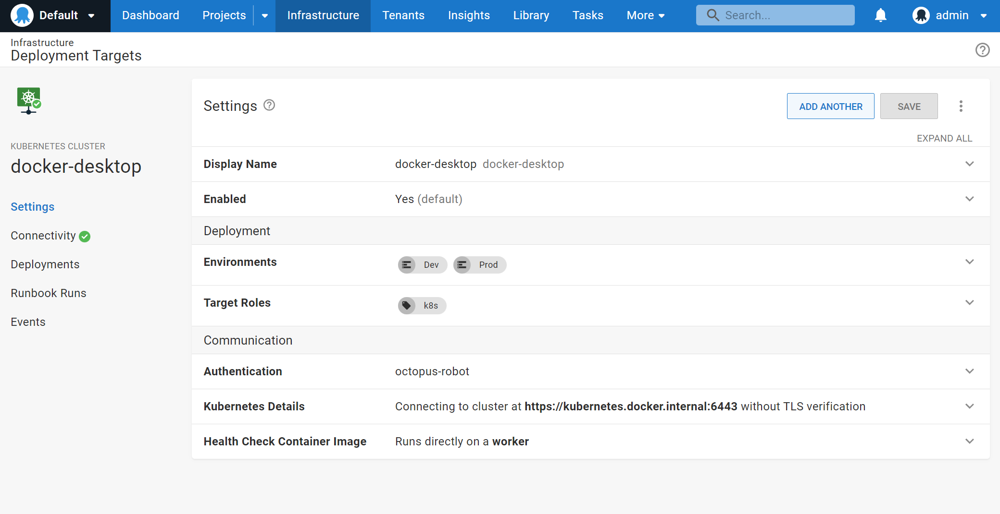
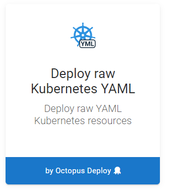
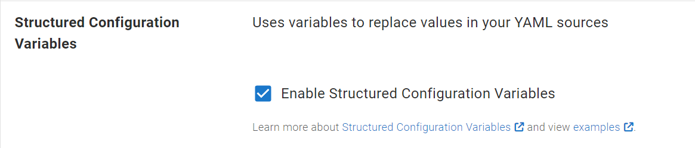
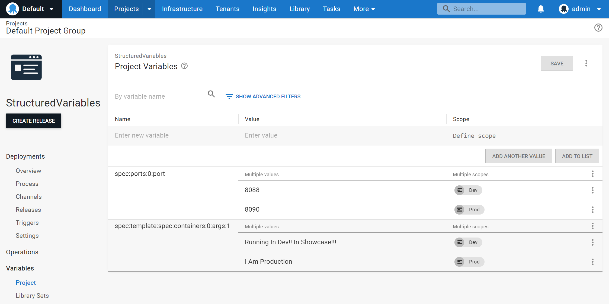
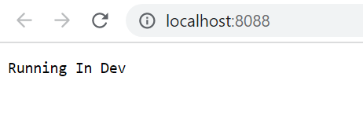

When developing your kubernetes configurations locally you are probably building up your deployment yaml files using values that allow you to evaluate and test the process against a non production system, such as a local minikube instance. Once you know that works, you probably want to take that exact yaml into your Octopus Deployment instance for use in real deployments with just some tweaks of the property values, perhaps replacing the replica count to handle the expected production loads, or configure specific node-affinity values to correctly distribute the pods throughout your cluster.   

Previously you would have had to embed [Octostache variable templates](https://octopus.com/docs/projects/variables/variable-substitutions) directly into your yaml, which results in configuration that you cant simply just invoke directly locally without replacing the invalid values with something that makes sense. Templating is a common pattern in managing kubernetes configuration files and version <XXX> of Octopus Deploy brings the power of Structured Variable Replacements to help make that process a little easier.

## Example Usage
1. Ensure you have registered a kubernetes cluster in your infrastructure. Check out our [docs](https://octopus.com/docs/infrastructure/deployment-targets/kubernetes-target) for specific instructions on getting this set up if you haven’t already done so. I’m going to run this locally so am just using a local cluster.



2. Create your project, add a raw YAML step.



3. Include the yaml of your configuration directly into the step. The great thing about using structured variables is that your yaml configuration does not need to contain any special Octostache variable templates (the `#{VariableName}` syntax). This means that you can directly take the YAML that you built and tested locally (or copied and pasted from StackOverflow) without having to make it work specifically for Octopus. 

In this scenario we will just deploy a single webserver pod and service that will print some text that we will change depending on the environment
```yaml
apiVersion: apps/v1
kind: Deployment
metadata:
  name: hashi-hello-deployment
  namespace: hashi-hello
spec:
  replicas: 1
  selector:
    matchLabels:
      app: hashi-hello
  template:
    metadata:
      labels:
        app: hashi-hello
    spec:
      containers:
      - image: hashicorp/http-echo
        name: hashi-hello-web
        args:
            - "-text"
            - "Developed Locally"
---
apiVersion: v1
kind: Service
metadata:
  name: hashi-hello-svc
  namespace: hashi-hello
spec:
  ports:
  - port: 8085
    protocol: TCP
    targetPort: 5678
  selector:
    app: hashi-hello
  type: LoadBalancer
```

The best defaults are likely the values you use when performing local development. This makes it easier when you need to iterate on the configuration from a starting point that you know works. Structured variables then allow Octopus to overlay values that are relevant to your test and production environments as required.

4. Enable the `Structured Configuration Variables` option. When using this feature in other steps, you typically would need to provide the file path to the configuration file. In this case since Octopus will be passing the configuration to `kubectl`, we don’t need to specify the file name ourselves.



5. Since we want to change the value of the text, and the exposed port depending on the environment, we can do this by defining project variables with a name that describes the path in the configuration that leads to the property we want to replace. 

In this case we want to replace one of the container arguments and port numbers, so the variable will look something like `spec:template:spec:containers:0:args:1` and `spec:ports:0:port` respectively.

 Check [our docs](https://octopus.com/docs/projects/steps/configuration-features/structured-configuration-variables-feature#StructuredConfigurationVariablesFeature-VariableReplacement) for details on this syntax.



6. Once we deploy our container we can check the generated yaml that is printed in the verbose task logs, or since this is running locally, access it via the port we injected for the development environment.



Success! 

If we now run this deployment to production, we will see the production variables being used in its place. All the while I can continue to develop and work with the raw configuration without having to resort to turning it into an Octopus specific template.

## Limitations
The structured variables feature relies on a fairly [simple naming convention](https://octopus.com/docs/projects/steps/configuration-features/structured-configuration-variables-feature#StructuredConfigurationVariablesFeature-VariableReplacement) that uses colons to build a hierarchical structure to point to the value being replaced in a configuration file. Although this simple nature makes it really easy to use, it also has some limitations in its capabilities.

Large structural replacements of sections of code are not supported, this feature is really targeted at modifying specific values. This also means that it wont allow you to add or remove entries in a collection. 

Since this feature was originally developed specifically for replacing values in a single application configuration, it also doesn't currently provide a simple mechanism to select between variable paths within multiple yaml documents embedded in the same configuration (typically defined via the triple-dash separator `---`). In this case all yaml documents will be compared with the variable pattern and the value may potentially be replaced in more than one matching path. The example above worked successfully since the two paths were distinct but if I were to deploy two services, it wouldn’t be able to differentiate between the two service configurations to perform the port value replacement.

Our objective in enabling this feature was to light up some capabilities for many of our users where the supported use cases provide a flexible way to cleanly inject Octopus specific variables at deployment time. Looking further ahead, our goal is to provide even richer configuration in the future through the leveraging of tools already used in this ecosystem such as kustomize, and through an enhanced YAML editing experience. Let us know your thoughts on what would make your projects even better in this space.

## Summary
These new capabilities are coming in Octopus XXX and work via the same Structured Variable substitution concepts that already exist and are used by users in other steps today. Structured variable substitution provides a lightweight mechanism for keeping your configurations clean, while still customizing them for the various scoping conditions that may be relevant to your deployment scenario.
