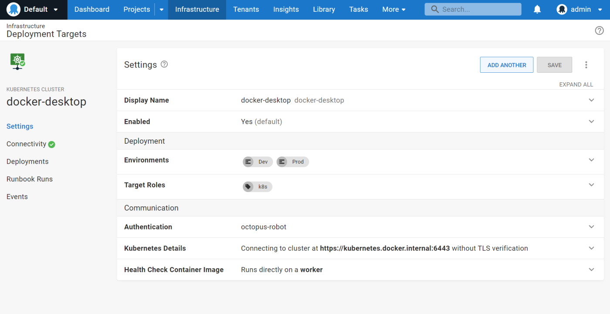
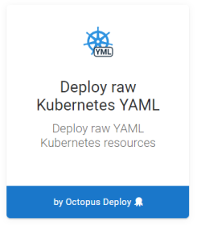
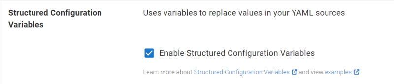
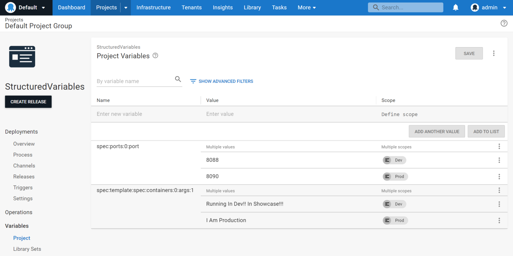
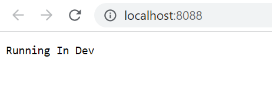

When developing your Kubernetes configurations locally, you're probably building up your deployment YAML files using values that let you test the process against a non-production system, like a local minikube instance. Next, you likely want to take that YAML into your Octopus instance for use in real deployments, with some tweaks to the property values. You might then replace the replica count to handle the expected production loads, or configure specific node-affinity values to correctly distribute the pods throughout your cluster.   

Previously, you had to embed [Octostache variable templates](https://octopus.com/docs/projects/variables/variable-substitutions) into your YAML. This resulted in configuration you couldn't invoke locally without replacing the invalid values. 

Templating is a common pattern for managing Kubernetes configuration files. Version 2023.1 of Octopus Deploy brings the power of structured variable replacements to help make this process easier. In this post, I show you how it works.

## How to use the improved structured variable replacement for Kubernetes 

1. Register a Kubernetes cluster in your infrastructure. You can see our [Kubernetes clusters documentation](https://octopus.com/docs/infrastructure/deployment-targets/kubernetes-target) for setup instructions. For this post, I run this locally, so I use a local cluster.



2. Create your project, then add a **Deploy raw Kubernetes YAML** step.



3. Include the YAML of your configuration in the step. By using structured variables, your YAML configuration doesn't need any special Octostache variable templates (the `#{VariableName}` syntax). You can take the YAML you built and tested locally (or copied and pasted from StackOverflow) without altering it to work for Octopus. 

In this scenario, you deploy a single web server pod and service that prints text that you change depending on the environment.

```yaml
apiVersion: apps/v1
kind: Deployment
metadata:
  name: hashi-hello-deployment
  namespace: hashi-hello
spec:
  replicas: 1
  selector:
    matchLabels:
      app: hashi-hello
  template:
    metadata:
      labels:
        app: hashi-hello
    spec:
      containers:
      - image: hashicorp/http-echo
        name: hashi-hello-web
        args:
            - "-text"
            - "Developed Locally"
---
apiVersion: v1
kind: Service
metadata:
  name: hashi-hello-svc
  namespace: hashi-hello
spec:
  ports:
  - port: 8085
    protocol: TCP
    targetPort: 5678
  selector:
    app: hashi-hello
  type: LoadBalancer
```

The best defaults are the values you use when performing local development. It's easier to iterate on the configuration from a starting point you know works. Structured variables then let Octopus overlay values relevant to your test and production environments.

4. Tick the **Structured Configuration Variables** option. When using this feature in other steps, you typically provide the file path to the configuration file. In this case, because Octopus is passing the configuration to `kubectl`, you don’t need to specify the file name.



5. To change the value of the text and the exposed port (depending on the environment), define project variables. Use a name describing the path in the configuration leading to the property you want to replace. 

Replace one of the container arguments with a variable like:
`spec:template:spec:containers:0:args:1`

And replace one of the port numbers, with a variable like:
`spec:ports:0:port` 

[Refer to our docs](https://octopus.com/docs/projects/steps/configuration-features/structured-configuration-variables-feature#StructuredConfigurationVariablesFeature-VariableReplacement) for details on this syntax.



6. After you deploy your container, check the YAML printed in the verbose task logs. Because this is running locally, you can also access it via the port you injected for the development environment.



Success! 

If you run this deployment to production, you see the production variables being used in its place. You can continue to develop and work with the raw configuration without turning it into an Octopus-specific template.

## Limitations

The structured variables feature relies on a [naming convention](https://octopus.com/docs/projects/steps/configuration-features/structured-configuration-variables-feature#StructuredConfigurationVariablesFeature-VariableReplacement) using colons to build a hierarchical structure that points to the value being replaced in a configuration file. Although easy to use, it has some limitations.

Large structural replacements of sections of code aren't supported. This feature instead helps when modifying specific values. It also won't let you add or remove entries in a collection. 

We originally developed this feature to replace values in a single application configuration. As such, there isn't a simple way to select between variable paths in multiple YAML documents embedded in the same configuration (typically defined via the triple-dash separator `---`). All YAML documents are compared with the variable pattern and the value might be replaced in more than one matching path. The example above worked successfully because the 2 paths were distinct, but if you deploy 2 services, it wouldn’t differentiate between the service configurations to perform the port value replacement.

Our aim for this feature was to give our users a flexible way to cleanly inject Octopus-specific variables at deployment time. Our next goal is to provide richer configuration by using existing tools in this ecosystem, such as kustomize, and through an enhanced YAML editing experience. 

Use the comments below to let us know what would make your projects even better.

## Conclusion

Injecting Octopus variables into your Kubernetes YAML scripts is now easier. This works using existing structured variable substitution concepts that people already use in other steps. 

Structured variable substitution gives you a lightweight way to keep your configurations clean, while customizing them for scoping conditions relevant to your deployment scenario.

Happy deployments!