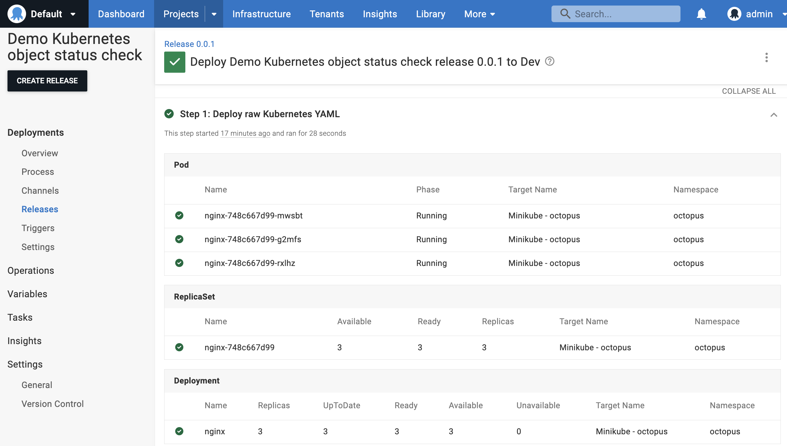
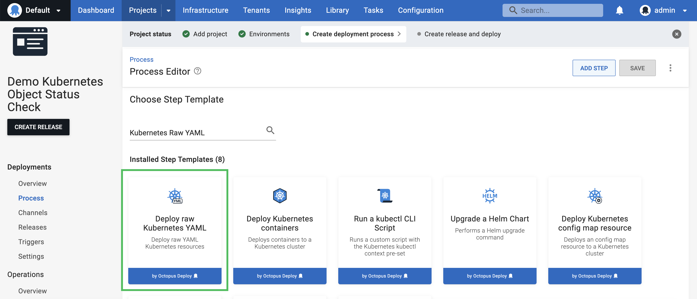
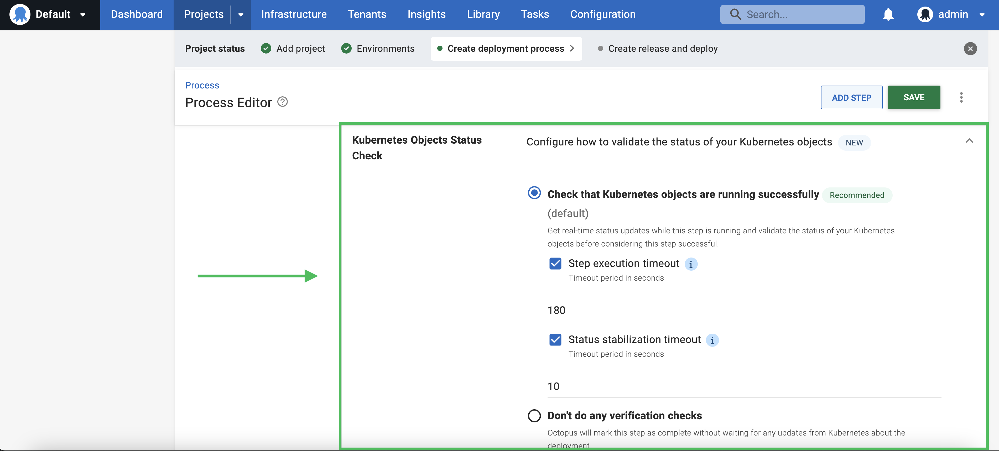
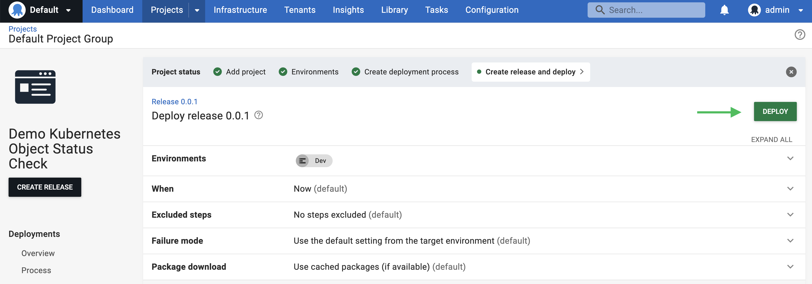
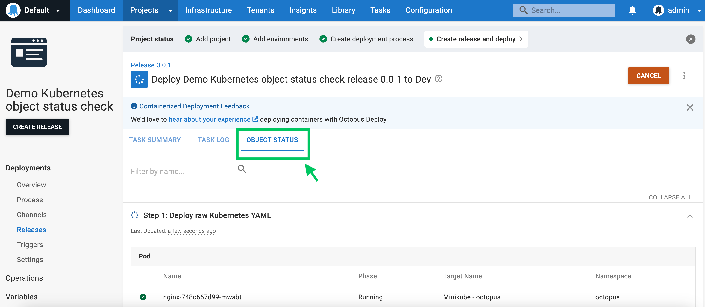
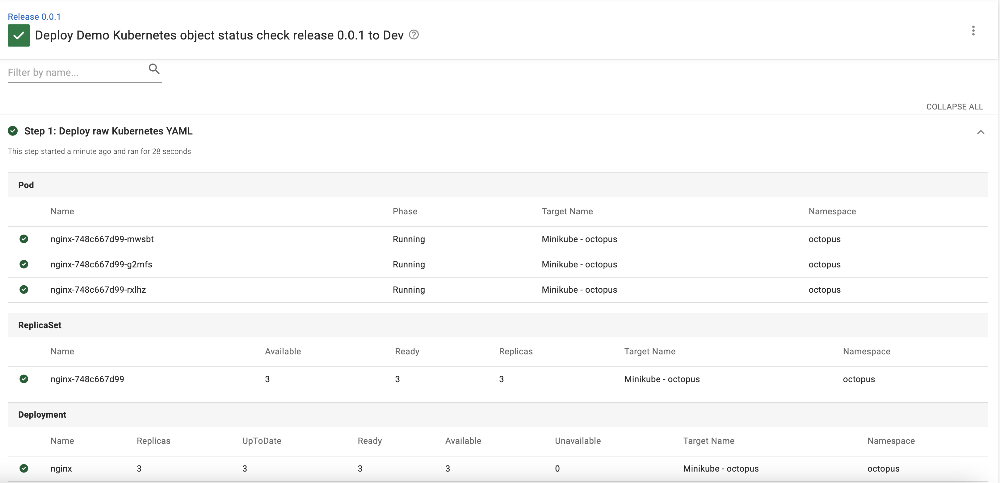
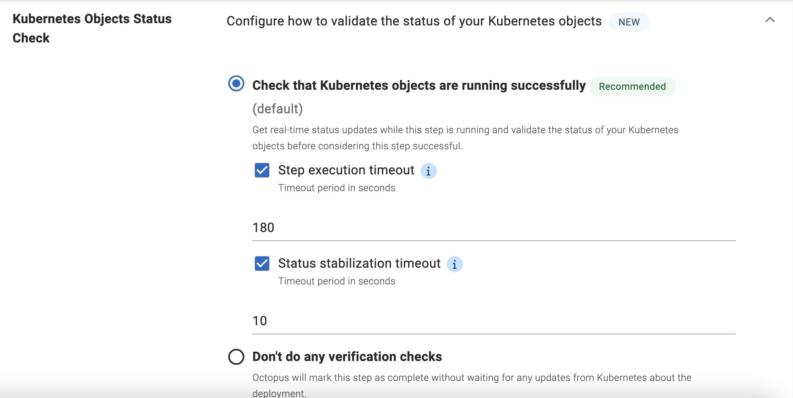
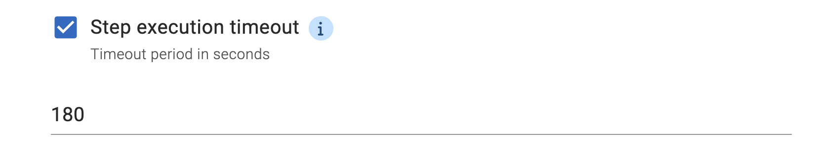
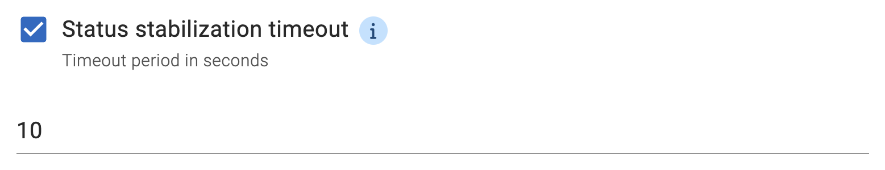

Kubernetes has become the de facto standard for container orchestration,
but deploying to a Kubernetes cluster is often a tricky process.
Once DevOps engineers have created Kubernetes objects in the cluster using manifest files,
they typically need to run a sequence of `kubectl get` or `kubect describe` commands,
until they confirm that the deployed objects are in fact up and running.

The good news is, you no longer have to do this every time if you deploy to a Kubernetes cluster via Octopus.

The Kubernetes object status check feature will give you live updates during the deployment process 
for the statuses of all the Kubernetes objects you are deploying.
This provides you extra visibility to the cluster to help you verify Kubernetes objects' statuses,
and detect any errors in the deployment as early as possible.



Now, let's have a look at how this works.

## Using object status check for Kubernetes deployments

1. Register a cluster

    Before we start, we need a Kubernetes cluster as the deployment target. 
    If you are not familiar with the process,
    you can find instructions [here](https://octopus.com/docs/infrastructure/deployment-targets/kubernetes-target).

    In this post, we will be using a local cluster that runs on Minikube, 
    but this works for cloud clusters as well.

    

2. Create a project

    Next, we will create a project that deploys to the Kubernetes cluster we just registered.

    Most built-in steps that deploy to Kubernetes clusters support object status checks. 
    Exceptions are [Upgrade a Helm Chart](https://octopus.com/docs/deployments/kubernetes/helm-update) (support for this step is coming soon) and "Run a kubectl CLI Script".

    In this demo, we will create a simple project that uses a [Deploy raw Kubernetes YAML](https://octopus.com/docs/deployments/kubernetes#raw-yaml-step) step.

    

    We going to create a Kubernetes Deployment resource with 3 replicas that run the nginx container.
    To do this, we put this YAML as an inline script.

    ```yaml
    apiVersion: apps/v1
    kind: Deployment
    metadata:
      labels:
        app: nginx
      name: nginx
      namespace: octopus
    spec:
      replicas: 3
      selector:
        matchLabels:
          app: nginx
      template:
        metadata:
          labels:
            app: nginx
        spec:
          containers:
          - image: nginx
            name: nginx
    ```
    
    > In this demo, I created the objects in the `octopus` namespace. Please remember to change this to the namespace that your deployment target has been configured with.

3. Configure the status check options

    You will notice that a new section has been added for the Kubernetes object status check.
    I will explain these options in more detail shortly.

    

    For now, we just leave everything as default, 
    and that's pretty much everything you need to make it work!

4. View the live updates from the cluster

    Now, let's create a release and a deployment from this project.

    

    Once the deployment starts, 
    you can find a new "OBJECT STATUS" tab that has been added next to the "TASK LOGS" tab.
    Simply click on the tab and we will see the object status updates.

    

    From the table, we can see one Kubernetes Deployment resource, 
    one Replicas, 
    and three Pods.
    We did not define the ReplicaSet and the Pods in the YAML file, 
    but since they are child objects of the Deployment,
    Octopus shows them for you as well.

    

5. Understand the settings

    Now we had a walk-through of the Kubernetes object status check feature, 
    let's revisit the configuration settings and understand how to configure them for your use case.

    Whenever a new project is created,
    the Kubernetes object status check option is enabled by default ("Check that Kubernetes objects are running successfully").
    If you are re-configuring a project which has been created before the release of this feature,
    the Kubernetes object status check will not be enabled, 
    until you manually do so.

    

    You can also configure two optional timeouts.

    - **Step execution timeout**

      
      This timeout is the total time allowed for all Kubernetes objects in the action to be deployed.
      If any resources are not in a successful state by the end of this timeout period,
      the step will stop executing and will be marked as failed.
      You can disable this timeout if you don't want to set a time limit.
    - **Status stabilization timeout**

      
      This timeout adds more stability to your deployment.
      Sometimes a Kubernetes object can have temporary failures but will self-heal eventually.
      For example, a pod may fail to spin up due to a temporary connection issue to the container registry,
      but it will be created successfully when the internet connection is back.
      You can use the stabilisation timeout to prevent this kind of temporary failure from causing a failed deployment.
      When this timeout is enabled, Octopus will wait for the period configured after the step fails or succeeds.
      The step will be marked as failed or succeeded only if the status does not change throughout this timeout period.


## Caveats

This feature can be super handy for Kubernetes deployments, but there are some caveats worth calling out.

First, the "OBJECT STATUS" tab only updates during the deployment process.
Once the deployment succeeds or fails, Octopus does not do further checks for the deployed resources.
This means any later updates to those objects, either done manually or by another deployment, won't be reflected in the table.

Second, if you are deploying with a "Deploy Kubernetes containers" step,
there is an existing option "Wait for the deployment to succeed" that allows you to wait until the completion of the deployment.
This option is not compatible with the object status check feature because it uses the `kubectl rollout status` command under the hood.
We recommend not using this option for any new deployments and use the object status check feature instead.

Finally, we currently do not support object status checks on resources deployed via the [Upgrade a Helm chart step](https://octopus.com/docs/deployments/kubernetes/helm-update) step, 
or deployments that are configured with a [blue/green strategy](https://octopus.com/docs/deployments/kubernetes/deploy-container#bluegreen-deployment-strategy). (But don't worry, we are planning to add the support for these shortly.)

## Conclusion

The Kubernetes object status check feature provides live updates during the deployment process for the Kubernetes objects being deployed.
It provides more visibility, gives you more confidence that your deployment is up and running,
and helps you detect and identify any errors in the deployment as early as possible.

We hope you like this feature. Please don't hesitate to share your experience with this feature or any recommendations [here](/)!

> The Kubernetes object status check feature will be available for Octopus cloud users from early May. But if you want to try it now, please just [let us know](/)!

Happy deployments!
