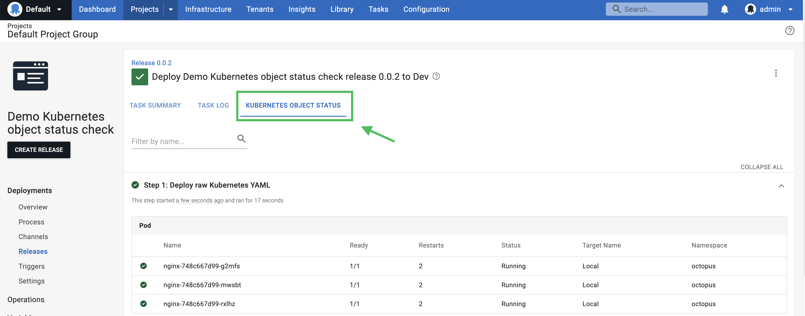
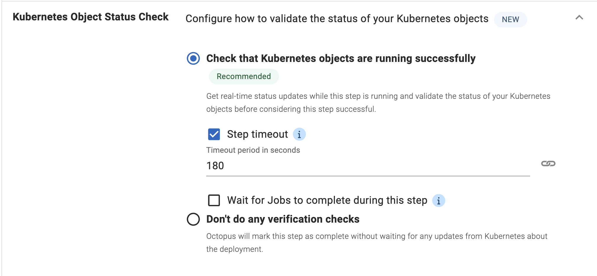

Kubernetes has become the standard for container orchestration. Deploying to a Kubernetes cluster can be tricky, though. After you create Kubernetes objects in your cluster using manifest files, you typically need to run a sequence of `kubectl get` or `kubect describe` commands. You need to do this until you confirm the deployed objects are running.

We're pleased to have addressed this with our new feature, Kubernetes Object Status.

This feature gives you live status updates during the deployment process for all the Kubernetes objects you're deploying.

You get greater visibility of your cluster to verify the status of your Kubernetes objects and detect deployment errors as early as possible.


In this post, I show you how our new Kubernetes Object Status feature works.

## Using the Kubernetes Object Status for deployments

### Step 1: Registering a cluster

Before you start, you need to register a Kubernetes cluster as the deployment target. 

You can follow the [steps in our docs](https://octopus.com/docs/infrastructure/deployment-targets/kubernetes-target) to do this.

In this post, I use a local cluster that runs on Minikube, but this process works for cloud clusters as well.


### Step 2: Creating a project

Next, you need to create a project that deploys to the Kubernetes cluster you just registered.

Most built-in steps that deploy to Kubernetes clusters support object status checks. Exceptions are: 

- **[Upgrade a Helm Chart](https://octopus.com/docs/deployments/kubernetes/helm-update)** (support for this step is coming soon) 
- **Run a kubectl CLI Script**

In this post, you create a simple project that uses a **[Deploy raw Kubernetes YAML](https://octopus.com/docs/deployments/kubernetes#raw-yaml-step)** step.


You need to create a Kubernetes deployment resource with 3 replicas that run the NGINX container. To do this, use this YAML as an inline script:

    ```yaml
    apiVersion: apps/v1
    kind: Deployment
    metadata:
      labels:
        app: nginx
      name: nginx
      namespace: octopus
    spec:
      replicas: 3
      selector:
        matchLabels:
          app: nginx
      template:
        metadata:
          labels:
            app: nginx
        spec:
          containers:
          - image: nginx
            name: nginx
    ```
    
:::hint 
For this post, I created the objects in the `octopus` namespace. Please remember to change this to the namespace that your deployment target is configured with.
:::

### Step 3: Configuring the status check options

There's a new section added for the Kubernetes Object Status check. I explain these options in more detail shortly.


For now, you can leave all the default options and it will work.

### Step 4: Viewing live updates from the cluster

Next, create a release and a deployment for this project.


After the deployment starts, you find a new **OBJECT STATUS** tab next to the **TASK LOG** tab.

Click **OBJECT STATUS** to see the object status updates.



From the table, you see one Kubernetes deployment resource, one replica, and 3 pods.

As you didn't define the ReplicaSet and the Pods in the YAML file, but they're child objects of the deployment, Octopus shows them for you as well.


### Step 5: Understanding the settings

Now you've seen how the Kubernetes Object Status feature works, I revisit the configuration settings and explain how to configure them for your use case.

Whenever a new project is created, the Kubernetes Object Status option is enabled by default, **Check that Kubernetes objects are running successfully**.

If you're re-configuring a project you created before the release of this feature, the Kubernetes Object Status check won't be enabled until you enable it manually.



You can also configure 2 optional timeouts:

- **Step execution timeout**


This timeout is the total time allowed for all Kubernetes objects in the action to be deployed. If any resources are not in a successful state by the end of this timeout period, the step will stop executing and be marked as failed. You can disable this timeout if you don't want to set a time limit.

- **Status stabilization timeout**


This timeout adds more stability to your deployment. Sometimes a Kubernetes object can have temporary failures but fixes itself eventually.

For example, a pod may fail to spin up due to a temporary connection issue to the container registry, but it will be created successfully when the internet connection is back.

You can use the stabilization timeout to prevent this kind of temporary failure from causing a failed deployment.

When this timeout is enabled, Octopus waits for the period configured after the step fails or succeeds. The step is marked as failed or successful only if the status does not change throughout this timeout period.

## Caveats

This feature is helpful for Kubernetes deployments, but there are some caveats worth calling out.

1. The **OBJECT STATUS** tab only updates during the deployment process.
After the deployment succeeds or fails, Octopus does not do further checks for the deployed resources. Any later updates to those objects, performed manually or by another deployment, won't be reflected in the table.

1. If you're deploying with a **Deploy Kubernetes containers** step, the option **Wait for the deployment to succeed** lets you wait until the deployment is complete. This option is not compatible with the Kubernetes Object Status feature because it uses the `kubectl rollout status` command. We don't recommend this option for new deployments. We recommend you use the Kubernetes Object Status feature for new deployments instead.

1. We do not support object status checks on resources deployed via the **[Upgrade a Helm chart](https://octopus.com/docs/deployments/kubernetes/helm-update)** step. We also do not support checks on deployments configured with a [blue/green strategy](https://octopus.com/docs/deployments/kubernetes/deploy-container#bluegreen-deployment-strategy). However, we plan to add support for these soon.

## Conclusion

The Kubernetes Object Status feature provides live updates during the deployment process for the Kubernetes objects being deployed.

It provides you with greater visibility, gives you more confidence that your deployment is running, and helps you detect and identify errors in the deployment as early as possible.

We'd love feedback on this feature while we continue to refine it. If you're an Octopus Cloud customer, it’s available now as an early access preview (EAP). [Register for the Kubernetes Object Status EAP](https://oc.to/EAP).

Happy deployments!