In the beginning, there was *the* [Kubernetes Dashboard](https://github.com/kubernetes/dashboard). This dashboard is the default option for anyone who wants to monitor a Kubernetes cluster, but over the years a number of alternatives have been developed that are worth looking into.

In this post, I take a look at some of these alternative Kubernetes dashboards.

## The sample Kubernetes cluster

For this post, I ran minikube locally, populated with the [Bookinfo](https://istio.io/docs/examples/bookinfo/) application provided by Istio.

## K8Dash

[K8Dash Homepage](https://github.com/herbrandson/k8dash)

> K8Dash is the easiest way to manage your Kubernetes cluster.

K8Dash has a clean, modern interface that should be familiar to anyone who has used the official Kubernetes Dashboard. A K8Dash’s selling point is that the interface is automatically updated, so you don't need to manually refresh the page to see the current state of the cluster.

Installation was painless with the following commands:

```
kubectl apply -f https://raw.githubusercontent.com/herbrandson/k8dash/master/kubernetes-k8dash.yaml
kubectl port-forward service/k8dash 9999:80 -n kube-system
```

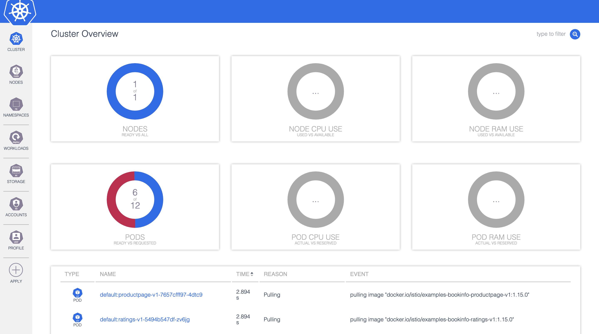
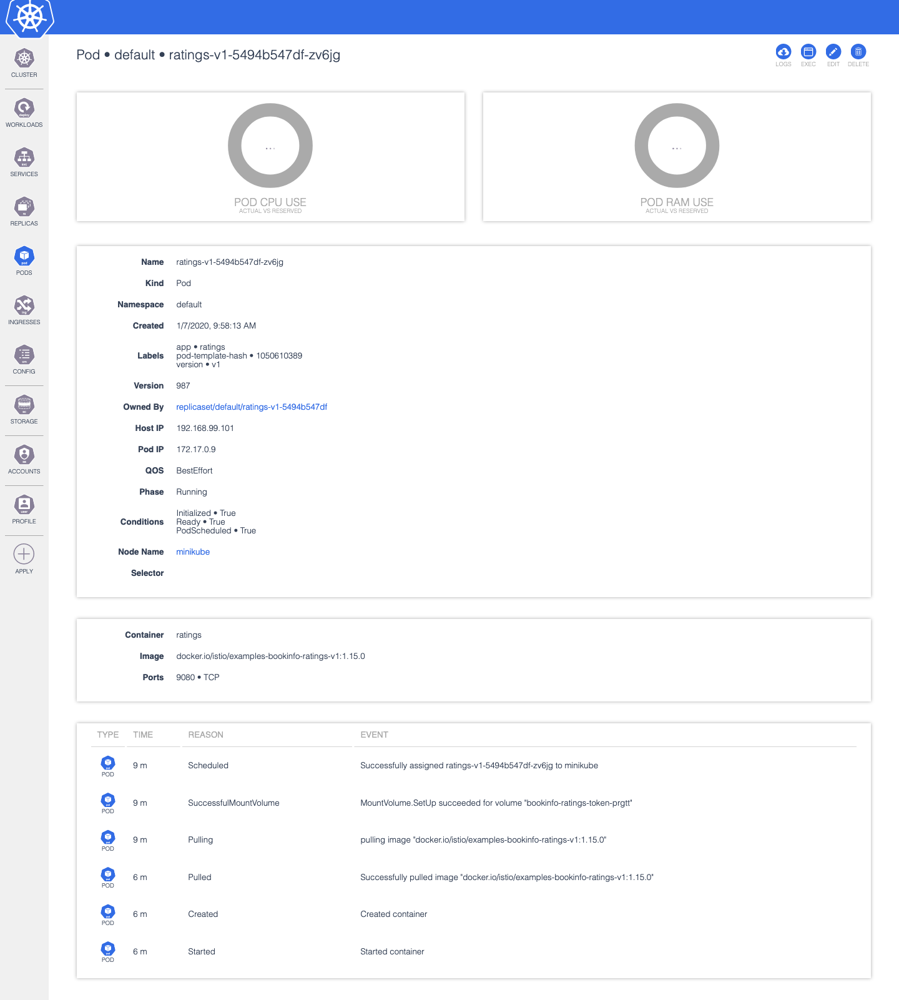

## Konstellate

> Visualize Kubernetes Applications

Konstellate is not so much a Kubernetes dashboard as a tool for creating, linking, and visualizing Kubernetes resources.

The main canvas lets you add new Kubernetes resources like Deployments, Services, and Ingresses. A dynamic user interface lets you build up the YAML description of these resources, exposing the available child properties with an associated description.

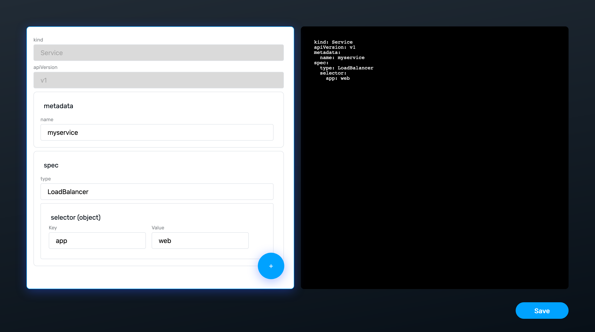
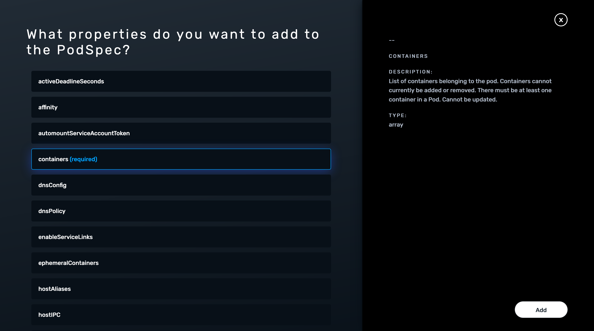

Two related entities can then be connected, with Konstellate displaying the associated properties that link them together.

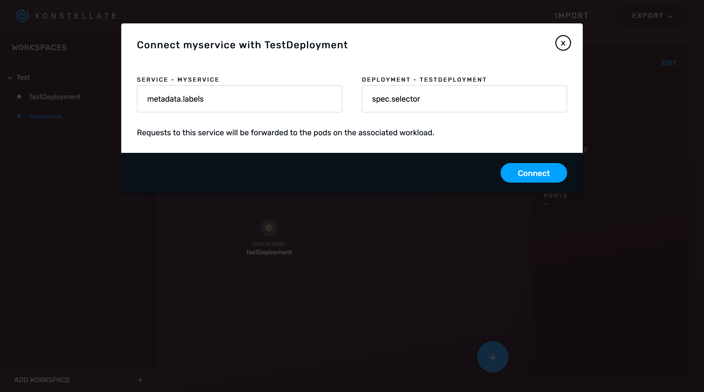
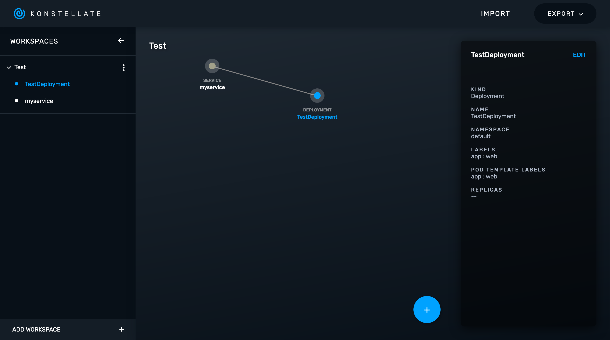

One challenge I found editing YAML by hand is that I'm forever Googling the exact property names and their relationships. The context aware Konstellate editor is a great way to explore the various properties available for a given entity.

It would be great if you could visualize the resources in an existing cluster, but this has yet to be implemented.

Konstellate is built from source, and doesn't provide any pre-built Docker images or binaries that I could see. All you need is Clojure and a single command to build and run the app, but it can take a few minutes for all the dependencies to download. The GitHub page links to a demo, but it was down when I tried it.

Overall, though, this is a useful app, and definitely a project to keep an eye on.

## Kubernator

[Kubernator Homepage](https://github.com/smpio/kubernator)

> In contrast to high-level Kubernetes Dashboard, Kubernator provides low-level control and clean view on all objects in a cluster with the ability to create new ones, edit, and resolve conflicts.

Kubernator is a capable YAML editor linked directly into a Kubernetes cluster. The navigation tree displays a filesystem like view of the cluster, while the editor provides features like tabs, keyboard shortcuts and diff views.

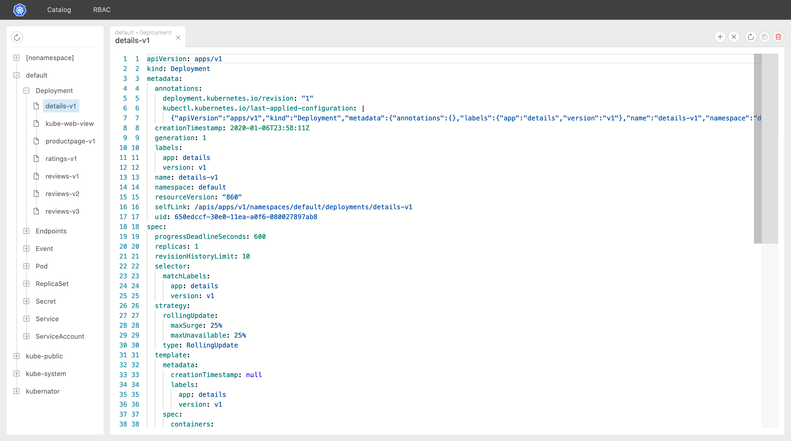

In addition to editing raw YAML, Kubernator visualizes the Role Based Access Control (RBAC) resources showing the relationships between users, groups, service accounts, roles, and cluster roles.

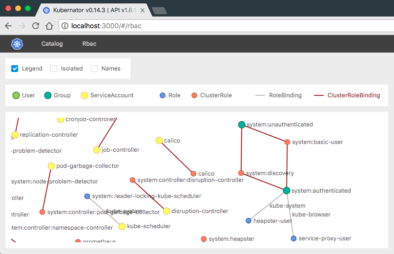

Installation is quick, with Docker images ready to be deployed into an existing Kubernetes cluster:

```
kubectl create ns kubernator
kubectl -n kubernator run --image=smpio/kubernator --port=80 kubernator
kubectl -n kubernator expose deploy kubernator
kubectl proxy
```

Next, just open the [service proxy URL](http://localhost:8001/api/v1/namespaces/kubernator/services/kubernator/proxy/) in your browser.

## Kubernetes Operational View

[Kubernetes Operational View Homepage](https://github.com/hjacobs/kube-ops-view)

> Read-only system dashboard for multiple K8s clusters

Have you ever wanted to manage your Kubernetes cluster like an ubergeek from the movies? Then KOV is for you.

Built on WebGL, KOV visualizes your Kubernetes dashboard as a series of nested boxes showing the cluster, nodes and pods. Additional graphs are nested directly into these elements, and tool tips provide additional details. The visualization can be zoomed and panned to drill down into individual pods.

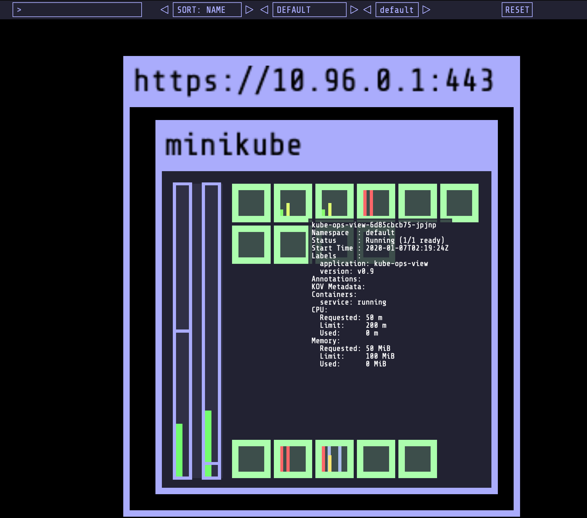

KOV is a read only dashboard, so you can’t manage a cluster with it or set alerts.

However, I used KOV to demonstrate how a Kubernetes cluster works as pods and nodes are added and removed, with people saying that this particular visualization was the first time they understood what Kubernetes was.

KOV provides a collection of YAML files that can be deployed as a group to an existing cluster, making installation easy:

```
kubectl apply -f deploy
kubectl port-forward service/kube-ops-view 8080:80
```

## Kubricks

[Kubricks Homepage](https://kubricks.io/)

> Visualizer/troubleshooting tool for single Kubernetes clusters

Kubricks is a desktop application that visualizes the Kubernetes cluster and lets you drill down from the node level to a traffic view mirroring the way kube-proxy directs incoming requests to different pods through services.

My minikube cluster isn’t that interesting to look at with only a single node:

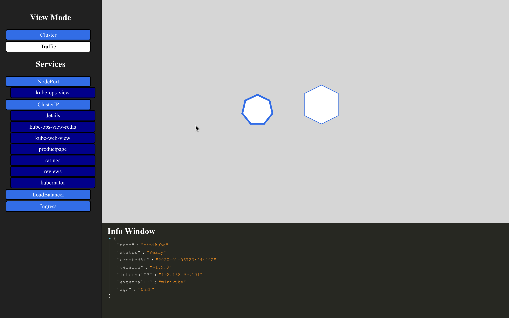

Clicking on the node shows the pods deployed to the node:

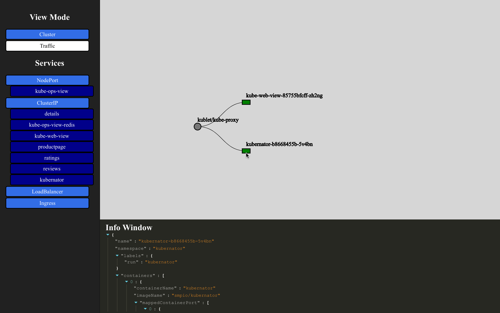

Here is the Kubricks traffic view:

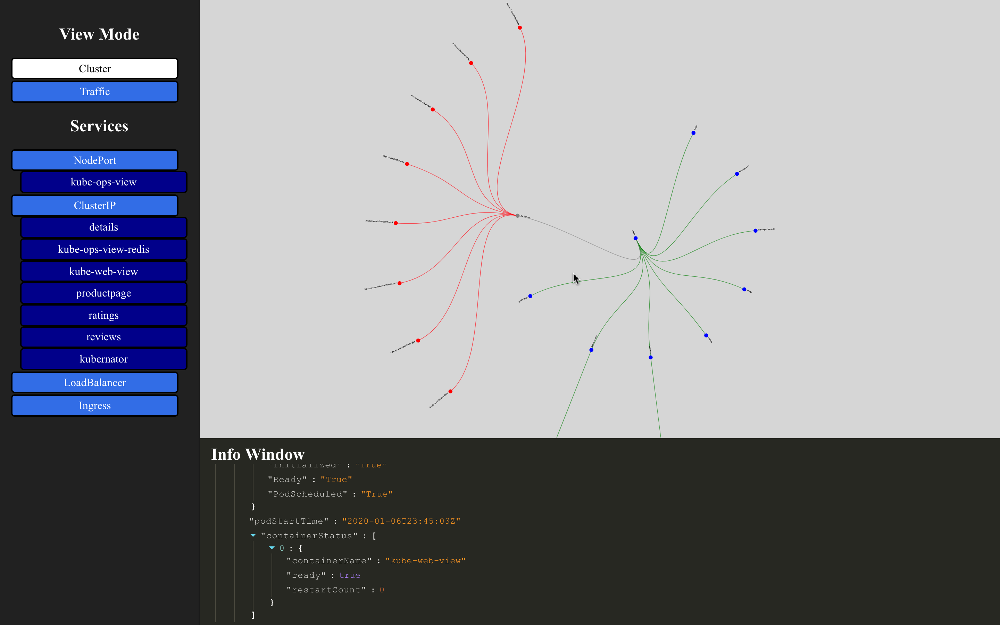

I struggled to understand what Kubricks was showing me. To see the connections between points in the traffic graph, I had to zoom out to the point where the labels were hard to read, and the node view appeared to be missing some of the pods.

Installation is easy with downloads for macOS and Linux.

## Octant

[Octant Homepage](https://github.com/vmware-tanzu/octant)

> A web-based, highly extensible platform for developers to better understand the complexity of Kubernetes clusters.

Octant is a locally installed application that exposes a web based dashboard. Octant has an intuitive interface for navigating, inspecting and editing Kubernetes resources, with the ability to visualize related resources. It also has a light and dark mode.

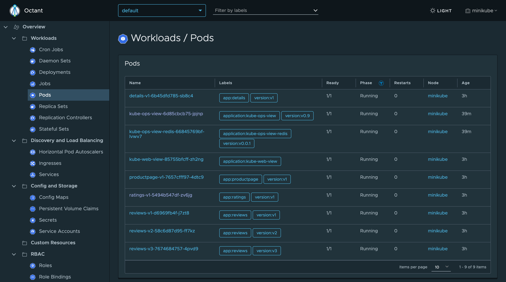
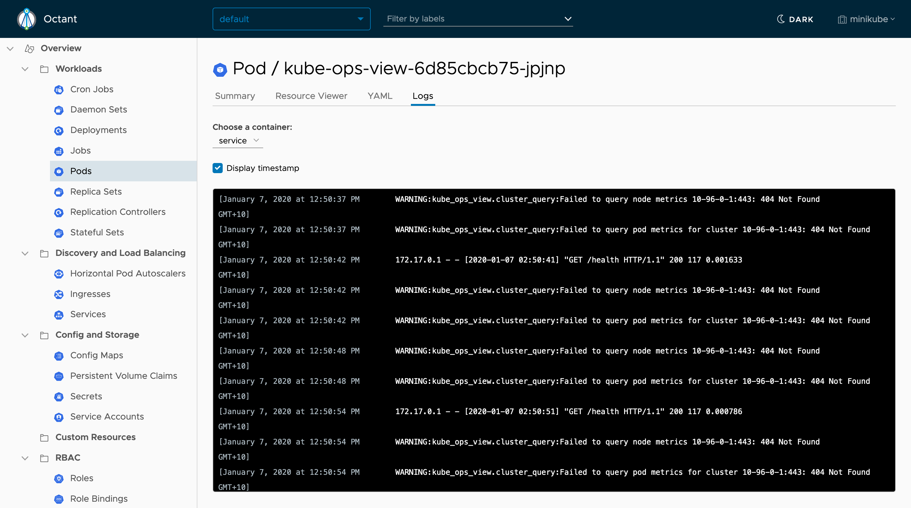
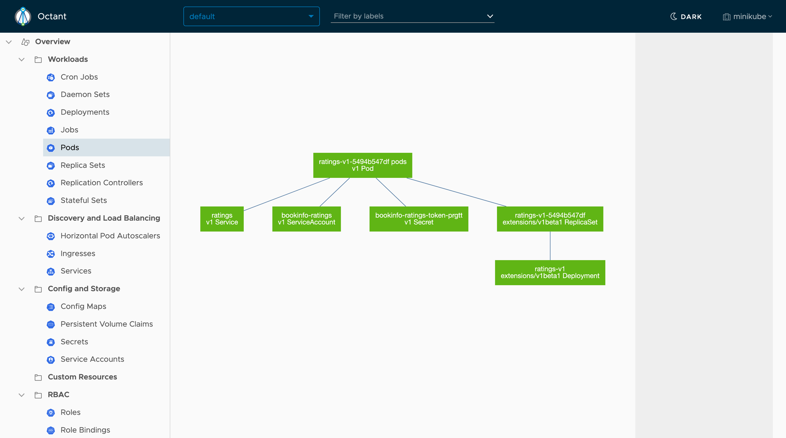

I particularly liked the ability to configure port forwarding directly from the interface.

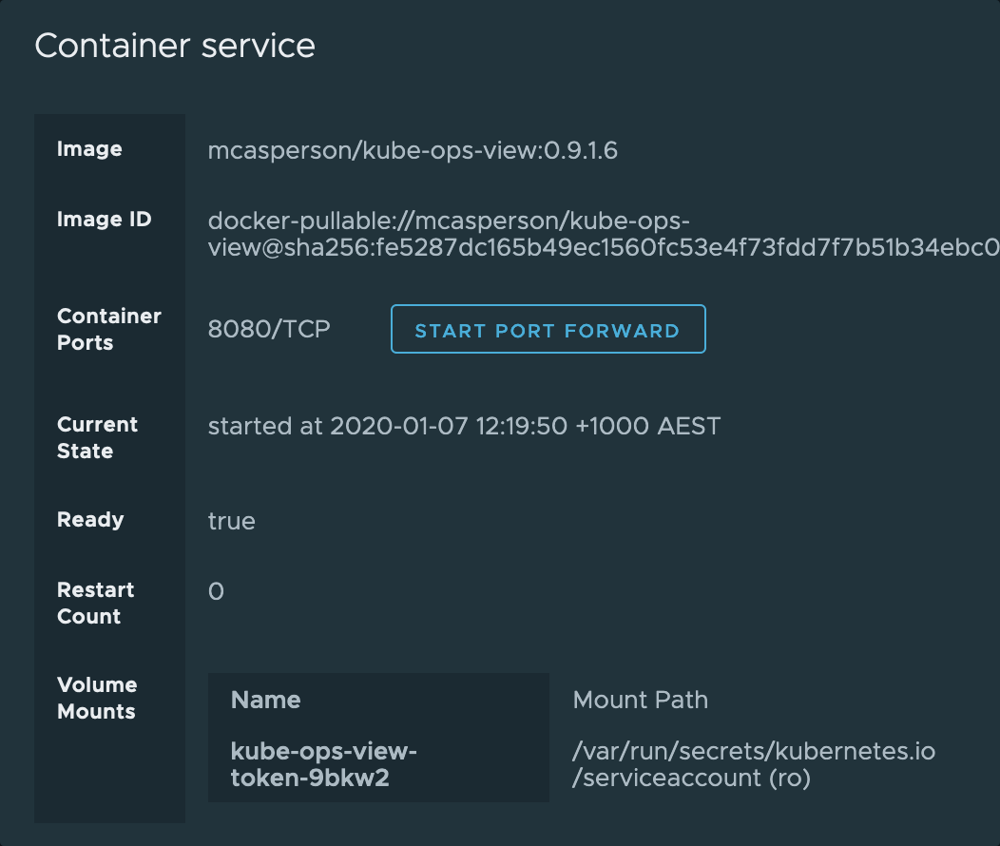
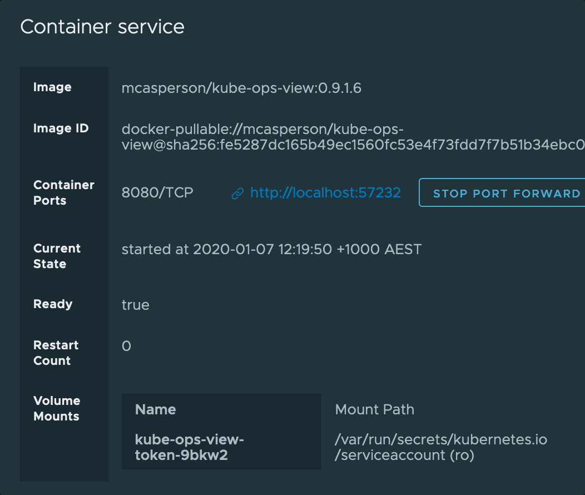

Installation was easy with packages available from Brew and Chocolatey, and compiled RPM and DEB packages for Linux.

## Weave Scope

[Weave Scope Homepage](https://github.com/weaveworks/scope)

> Monitoring, visualization & management for Docker & Kubernetes

Weave Scope provides a visualization of the Kubernetes nodes, pods, and containers showing details about memory and CPU usage.

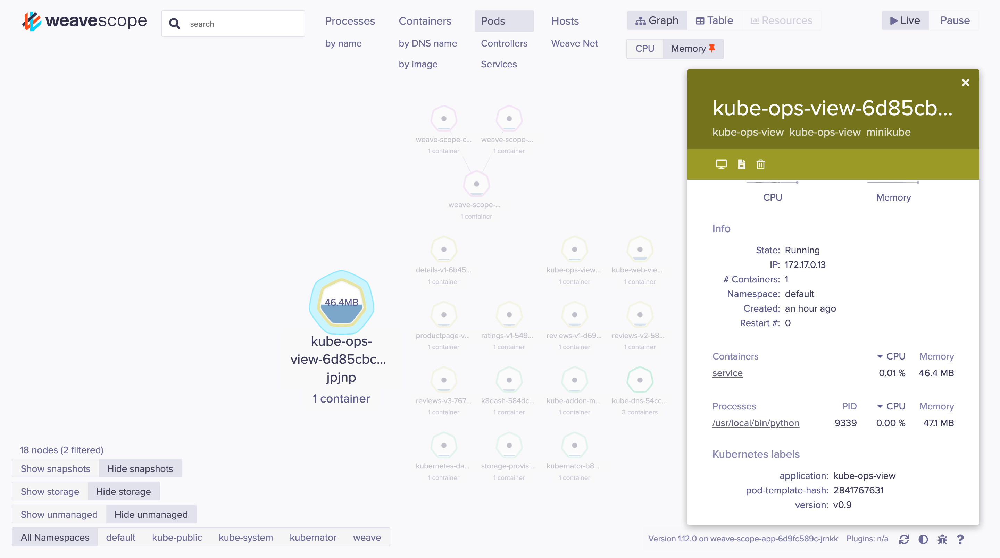
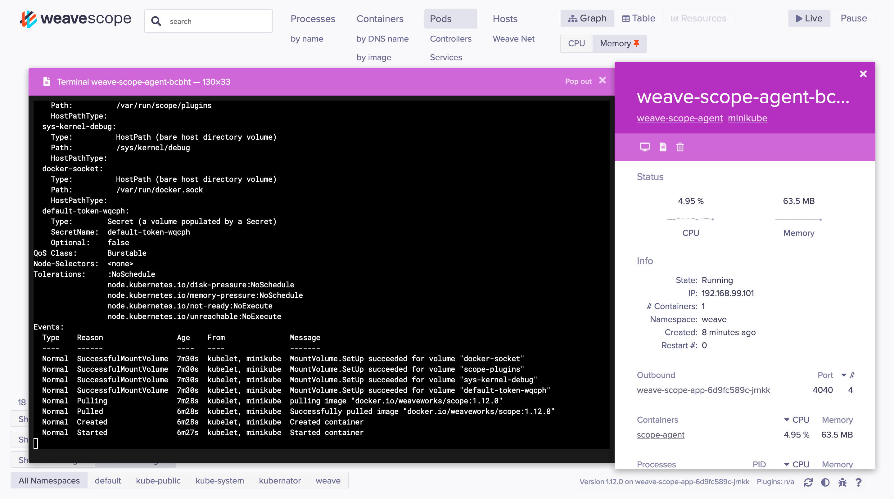

Of more interest is Weave Scope’s ability to capture how the pods are communicating with each other. This insight is not provided by other dashboards I tested here.

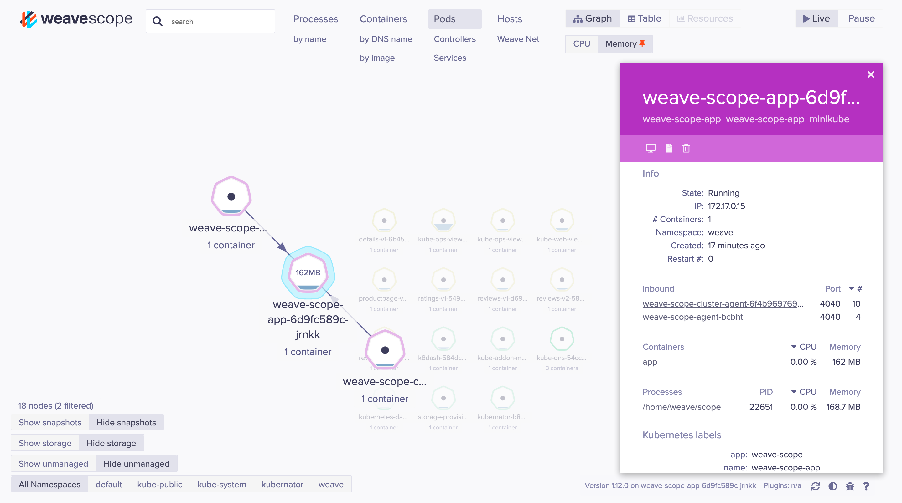

Weave Scope is very process oriented though, ignoring static resources like config maps, secrets, etc.

Installation is simple, with a YAML file that can be deployed directly into the Kubernetes cluster.

```
kubectl apply -f "https://cloud.weave.works/k8s/scope.yaml?k8s-version=$(kubectl version | base64 | tr -d '\n')"
kubectl port-forward -n weave "$(kubectl get -n weave pod --selector=weave-scope-component=app -o jsonpath='{.items..metadata.name}')" 4040
```

## Conclusion

If the official Kubernetes dashboard isn’t meeting your needs, there's a huge range of high quality, free, and open source alternatives to choose from. Overall, I was impressed at how easy these dashboards were to install, and it’s clear that a great deal of work has gone into their design, with most offering at least one compelling reason to switch.

Happy deployments!