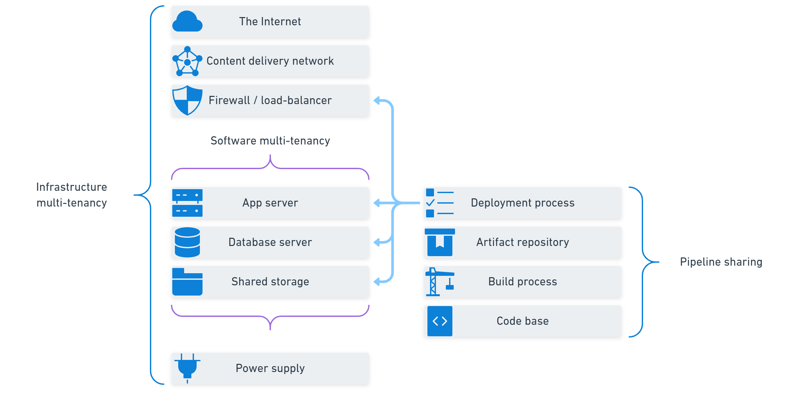

Most software isn't written with multi-tenancy in mind, it just emerges - sometimes suddenly - at a point in time. Because multi-tenancy involves a decision based on complex trade-offs, the way it creeps up on you is inconvenient.

It's common for the problem of multi-tenancy to arrive when you are least prepared to handle it.

## The bad timing of multi-tenancy 

Many software products start off satisfying the needs of a single customer, either internal or external to your organization. You may have a contract to develop a product that grants you the IP to sell it other customers, or you might be writing an application for your own needs that may turn into a saleable software product. Either way, you have one customer and you build a product that works for them.

Before long, your software gainst another customer. They are often smaller and less dominant than your first customer, so it's easy enough create an instance they can use. You have to deploy the application twice, but this is cost effective as the expensive part, writing the software, has already been done.

You can repeat this process, but it's only a matter of time before one of the customers needs some customization. They need a feature to work in a different way and it's a deal breaker if it can't be done. You now face your first multi-tenancy decision; whether to copy the code base or make it configurable. If the difference seems substantial, you might choose to create a copy and change it. The problem with this decision is that it comes when you at your busiest time for onboarding new customers.

Before you know it, you have two or three versions of you application with minor differences, powering different customers. You don't notice any problems until the following starts to happen:

1. When you fix a bug, you have to repeat the fix in multiple branches or source code repositories.
2. Sometimes, you can't apply the same bug fix as the code is different for some of the customers.
3. You find that two customers want a similar new customization, but they are on different evolutions of the software.
4. Your database has customer-specific columns with different names for the same data.
5. Your deployments used to take an hour when you had one customer, with 5 customers it takes a whole day and often goes wrong.
6. It takes longer to test the software than it does to change it.
7. You have a process for selecting the best starting code base for a new customer.
8. When you need to update your operating systems or database software, you have to repeat the process many times, often with different maintenance windows.

With organic multi-tenancy, the speed and extent of your success can make it hard to find the time to solve the problem. The earlier you spot the signs, the easier it is to avoid the trap.

## Multi-tenancy timelines

There are some multi-tenancy decisions you need to antipate ahead of time and others that turn out better if you wait to understand your customers better.

At the pipeline level, the decisions can be made early and fine-tuned over time. If you are creating a software product intended for more than a handful of customers, you should plan to share the code base and the deployment pipeline. The additional complexity from pipeline sharing is minimal compared to the retrospective job of handling the organic scenario.

:::hint
If you want to find out more about pipeline sharing, infrastructure multi-tenancy, and software multi-tenancy we describe them all in our white paper: [A modern view of multi-tenancy](https://octopus.com/resource-center).
:::

When it comes to software and infrastructure multi-tenancy, the decision needs a deeper knowledge of customer needs. You'll need to understand whether customers want to self-host the software, or use it as software-as-a-service (Saas). You'll also need to understand what level of isolation customers expect for their data or to protect the performance of the application within their business. There may be legal or contractual requirements to keep the data in a particular region. Until you understand the business drivers, it's not possible to create an appropriate design for multi-tenancy within these layers.

Software multi-tenancy refers to creating an architecture that allows customers to share an application and database instance, so you have a single code base, build, deployment, and running application instance. Although it's common to share the whole instance, it's also common to share just the database, or just the application.

It should never be plotted along a scale for the number of codebases or the number of data schemas like the organic multi-tenancy approach. You should maintain one codebase and one schema and design flexibility where it makes viable sense to the product. You can lower the cost of flexibility using techniques such as feature flags, but flexibility always costs you something. It shouldn't cost you the maintainance of multiple codebases or schemas for the same application.

:::hint
To avoid confusion, an installation is a deployment of one application. If you load balance the application, you may have several instances of the same deployment. This is still one installation for the purposes of this discussion.
:::

1. One data store, one application installation
2. Data store per tenant, one application installation
3. One data store, application installation per tenant
4. Data store per tenant, application installation per tenant

These are the four groups for multi-tenancy approaches.

### Multi-tenancy considerations

- Hard walls for data
- Data residency
- Noisy neighbours
- Tracking or limiting customer usage

### One data store, one application installation

At the heard of the single data store and application installation is a tenant concept. You'll have a table in your data store called *tenants* and each customer is listed with a unique identity. Each tenant represents a virtual wall around a set of data.

Almost all information in the data store is linked back to a tenant. A common exception is that users mare typically global, and granted permission to one or more tenants.

### Data store per tenant, one application installation

In this scenario, your application is data store aware. There is some signal built into the application that tells it which data store to connect to. For example, you may offer subdomains that map to each data store so `octo-pet-shop.example.com` connects to an OctoPetShop data store and `random-quotes.example.com` connects to a RandomQuotes data store.

Each data store would have the same schema, but the data would be tenant-specific. Schema updates would need to be deployed to all data stores, and your backup and maintenancy strategy would also need to be applied uniformly.

### One data store, application installation per tenant

Having one data store and an application installation per tenant is useful if the application itself is resource intensive, but the database isn't. Each tenant may pay for a different tier of compute resource, based on their intended workflows.

Each application installation has the same data store connection, but its own allocated compute resources. This is very similar to the full muti-tenanted application except you install the application for each tenant to give them dedicated compute and to limit their usage.

### Data store per tenant, application installation per tenant

The infrastructure for this scenario is similar to that required for the organic multi-tenancy. Each customer has their own dedicated application and data store, usually on isolated resources.

The crucial difference compared to organic multi-tenancy is that there is one schema definition and one application codebase.

This scenario has been made more managemeble thanks to virtualization and containerization infrastructure technology.

## Mixed multi-tenancy approaches

It is also possible to use a mixed approach where you:

1. Use one data store and one application installation for groups of small customers.
2. A data store and application installation for a single larger enterprise customer.

The mixed approach has some benefits. The multi-tenant installation for small customers means resource usage is shared efficiently by many users. For the large enterprises, their dedicated installation and data store means they don't become noisy neighbours to other customers and their data has thick hard walls from other customers. The enterprise customers may even have data residency requirements that mean their installation is within a specific region or their own data centre.

## How they compare as you scale

One customer

All approaches are similar, though any multi-tenancy added at this stage will be an investment in your future (i.e. additional work that won't pay dividends until you land your second customer).

### Data store pros and cons

Single data store
- If one tenant accidentally deletes data, how do you resore their data without affecting other tenants?
- You must ensure multi-tenancy is robust and data cannot leak.
- Maintenance windows are harder to schedule if you have customers in many time zones.
- A heavy database operation or rogue report can block requests for all tenants.

Tenant data store
- Easy to manage the data in the store as it all belongs to one customer.
- Harder to manage maintenance plans and backup tasks.

### Application installation pros and cons

Single application installation
- Resources are shared, which means you need fewer CPUs and other resources.
- Load balancing can smooth usage across a single installation.
- Redundancy requirements are lower when you have more than 3 customers (n+3 for multi-tenant vs n*2 for each customer).
- Noisy neighbours can cause slowdowns for other customers.
- Many customers in a single region can cause large peaks at a specific time.

Application installation per tenant
- Easier to track and limit usage per customer.
- Can be installed in customer-selected regions and data centres.

### Virtualization and containers

Many of the drawbacks to tenant-specific installations have become less concerning thanks to virtualization and containerization.

Virtual machines provided an easy way to quickly add customer-specific resources and containers have made that even easier, especially with the automation and config-as-code technologies that are now available.

Creating a set of containers specific to a customer can now be completed as an automated step as part of your on-boarding process.

## What to do when you don't know the future

It is worth addressing the question of multi-tenancy early as this is one of the few truly architectural decisions you can make. Your chosen path for multi-tenancy can heavily impact many decisions that will be made as your write the application and these are hard to change later.

You should either:

- Add a tenant concept early, such as a tenant identity, to keep your options open.
- Invest heavily in isolated customer instances, including automation of customer specific installations.

Having multi-tenancy available from the start may benefit your testing as people can have their own test tenant and avoid colliding with other tests. Having an "integration test" tenant with a well-designed and scripted dataset will help you maintain reliable integration tests and UI test suites.

## Conclusion

Happy deployments!
