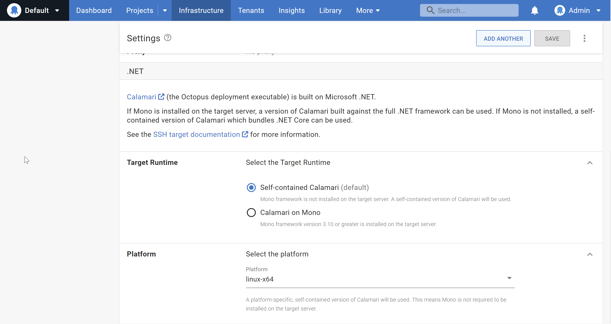

---
title: Deprecating Mono
description: Octopus Deploy is planning to drop support for deploying to SSH targets via Mono. This post talks through the background for this decision and what users need to do to move to utilize .NET core.
author: robert.erez@octopus.com
visibility: private
published: 3020-01-01-1400
metaImage: 
bannerImage: 
bannerImageAlt: 125 characters max, describes image to people unable to see it.
isFeatured: false
tags: 
  - Linux
----

Octopus is planning to deprecate support for Mono in a future release. This post will walk through the history of Mono at Octopus along with the steps that we have taken towards removing it as a dependency for Linux deployments.

If your Octopus Server instance is configured to deploy to SSH targets via Mono (and not self-contained .NET Core) then this post should give you all the context you need to understand the changes being made and your options available once the deprecation process completes. 

A [GitHub issue has been created](https://github.com/OctopusDeploy/Issues/issues/8146) where you can provide feedback or questions on this decision outlined in this post.

## Background - When and why does Octopus use Mono?
Way back in 2015, the release of Octopus 3.0 introduced support for [deploying releases on Linux via SSH Targets](https://octopus.com/blog/deployment-targets-in-octopus-3#multiple-types-of-machines-deployment-targets). The Octopus Deploy deployment execution engine framework, [Calamari](https://github.com/OctopusDeploy/Calamari), was originally built only on .NET Full Framework. .NET Core had only recently been announced and the first version was over a year away from release so the only way to run a deployment process was invoking it via [Mono](https://www.mono-project.com/docs/about-mono/). Mono has served it's purpose well, however with .NET Core now the dominant cross-platform framework for running .NET applications the benefits Mono brings is outweighed by the support costs.

### What is Mono - Technical notes?
Mono provides a [CLI](https://en.wikipedia.org/wiki/Common_Language_Infrastructure) (Common Language Infrastructure) virtual machine which can be run on various non-Windows platforms. The CLI comprises of the runtime required to execute .NET code previously compiled into into CIL (Common Intermediate Language)
which includes components such as the JIT compiler, garbage collector and library loader. These components would typically be provided by the .NET Framework installed on a Windows machine. 

The Mono CLI also includes its own implementation of the .NET Framework Class Library which, although compatible with Microsoft’s .NET Framework classes, are separate to the standard .NET Framework libraries used on a typical machine using .NET Full Framework. They are therefore also different to the APIs provided by .NET Core libraries.

Mono provides an amazing set of tools that opened up .NET development for (and on) non-Windows machines before it was fully supported by Microsoft itself.

### The rise of .NET Core and reducing our dependency on Mono
For some users, the Mono dependency itself was not viable, so in [early 2017 we introduced support for what we call Raw Octopus](https://octopus.com/blog/trying-raw-octopus). This mechanism allows for running scripts directly through the SSH shell without any of the helpful orchestration provided by Calamari. As a result, this runs without any of the dependencies required to run Calamari, .NET or otherwise. Due to it's simplicity, this option has always remained a niche fallback mechanism available for very constrained platforms.

The API surface area provided by the release of .NET Core 2.0 in mid 2017 allowed us to quickly work towards [Mono-less SSH targets in 3.16](https://octopus.com/blog/octopus-release-3-16#ssh-targets-sans-mono). This was the first release that allowed for running Octopus deployments on a Linux system with .NET Core and was quickly taken up by customers as a simpler mechanism for running their deployment workloads on Linux servers.

## Why are we deprecating mono?
Developing an application that runs on multiple platforms and runtimes has a non-zero cost that we must account for with the value it brings.

* **Development Costs** - Since the surface area of .NET Core does not perfectly overlap with the Core Libraries provided by Mono (or .NET Full Framework), there are parts of the code require pre-processor directives that switch between code-paths, dependencies or even entire classes and creates a codebase that is harder to reason with. This impacts the ease of maintaining the code and increases complexities in the solution's core architecture requiring multiple projects or dependencies depending on the platform being compiled for.

* **Testing Costs** - In addition to multiple Windows and Linux (with .NET Core) build configurations, we run almost the entire suite of Calamari tests against about 20 additional agent configurations to cover the various Linux platforms and Mono versions that might be encountered. This adds additional overhead in terms of time (which translates directly into dollars to run and maintain these systems) and developer effort. Every time a test fails, which can happen when integrating with external systems or running on complex build infrastructure, it may take hours of a developers time to stop, context switch and investigate.

* **Support Costs** - Customers sometimes have questions or issues with setting up a Mono based SSH Target. Although the general recommendation is now to just try the self-contained .NET Core option, this still creates a support overhead.

With the modern alternatives available for deploying to Linux that the majority of our customers now rely on, Mono no longer justifies the maintenance cost levied on both the development and verification of our software.

## When will we remove Mono?
We are aiming to provide as much time as possible to give customers the chance to make the required changes to keep their deployments running smoothly, while ensuring we can modernise our systems as soon as practical.

Releases from `2023.2` will begin generating warning messages in your logs if the Calamari execution takes place via Mono. The deployments will continue to function as normal however we hope that this mechanism will provide an additional opportunity to remind people that the pending changes are approaching.

From `2023.4` (likely released late November 2023) we will begin entirely disabling Mono functionality by default in new builds of Octopus Server. At this point, rather than just attempting to use .NET Core, deployments relying on Mono targets will fail with appropriate messaging to indicate the options available.

## How to start using .NET Core instead
When configuring a SSH target, the `Target Runtime` has already been defaulted `Self-contained Calamari` (.NET Core) for several years. If your target has this selected, then it is already using the .NET Core version of Calamari and these changes won't apply to you. If however your target has `Calamari on Mono` then you will need to make some changes before Mono support is disabled in Octopus Server.

### Listing Affected Targets
If you have lots of targets and are unsure if any are currently reliant on Mono, the below code snippet shows how to query your instances with the C# [OctopusClient](https://octopus.com/docs/octopus-rest-api/octopus.client).
```c#
var client = new OctopusClient(new OctopusServerEndpoint("https://octopus.acme.corp/", "API-XRLLCHXXXXIZGHDNC1OEUVRXXXXX"));
var sshEndpoints = client.Repository.Machines.List(commStyles: "Ssh");
var monoEndpoints = sshEndpoints.Items
  .Where(p => p.Endpoint is SshEndpointResource sshEndpoint && sshEndpoint.DotNetCorePlatform is null);
foreach (var endpoint in monoEndpoints) {
	Console.WriteLine($"SSH endpoint `{endpoint.Name}` is still running Mono. Time to convert to .NET Core!");
}
```

### Library Dependencies
Although in future you will no longer need to install Mono on your target to utilize it as a Deployment Target, there are still some dependencies that .NET Core require to be present. 

In many cases, particularly if using pre-configured VMs from a cloud vendor, these dependencies may already be available on your system and so no updates will need to be made to the target itself. If you are manually building your target you can [Follow the .NET Core guides](https://learn.microsoft.com/en-us/dotnet/core/install/linux-scripted-manual#dependencies) relevant to your distribution to determine if anything is missing and install them accordingly.

### Updating your Octopus Target
Updating Octopus to begin using the .NET Core version of Calamari rather than Mono requires a simple change on the Deployment Target configuration. Navigate to
{{ Infrastructure,Deployment Targets }} and select the Target to be updated. On the `Settings` page, under the `.NET` select the `Self-contained Calamari` option. If required also update the `Platform` value to the appropriate setting.


Although a health check wont exercise Calamari and validate the above dependencies are available, you can test that everything is ready by running a short, `echo Hello World`, script via the 
{{ Tasks,Script Console }} or even deploying a simple project.

## Impacts
For the majority of our current Mono users the changes required will be minor. There are however potential impacts for some platforms and functionality once the only option available is the .NET Core compiled binaries or raw scripting.

### ScriptCS
At the time of writing, ScriptCS is not currently supported on the .NET Core version of Calamari however some scheduled updates will soon change this. Check out the [related blog post](https://octopus.com/blog/rfc-migrate-scriptcs-dotnet-script) for further details on the plans and [possible workarounds](https://octopus.com/blog/rfc-migrate-scriptcs-dotnet-script#workaround) if this affects you.

### RHEL6
Running deployments on RHEL6 and below requires compiling for the `rhel-x64` runtime which we currently do not do. Cross-compiling to cater for these targets would negatively impact the bundled Octopus Server installation size for all customers which cannot be justified given the platform's reported usage. Since we explicitly call out support only for RHEL7.2 and above we will not be providing a solution for earlier versions of RHEL. Users on RHEL6 are encouraged to upgrade to the later versions of this platform to continue running deployment steps.

### FreeBSD
FreeBSD does [not currently support .NET Core](https://github.com/dotnet/runtime/issues/14537) at all, however this may change in the future. Based on target statistics it does not look like there are any instances that run on FreeBSD today so we don't expect this to impact any of our users. As part of the Mono deprecation we will likely fully drop support for FreeBSD until it is possible to run .NET Core.

## Conclusion
There are costs associated with any software that continues to support older platforms and frameworks. Although Mono has served Octopus well in providing an effective mechanism for deployments using Linux Targets, the time has come for it to stand aside for more modern solutions that have become available since its introduction. 

Customers currently relying on Mono should consider switching their Targets to use Self-contained Calamari now to avoid any problems in the future when Mono is disabled in Octopus Server. In most cases this should require minimal, if any, changes to your system to achieve beyond the flick of a switch on the SSH Target Settings page.

As noted in the introduction please add your thoughts, comments or questions to our [GitHub issue](https://github.com/OctopusDeploy/Issues/issues/8146) behind this change.

Happy (Linux) Deployments!
