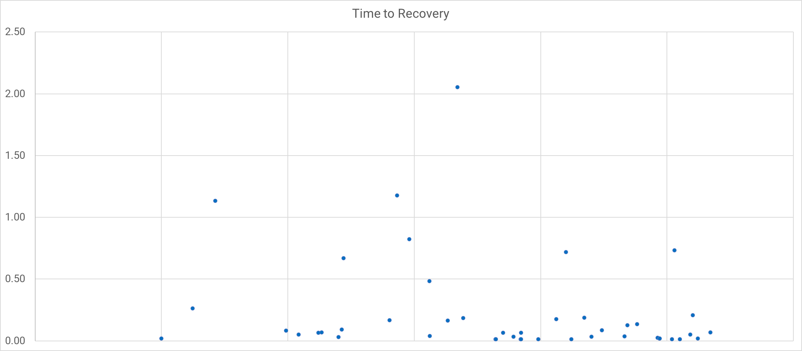

Mean time to recovery (MTTR) gained fame thanks to the DevOps "four keys" and the [DORA State of DevOps Report](https://dora.dev/publications/).

In this post, you'll discover:

- What MTTR measures
- Why it's useful for industry research
- Some reasons it can mislead you
- How you can avoid problems with MTTR

## What MTTR measures

MTTR is the mean time to recovery, sometimes called mean time to restore. It's the time it takes to get a system operational following a fault. It's become a standard measure of software delivery performance as part of the [DORA Metrics](https://octopus.com/devops/metrics/dora-metrics/).

When you perform well against all DORA metrics, you have working software sooner, happier employees, and a competitive advantage in your industry.

### How to calculate MTTR

To collect *mean* time to recovery, you need to collect the duration of each incident from when it started to when it ended. You then sum the durations and divide the total by the number of incidents. 

Some teams calculate the *median* time to recovery by ordering all incidents and selecting the middle value.

Your software delivery process impacts recovery times, in particular:

- Architecture
- Documentation
- Observability
- Deployment pipeline performance

When you can recover quickly, incidents have less impact, and customers are happier. You should inspect and adapt your process to make recovery quick and low-risk.

### Why MTTR is useful for industry research

DevOps Research and Assessment (DORA) use a survey as part of their research. Questions need to be answerable across a range of organizations with different data and performance levels. The [DORA quick check](https://dora.dev/quickcheck/) phrases the MTTR question as:

> For the primary application or service you work on, how long does it generally take to restore service when a service incident or a defect that impacts users occurs (for example, unplanned outage, service impairment)?
>
> - More than six months
> - One to six months
> - One week to one month
> - One day to one week
> - Less than one day
> - Less than one hour

Most people working in software delivery have a feel for incidents duration. The broad buckets used in the survey make it easy to choose an answer. You can probably answer this for your team from memory with reasonable accuracy.

The researchers use this information to find [performance groups](https://octopus.com/blog/new-devops-performance-clusters) in the data. They also look for relationships between various practices and their impact on business outcomes. Researchers build the DevOps structural equation model using these findings.

### Why MTTR might mislead your team

While MTTR is helpful in research for performance clustering, this isn't how you use incident information in your team. You should use the information to learn from service outages and improve how you handle them in the future. The goal isn't to compare yourself to other teams or organizations.

For continuous improvement purposes, using an average hides essential signals. You need fine-grained information to understand how well you handle faults and to find their causes.

The Verica Open Incident Database (VOID) has over 10,000 incidents shared by almost 600 organizations. They analyze these incidents in [the VOID report](https://www.thevoid.community/report). The 2022 report made the following comment about MTTR:

> MTTR isn't a viable metric for the reliability of complex software systems for many reasons, notably due to its underlying variance.

Variability smoothes out when you have very large numbers. But your frequency is unlikely to result in the thousands of monthly incidents required for a useful average. With fewer incidents, averages become a volatile metric. The average may even increase despite improvements in incident management.

The VOID database also found that most incidents get resolved in under 2 hours, with a long thin tail of values that nudge the average up and down in a way that doesn't represent how customers view the system's reliability.

You could eliminate this variation by excluding outliers, but then you'd hide valuable information. You need a better way to use this data to improve your process.

### Where restore times remain useful

Instead of zipping up your incidents into an average number, plot each duration on a chart. Use a scatter plot or box-and-whisker chart to visualize durations without losing fidelity. This shows you trends and outliers, which is more valuable than an average.

You can now understand the trend in resolution times to see if you're improving over time. You can also identify the outliers and discuss how you could handle them better. Resolution times remain useful as part of your journey into exploring incidents. Use them to improve incident management and system stability.

If incidents need a code fix, the restore time depends on your deployment pipeline's performance. Being able to quickly and safely deploy new versions of your software also helps beyond incident management.

Using restore times encourages you to introduce monitoring and alerting tools. This significantly improves your ability to detect problems before you impact customers.

### Have a clear definition for incidents

To get the most out of incident duration data, make sure you have consistent definitions for:

- What is an incident
- What is the start time
- What is the end time

You need a clear shared definition of an incident. It should cover whether you count a fault as an incident when your system can handle it gracefully. For example, you may decide that only customer-impacting faults are incidents.

The same goes for start time and end time. Do you start the clock when the conditions causing the incident first occur or when the problem becomes visible to customers? Depending on your definition of an incident, you may end up with a negative incident duration where you resolve a fault before it impacts customers.

Agreeing on the definition of an incident and how to measure its duration makes your metrics more comparable.

When you've used DORA metrics for a long time, they may no longer inspire you to find the next level of improvement. You can design a new measurement system with the SPACE framework.

## Using the SPACE Framework to measure incident response

You can take a more holistic view of incident response and management using [the SPACE framework](https://octopus.com/devops/metrics/space-framework/). The SPACE framework groups measurements into 5 categories or *dimensions*:

- Satisfaction and wellbeing
- Performance
- Activity
- Communication and collaboration
- Efficiency and flow

You don't have to use all these metrics at once. The SPACE framework recommends using a mix of instrumented and perceptual measures across at least 3 dimensions. It also recommends covering individual, team, and system levels. Your goal is to create a balanced set of measurements that helps you improve the process.

### Satisfaction and wellbeing

Perceptual measures work best here, so survey the people managing incidents to see how happy they are with:

- The incident management process
- The on-call schedule
- How easy it is to escalate or access specialists to help during an incident

You can also review instrumented data to determine how reasonable the on-call schedule is:

- What local times did pagers go off

### Performance

You can measure incident management performance using metrics such as:

- Whether systems perform against their reliability targets
- The time between incident conditions and awareness of the incident
- The time it takes to resolve an incident

### Activity

Your incident activity doesn't just have to be about the number of incidents. There are plenty of activity metrics you can use to understand incidents. You'll find most of these numbers in your existing systems:

- Number of alerts raised by monitoring tools
- Number of incidents raised
- Number of concurrent incidents

### Communication and collaboration

The flow of information is crucial to incident management. You should include this dimension in your measurement strategy for incidents. Having high-quality communication will reduce the time it takes to resolve faults. You can measure:

- The number of people involved in each incident
- How many different teams each incident involves
- The number of chat channels opened for an incident
- How many times people view the incident report (or give a positive rating, or reference it in other incidents)

### Efficiency and flow

You'll often uncover waste in your system when you use efficiency and flow metrics. If you pass an incident around, progress stalls, and resolution takes longer. These metrics can help you spot problems:

- How often you reassign an incident 
- The number of mitigation attempts per incident

### Incident management SPACE framework summary

You should be free to build and adjust your metrics as you gain insight and improve your system. You may find it helpful to start with satisfaction, communication, and efficiency, as these will likely give you early wins.

If you already survey customers, ask them to rate your reliability.

The SPACE framework provides a way to build measurements that can directly influence your incident management more than recovery times alone.

## Transitioning from MTTR

If you've been reporting mean time to recovery, you'll confuse people if you just drop it. Instead, introduce new measurements alongside MTTR to familiarize people with the new concepts. You can demote the importance of MTTR in your dashboards by moving it further away from the "top left" of the dashboard. You can eventually remove it.

The same process can help you normalize changing metrics over time. For example, if you expand from [DORA metrics](https://octopus.com/devops/metrics/dora-metrics/) to [the SPACE Framework](https://octopus.com/devops/metrics/space-framework/).

## Beyond the numbers

Metrics are useful because they stop you from fooling yourself with convincing narratives. Without numbers, you may dismiss an incident as a one-off when it is more frequent than you thought. Phrases like "one-off", "exceptional", or "edge case" should warn you of narrative fallacy.

Despite the role numbers play, they can only tell you there's a problem, not how to solve it. You'll need to go beyond numbers and use incident retrospectives and reviews to work out how to improve incident management in your organization.

The numbers don't drive continuous improvement. They remind you of reality so you can apply some human ingenuity and improve things each week, forever. Use the numbers to identify and remove bias and logical fallacy from your discussions so that you can deal with the reality before you.

You should run incident retrospectives soon after each incident. This prevents you from losing vital context when the assembled team returns to their day jobs.

Be cautious about root cause analysis, as software systems rarely have a single root cause. It's usually a combination of several contributing factors. Root cause analysis focuses on the people closest to the incident, not the broader systemic issues. Aim instead for a post-incident review that details everything that happened and what you did to mitigate and solve it.

Your incident reviews can contribute directly to reducing resolution times as they capture the learning and make it available to people handling future incidents.

> Safety is the capability to absorb an incident, not the absence of failure, and incident reviews are blameless learning opportunities. - Adrian Cockcroft

The cause of an incident is never a person. It's a whole system in which people work. If someone logged onto a server and accidentally selected "shut down" instead of "log out", that's a fault in the system. Why isn't the "shut down" option hidden? Why do they need to access servers directly? Can we do this with a runbook?

Periodic reviews let you review recent incidents to find patterns and think up improvements in the absence of *incident adrenaline*.

Learning from incidents is more important than achieving some arbitrary goals around time to recover.

## Conclusion

Do we want DORA to change how they measure software delivery - no. The survey collects how long it generally takes to restore service. You can answer more accurately if you have adopted some of the measurements in this article. For industry analysis, this is a sensible way to gauge one of many factors in the research.

> For the primary application or service you work on, how long does it generally take to restore service when a service incident or a defect that impacts users occurs (e.g., unplanned outage, service impairment)?

- Treat incidents as opportunities to learn
- Favour in-depth analysis over shallow metrics
- Treat humans as solutions, not problems
- Study what goes right along with what goes wrong

## Further reading

- [DevOps metrics](https://octopus.com/devops/metrics/)
- [Measuring Continuous Delivery and DevOps white paper](https://octopus.com/whitepapers/lv-measuring-continuous-delivery-and-devops)
- [DORA DevOps research](https://www.devops-research.com/research.html)
- [The Verica Open Incident Database (VOID)](https://www.thevoid.community/)

Happy deployments!