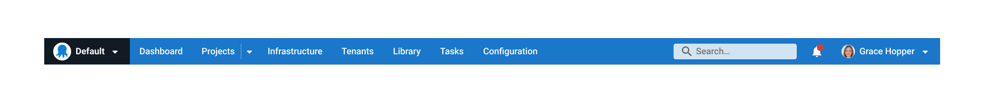

At Octopus, we pay close attention to our customer feedback. Lately, we've focused on feedback about our navigation experience. 

Customers told us some functions are hard to find and it's difficult to remember where items live in our application. 

This is a tricky design issue because of a combination of factors:

- Where things live
- Complex information structures
- Complex interactions in Octopus
- Visual design and page layouts make it hard to understand where you are
- Deciding when to use search versus navigation

In this post, I walk you through some of our design process and the changes we're making to improve the navigation experience for you.

## Starting the redesign process

We spent time reimagining our user interface (UI) to understand how all the elements could work together harmoniously. We then took our concept to customers and DevOps professionals to see if they found it easier to use. The feedback was positive, and the learnings were valuable. Implementing the changes is no easy task, though, so we knew we had to break it down into smaller parts.

Our first step was improving our navigation visually while introducing good design patterns.

### The Octopus UI before the uplift

## The Octopus UI now 

We implemented new design features to the main Octopus navigation, including:

- **Squares for spaces:** We're moving away from using circles in spaces and projects and using squares instead. This helps you identify visual elements across the app more easily.

- **Stronger visual hierarchy:** You can easily see which section of the app you're in. This is thanks to strong, contrasting color choices applied appropriately.

- **Configuration and administration:** We moved to a cog icon on the far right of the main menu at the top of the app. This follows standard navigation UX patterns, so it's more familiar for you.

## Under the covers

These may look like small changes, but this is a more considered approach to building our UI components. This is where a design system comes into play.

We started by tackling our simplest design decisions first. These were primarily our colors and typography. In a design system, we call these design tokens. This modern way of building interfaces helps us create better-quality designs. It also makes for a better experience for our customers. 

We also darkened our dark mode. This was one of the positive outcomes of taming and consolidating the many colors that had grown over time. The expansion of colors is what UX debt can look like and requires design and engineering effort to manage.

Now that we have design tokens, we can make sure our colors adhere to accessibility guidelines. This will also allow us to surface more theming options for our customers. 

## What's next?

We'll be looking at the page header section in the Octopus app next, as we continue to modernize the UI. We want to create a simpler layout that supports easier navigation between areas of the app. 

Each change to the navigation will deliver more visual consistency and improve the information architecture.

We're dedicated to improving the Octopus Deploy UX. This is the first of many milestones to achieve a world-class navigation experience. If you'd like to help us continue to improve Octopus, check out [our careers page](https://octopus.com/company/careers).

Happy deployments!
