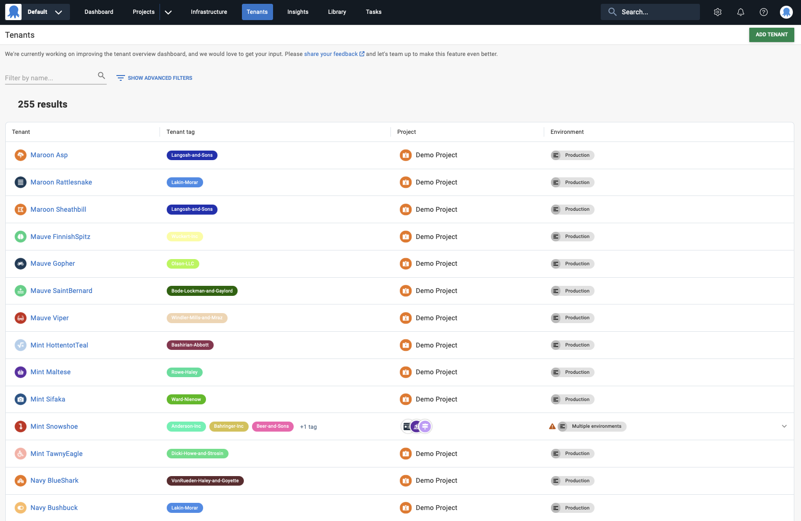
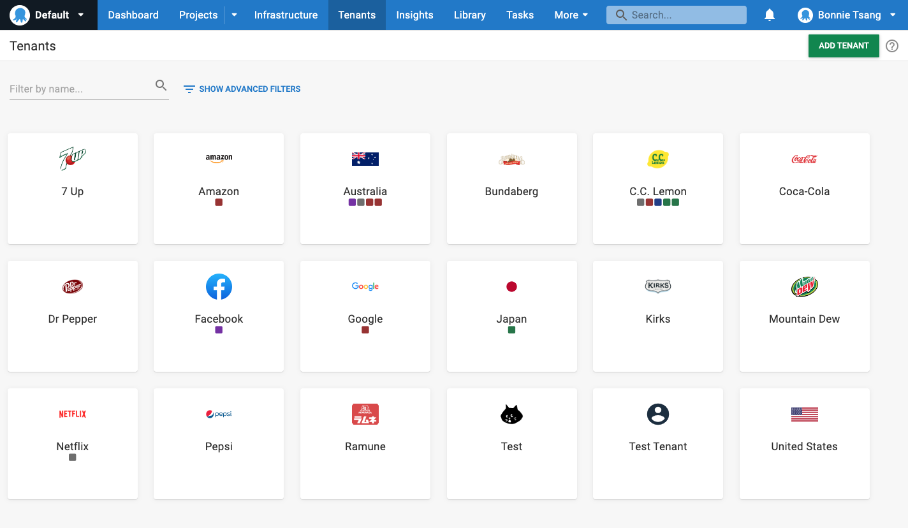
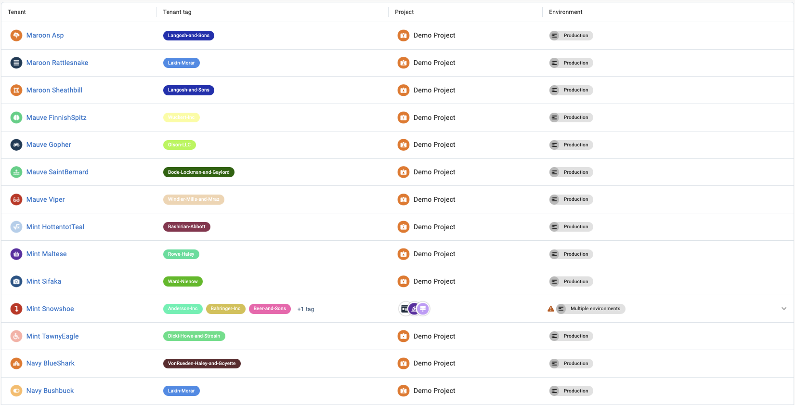
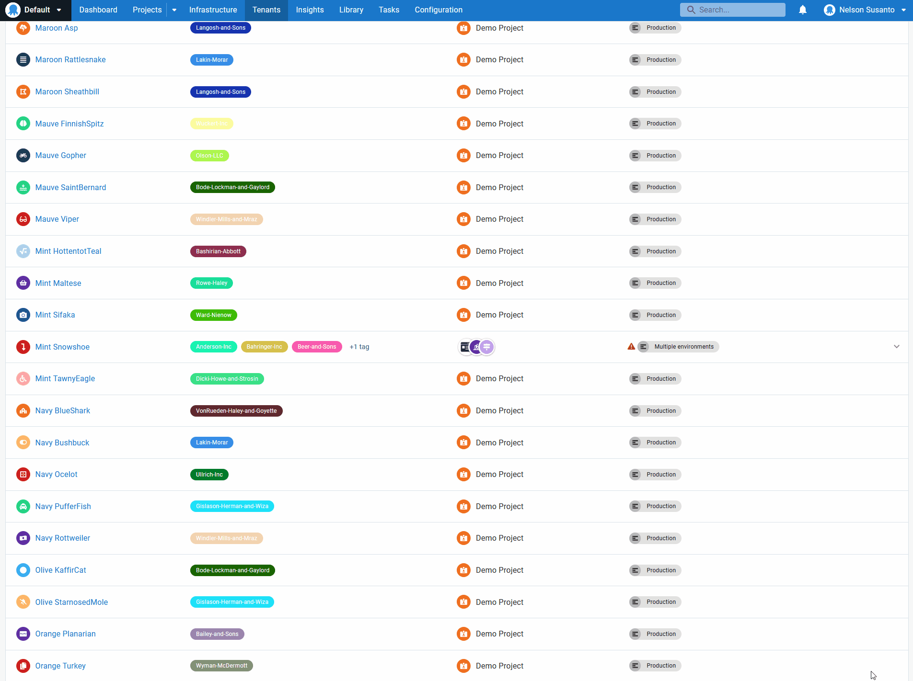
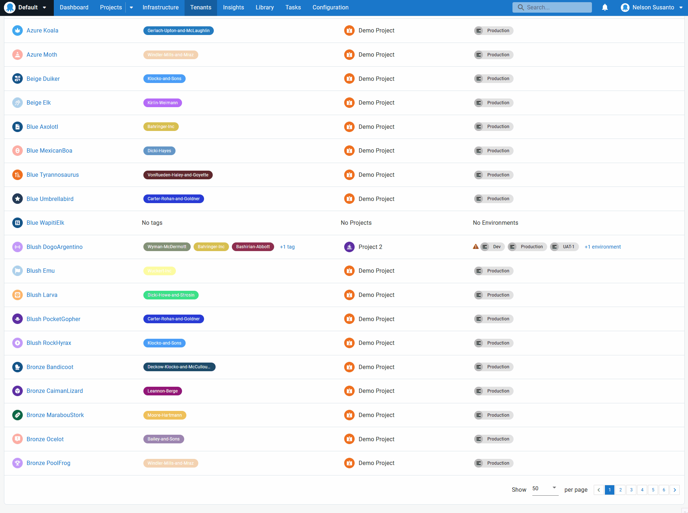
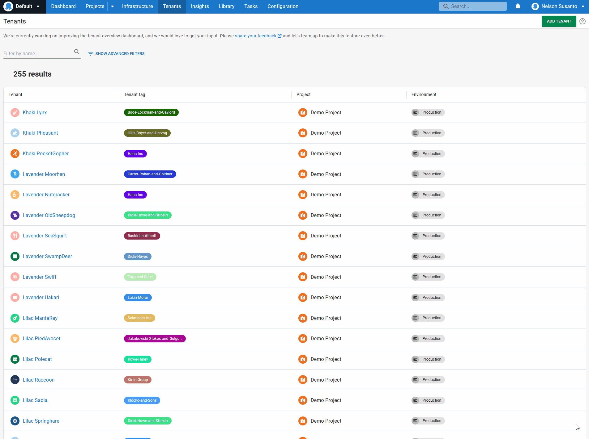
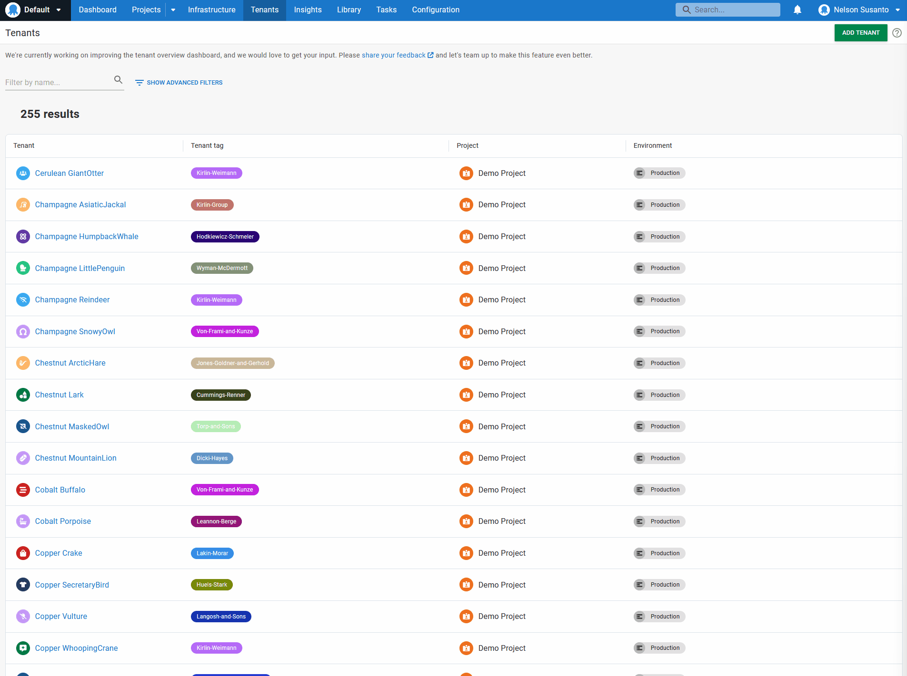

Tenants in Octopus are the standard way for you to create customer-specific deployment pipelines without duplicating project configuration. Tenants help you deploy multiple instances of an application for each of your customers. 

We received feedback that we could improve our Tenants overview dashboard, to make it easier to administer, manage, and view hundreds or thousands of tenants.

We addressed this by redesigning the dashboard.

The new Tenants overview dashboard gives you better overall visibility of your tenants and tenant-related items. This includes projects, environments, and tenant tags. The new dashboard is also fast and performant under large data loads. You can easily manage and administer thousands of tenants, knowing the dashboard won't hang, crash, or slow down.

In this post, I show you how the new redesigned Tenants overview dashboard works.

## Using a new data table

Before this redesign, the Tenants overview dashboard looked like this:

Some customers found it challenging to navigate through this card-style format to see lots of data at the same time. We solved this by displaying the information in a data table format.

Visualizing the information this way preserves existing functionality for viewing tenants. It also lets you see other tenant-related information that you couldn't see with the card-style format, namely:

- The name and number of tenant tags associated with each tenant
- The projects associated with each tenant
- The environments associated with those projects

## Expandable rows to view additional information

The data table format allows Octopus to provide more information at a glance. By default, the table reveals high-level information about tenant tags, projects, and environments. It then hides the rest of the information in an expandable row.

You can open the expandable row if you want more detail about those items. This displays all information about tenant tags, projects, and environments for that tenant. You can see all the related information or retract the row to keep your view clean and organized.

## Pagination and results controls

The Tenants overview dashboard now has additional pagination and results limitation and expansion controls. You can choose to see 30, 50, or 100 results. Pagination follows the option selected for results limitation. For example, if you select 50 results, each dashboard page shows up to 50 results before you need to click through to the next page.

The pagination and results limitation means the new dashboard suits different use cases. You can see all data or just some, depending on your preferences and needs.

## Maintaining existing filtering and name search function

We kept the advanced filters on the dashboard. You can still find the **Filter by name** search bar on the top left-hand side of the page. Use the search bar to type in a tenant's name to narrow down the results and find the tenant you're looking for.

You can also use these advanced filters with the new dashboard to search for a particular tenant or other tenant-related items.

## Performant under large data loads

Finally, the new dashboard is performant and fast under large data loads. This is the case even if you have hundreds or thousands of tenants to view, manage, and administer. The dashboard is more responsive and reliable, without long loading times or sluggish UI performance.

## Conclusion

The new Tenants overview dashboard provides greater visibility and better tools to manage and administer your tenants at scale. 

We'd love feedback on this feature while we continue to refine it. If you're an Octopus Cloud customer, it's available now as an early access preview (EAP). 

<a class="btn btn-success" href="https://octopusdeploy.typeform.com/to/CxkblnbR">Share your feedback</a>

Happy deployments!