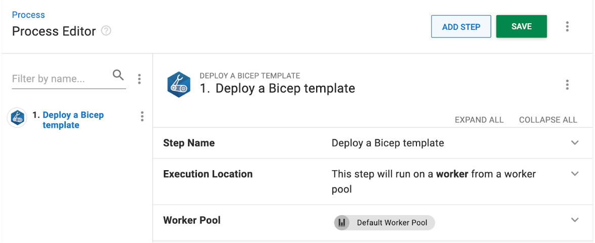
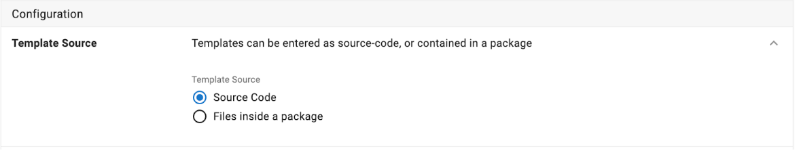
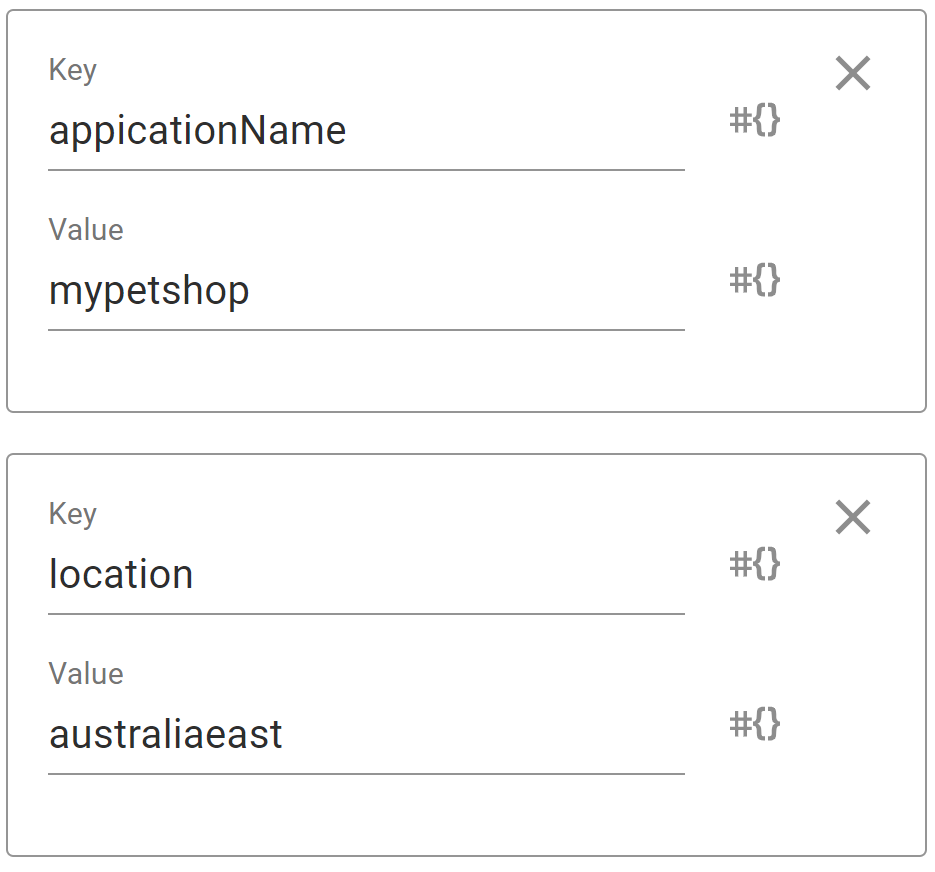
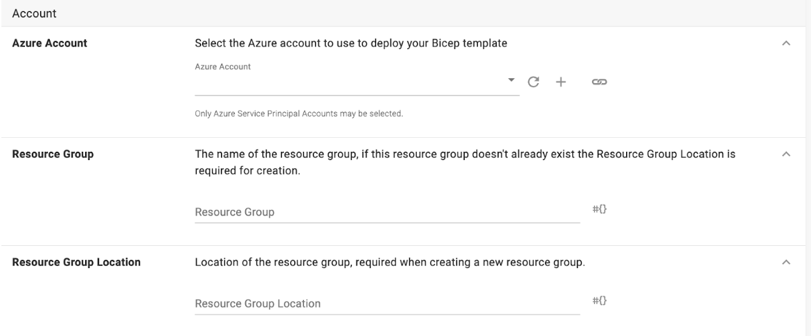

Bicep is a human-readable language Azure has created for deploying resources using ARM templates. Our latest step makes the process of deploying Azure Resources using Bicep more intuitive and user-friendly.


## Configuring the ‘Deploy a Bicep Template’ Step

To start, add the Deploy a Bicep Template step to your project process. This step relies on the availability of the [bicep module](https://learn.microsoft.com/en-us/azure/azure-resource-manager/bicep/install) of the Azure CLI in the execution environment. Assuming the azure cli is already installed and on path to install the az bicep module run:
```
az bicep install
```





## Configuration

When configuring the Deploy a Bicep Template Step you can store your templates using the source code editor or packages. The first and easier option is the Source Code editor, here you can directly edit your bicep template. Alternatively you can store your bicep files in a package and provide a path to the template. When using packages you can provide multiple bicep templates and reference modules in [local files](https://learn.microsoft.com/en-us/azure/azure-resource-manager/bicep/modules#local-file) using relative paths. When using packages, you’ll need to provide the relative path to the Bicep template file contained in the package.





To provide parameters to these bicep templates a list of key-value pairs is provided.


For example given a bicep template with the following param definitions
```
param appicationName string
param location string
```
The following parameters definitions



Regardless of your template source, you’ll need to decide on a [deployment mode](https://learn.microsoft.com/en-us/azure/azure-resource-manager/templates/deployment-modes), we default to incremental mode. In incremental mode, Resource Manager leaves resources that exist in the resource group but aren't specified in the template unchanged. Resources in the template are added to the resource group. 
In complete mode, Resource Manager deletes resources that exist in the resource group but aren't specified in the template.


## Account

This is where you select which Azure account and resource group you wish to use in this step. For help configuring an Azure Account see [connect an Azure Account to Octopus Deploy](https://octopus.com/docs/infrastructure/accounts/azure#azure-service-principal). When specifying a resource group if it does not exist, it will be created as part of the deployment process. If the resource group does not exist and is being created as a part of the deployment, the resource group location must be specified.





Happy deployments!

