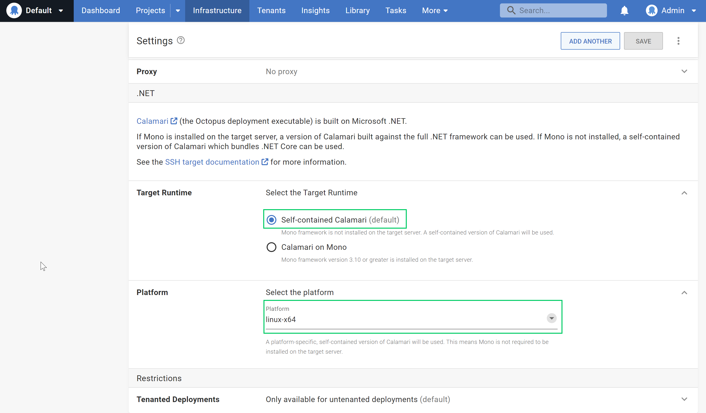

---
title: Deprecating Mono
description: Octopus Deploy is planning to drop support for deploying to SSH targets via Mono. Learn why we made this decision and how to move to .NET core.
author: robert.erez@octopus.com
visibility: private
published: 2023-06-12-1400
metaImage: 
bannerImage: 
bannerImageAlt: 125 characters max, describes image to people unable to see it.
isFeatured: false
tags: 
- Product
- Linux

----

Octopus is planning to deprecate support for Mono in a future release. 

If you've configured your Octopus Server instance to deploy to SSH targets via Mono (and not self-contained .NET Core), this post will help you understand the changes. It also outlines your options after we complete the deprecation process. 

I walk you through the history of Mono at Octopus, and the steps we're taking to remove it as a dependency for Linux deployments.

We created a [GitHub issue] (https://github.com/OctopusDeploy/Issues/issues/8146) where you can provide feedback or ask questions after you've read this post.

## What is Mono?

Mono provides a [CLI](https://en.wikipedia.org/wiki/Common_Language_Infrastructure) (Common Language Infrastructure) virtual machine which can run on various non-Windows platforms. The CLI comprises the runtime required to execute .NET code previously compiled into CIL (Common Intermediate Language). This includes components such as the JIT compiler, garbage collector, and library loader. These components are typically provided by the .NET Framework installed on a Windows machine. 

The Mono CLI also includes its own implementation of the .NET Framework Base Class Library. Although compatible with Microsoft's .NET Framework classes, it's separate from the standard .NET Framework libraries used on a typical machine using .NET Full Framework. They are, therefore, also different from the APIs provided by .NET Core libraries.

Mono provides a fantastic set of tools that opened up .NET development for (and on) non-Windows machines before Microsoft fully supported it.

## The history of Mono at Octopus

In 2015, the release of Octopus 3.0 introduced support for [deploying releases on Linux via SSH Targets](https://octopus.com/blog/deployment-targets-in-octopus-3#multiple-types-of-machines-deployment-targets). The Octopus deployment execution engine framework, [Calamari](https://github.com/OctopusDeploy/Calamari), was originally built only on .NET Full Framework. 

.NET Core was only recently announced, and the first version was over a year from release. This meant the only way to run a deployment process was by invoking it via [Mono](https://www.mono-project.com/docs/about-mono/). 

Mono served its purpose well. However, with .NET Core now the dominant cross-platform framework for running .NET applications, Mono's support costs outweigh its benefits.

### The rise of .NET Core and reducing our dependency on Mono

For some users, the Mono dependency itself was never viable, so in [early 2017 we introduced support for  Raw Octopus](https://octopus.com/blog/trying-raw-octopus). This lets you run scripts through the SSH shell without Calamari's helpful orchestration. As a result, this runs without any of the dependencies required to run Calamari, .NET or otherwise. Due to it's simplicity, this option has always been a niche fallback mechanism for very constrained platforms.

The API surface area provided by the release of .NET Core 2.0 in mid 2017 let us quickly work towards [Mono-less SSH targets in 3.16](https://octopus.com/blog/octopus-release-3-16#ssh-targets-sans-mono). This was the first release that let you run Octopus deployments on a Linux system with .NET Core. It was quickly taken up by customers as a simpler way to run their deployment workloads on Linux servers.

## Why are we deprecating mono?

Developing an application that runs on multiple platforms and runtimes has a non-zero cost. And we must balance that cost against the value it brings.

Here are some of the costs we've had to consider:

* **Development costs** - The surface area of .NET Core doesn't perfectly overlap with the core libraries provided by Mono (or .NET Full Framework). Some parts of the code need pre-processor directives that switch between code paths, dependencies, or entire classes. This creates a codebase that is harder to reason with. This impacts the ease of maintaining the code. It also increases complexities in the solution's core architecture requiring multiple projects or dependencies, depending on which platform it's compiled for.

* **Testing costs** - In addition to multiple Windows and Linux (with .NET Core) build configurations, we run most Calamari tests against about 20 additional agent configurations. This covers the various Linux platforms and Mono versions we might encounter. This adds time (which translates directly into dollars to run and maintain these systems) and developer effort. When a test fails, which can happen when integrating with external systems or running on complex build infrastructure, it can take hours of a developer's time to stop, context switch, and investigate.

* **Support costs** - Customers sometimes have questions or issues when setting up a Mono-based SSH target. We generally recommend trying the self-contained .NET Core option, but this still creates a support overhead.

Our customers mostly now use modern alternatives for deploying to Linux. This means we can no longer justify the maintenance costs of Mono on the development and verification of our software.

## When will we remove Mono?

We want to provide time before removing Mono, so you can make the required changes to keep your deployments running smoothly.

Releases from 2023.2 will show warning messages in your logs if the Calamari execution occurs via Mono. Your deployments will function as normal. However, we hope the messages will remind you the changes are approaching.

From 2023.4 (likely released late in 2023), we'll begin disabling Mono functionality by default in new builds of Octopus Server. At this point, rather than just attempting to use .NET Core, deployments relying on Mono targets will fail with messaging to advise the options available.

## How to start using .NET Core

When configuring an SSH target, the **Target Runtime** has defaulted to `Self-contained Calamari` (.NET Core) for several years. If your target has this selected, it's already using the .NET Core version of Calamari, and the changes in this post won't apply to you. 

If your target has **Calamari on Mono**, then you need to make some changes before we disable support for Mono in Octopus Server.

### Listing affected targets

If you have many targets and are unsure if any are reliant on Mono, the code snippet below shows how to query your instances with the C#  [OctopusClient](https://octopus.com/docs/octopus-rest-api/octopus.client).

```c#
var client = new OctopusClient(new OctopusServerEndpoint("https://octopus.acme.corp/", "API-XRLLCHXXXXIZGHDNC1OEUVRXXXXX"));
var sshEndpoints = client.Repository.Machines.List(commStyles: "Ssh");
var monoEndpoints = sshEndpoints.Items
  .Where(p => p.Endpoint is SshEndpointResource sshEndpoint && sshEndpoint.DotNetCorePlatform is null);
foreach (var endpoint in monoEndpoints) {
	Console.WriteLine($"SSH endpoint `{endpoint.Name}` is still running Mono. Time to convert to .NET Core!");
}
```

### Library dependencies

With .NET Core, you no longer need to install Mono on your target to use it as a deployment target. However, there are still some dependencies it requires.

In many cases, mainly if using pre-configured VMs from a cloud vendor, these dependencies may already be available on your system. In these cases, you don't need to update the target itself. If you're manually building your machine,follow [the .NET Core guides](https://learn.microsoft.com/en-us/dotnet/core/install/linux-scripted-manual#dependencies) relevant to your distribution to see if anything is missing and install accordingly.

### Updating your Octopus target

To update Octopus to use the .NET Core version of Calamari, rather than Mono, you just make a simple change to the deployment target configuration.

1. Navigate to **Infrastructure**, then **Deployment Targets**, and select the target to update. 
2. On the **Settings** page, under **.NET** select the **Self-contained Calamari** option. 
3. If required, also update the **Platform** value to the appropriate setting.



A health check won't exercise Calamari and validate the above dependencies, but you can test that everything is ready. Run a short  `echo Hello World` script via the **Tasks**, **Script Console**, or even deploy a simple project.

## Impacts

For the majority of our Mono users, the changes will be minor. There are potential impacts for some platforms and functionality after .NET Core compiled binaries or raw scripting become the only options.

### ScriptCS

At the time of writing, we don't support ScriptCS on the .NET Core version of Calamari, but scheduled updates are due to change this. Read [our post about migrating from scriptcs to dotnet-script](https://octopus.com/blog/rfc-migrate-scriptcs-dotnet-script) for our plans and [our workaround](https://octopus.com/blog/rfc-migrate-scriptcs-dotnet-script#workaround), if this affects you.

### RHEL6

Running deployments on RHEL6 and below requires compiling for the `rhel-x64` runtime, which doesn't take place. Cross-compiling to cater for these targets would negatively impact the bundled Octopus Server installation size for all customers. We can't justify this given the platform's reported usage. 

Since we support only RHEL7.2 and above, we won't be providing a solution for earlier versions of RHEL. We encourage users on RHEL6 to upgrade to later versions to continue running deployment steps, or consider using the [Raw Scription](https://octopus.com/docs/deployments/custom-scripts/raw-scripting) option.

### FreeBSD

FreeBSD does [not currently support .NET Core](https://github.com/dotnet/runtime/issues/14537) but this may change in the future. Based on target statistics. it doesn't look like there are any instances that run on FreeBSD today, so we don't expect this to impact any of our users. As part of the Mono deprecation, we'll likely drop support for FreeBSD until it's possible to run .NET Core.

## Conclusion

There are costs with any software supporting older platforms and frameworks. Mono has served Octopus well for deployments using Linux targets, but it's time for us to use more modern solutions that are now available.

If you reply on Mono, we recommend switching your targets to use self-contained Calamari now. This will avoid future issues when we disable Mono in Octopus Server. In most cases, this requires minimal changes to your system and will mostly be the flick of a switch on the SSH target settings page.

Please add your thoughts, comments, or questions about this change to our [GitHub issue](https://github.com/OctopusDeploy/Issues/issues/8146).

Happy deployments!