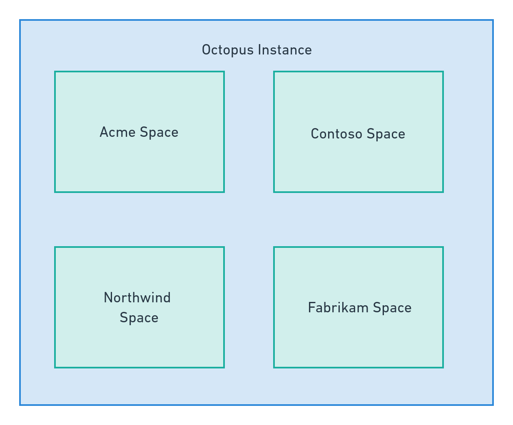
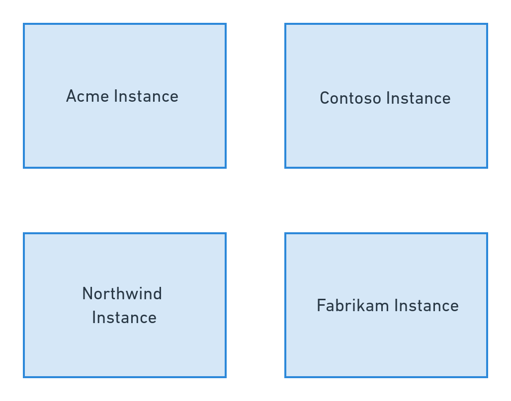
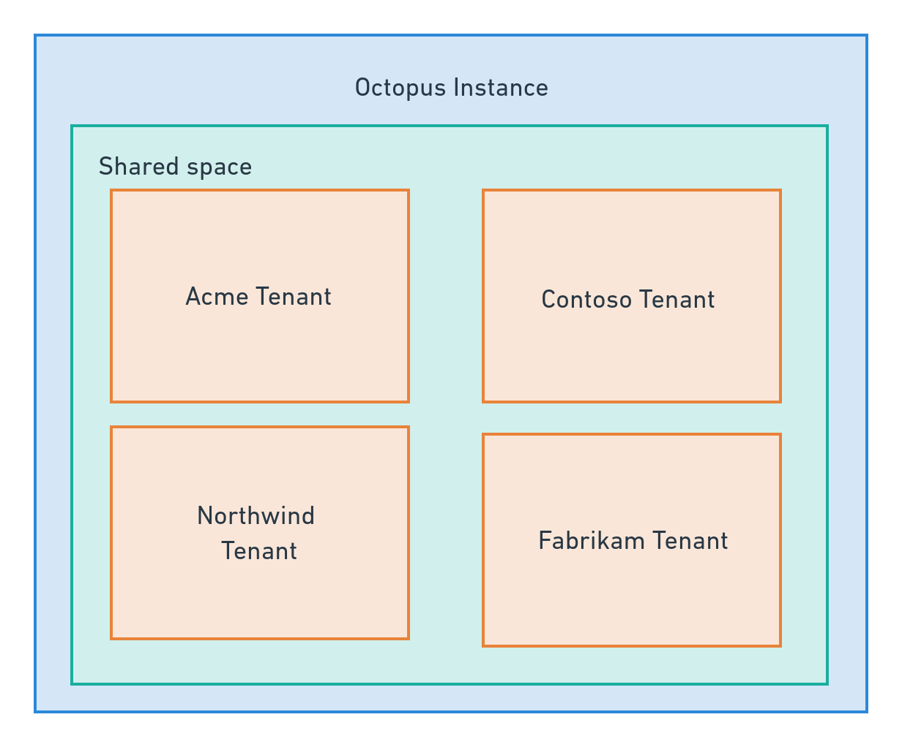
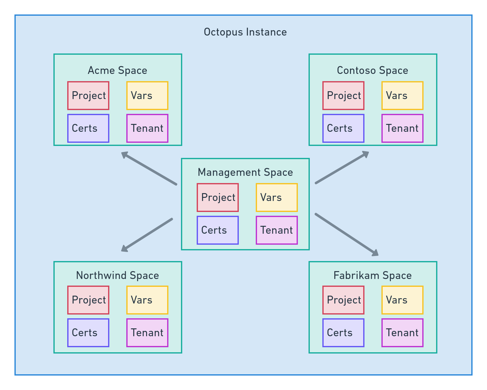
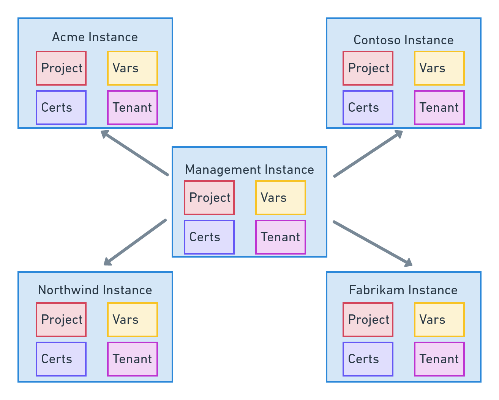
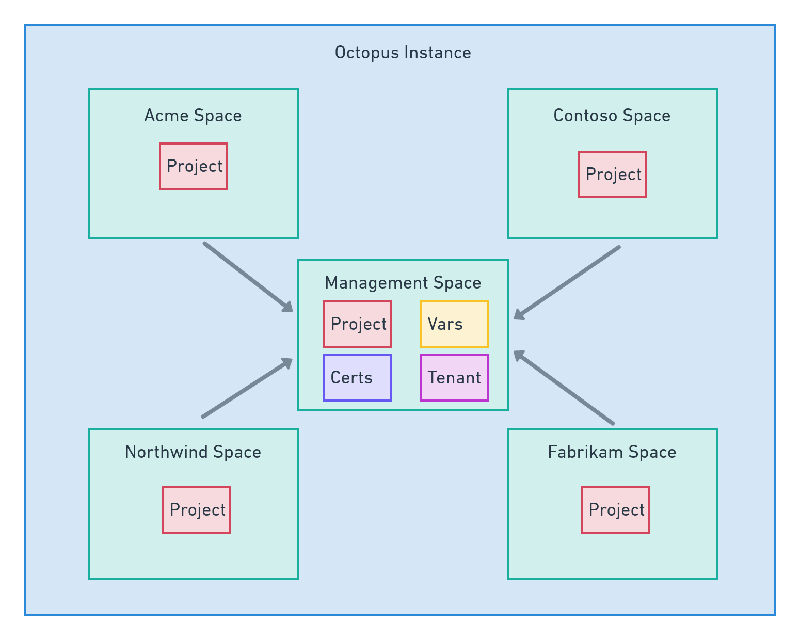
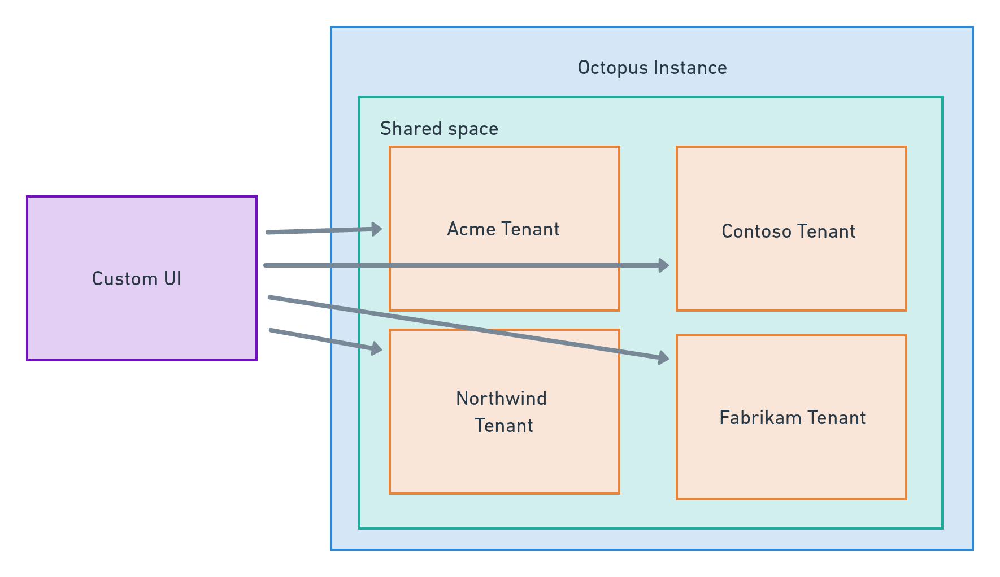

Supporting software deployments and maintaining applications in large enterprise environments is often not as simple as configuring a single, shared Octopus instance that everyone can use. Practical constraints such as network latency between geographically distributed teams, the desire for business units to control their own infrastructure and processes, business acquisitions that bring established DevOps systems, and compliance with standards like PCI are common and valid reasons to configure multiple Octopus spaces and instances.

Over time we have seen a number of common patterns emerge with Octopus installations as enterprise environments address these concerns. In this post we'll break these patterns down and describe how each pattern can be used to address common scenarios in enterprise environments.

## Independent space per business unit/application

The most common pattern is to partition a single Octopus installation into separate spaces. Octopus is fairly agnostic as to what any individual space represents, but it is common to provide a space for business units or application stacks. As long as the space represents a stable context for the projects it holds (meaning Octopus projects are unlikely to move between spaces even as people move between teams or security requirements change), spaces are a convenient method of splitting projects and defining security boundaries.

This pattern is very easy to implement as it often involves little more than creating a new space and assigning security permissions. We expect most Octopus users to naturally adopt spaces as their usage of the platform grows.

However, spaces do have some limitations. Because spaces are limited to a single Octopus installation, and Octopus installations require a low latency connection to the database, spaces do not provide the ability to co-locate Octopus with geographically dispersed teams. In addition, all tasks initiated by spaces use a shared task queue. When projects in a space queue many tasks, other spaces have to wait for their deployments to be processed. This is commonly known as the "noisy neighbor" problem.

| Feature  | Solves  |
|---|---|
| Independent projects, runbooks, dashboards etc  | ✓ | 
| Task execution guarantees for business unit/application | ✕ |
| Shared authentication settings | ✓ |
| Synchronized projects, runbooks, dashboards etc | ✕ |
| Supports geographically disperse business units | ✕ |
| Robust RBAC support | ✓ |

## Independent instance per business unit/region

Independent instances provide geographically disperse teams the ability to deploy a local Octopus instance, providing better performance and greater reliability due to the reduced networking distance. Independent instances also grant each business unit an isolated task queue ensuring deployments and management tasks are not held up by other teams.

Enterprises may also choose to deploy independent Octopus instances within the scope of PCI or other security regulations to perform deployments to secure environments. This frees teams from having to lock down their regular Octopus instance to meet specialized security requirements.

Like the independent space pattern, the independent instance pattern is easy to implement as it only requires the deployment of another Octopus instance. However, due to the lack of centralized management of independent instances, common settings like authentication, SMTP servers, subscriptions, audit log streaming and more must be manually configured on each instance.

| Feature  | Solves  |
|---|---|
| Independent projects, runbooks, dashboards etc  | ✓ | 
| Task execution guarantees for team/customer | ✓ |
| Shared authentication settings | ✕ |
| Synchronized projects, runbooks, dashboards etc | ✕ |
| Supports geographically disperse teams/customers | ✓ |
| Robust RBAC support | ✓ |

## Tenant per customer

Octopus has long supported the ability to partition deployment processes across multiple tenants, allowing each tenant to progress their own deployments independently. The RBAC rules in Octopus can be scoped to tenants, allowing fine grained access to resources like targets, accounts, and certificates.

Tenants are a natural solution for teams that need to independently deploy applications to multiple downstream customers. Tenants can also be used to represent concepts such as regions, release rings, or teams.

However, the RBAC controls around tenants are not expressive enough to isolate customers if they log into the Octopus installation and are granted permissions to see a single tenant. For example, channels, tasks, and audit logs can not be scoped to a tenant.

You can find more information about tenants in the [documentation](https://octopus.com/docs/tenants).

| Feature  | Solves  |
|---|---|
| Independent projects, runbooks, dashboards etc  | ✕ | 
| Task execution guarantees for team/customer | ✕ |
| Shared authentication settings |  ✓|
| Synchronized projects, runbooks, dashboards etc |✓  |
| Supports geographically disperse teams/customers | ✕ |
| Robust RBAC support |✕ |

## Managed space per business unit/application

This solution represents a typical "hub and spoke", or platform engineering, approach where each application stack or business unit has their own space, and some or all of the space configuration is centrally managed.

Each space is represented by a tenant in the management space, with deployment projects or runbooks used to configure the managed spaces. The Terraform provider or raw API scripting can be used to push configuration for shared resources, like template projects, to the managed spaces.

| Feature  | Solves  |
|---|---|
| Independent projects, runbooks, dashboards etc  | ✓ | 
| Task execution guarantees for team/customer | ✕ |
| Shared authentication settings |  ✓|
| Synchronized projects, runbooks, dashboards etc |✓  |
| Supports geographically disperse teams/customers | ✕ |
| Robust RBAC support |✓ |

## Managed instance per business unit/region

Like the `Managed space per business unit/application` pattern, this pattern represents a typical "hub and spoke", or platform engineering, approach. However, each business unit or region gets their own Octopus installation.

Each managed Octopus instance is represented by a tenant in the management space, with deployment projects or runbooks used to configure the managed Octopus instances. The Terraform provider or raw API scripting can be used to push configuration for shared resources, like template projects, to the managed instances.

| Feature  | Solves  |
|---|---|
| Independent projects, runbooks, dashboards etc  | ✓ | 
| Task execution guarantees for team/customer | ✓ |
| Shared authentication settings |  ✓|
| Synchronized projects, runbooks, dashboards etc |✓  |
| Supports geographically disperse teams/customers | ✓ |
| Robust RBAC support |✓ |

## Facade space per customer

This pattern provides each customer with their own space. Each customer space has deployment projects or runbooks with a single step to call the associated project in the management space. These projects therefor act as a facade over the projects in the management space.

This approach has the benefit of only requiring very simple projects to be created in each managed space. Each customer is represented as a tenant in the management space, taking advantage of the native features of tenants. Customers log into their own space, providing a high degree of security.

| Feature  | Solves  |
|---|---|
| Independent projects, runbooks, dashboards etc  | not required| 
| Task execution guarantees for team/customer | ✕ |
| Shared authentication settings |  ✓|
| Synchronized projects, runbooks, dashboards etc | not required |
| Supports geographically disperse teams/customers | ✕ |
| Robust RBAC support |✓ |

## Custom UI over Octopus Installation

This is the most advanced pattern of all, requiring the development of a custom web user interface to orchestrate deployments with a backend Octopus installation.

The custom UI provides an almost unlimited ability to control and customize the end user's experience.

This solution also provides the ability to orchestrate deployments across multiple Octopus installations from a single shared UI.

You can find more information about the Octopus REST API in the [documentation](https://octopus.com/docs/octopus-rest-api).

| Feature  | Solves  |
|---|---|
| Independent projects, runbooks, dashboards etc  | ✓| 
| Task execution guarantees for team/customer | ✓ |
| Shared authentication settings |  ✓|
| Synchronized projects, runbooks, dashboards etc | not required |
| Supports geographically disperse teams/customers | ✓ |
| Robust RBAC support |✓ |

## Managed instance per environment

This solution creates Octopus installations in each environment. It treats Octopus upgrades and other maintenance tasks in the same manner as a regular application deployment by promoting the changes through environments like Development, Test, and Production.

The Octopus installations are required to be synchronized to ensure their configuration is as similar to one another as possible.

Unlike the previous patterns, this pattern is less concerned with providing the ability for teams and customers to log into Octopus installations. Rather, non-production Octopus installations are used by DevOps teams to test upgrades and validate project changes.

| Feature  | Solves  |
|---|---|
| Independent projects, runbooks, dashboards etc  | N/A | 
| Task execution guarantees for team/customer | N/A |
| Shared authentication settings | N/A|
| Synchronized projects, runbooks, dashboards etc | ✓ |
| Supports geographically disperse teams/customers | N/A |
| Robust RBAC support | N/A |

## Conclusion

The patterns described here cover the majority of implementations we expect enterprise customers will adopt as they scale their use of Octopus to support business units and customers.

Some of these patterns, like "independent space per business unit/application", "independent instance per business unit/region", and "tenant per customer", either require little effort to deploy or are deeply embedded into Octopus. We won't cover these patterns in any more detail, as they are covered by the existing documentation.

The "custom UI over Octopus installation" is an advanced pattern that requires a dedicated development team to build a web application that consumes the Octopus REST API. This blog series won't go into any additional detail on how to write such a custom UI, but those interested in this pattern can refer to the API documentation for more information.

The remaining patterns, "managed space per business unit/application", "managed instance per business unit/region", "facade space per customer", and "managed instance per environment", will be covered in detail in subsequent posts. 

We also provide a reference implementation in the form of a Docker Compose stack that provisions a preconfigured Octopus instance with sample projects demonstrating how to deploy and synchronize Octopus projects between spaces and instances. The reference implementation is described in more detail in the [next post](/blog/2023-06/reference-implementation/index.md).

We are currently refining our approach to these enterprise patterns, so if you have any suggestions or feedback about the approach described here, please leave a comment on [this GitHub issue](https://github.com/OctopusSolutionsEngineering/EnterprisePatternsReferenceImplementation/issues/1).
