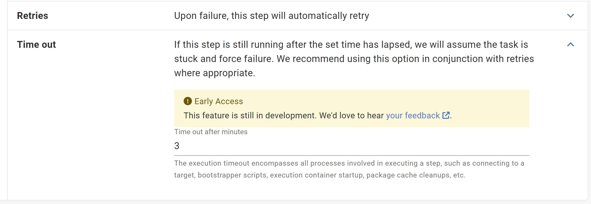

We've received [user voice](https://octopusdeploy.uservoice.com/forums/170787-product-feedback/suggestions/6396476-add-timeout-support-for-individual-steps-and-overa) feedback requesting execution timeouts to handle hung deployment processes. Octopus 2023.3 introduces execution timeouts, a new feature adding a configurable cancellation to steps. Some deployment processes include long-running actions like Azure FTP connections or CloudFormation updates. These can hang indefinitely or at least for hours. Currently, there is no way to resolve this other than manually cancelling an entire task. Execution timeouts allow setting a time limit in minutes within steps a step configuration. When this timeout is reached the action is canclled and the deployment process continues. Paired with auto-retries, this increases the likelihood of successful deployments.

Watch the video below to see this new feature in action:

<iframe width="560" height="315" src="TODO" title="YouTube video player" frameborder="0" allow="accelerometer; clipboard-write; encrypted-media; gyroscope; picture-in-picture; web-share" allowfullscreen></iframe>

## How do execution timeouts work?

You can enable execution timeouts on individual steps found in the **Conditions** section of each step, as shown below:

Execution timeouts are configured in minutes. An unset value or zero will not timeout. It's important to note that execution timeouts encompass all processes involved in step execution. This includes connecting to a target, bootstrapper scripts, execution container start-up, and package cache clean-ups. We recommend setting a slightly longer timeout than expected, in most cases, an additional minute should account for this.

### Are there any steps I can't use execution timeouts for?

You can use execution timeouts on all steps except for:

- **Send an Email** step
- **Manual Intervention** step
- **Health Check** step
- **Deploy a Release** step

### How is execution timeout configured?

Execution timeout can be configured manually through the step UI, or through the octopus variable `Octopus.Action.ExecutionTimeout.Minutes`.

### Can I set execution timeout to a default value for all my steps?

No. You must configure execution timeout on each step in each deployment process.

### Do execution timeouts trigger at all stages of a deployment process?

No, execution timeouts will not trigger during package acquisition.

## Conclusion

To help improve the success rate and automation of deployments, you can now add execution timeouts. This lets you configure unpredictable long-running processes to fail early. Combined with automatic retries this feature can be used to improve deployment success rates.

## Feedback

We'd love to hear [any feedback](https://oc.to/ActionExecutionTimeOutFeedbackForm) to help us improve this feature.

Happy deployments!